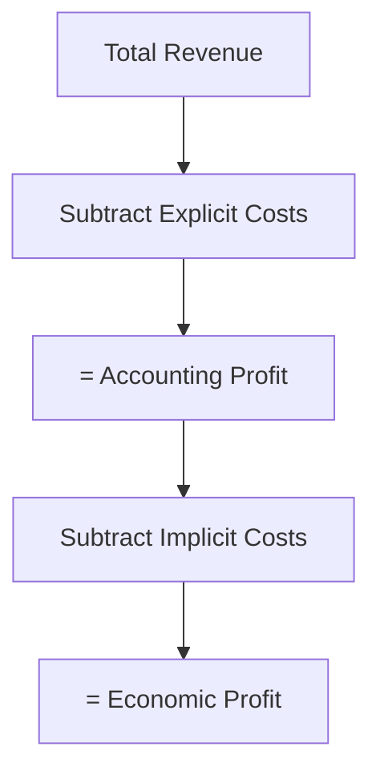
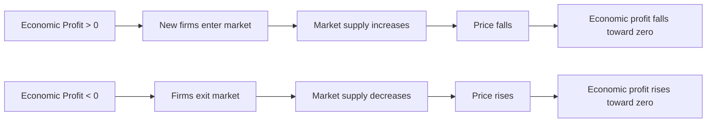

## Economic Profit vs Accounting Profit

### Definitions

**Accounting profit** is the difference between total revenue and explicit (out-of-pocket) costs only, as reported in standard financial statements:

$$\text{Accounting Profit} = \text{Total Revenue} - \text{Explicit Costs}$$

**Economic profit** is the difference between total revenue and *total* economic costs, which include both explicit costs and implicit (opportunity) costs:

$$\text{Economic Profit} = \text{Total Revenue} - \text{Explicit Costs} - \text{Implicit Costs}$$

**Key Points**

- Economic profit is always less than or equal to accounting profit, since implicit costs are nonnegative
- Accounting profit is the concept used for taxation, financial reporting, and business valuation; economic profit is the concept used for resource-allocation decisions in economic theory
- The gap between the two equals total implicit costs

### The Relationship Between the Two Measures

$$\text{Economic Profit} = \text{Accounting Profit} - \text{Implicit Costs}$$

### Worked Numerical Example

**Example**

An entrepreneur runs a consulting firm.

- Total revenue: $300,000
- Explicit costs (office rent, software subscriptions, contractor payments): $180,000
- Forgone salary from the best alternative corporate job: $85,000 (implicit cost)
- Forgone return on $100,000 of personal savings invested in the business, at a 5% expected market return: $5,000 (implicit cost)

**Accounting profit**:

$$\$300{,}000 - \$180{,}000 = \$120{,}000$$

**Total implicit costs**:

$$\$85{,}000 + \$5{,}000 = \$90{,}000$$

**Economic profit**:

$$\$120{,}000 - \$90{,}000 = \$30{,}000$$

The business looks strongly profitable on paper ($120,000), but the economically relevant comparison shows the entrepreneur is $30,000 better off than their next-best alternative — a real but smaller advantage.

### Normal Profit

**Normal profit** is the level of accounting profit at which economic profit equals exactly zero. It represents the minimum return necessary to keep resources (particularly entrepreneurial effort and invested capital) engaged in their current use rather than shifting to the next-best alternative.

$$\text{Normal Profit} = \text{Implicit Costs} \quad (\text{when Economic Profit} = 0)$$

**Key Points**

- Normal profit is not "zero profit" in the everyday sense — a firm earning normal profit still shows positive accounting profit
- Earning normal profit means the firm is doing exactly as well as its next-best alternative, no better and no worse
- The concept of normal profit is central to the analysis of long-run equilibrium in perfectly competitive markets

### Visual Comparison

<svg xmlns="http://www.w3.org/2000/svg" viewBox="0 0 540 300" font-family="Arial, sans-serif">
<text x="270" y="20" text-anchor="middle" font-size="14" font-weight="bold">Accounting Profit vs Economic Profit (svg_diagram)</text>
<line x1="60" y1="270" x2="60" y2="40" stroke="black" stroke-width="1.5" />
<line x1="60" y1="270" x2="480" y2="270" stroke="black" stroke-width="1.5" />
<text x="30" y="45" font-size="12">\$</text>

<rect x="100" y="60" width="90" height="210" fill="#93c5fd" stroke="black" />
<text x="145" y="55" text-anchor="middle" font-size="11">Total Revenue</text>

<rect x="260" y="170" width="90" height="100" fill="#fca5a5" stroke="black" />
<text x="305" y="225" text-anchor="middle" font-size="10">Explicit Costs</text>
<rect x="260" y="110" width="90" height="60" fill="#fde68a" stroke="black" />
<text x="305" y="143" text-anchor="middle" font-size="10">Implicit Costs</text>
<text x="305" y="156" text-anchor="middle" font-size="9">(Normal Profit)</text>
<rect x="260" y="60" width="90" height="50" fill="#86efac" stroke="black" />
<text x="305" y="88" text-anchor="middle" font-size="10">Economic Profit</text>

<line x1="365" y1="60" x2="365" y2="170" stroke="#dc2626" stroke-width="1.5" />
<text x="380" y="105" font-size="11" fill="#dc2626">Accounting</text>
<text x="380" y="118" font-size="11" fill="#dc2626">Profit</text>
</svg>

### Implications for Market Entry and Exit

**Key Points**

- **Positive economic profit** signals that resources deployed in this activity are earning more than their next-best alternative — this attracts new entrants into the market (in industries without significant barriers to entry)
- **Negative economic profit** (economic loss) signals resources would be better deployed elsewhere — in the long run, this drives exit from the market
- **Zero economic profit** represents a long-run equilibrium condition in perfectly competitive markets: no incentive exists for further entry or exit, even though firms are earning positive accounting profit (normal profit)
- This entry/exit mechanism is the theoretical explanation for why perfectly competitive firms earn zero economic profit in long-run equilibrium, and is a key link between production/cost theory and market structure analysis

### Why the Two Measures Diverge in Practice

**Key Points**

- **Owner-operated businesses**: sole proprietorships and small businesses often have the largest divergence, since owners frequently supply their own labor and capital without recording an explicit wage or rental payment to themselves
- **Large corporations**: for publicly traded firms, most inputs (including executive salaries, which represent the opportunity cost of managerial talent) are already paid as explicit costs, so the gap between accounting and economic profit is typically smaller — though the opportunity cost of equity capital invested by shareholders (as opposed to debt, which carries an explicit interest cost) is still generally treated as implicit
- **Capital-intensive vs. labor-intensive businesses**: implicit costs tend to be larger relative to revenue in industries where owners contribute significant unpaid labor or personal capital (e.g., independent farms, family restaurants, freelance professional practices)

### Connection to Economic Value Added (EVA) in Finance

[Inference: the following connects standard microeconomic profit concepts to a related, commonly taught finance metric; while EVA is a widely used and well-documented corporate finance tool, the specific framing below as directly equivalent to "economic profit" reflects a standard pedagogical simplification rather than a claim about identical technical construction in all applications.]

**Key Points**

- The finance concept of **Economic Value Added (EVA)** operationalizes a similar idea: it subtracts a capital charge (representing the opportunity cost of invested capital, i.e., the weighted average cost of capital times invested capital) from a firm's after-tax operating profit
- Both economic profit and EVA share the core insight that profit calculations should account for the opportunity cost of capital, not just accounting costs
- Students should be aware that EVA is a specific, more formalized corporate finance metric with its own precise calculation conventions, while "economic profit" in microeconomics is typically presented at a more conceptual level

### Common Pitfalls and Misconceptions

**Key Points**

- Believing "normal profit" means the firm earns nothing — normal profit is positive in accounting terms; it is simply the accounting profit level at which economic profit is exactly zero
- Assuming a firm reporting positive accounting profit is necessarily making an economically sound decision — it may still be earning negative economic profit if implicit costs are large enough
- Treating economic profit as an alternative accounting standard that businesses could adopt in practice — in reality, businesses report accounting profit for financial and tax purposes; economic profit is primarily an analytical tool for understanding resource allocation and market equilibrium, not a bookkeeping requirement
- Assuming economic profit is always negative or always small — in the short run, or in markets with barriers to entry (e.g., monopoly, oligopoly with entry barriers), firms can sustain positive economic profit indefinitely
- Confusing "zero economic profit" with the firm being on the verge of shutting down — a zero-economic-profit firm is earning exactly as much as its next-best alternative, which is a stable, sustainable position, not a warning sign

### Related Topics

**Related Topics**

- Explicit vs. implicit costs
- Opportunity cost
- Normal profit and long-run competitive equilibrium
- Sunk costs and the sunk cost fallacy
- Short-run and long-run cost curves
- Perfectly competitive market structure and long-run equilibrium
- Barriers to entry and sustained economic profit (monopoly, oligopoly)
- Economic Value Added (EVA) in corporate finance