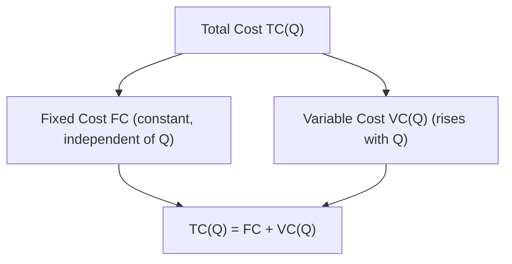
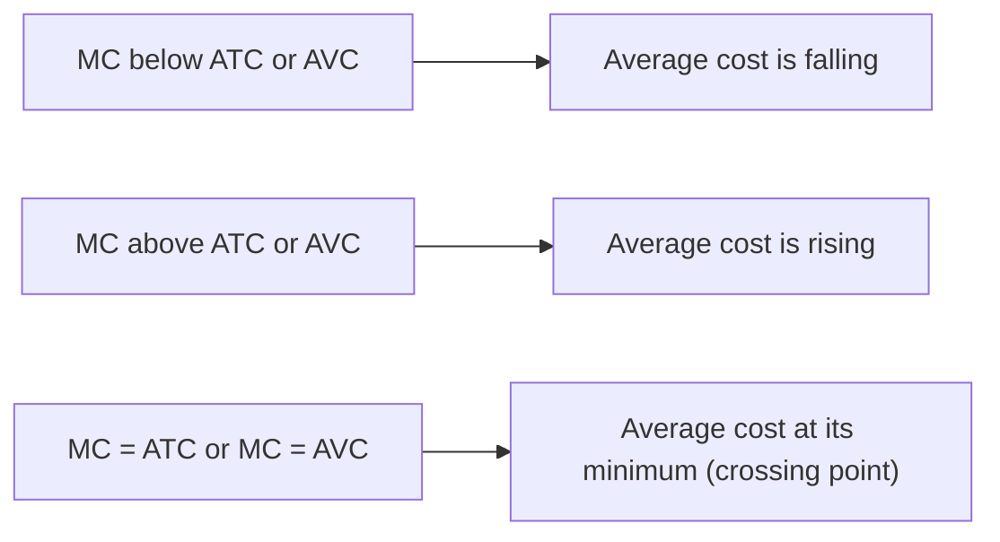

## Fixed, Variable, and Total Cost

### Definitions

**Fixed cost (FC)**: Costs that do not change with the level of output, even if output is zero. Fixed costs must be paid regardless of production level in the short run (e.g., rent on a factory, insurance premiums, salaried management contracts).

**Variable cost (VC)**: Costs that change directly with the level of output. As output rises, variable costs rise; as output falls, variable costs fall (e.g., raw materials, hourly wages, energy used in production).

**Total cost (TC)**: The sum of fixed and variable costs at a given output level:

$$TC(Q) = FC + VC(Q)$$

**Key Points**

- The fixed/variable distinction is inherently a **short-run** concept — in the long run, all costs are variable, since the firm can adjust every input, including capital and plant size
- Fixed costs are sometimes further distinguished as **sunk** (unrecoverable, e.g., an already-paid non-refundable lease) versus **avoidable fixed costs** (recoverable if the firm shuts down, e.g., a lease that can be broken for a smaller cancellation fee) — this distinction matters for the shutdown decision but not for the basic FC/VC/TC framework
- Total cost is defined only when output is nonzero *or* when explicitly including the fixed cost incurred even at $Q=0$

### The Cost Curves at a Glance

### Behavior at Zero Output

$$TC(0) = FC + VC(0) = FC + 0 = FC$$

Since variable cost is zero when output is zero (no variable inputs are needed if nothing is produced), total cost at zero output equals fixed cost exactly. This is why the total cost curve's vertical intercept equals fixed cost.

### Graphical Representation

<svg xmlns="http://www.w3.org/2000/svg" viewBox="0 0 520 340" font-family="Arial, sans-serif">
<text x="260" y="20" text-anchor="middle" font-size="14" font-weight="bold">Fixed, Variable, and Total Cost Curves (svg_diagram)</text>
<line x1="60" y1="300" x2="60" y2="40" stroke="black" stroke-width="1.5" />
<line x1="60" y1="300" x2="480" y2="300" stroke="black" stroke-width="1.5" />
<text x="480" y="320" font-size="13">Output (Q)</text>
<text x="25" y="45" font-size="13">Cost (\$)</text>

<line x1="60" y1="240" x2="460" y2="240" stroke="#2563eb" stroke-width="2" />
<text x="465" y="244" font-size="11" fill="#2563eb">FC</text>

<path d="M 60 300 C 150 280, 220 260, 260 220 C 320 160, 380 130, 460 110" stroke="#16a34a" stroke-width="2" fill="none" />
<text x="465" y="108" font-size="11" fill="#16a34a">VC</text>

<path d="M 60 240 C 150 220, 220 200, 260 160 C 320 100, 380 70, 460 50" stroke="#dc2626" stroke-width="2.5" fill="none" />
<text x="465" y="48" font-size="11" fill="#dc2626">TC</text>

<text x="65" y="235" font-size="10" fill="#555">TC(0) = FC</text>

</svg>

### The Shape of the Variable Cost Curve

The typical S-shaped (or "backward Z") variable cost curve reflects the underlying **short-run production function** and the law of diminishing marginal returns:

**Key Points**

- **Initial stage (increasing marginal returns)**: As output rises from zero, each additional unit of the variable input adds progressively more output — variable cost rises at a *decreasing* rate over this range, giving the curve a concave-from-below shape initially
- **Later stage (diminishing marginal returns)**: Beyond some output level, additional units of the variable input add progressively less output — variable cost rises at an *increasing* rate, giving the curve a convex shape
- The inflection point of the VC curve, where the curve shifts from concave to convex, corresponds to the output level at which marginal product of the variable input is maximized (equivalently, where marginal cost is minimized)
- Since $TC(Q) = FC + VC(Q)$ and FC is constant, the TC curve is a vertical shift of the VC curve and has an identical shape (same slope at every output level)

### Deriving Marginal and Average Cost from FC, VC, and TC

While marginal and average costs are typically treated as a related, separate topic, their direct algebraic relationship to FC, VC, and TC is essential:

$$MC(Q) = \frac{d\,TC}{dQ} = \frac{d\,VC}{dQ}$$

**Key Points**

- Marginal cost depends *only* on variable cost, since fixed cost does not change with output — the derivative of a constant is zero
- Average fixed cost: $AFC(Q) = FC/Q$ — always declining as $Q$ rises, since a constant numerator is spread over more units
- Average variable cost: $AVC(Q) = VC(Q)/Q$
- Average total cost: $ATC(Q) = TC(Q)/Q = AFC(Q) + AVC(Q)$

### Worked Numerical Example

**Example**

A firm has fixed cost $FC = \$100$ and the following variable costs at different output levels:

| Q | VC ($) | TC = FC + VC ($) | AFC ($) | AVC ($) | ATC ($) | MC ($) |
| --- | --- | --- | --- | --- | --- | --- |
| 0 | 0 | 100 | — | — | — | — |
| 1 | 60 | 160 | 100.00 | 60.00 | 160.00 | 60 |
| 2 | 110 | 210 | 50.00 | 55.00 | 105.00 | 50 |
| 3 | 150 | 250 | 33.33 | 50.00 | 83.33 | 40 |
| 4 | 200 | 300 | 25.00 | 50.00 | 75.00 | 50 |
| 5 | 270 | 370 | 20.00 | 54.00 | 74.00 | 70 |

**Key observations from the table**:

- $TC$ at $Q=0$ equals $FC = \$100$, confirming $TC(0) = FC$
- $MC$ is calculated as the change in $TC$ (equivalently, change in $VC$) per unit increase in $Q$: e.g., $MC$ at $Q=3$: $(250-210)/(3-2) = 40$
- $MC$ falls initially (from 60 to 40) then rises (from 40 to 70) — reflecting increasing then diminishing marginal returns to the variable input
- $AFC$ declines continuously as $Q$ increases

### Relationship Among the Cost Curves — Standard Geometric Properties

**Key Points**

- The **MC curve intersects both the AVC and ATC curves at their respective minimum points** — this occurs because when marginal cost is below average cost, average cost is being pulled down, and when marginal cost is above average cost, average cost is being pulled up; the crossing point is where they are equal
- **ATC and AVC curves converge as output rises** but never meet, since $ATC - AVC = AFC = FC/Q$, which approaches zero as $Q \to \infty$ but never reaches exactly zero for finite fixed cost
- **AFC is a rectangular hyperbola** ($AFC \times Q = FC$, a constant), asymptotically approaching both axes

### Fixed vs. Sunk Costs — A Refinement

**Key Points**

- Not all fixed costs are sunk. A fixed cost is **sunk** if it cannot be recovered even by shutting down (e.g., a specialized machine with no resale value, already-completed advertising spend)
- A fixed cost is **avoidable** (non-sunk) if it can be eliminated or recovered by ceasing operation (e.g., a building lease that can be terminated, unused equipment that can be resold)
- This distinction matters directly for the **shutdown decision**: a firm should ignore sunk costs when deciding whether to continue operating in the short run, since they are incurred regardless of the output decision — but avoidable fixed costs are relevant to the decision of whether to operate at all
- The basic FC/VC/TC framework does not distinguish sunk from avoidable fixed costs, but the distinction becomes critical when moving to short-run shutdown and long-run exit analysis

### Long-Run Perspective: All Costs Become Variable

**Key Points**

- In the **long run**, the firm can adjust plant size, capital stock, and all other inputs — so the FC/VC split, which is specific to a given short-run planning horizon, disappears
- The long-run total cost curve reflects cost minimization along the expansion path (see Cost-minimizing input combination), where every input, including what was fixed in the short run, is optimally chosen for each output level
- Short-run total cost at any output level is always greater than or equal to long-run total cost at that same output level, since the short-run firm faces a constraint (fixed capital) not present in the long run; the two coincide only at the output level for which the fixed input happens to already be at its long-run optimal level

### Common Pitfalls and Misconceptions

**Key Points**

- Treating fixed cost as if it changes with output "in special cases" — by definition, FC is constant across all positive output levels in the short run; if a cost changes with quantity produced, it is variable cost, not fixed cost
- Assuming $MC$ can be derived from $AFC$ or $FC$ — since fixed cost does not vary with $Q$, it contributes nothing to marginal cost; $MC$ depends only on how variable cost changes
- Confusing "fixed" with "sunk" — a cost can be fixed (constant regardless of output level) yet still avoidable (recoverable if the firm exits), which matters for shutdown/exit decisions even though it does not change the FC/VC/TC decomposition itself
- Believing average total cost and average variable cost will eventually meet at high output — they converge but never intersect for any finite $Q$, since $ATC - AVC = FC/Q > 0$ for all $Q < \infty$
- Forgetting that the specific S-shape of VC and TC curves stems directly from the underlying production function's returns to the variable input — these curves are not arbitrary shapes but a mirror image of the production function's marginal product behavior

### Related Topics

**Related Topics**

- Average and marginal cost curves
- Law of diminishing marginal returns
- Short-run vs. long-run cost curves
- Shutdown decision and the role of sunk vs. avoidable costs
- Cost-minimizing input combination and the expansion path
- Explicit vs. implicit costs
- Economies and diseconomies of scale
- Long-run average cost curve (LRAC) and minimum efficient scale