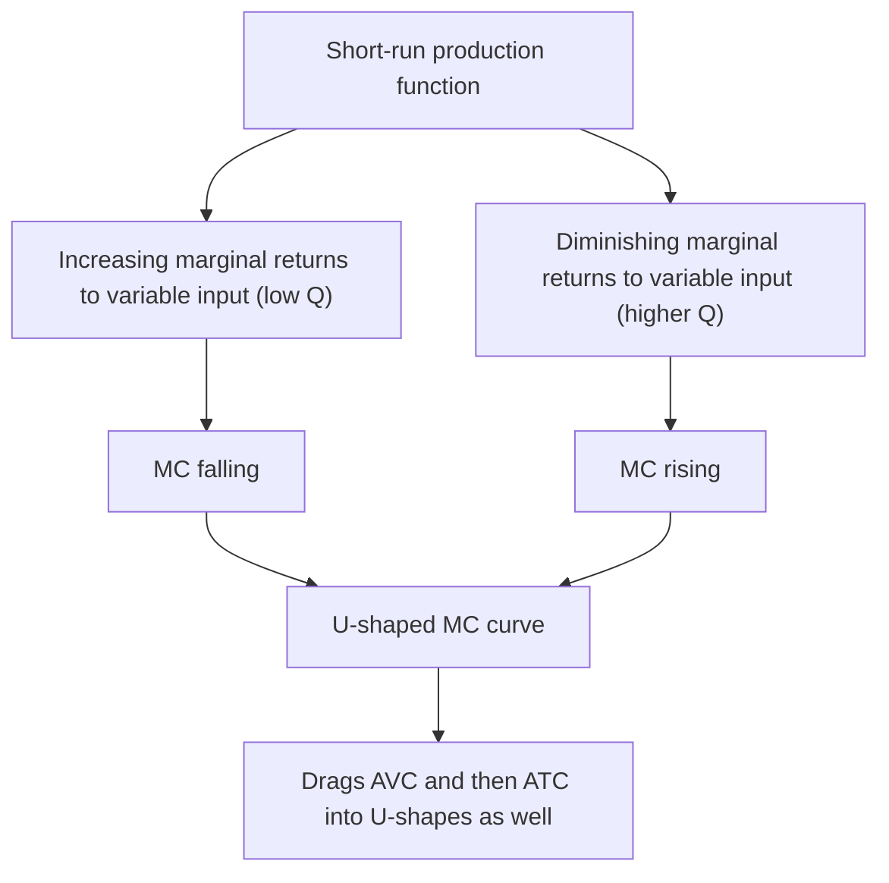
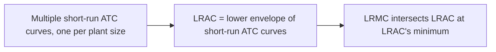

## Average and Marginal Cost Curves

### Definitions

**Average fixed cost (AFC)**: Fixed cost per unit of output.

$$AFC(Q) = \frac{FC}{Q}$$

**Average variable cost (AVC)**: Variable cost per unit of output.

$$AVC(Q) = \frac{VC(Q)}{Q}$$

**Average total cost (ATC)**, also called average cost (AC): Total cost per unit of output.

$$ATC(Q) = \frac{TC(Q)}{Q} = AFC(Q) + AVC(Q)$$

**Marginal cost (MC)**: The additional cost of producing one more unit of output — the rate of change of total cost (equivalently variable cost) with respect to output.

$$MC(Q) = \frac{d\,TC}{dQ} = \frac{d\,VC}{dQ}$$

**Key Points**

- All four curves are derived from the underlying total cost function $TC(Q) = FC + VC(Q)$
- MC depends only on variable cost, since fixed cost's derivative with respect to $Q$ is zero
- In discrete terms (non-calculus), marginal cost is approximated as $MC \approx \Delta TC / \Delta Q$ between two output levels

### The Standard U-Shaped Curves

In the short run, with at least one fixed input, AVC, ATC, and MC are typically drawn as **U-shaped**, while AFC is continuously declining.

**Key Points**

- The U-shape of AVC and ATC reflects the underlying short-run production function: increasing marginal returns to the variable input at low output (falling AVC/MC), followed by diminishing marginal returns at higher output (rising AVC/MC)
- MC is U-shaped and typically reaches its minimum at a *lower* output level than AVC or ATC
- AFC declines continuously across all output levels and never turns upward, since it is simply $FC/Q$ with constant $FC$

### The Critical Geometric Relationship: MC and Average Cost

**Key Points**

- **MC intersects AVC at AVC's minimum point**
- **MC intersects ATC at ATC's minimum point**
- This is a general mathematical property of averages and marginals, not specific to cost curves: whenever the marginal value is below the average, the average is falling; whenever the marginal value is above the average, the average is rising; they are equal exactly at the average's turning point

**Formal derivation** (for ATC): Since $ATC = TC/Q$, differentiate with respect to $Q$ using the quotient rule:

$$\frac{d(ATC)}{dQ} = \frac{MC \cdot Q - TC}{Q^2} = \frac{MC - ATC}{Q}$$

Setting this equal to zero (to find ATC's minimum) requires $MC = ATC$, confirming the intersection occurs precisely at ATC's minimum. The same logic applies to AVC by an identical derivation using $VC$ in place of $TC$.

<svg xmlns="http://www.w3.org/2000/svg" viewBox="0 0 520 340" font-family="Arial, sans-serif">
<text x="260" y="20" text-anchor="middle" font-size="14" font-weight="bold">Relationship Among AFC, AVC, ATC, and MC (svg_diagram)</text>
<line x1="60" y1="300" x2="60" y2="40" stroke="black" stroke-width="1.5" />
<line x1="60" y1="300" x2="480" y2="300" stroke="black" stroke-width="1.5" />
<text x="480" y="320" font-size="13">Output (Q)</text>
<text x="25" y="45" font-size="13">Cost (\$)</text>

<path d="M 100 230 Q 180 130 230 125 Q 300 130 420 260" stroke="#dc2626" stroke-width="2.5" fill="none" />
<text x="425" y="264" font-size="11" fill="#dc2626">MC</text>

<path d="M 110 250 Q 220 170 260 168 Q 340 175 440 220" stroke="#16a34a" stroke-width="2.5" fill="none" />
<text x="445" y="223" font-size="11" fill="#16a34a">AVC</text>

<path d="M 130 280 Q 260 190 300 187 Q 380 195 460 230" stroke="#2563eb" stroke-width="2.5" fill="none" />
<text x="465" y="234" font-size="11" fill="#2563eb">ATC</text>

<path d="M 90 60 Q 200 150 460 230" stroke="#a855f7" stroke-width="2" fill="none" stroke-dasharray="5,3" />
<text x="90" y="50" font-size="11" fill="#a855f7">AFC</text>

<circle cx="255" cy="169" r="4" fill="black" />
<text x="200" y="155" font-size="10">MC = AVC (AVC min)</text>
<circle cx="298" cy="187" r="4" fill="black" />
<text x="305" y="200" font-size="10">MC = ATC (ATC min)</text>
</svg>

### Worked Numerical Example

**Example**

Given $FC = \$50$ and the variable cost schedule below, compute all four cost curves.

| Q | VC ($) | TC ($) | AFC ($) | AVC ($) | ATC ($) | MC ($) |
| --- | --- | --- | --- | --- | --- | --- |
| 1 | 40 | 90 | 50.00 | 40.00 | 90.00 | 40 |
| 2 | 70 | 120 | 25.00 | 35.00 | 60.00 | 30 |
| 3 | 96 | 146 | 16.67 | 32.00 | 48.67 | 26 |
| 4 | 128 | 178 | 12.50 | 32.00 | 44.50 | 32 |
| 5 | 170 | 220 | 10.00 | 34.00 | 44.00 | 42 |
| 6 | 225 | 275 | 8.33 | 37.50 | 45.83 | 55 |

**Key observations**:

- $MC$ falls from 40 to 26 (through $Q=3$), then rises — its minimum occurs at $Q=3$
- $AVC$ reaches its minimum around $Q=3$–4 ($32.00 at both), consistent with $MC$ crossing $AVC$ near its lowest point
- $ATC$ reaches its minimum around $Q=4$–5 ($44.50$ and $44.00$), occurring at a higher $Q$ than AVC's minimum — consistent with the standard property that ATC's minimum lies to the right of AVC's minimum, since AFC is still falling and pulls ATC down even as AVC begins rising
- $AFC$ falls continuously throughout, from 50.00 down to 8.33

### Why ATC's Minimum Occurs at a Higher Output Than AVC's Minimum

**Key Points**

- Between AVC's minimum and ATC's minimum, AVC is rising, but AFC is still falling fast enough that their sum (ATC) continues to fall
- ATC only reaches its own minimum once the rise in AVC exceeds the (shrinking) decline in AFC
- This gap between the two minima narrows as fixed cost becomes a smaller share of total cost, and can become negligible at very high output levels where AFC has flattened out near zero

### Long-Run Marginal and Average Cost

**Key Points**

- The **long-run average cost (LRAC)** curve is often drawn as the "envelope" of a series of short-run ATC curves, each corresponding to a different fixed plant size — at each output level, LRAC equals the minimum short-run ATC achievable by choosing the optimal plant size for that output
- The **long-run marginal cost (LRMC)** curve intersects LRAC at LRAC's minimum point, by the identical average-marginal relationship that holds in the short run
- Unlike short-run AFC, there is no separate "fixed cost" component in the long run, since all inputs are variable — LRAC and LRMC are derived directly from the long-run total cost function

### Marginal Cost and the Firm's Supply Decision

**Key Points**

- In perfect competition, a profit-maximizing firm produces where price equals marginal cost ($P = MC$), provided price is at least equal to AVC (short run) — this makes the **portion of the MC curve above minimum AVC** the firm's short-run supply curve
- Below minimum AVC, the firm is better off shutting down temporarily (producing zero) than continuing to operate, since it cannot even cover its variable costs
- This is why the shutdown point is defined precisely at minimum AVC, and the break-even point (where economic profit is exactly zero) is defined at minimum ATC (where $P = MC = ATC$)

### Common Pitfalls and Misconceptions

**Key Points**

- Assuming MC crosses AVC and ATC at the *same* output level — they cross at two distinct points, with the AVC crossing occurring first (at lower $Q$) since AFC continues falling between the two minima
- Believing AFC eventually reaches zero — it approaches zero asymptotically as $Q \to \infty$ but never actually reaches zero for any finite $FC > 0$
- Treating the average-marginal relationship (marginal below average pulls average down, marginal above average pulls average up) as unique to cost curves — it is a general mathematical property that also applies, for example, to marginal and average product, or marginal and average grades in a course
- Assuming MC must always be U-shaped — this shape follows from the assumption of a short-run production function with initially increasing, then diminishing, marginal returns to the variable input; different underlying production technologies (e.g., constant marginal product throughout) would produce a flat MC curve instead
- Confusing short-run ATC (which includes AFC and reflects a fixed plant size) with long-run average cost (which reflects optimal plant size chosen for every output level, and is generally flatter or lower than any single short-run ATC curve except at one tangency point)

### Related Topics

**Related Topics**

- Fixed, variable, and total cost
- Law of diminishing marginal returns
- Short-run vs. long-run cost curves
- Shutdown point and break-even point
- Perfectly competitive firm's supply curve
- Long-run average cost curve (LRAC) and the envelope theorem
- Cost-minimizing input combination
- Economies and diseconomies of scale