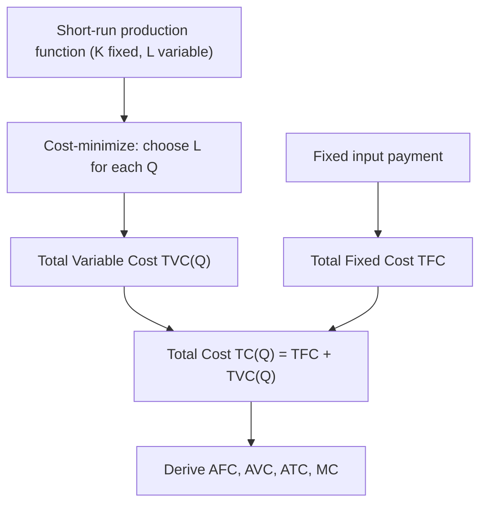
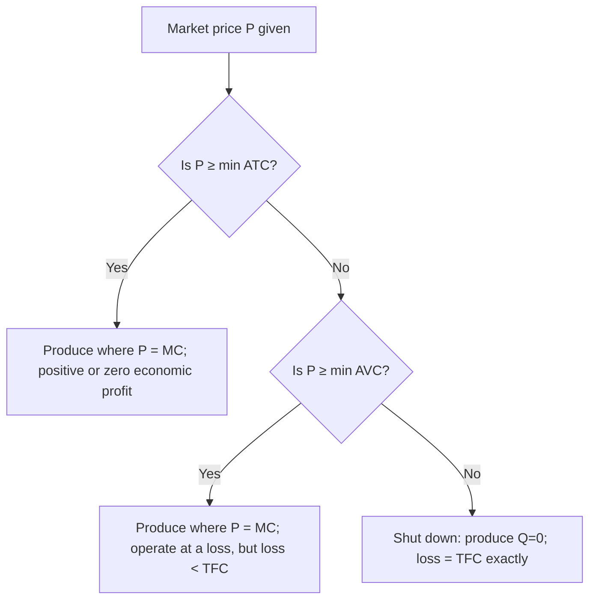
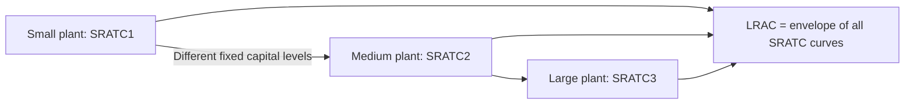

## Short-Run Cost Curves

### Definition of the Short Run

The **short run** is the planning horizon over which at least one input (conventionally capital, $K$) is **fixed**, while other inputs (conventionally labor, $L$) are variable. Short-run cost curves describe how a firm's costs behave as it varies output using only its variable input(s), given a fixed level of the fixed input.

**Key Points**

- The short run is defined by the presence of a fixed input, not by a specific calendar duration — its length varies by industry (e.g., adjusting capital in a power plant takes years; in a small retail shop, weeks)
- Every short-run cost curve is drawn for a *given, specific* level of the fixed input (e.g., a specific plant size or capital stock); changing that fixed level produces an entirely different set of short-run curves
- The short-run cost structure is directly derived from the short-run production function via cost minimization, given fixed capital

### The Family of Short-Run Cost Curves

**Total Fixed Cost (TFC)**: constant regardless of output, reflecting payments for the fixed input.

**Total Variable Cost (TVC)**: rises with output, reflecting payments for the variable input(s).

**Total Cost (TC)**: $TC(Q) = TFC + TVC(Q)$

**Average Fixed Cost (AFC)**: $AFC(Q) = TFC/Q$

**Average Variable Cost (AVC)**: $AVC(Q) = TVC(Q)/Q$

**Average Total Cost (ATC)**: $ATC(Q) = TC(Q)/Q = AFC(Q) + AVC(Q)$

**Marginal Cost (MC)**: $MC(Q) = d(TC)/dQ = d(TVC)/dQ$

### Link to the Short-Run Production Function

Short-run cost curves are the "mirror image" of the short-run production function, reflecting the **law of diminishing marginal returns**.

**Key Points**

- At low output, the variable input typically exhibits *increasing* marginal returns (each additional unit of labor adds more output than the last, e.g., due to better utilization of fixed capital) — this corresponds to *falling* MC
- Beyond some output level, the variable input exhibits *diminishing* marginal returns — this corresponds to *rising* MC
- Formally, if $w$ is the wage rate and $MP_L$ is the marginal product of labor: $MC(Q) = w / MP_L$. Since $MP_L$ first rises then falls (with a fixed input), MC first falls then rises — an inverse relationship
- Average variable cost is similarly linked to the **average product of labor** ($AP_L$): $AVC(Q) = w/AP_L$. As $AP_L$ rises then falls, AVC falls then rises

$$MC(Q) = \frac{w}{MP_L}, \qquad AVC(Q) = \frac{w}{AP_L}$$

### Graphical Representation: The Full Short-Run Cost Structure

<svg xmlns="http://www.w3.org/2000/svg" viewBox="0 0 560 360" font-family="Arial, sans-serif">
<text x="280" y="20" text-anchor="middle" font-size="14" font-weight="bold">Short-Run Cost Curves (svg_diagram)</text>
<line x1="60" y1="320" x2="60" y2="40" stroke="black" stroke-width="1.5" />
<line x1="60" y1="320" x2="500" y2="320" stroke="black" stroke-width="1.5" />
<text x="500" y="340" font-size="13">Output (Q)</text>
<text x="25" y="45" font-size="13">Cost (\$)</text>

<path d="M 110 250 Q 190 150 240 145 Q 320 150 440 280" stroke="#dc2626" stroke-width="2.5" fill="none" />
<text x="445" y="284" font-size="11" fill="#dc2626">MC</text>

<path d="M 120 270 Q 230 190 270 188 Q 350 195 460 240" stroke="#16a34a" stroke-width="2.5" fill="none" />
<text x="465" y="243" font-size="11" fill="#16a34a">AVC</text>

<path d="M 140 300 Q 270 210 310 207 Q 390 215 480 250" stroke="#2563eb" stroke-width="2.5" fill="none" />
<text x="485" y="253" font-size="11" fill="#2563eb">ATC</text>

<path d="M 90 60 Q 200 160 480 250" stroke="#a855f7" stroke-width="2" fill="none" stroke-dasharray="5,3" />
<text x="90" y="50" font-size="11" fill="#a855f7">AFC</text>
<circle cx="265" cy="189" r="4" fill="black" />
<circle cx="308" cy="207" r="4" fill="black" />
</svg>

### The Shutdown Point and the Break-Even Point

**Shutdown point**: The output level (and price) at which price equals minimum AVC. Below this price, the firm cannot cover its variable costs, so it minimizes losses by producing zero output (shutting down temporarily) rather than continuing to operate.

**Break-even point**: The output level (and price) at which price equals minimum ATC. At this point, economic profit is exactly zero (the firm earns normal profit).

**Key Points**

- The shutdown point occurs at a lower price than the break-even point, since minimum AVC ≤ minimum ATC always
- Between the shutdown price and the break-even price, the firm operates at an economic loss but continues producing in the short run, since it is covering variable costs and contributing something toward fixed costs
- Below the shutdown price, continuing to operate would mean losing more than the fixed cost alone, so shutting down is the loss-minimizing choice
- **The portion of the MC curve at or above minimum AVC is the firm's short-run supply curve** under perfect competition

### Worked Numerical Example

**Example**

A firm has $TFC = \$60$ and the wage rate is $w = \$20$/unit of labor. Given the following labor-output relationship (short-run production function) and resulting cost data:

| Q | L | TVC = wL ($) | TC ($) | AVC ($) | ATC ($) | MC ($) |
| --- | --- | --- | --- | --- | --- | --- |
| 10 | 2 | 40 | 100 | 4.00 | 10.00 | — |
| 20 | 3 | 60 | 120 | 3.00 | 6.00 | 2.00 |
| 30 | 4 | 80 | 140 | 2.67 | 4.67 | 2.00 |
| 40 | 6 | 120 | 180 | 3.00 | 4.50 | 4.00 |
| 50 | 9 | 180 | 240 | 3.60 | 4.80 | 6.00 |
| 60 | 13 | 260 | 320 | 4.33 | 5.33 | 8.00 |

**Key observations**:

- $MC$ falls from $2.00 through $Q=30$, then rises — its minimum region is around $Q=20$–30
- $AVC$ reaches its minimum near $Q=30$ ($2.67), where MC crosses it
- $ATC$ reaches its minimum near $Q=30$–40 (roughly $4.67 and $4.50), slightly to the right of AVC's minimum, consistent with the standard AFC-driven lag between the two minima
- If market price were, say, $3.00, the firm would be below minimum ATC but above minimum AVC — it should continue operating in the short run despite an economic loss, since price still exceeds AVC
- If market price fell below approximately $2.67 (minimum AVC), the firm would shut down

### How a Change in the Fixed Input Shifts Short-Run Cost Curves

**Key Points**

- Increasing the fixed input (e.g., a larger factory or more machinery) shifts **TFC and AFC upward**, but can shift the **MC and AVC curves downward** at relevant output ranges if the added capital raises the marginal and average product of labor
- This produces a distinct short-run cost structure for *each* possible level of the fixed input — the firm's problem of choosing the best plant size is a long-run decision, addressed by comparing these different short-run curves
- The **long-run average cost (LRAC) curve** is the lower envelope of all possible short-run ATC curves, each corresponding to a different fixed input level; short-run ATC touches LRAC at exactly one output level for each plant size (the output for which that plant size happens to be long-run optimal)

### Distinguishing Short-Run from Long-Run Cost Curves

**Key Points**

- Short-run cost curves reflect a fixed level of at least one input; long-run cost curves reflect the cost-minimizing choice of *all* inputs (via the expansion path) at every output level
- Short-run ATC lies at or above long-run average cost (LRAC) at every output level, touching it only at the output level where the given fixed input happens to be optimal
- Short-run MC and long-run MC (LRMC) are generally different curves, except at the single output level where the short-run fixed input level coincides with the long-run optimal level for that output
- The distinction between short-run and long-run costs is central to understanding why firms may temporarily operate at a loss (short-run decision) even though they would exit in the long run if losses persisted

### Common Pitfalls and Misconceptions

**Key Points**

- Assuming short-run cost curves apply universally regardless of the fixed input level — every short-run curve set is specific to one particular quantity of the fixed input; changing that quantity requires deriving an entirely new set of curves
- Confusing the shutdown point (minimum AVC) with the break-even point (minimum ATC) — these are different price thresholds guiding different decisions (whether to produce at all vs. whether the firm is earning at least normal profit)
- Believing a firm operating at an economic loss between the shutdown and break-even prices is behaving irrationally — continuing to produce in this range is the loss-*minimizing* choice in the short run, since some revenue is being applied toward fixed costs that must be paid regardless
- Treating short-run and long-run marginal cost as identical — they coincide only at the output level for which the short-run fixed input happens to match the long-run cost-minimizing choice
- Forgetting that the U-shape of short-run AVC, ATC, and MC curves is a direct consequence of the assumed pattern of increasing-then-diminishing marginal returns in the underlying short-run production function, not an arbitrary or universal mathematical property

### Related Topics

**Related Topics**

- Fixed, variable, and total cost
- Average and marginal cost curves
- Law of diminishing marginal returns
- Shutdown point and break-even point
- Perfectly competitive firm's short-run supply curve
- Long-run average cost curve (LRAC) and the envelope theorem
- Cost-minimizing input combination and the expansion path
- Economies and diseconomies of scale