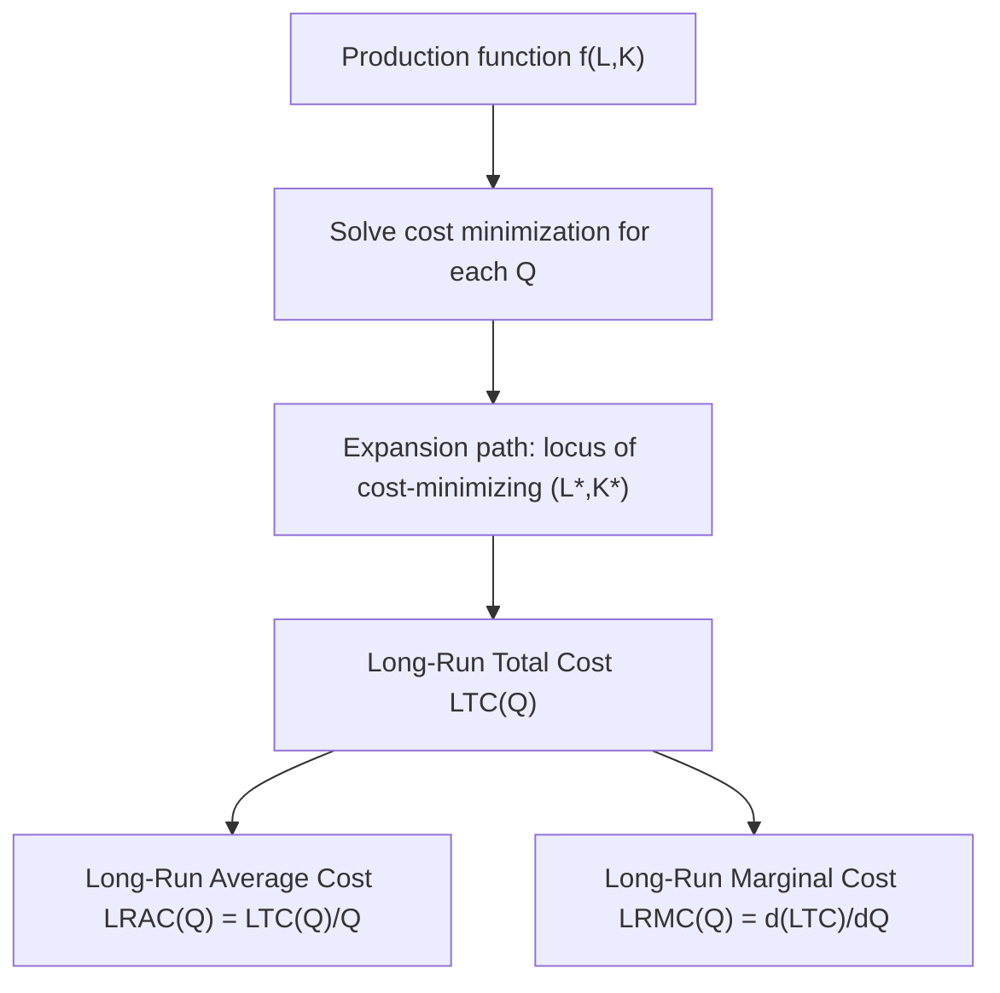
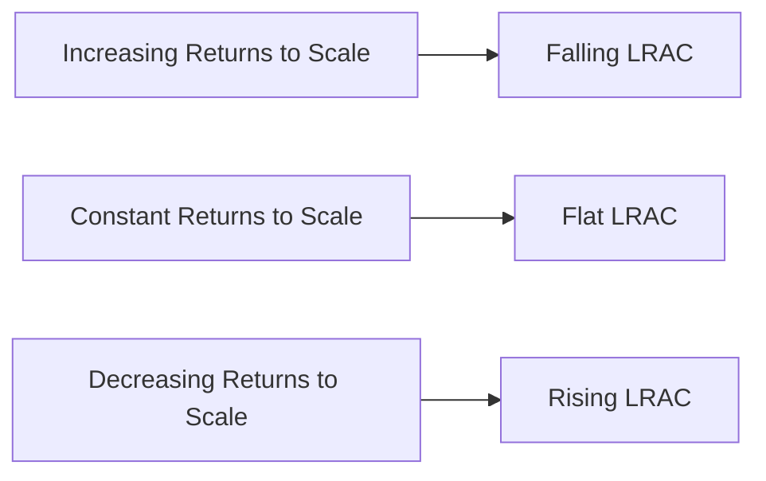

## Long-Run Cost Curves

### Definition of the Long Run

The **long run** is the planning horizon over which *all* inputs — including capital, plant size, and any input that was fixed in the short run — are variable. Long-run cost curves describe the lowest possible cost of producing each output level when the firm is free to choose every input optimally, including plant scale.

**Key Points**

- Unlike the short run, there is no fixed input in the long run, so there is no separate fixed-cost/variable-cost distinction — all long-run cost is, by construction, variable
- Long-run cost curves are derived by solving the cost-minimization problem (see Cost-minimizing input combination) for every possible output level, then tracing the resulting minimum costs
- The long run is a planning concept, not a fixed calendar length — its duration depends on how long it takes a specific firm or industry to adjust all inputs, including capital

### Deriving Long-Run Total Cost (LTC)

Long-run total cost at each output level $Q$ is obtained by minimizing cost subject to the production constraint:

$$LTC(Q) = \min_{L,K} \; wL + rK \quad \text{subject to } f(L,K) = Q$$

Solving this problem for a range of $Q$ values (holding $w$ and $r$ fixed) generates the **expansion path** — the locus of cost-minimizing input combinations — and plotting the resulting minimum cost against $Q$ produces the LTC curve.

**Key Points**

- LTC always starts at the origin: $LTC(0) = 0$, since there are no fixed costs to pay even at zero output (unlike short-run TC, which equals TFC at $Q=0$)
- The shape of LTC is governed entirely by the underlying production function's **returns to scale**
- From LTC, all other long-run cost curves (LRAC, LRMC) are derived by the same mathematical relationships used in the short run

### Long-Run Average and Marginal Cost

$$LRAC(Q) = \frac{LTC(Q)}{Q}$$

$$LRMC(Q) = \frac{d(LTC)}{dQ}$$

**Key Points**

- As with short-run cost curves, LRMC intersects LRAC exactly at LRAC's minimum point, by the same average-marginal mathematical relationship
- If LRAC is falling, LRMC lies below it; if LRAC is rising, LRMC lies above it
- There is no long-run analogue to AFC, since no cost is fixed in the long run

### Returns to Scale and the Shape of LRAC

The shape of the LRAC curve is a direct reflection of the production function's returns to scale:

**Key Points**

- **Increasing returns to scale** → LRAC is **falling** (economies of scale): doubling output requires less than double the cost
- **Constant returns to scale** → LRAC is **flat** (constant): doubling output requires exactly double the cost
- **Decreasing returns to scale** → LRAC is **rising** (diseconomies of scale): doubling output requires more than double the cost
- A common textbook depiction shows LRAC as **U-shaped**: falling at low output (increasing returns / economies of scale), flattening at a minimum range (constant returns), then rising at high output (decreasing returns / diseconomies of scale) — though not all industries necessarily exhibit all three phases

### Minimum Efficient Scale (MES)

The **minimum efficient scale** is the smallest output level at which LRAC reaches its minimum (i.e., the smallest scale at which the firm has fully exhausted available economies of scale).

**Key Points**

- Below MES, a firm operating at that scale faces a cost disadvantage relative to larger competitors, since further scale would still lower average cost
- If LRAC has a flat minimum range (a common depiction with constant returns to scale in an intermediate range), MES refers to the smallest output at which that minimum is first reached
- MES varies substantially by industry: capital-intensive industries with large fixed-investment requirements (e.g., semiconductor fabrication, utilities) tend to have high MES, while industries with low capital requirements (e.g., many personal services) tend to have low MES
- Industries with a high MES relative to total market demand tend toward more concentrated market structures (few firms), since only a small number of firms can operate near efficient scale

### The Long-Run Average Cost Curve as an Envelope of Short-Run Curves

**Key Points**

- Each short-run ATC curve corresponds to a specific, fixed level of capital (plant size)
- **LRAC is the lower envelope of all possible short-run ATC curves**: at each output level, LRAC equals the minimum cost achievable by choosing the best possible plant size for that specific output
- Each short-run ATC curve is tangent to LRAC at exactly one point — the output level at which that particular plant size happens to be the long-run cost-minimizing choice
- On the rising portion of a U-shaped LRAC, the tangency between LRAC and each SRATC curve occurs to the *left* of that SRATC curve's own minimum (the firm has "over-expanded" its fixed input relative to its short-run optimum at that output); on the falling portion, tangency occurs to the *right* of the SRATC minimum

<svg xmlns="http://www.w3.org/2000/svg" viewBox="0 0 560 340" font-family="Arial, sans-serif">
<text x="280" y="20" text-anchor="middle" font-size="14" font-weight="bold">LRAC as Envelope of Short-Run ATC Curves (svg_diagram)</text>
<line x1="60" y1="300" x2="60" y2="40" stroke="black" stroke-width="1.5" />
<line x1="60" y1="300" x2="500" y2="300" stroke="black" stroke-width="1.5" />
<text x="500" y="320" font-size="13">Output (Q)</text>
<text x="25" y="45" font-size="13">Cost (\$)</text>

<path d="M 90 260 Q 140 150 190 200" stroke="#94a3b8" stroke-width="1.8" fill="none" />
<path d="M 160 230 Q 230 130 290 190" stroke="#94a3b8" stroke-width="1.8" fill="none" />
<path d="M 250 200 Q 320 120 380 180" stroke="#94a3b8" stroke-width="1.8" fill="none" />
<path d="M 340 190 Q 410 140 470 220" stroke="#94a3b8" stroke-width="1.8" fill="none" />
<text x="105" y="255" font-size="9" fill="#555">SRATC1</text>
<text x="180" y="225" font-size="9" fill="#555">SRATC2</text>
<text x="275" y="195" font-size="9" fill="#555">SRATC3</text>
<text x="365" y="185" font-size="9" fill="#555">SRATC4</text>

<path d="M 90 260 Q 200 150 320 148 Q 420 155 470 220" stroke="#dc2626" stroke-width="2.8" fill="none" />
<text x="475" y="223" font-size="12" fill="#dc2626">LRAC</text>
</svg>

### Worked Numerical Example: Constant Returns to Scale

**Example**

Given $Q = 4L^{0.5}K^{0.5}$ (Cobb-Douglas, $\alpha+\beta=1$, constant returns to scale), $w=\$8$, $r=\$2$.

Step 1 — Tangency condition:

$$\frac{MP_L}{MP_K} = \frac{K}{L} = \frac{w}{r} = 4 \implies K = 4L$$

Step 2 — Substitute into production function for general $Q$:

$$Q = 4L^{0.5}(4L)^{0.5} = 4L^{0.5}(2)L^{0.5} = 8L \implies L^* = Q/8, \quad K^* = Q/2$$

Step 3 — Long-run total cost:

$$LTC(Q) = wL^* + rK^* = 8(Q/8) + 2(Q/2) = Q + Q = 2Q$$

Step 4 — Long-run average and marginal cost:

$$LRAC(Q) = \frac{2Q}{Q} = 2 \quad (\text{constant for all } Q)$$

$$LRMC(Q) = \frac{d(2Q)}{dQ} = 2$$

This confirms the expected result: with constant returns to scale, LRAC and LRMC are both **constant and equal to each other** at every output level — consistent with the theoretical link between constant returns to scale and flat LRAC.

### Long-Run vs. Short-Run Cost: Key Comparison

**Key Points**

- **$LTC(Q) \leq STC(Q)$** at every output level, for any given short-run fixed input level, since the long-run firm has strictly more flexibility (it can always choose to replicate the short-run input combination if that happened to be optimal, but is never forced to)
- Equality holds only at the single output level for which the short-run fixed input already equals its long-run cost-minimizing level
- This same relationship extends to average cost: $LRAC(Q) \leq SRATC(Q)$ for all $Q$, with equality at exactly one point per short-run curve
- The gap between short-run and long-run cost reflects the cost of being "locked into" a suboptimal capital stock relative to what would be chosen with full flexibility

### Common Pitfalls and Misconceptions

**Key Points**

- Assuming LRAC must always be U-shaped — the shape is empirically and theoretically determined by the underlying production function's returns to scale; some industries plausibly exhibit LRAC that is flat throughout, or that declines over the entire relevant range without ever rising within observed output levels [Inference: which shape best describes a specific real-world industry is an empirical question, not something determined by theory alone]
- Confusing LRAC with a *specific* short-run ATC curve — LRAC is the envelope across *all possible* plant sizes, not any single SRATC curve
- Believing SRATC and LRAC are tangent at each curve's own minimum — this is only true at the very bottom of a U-shaped LRAC; elsewhere, tangency occurs off each SRATC curve's own minimum point
- Treating LTC as having a positive vertical intercept — since there is no fixed cost in the long run, $LTC(0) = 0$ always, unlike short-run TC which equals TFC at zero output
- Assuming minimum efficient scale is the same across industries — MES depends heavily on the specific technology and capital requirements of each industry

### Related Topics

**Related Topics**

- Short-run cost curves
- Returns to scale
- Cost-minimizing input combination and the expansion path
- Economies and diseconomies of scale
- Minimum efficient scale and market structure
- Average and marginal cost curves
- Perfectly competitive long-run equilibrium
- Natural monopoly and cost-based market structure analysis