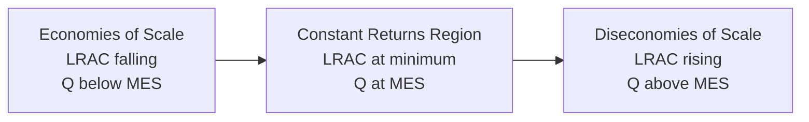

## Economies and Diseconomies of Scale

### Definitions

**Economies of Scale**: Occur when a firm's long-run average cost (LRAC) decreases as output increases. Larger scale of production leads to lower per-unit costs.

**Diseconomies of Scale**: Occur when LRAC increases as output increases. Beyond some point, expanding scale further raises per-unit costs.

**Constant Returns to Scale (cost analogue)**: LRAC remains flat as output changes — per-unit costs are unaffected by scale.

$$LRAC(Q) = \frac{TC_{LR}(Q)}{Q}$$

where economies of scale exist when $\frac{d(LRAC)}{dQ} < 0$, diseconomies exist when $\frac{d(LRAC)}{dQ} > 0$, and the point where $\frac{d(LRAC)}{dQ} = 0$ marks the **Minimum Efficient Scale (MES)**.

### Relationship to Returns to Scale

**Key Points**

- Economies/diseconomies of scale are the *cost-side* expression of returns to scale (a *production-side* concept).
- Increasing returns to scale (output more than proportionally increases with inputs) → falling LRAC → economies of scale.
- Constant returns to scale → flat LRAC.
- Decreasing returns to scale → rising LRAC → diseconomies of scale.
- [Inference] In practice, economies of scale often arise from sources beyond pure technical returns to scale — such as bargaining power in input markets — so the two concepts, while closely linked, are not perfectly interchangeable in applied analysis.

### The LRAC Curve Shape

The standard textbook LRAC curve is U-shaped, reflecting three phases:

**LRAC Curve with Economies/Diseconomies (svg_diagram)**

<svg xmlns="http://www.w3.org/2000/svg" viewBox="0 0 600 400" font-family="sans-serif">
<text x="300" y="24" text-anchor="middle" font-size="16" font-weight="bold">LRAC Curve with Economies/Diseconomies (svg_diagram)</text>
<line x1="60" y1="350" x2="560" y2="350" stroke="black" stroke-width="1.5" />
<line x1="60" y1="350" x2="60" y2="60" stroke="black" stroke-width="1.5" />
<text x="570" y="355" font-size="12">Q</text>
<text x="30" y="60" font-size="12">Cost</text>
<path d="M 90 300 C 180 150, 260 110, 320 105 S 420 130, 500 260" stroke="#1d4ed8" stroke-width="3" fill="none" />
<text x="440" y="240" font-size="12" fill="#1d4ed8" font-weight="bold">LRAC</text>
<line x1="320" y1="350" x2="320" y2="105" stroke="#999" stroke-dasharray="4,4" />
<text x="290" y="368" font-size="11">MES (Q*)</text>

<text x="140" y="200" font-size="12" fill="`#16a34a`">Economies of Scale</text>

<text x="300" y="90" font-size="11" fill="#555">Constant Returns</text>

<text x="420" y="200" font-size="12" fill="`#dc2626`">Diseconomies of Scale</text>

</svg>

Some industries exhibit an extended flat minimum segment (constant returns over a wide output range) before diseconomies set in, giving an L-shaped or "saucer-shaped" LRAC rather than a sharp U.

### Sources of Economies of Scale

**Key Points**

*Internal Economies of Scale* (arising from the firm's own growth):

- **Technical economies**: Specialization and division of labor; use of large, more efficient (and often more expensive) capital equipment that is only cost-effective at high volume; the "container principle" — cost of container capacity (e.g., storage tanks, pipelines) rises roughly with surface area ($\propto r^2$) while capacity rises with volume ($\propto r^3$), so unit cost falls as scale increases.
- **Purchasing/managerial economies**: Bulk purchasing gives bargaining power over suppliers, lowering input costs per unit; large firms can afford specialized managers/departments (finance, HR, R&D) whose costs spread over more output.
- **Financial economies**: Larger firms typically access capital markets on better terms (lower borrowing costs, wider range of financing instruments) [Unverified — actual borrowing terms depend on creditworthiness, market conditions, and country-specific financial regulation].
- **Marketing economies**: Advertising and distribution costs can be spread over a larger sales volume, lowering average marketing cost per unit.
- **Risk-bearing economies**: Larger, more diversified firms can spread risk across multiple product lines or markets.

*External Economies of Scale* (arising from the growth of the industry or geographic cluster, not the individual firm):

- Development of specialized local labor pools with industry-specific skills.
- Growth of specialized suppliers and support services in a region (agglomeration effects).
- Improved infrastructure (transport, utilities) developed to support industry clusters.
- Knowledge spillovers between firms in the same industry or region.

**Example**

An automobile manufacturer investing in a robotic assembly line: the fixed cost of the robotics is very high, but if spread across producing 500,000 vehicles annually, the added cost per vehicle is far lower than if spread across only 5,000 vehicles. This illustrates a technical economy of scale.

### Sources of Diseconomies of Scale

**Key Points**

*Internal Diseconomies*:

- **Managerial/coordination diseconomies**: As firms grow, communication and coordination between layers of management become more complex; decision-making can slow down, and information can become distorted moving through hierarchical layers ("control loss").
- **Motivation/agency diseconomies**: Workers in very large organizations may feel less connected to outcomes, potentially reducing individual productivity; principal-agent problems can intensify as ownership and control separate further.
- **X-inefficiency**: [Inference] A concept associated with Harvey Leibenstein describing a tendency for large organizations to operate above their theoretically minimum cost curve due to reduced competitive pressure and organizational slack — this is more a critique of allocative/organizational efficiency than a strict technical diseconomy, and its empirical magnitude is debated among economists.
- **Duplication and bureaucracy**: Overlapping functions across divisions, increased administrative overhead.

*External Diseconomies*:

- Increased competition for scarce local resources (labor, land) as an industry cluster grows, bidding up input prices for all firms in the area.
- Congestion effects (transport, infrastructure strain) as industry concentration increases in a region.

### Distinguishing Economies of Scale from Economies of Scope

| Concept | Definition |
| --- | --- |
| Economies of Scale | Cost per unit falls as *output of a single product* increases |
| Economies of Scope | Cost falls when a firm produces *multiple different products together* rather than separately, due to shared resources or processes |

$$TC(Q_1, Q_2) < TC(Q_1, 0) + TC(0, Q_2)$$

This inequality defines economies of scope — it is a distinct concept from scale economies and should not be conflated with it.

### Market Structure Implications

**Key Points**

- Industries with substantial economies of scale relative to market size tend toward higher market concentration (oligopoly or natural monopoly), since larger incumbents achieve lower unit costs than potential smaller entrants — creating a barrier to entry.
- A **natural monopoly** arises when the MES is so large relative to market demand that a single firm can supply the entire market at lower average cost than two or more firms could achieve individually. This is common in industries with very high fixed infrastructure costs (e.g., utility transmission networks).
- Industries with limited economies of scale (MES reached at low output relative to market size) tend to support many competing firms, consistent with monopolistic competition or perfect competition.

**Natural Monopoly and MES Relative to Demand (svg_diagram)**

<svg xmlns="http://www.w3.org/2000/svg" viewBox="0 0 600 380" font-family="sans-serif">
<text x="300" y="24" text-anchor="middle" font-size="16" font-weight="bold">Natural Monopoly and MES Relative to Demand (svg_diagram)</text>
<line x1="60" y1="330" x2="560" y2="330" stroke="black" stroke-width="1.5" />
<line x1="60" y1="330" x2="60" y2="60" stroke="black" stroke-width="1.5" />
<text x="570" y="335" font-size="12">Q</text>
<text x="30" y="60" font-size="12">Cost/Price</text>
<path d="M 90 300 C 200 150, 350 100, 540 90" stroke="#1d4ed8" stroke-width="3" fill="none" />
<text x="400" y="80" font-size="12" fill="#1d4ed8" font-weight="bold">LRAC (still falling)</text>
<line x1="90" y1="290" x2="500" y2="130" stroke="#dc2626" stroke-width="2" />
<text x="420" y="160" font-size="12" fill="#dc2626">Market Demand</text>
<circle cx="330" cy="185" r="4" fill="black" />
<text x="340" y="180" font-size="10">Demand met before LRAC bottoms out</text>
</svg>

### Empirical and Policy Relevance

- Antitrust and regulatory economics use MES estimates to assess whether a market can sustainably support multiple competitors.
- Government regulation of natural monopolies (e.g., price caps, rate-of-return regulation) is often justified on the grounds that unregulated natural monopolies could set prices well above cost while restricting output.
- [Speculation] Some economists argue that in certain digital and network industries, economies of scale interact with network effects to produce concentration dynamics not fully captured by traditional production-cost-based MES analysis — this remains an area of ongoing debate in industrial organization theory.

### Common Pitfalls

- Confusing economies of scale (a long-run, cost-side concept) with diminishing marginal returns (a short-run, single-variable-input concept) — they operate on different timeframes and involve different input assumptions.
- Treating "returns to scale" and "economies of scale" as always perfectly synonymous — cost economies can also arise from non-technical sources (bulk purchasing, financial terms) even without technical increasing returns to scale.
- Assuming all industries have a strongly U-shaped LRAC; many exhibit long flat segments (constant returns) before diseconomies emerge, if diseconomies emerge at relevant output levels at all.

**Related Topics**

- Minimum Efficient Scale and Market Structure
- Natural Monopoly and Regulation
- Economies of Scope
- X-Inefficiency and Principal-Agent Problems
- Long-Run Average Cost Curve Derivation
- Returns to Scale (Production Theory)
- Barriers to Entry