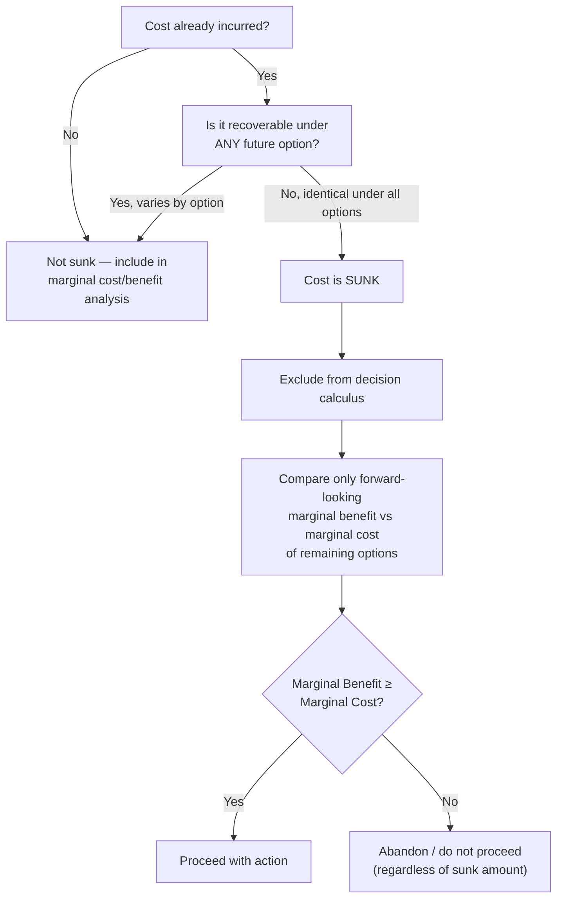

## Sunk Costs and Their Irrelevance to Decisions

### Definition

A sunk cost is an expenditure that has already been incurred and cannot be recovered by any current or future decision. Once resources have been spent, committed, or contractually locked in, that cost is fixed with respect to every option available going forward.

The defining feature is *irreversibility*: the money, time, or resources are gone regardless of which choice is made next. This distinguishes sunk costs from fixed costs, which — although also unaffected by output level in the short run — are still ongoing obligations that may be avoidable in the long run (e.g., by not renewing a lease).

$$\text{Sunk Cost} = \text{Expenditure already made, unrecoverable under all future action paths}$$

### The Sunk Cost Principle

The central principle in microeconomics is:

> **Sunk costs are irrelevant to rational decision-making.**

Rational economic agents make decisions by comparing the **marginal (incremental) costs and benefits** of available options going forward. Because a sunk cost is identical across every possible future choice, it does not change the relative ranking of those choices. Including it in the decision calculus contributes no new information — it acts as a constant added equally to every option, so it cannot affect which option is optimal.

Formally, if a decision-maker is choosing among $n$ mutually exclusive future actions $a_1, a_2, \ldots, a_n$, and $S$ is a sunk cost already incurred prior to the decision, then the net payoff of each action is:

$$\pi_i = B_i - C_i - S$$

where $B_i$ is the future benefit and $C_i$ is the future (avoidable) cost of action $a_i$. Since $S$ is identical for all $i$, the ranking of $\pi_i$ across actions is unaffected by $S$:

$$\pi_i - \pi_j = (B_i - C_i) - (B_j - C_j)$$

$S$ cancels out entirely. The optimal decision rule reduces to comparing only the forward-looking components, $B_i - C_i$.

### Sunk Cost vs. Other Cost Concepts

| Cost Type | Recoverable? | Relevant to Future Decisions? | Example |
| --- | --- | --- | --- |
| Sunk cost | No | No | Non-refundable deposit already paid |
| Fixed cost (ongoing) | Sometimes, in the long run | Yes, if avoidable going forward | Monthly equipment lease (avoidable by cancelling) |
| Variable cost | N/A (not yet incurred) | Yes | Cost of raw materials for the next unit |
| Opportunity cost | N/A (forward-looking) | Yes | Value of the next-best alternative foregone |
| Marginal cost | N/A (forward-looking) | Yes | Cost of producing one additional unit |

A useful distinguishing test: **ask whether the cost changes depending on which option is chosen from this point forward.** If it does not change under any option, it is sunk and should be excluded from the comparison.

### Why Firms Should Ignore Sunk Costs

In production and firm-behavior analysis, the sunk cost principle governs several standard decisions:

**1. Shutdown decision (short run).** A firm should compare price to average variable cost (AVC), not average total cost (ATC), because fixed costs already committed in the short run are sunk over that period.

$$\text{Continue operating if } P \geq AVC$$

$$\text{Shut down if } P < AVC$$

Fixed costs (rent already paid, equipment already purchased) must be paid whether the firm produces or not, so they play no role in the produce-or-shutdown comparison — only the avoidable variable costs matter.

**2. Exit decision (long run).** In the long run, all costs — including those previously treated as fixed — become avoidable if the firm exits the industry, so the sunk cost logic re-applies at a different horizon:

$$\text{Exit if } P < \min(ATC)$$

**3. Continuing a failing project.** If a firm has spent $2 million on a project and completing it will cost another $500,000 in exchange for $400,000 in additional revenue, the project should be abandoned — the $2 million already spent is irrelevant. The only relevant comparison is $500,000 in future cost versus $400,000 in future benefit, a net loss of $100,000 regardless of what has already been spent.

### The Sunk Cost Fallacy

The **sunk cost fallacy** (also called the "Concorde fallacy," named after the continued government funding of the Concorde aircraft program despite it being commercially unviable) is a behavioral bias in which decision-makers factor sunk costs into forward-looking decisions, typically to justify continuing a course of action because of the resources already invested.

**Common manifestations:**

- Continuing to watch a bad movie because a ticket was already purchased
- A firm continuing to fund an unprofitable R&D project because of the money already spent on it
- An investor holding a losing stock to "make back" the original investment rather than assessing its future prospects
- A manager continuing to staff a failing product line because of past hiring and training costs

**Behavioral explanation [Inference]:** Standard rational-choice models do not explain this behavior, since it violates the sunk cost principle. Behavioral economists commonly attribute it to loss aversion and a desire to avoid admitting that prior resources were wasted — psychologically framing abandonment as "losing" the sunk amount rather than recognizing it as already lost. This is documented in the behavioral economics literature (e.g., prospect theory), though the precise psychological mechanism is still debated across studies.

### Worked Example

A firm has already spent $50,000 developing a new product line. Market research (also already conducted, at a cost of $10,000) reveals demand will be weaker than expected. Management is deciding whether to launch the product.

- Additional cost required to launch: $30,000 (marketing, distribution setup)
- Expected revenue from launch: $25,000

**Incorrect reasoning (sunk cost fallacy):** "We've already spent $60,000 combined on this — we can't back out now, we need to launch to try to recoup it."

**Correct reasoning:** The $60,000 already spent is sunk regardless of the launch decision. The only relevant comparison is the future cost ($30,000) versus future benefit ($25,000):

$$\Delta\pi = 25{,}000 - 30{,}000 = -5{,}000$$

Since launching yields a net loss of $5,000 going forward, the product should **not** be launched — irrespective of the $60,000 already sunk. The firm's total loss is $60,000 either way if it doesn't launch, but launching would increase the total loss to $65,000.

### Decision Flow Diagram (svg_diagram)

### Common Misconceptions

- **"A large sunk cost justifies continuing."** False — the size of the sunk cost is irrelevant precisely because it is unrecoverable under every option; a larger sunk cost does not make future prospects any better.
- **"Sunk costs should factor into how much risk to take on next."** In a purely rational framework, they should not; however, [Speculation] behavioral models sometimes note that psychological "mental accounting" can cause sunk costs to indirectly shift risk tolerance, even though this is not economically justified.
- **"All fixed costs are sunk costs."** Not necessarily — a fixed cost is sunk only once incurred and only for the period over which it cannot be altered. A future lease payment not yet signed is a fixed cost that is still avoidable, and therefore not sunk.

### Key Points

- A sunk cost is unrecoverable and identical across all future choices, so it drops out of any marginal comparison.
- Rational decisions rely only on **future** (incremental) costs and benefits.
- The shutdown rule ($P \geq AVC$) is a direct application of the sunk cost principle in the short run.
- The sunk cost fallacy is a well-documented behavioral deviation from this rational benchmark, not a rational strategy.
- Distinguishing sunk costs from avoidable fixed costs requires checking whether the cost can still be changed by a present decision.

**Related Topics**

- Fixed vs. variable costs and the short-run cost structure
- The shutdown decision and short-run supply curve derivation
- Opportunity cost and its role in economic (vs. accounting) profit
- Marginal analysis and marginal cost/marginal benefit decision rules
- Behavioral economics: loss aversion and prospect theory
- Long-run vs. short-run cost curves and the firm's exit decision
- Break-even analysis in production decisions