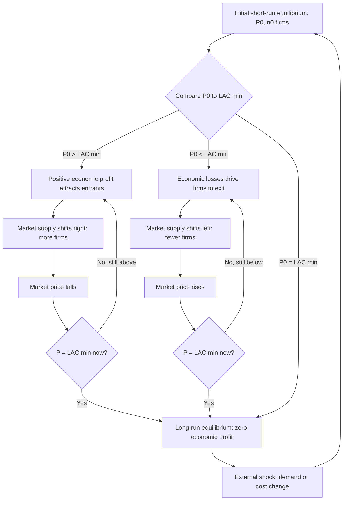
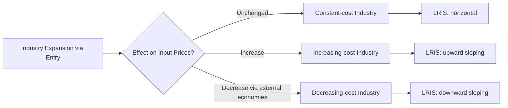

## Entry, Exit, and Market Adjustment

### Definition

Entry and exit are the mechanisms through which a perfectly competitive industry transitions from short-run disequilibrium (where firms earn positive or negative economic profit) to long-run equilibrium (where economic profit is zero). Market adjustment refers to the resulting changes in market supply, price, and industry output that occur as firms respond to profit signals over time.

### Preconditions: Assumptions Enabling Free Entry and Exit

The entry/exit mechanism relies on core assumptions of the perfectly competitive market structure:

- **No barriers to entry**: no legal, technological, or capital restrictions prevent new firms from starting production.
- **No barriers to exit**: firms can leave the industry and redeploy resources elsewhere without prohibitive sunk costs (in the long run, all costs are variable/avoidable).
- **Identical technology access**: entering firms have access to the same production technology as incumbents, so their long-run cost curves are comparable.
- **Perfect information**: firms observe market prices and profitability signals without delay or uncertainty.
- **Homogeneous product**: new entrants produce a good indistinguishable from incumbents', so entrants compete purely on price/cost, not differentiation.

### The Adjustment Mechanism in Detail

**Trigger: Short-run Profit or Loss**

The short-run market price is initially set by the intersection of short-run market supply and demand, given the existing number of firms $n_0$:

$$P_{SR} = \text{where } S_{SR}(n_0) = D$$

Each firm compares $P_{SR}$ to its $LAC_{min}$.

**Case A — Entry (P > LAC_min)**

1. Existing firms earn positive economic profit: $P_{SR} > LAC_{min}$.
2. This profit signal attracts new firms, since resources (capital, entrepreneurship) flow toward the most profitable use available.
3. New entrants begin producing, adding their individual short-run supply curves to the market.
4. Market supply shifts rightward: $S_{SR}(n_0) \to S_{SR}(n_1)$, where $n_1 > n_0$.
5. At the new supply curve, price falls along the demand curve.
6. Entry continues incrementally as long as $P > LAC_{min}$; each new entrant further increases supply and further depresses price.
7. The process halts when $P = LAC_{min}$, at which point profit opportunities are exhausted, and the number of firms stabilizes at $n^*$.

**Case B — Exit (P < LAC_min)**

1. Existing firms incur economic losses: $P_{SR} < LAC_{min}$.
2. In the short run, firms continue operating as long as $P \geq AVC_{min}$ (see shutdown condition), but they do not replace depreciated capital, renew leases, or reinvest.
3. Over time, as fixed inputs become variable (equipment wears out, contracts expire), the least efficient or most capital-constrained firms exit the industry entirely.
4. Market supply shifts leftward: $S_{SR}(n_0) \to S_{SR}(n_2)$, where $n_2 < n_0$.
5. Reduced supply causes price to rise along the demand curve.
6. Exit continues until $P = LAC_{min}$, at which remaining firms earn zero economic profit and no further exit is warranted.

**Case C — Equilibrium (P = LAC_min)**

No entry or exit pressure exists; the number of firms is stable at $n^*$, and the industry remains in long-run equilibrium until an external shock (demand shift, cost shock, technology change) displaces it again.

### Mermaid Diagram: Full Adjustment Cycle

### Diagram: Market Adjustment via Entry

<svg xmlns="http://www.w3.org/2000/svg" viewBox="0 0 700 460" font-family="Helvetica, Arial, sans-serif">
<text x="350" y="24" text-anchor="middle" font-size="16" font-weight="bold" fill="#1a1a1a">Market Adjustment Through Entry (svg_diagram)</text>
<line x1="80" y1="400" x2="650" y2="400" stroke="#333" stroke-width="2" />
<line x1="80" y1="400" x2="80" y2="60" stroke="#333" stroke-width="2" />
<text x="660" y="405" font-size="13" fill="#333">Q</text>
<text x="65" y="55" font-size="13" fill="#333">P</text>

<line x1="120" y1="360" x2="380" y2="90" stroke="#7f8c8d" stroke-width="2.5" />
<text x="385" y="85" font-size="12" fill="#7f8c8d">S₀ (n₀ firms)</text>

<line x1="180" y1="360" x2="440" y2="90" stroke="#c0392b" stroke-width="2.5" />
<text x="445" y="85" font-size="12" fill="#c0392b">S₁ (n₁ &gt; n₀ firms)</text>

<line x1="120" y1="110" x2="500" y2="380" stroke="#2980b9" stroke-width="2.5" />
<text x="505" y="385" font-size="12" fill="#2980b9">D</text>

<circle cx="280" cy="235" r="5" fill="#2c3e50" />
<line x1="80" y1="180" x2="280" y2="180" stroke="#888" stroke-dasharray="4,3" />
<line x1="280" y1="180" x2="280" y2="400" stroke="#888" stroke-dasharray="4,3" />
<text x="55" y="184" font-size="12" fill="#333">P₀</text>

<circle cx="330" cy="250" r="5" fill="#2c3e50" />
<line x1="80" y1="270" x2="330" y2="270" stroke="#8e44ad" stroke-dasharray="4,3" />
<line x1="330" y1="270" x2="330" y2="400" stroke="#8e44ad" stroke-dasharray="4,3" />
<text x="45" y="274" font-size="12" fill="#8e44ad">P* = LAC min</text>

<text x="285" y="225" font-size="11" fill="#333">E₀</text>

<text x="335" y="245" font-size="11" fill="`#8e44ad`">E* (LR eq.)</text>

<text x="150" y="420" font-size="11" fill="#333">Entry pushes supply and equilibrium along D →</text>

</svg>

**How to read this diagram:** Starting at $E_0$ with price $P_0 > LAC_{min}$, positive profits attract entrants. Supply shifts from $S_0$ to $S_1$, sliding the equilibrium down the demand curve to $E^*$, where $P^* = LAC_{min}$ and entry ceases.

### The Role of Time Horizons

Entry and exit responses are not instantaneous; they unfold over what economists call the **long run**, distinguished from the short run precisely by the flexibility to adjust all inputs, including the number of firms. The length of calendar time this takes varies enormously by industry:

- Industries with low capital requirements and simple technology (e.g., small retail, some agricultural crops) may see entry/exit within months.
- Capital-intensive industries (e.g., semiconductor fabrication, airlines) may take years for meaningful entry or exit to materialize, due to long construction times, financing, and regulatory approval.

**[Inference — industry-specific outcome, not a general law]** The speed of adjustment in a given real-world industry depends on factors outside the basic model, such as financing conditions and regulatory approval times, and should not be assumed uniform across sectors.

### Long-run Industry Supply Curves: Effect of Entry/Exit on Cost Structure

The entry/exit process interacts with how input prices respond to industry expansion, generating three types of long-run industry supply (LRIS) curves:

**1. Constant-Cost Industry**

- Input prices remain unchanged as the industry expands or contracts (the industry's demand for inputs is small relative to total input market).
- Entering firms have access to inputs at the same prices as incumbents.
- The long-run industry supply curve is **horizontal** at $P = LAC_{min}$.
- Example: an industry using standardized, widely available inputs — e.g., many light manufacturing sectors, generic retail.

**2. Increasing-Cost Industry**

- Industry expansion increases demand for specialized inputs (skilled labor, particular land parcels, scarce raw materials), bidding up input prices.
- As new firms enter, all firms' cost curves shift upward due to higher input prices.
- The long-run industry supply curve is **upward sloping**.
- Example: industries reliant on specialized, less mobile inputs — e.g., vineyards requiring specific terroir, industries competing for specialized engineering talent.

**3. Decreasing-Cost Industry**

- Industry expansion generates external economies of scale — for instance, supplier industries grow more efficient, specialized infrastructure develops, or knowledge spillovers reduce costs for all firms in the region.
- As the industry grows, input costs fall for all firms.
- The long-run industry supply curve is **downward sloping** (rare in practice, but theoretically important).
- Example: technology clusters where a growing ecosystem of specialized suppliers, spillovers of expertise, and shared infrastructure reduce costs as the industry expands.

### Mermaid Diagram: Types of Long-run Industry Supply

### Numerical Example: Constant-Cost Industry Adjustment

Suppose a constant-cost industry has identical firms with $LAC_{min} = \$20$ per unit, achieved at $q^* = 10$ units per firm. Initial market demand is:

$$Q_D = 5{,}000 - 100P$$

**Step 1 — Find long-run equilibrium price and quantity:**

Since it's a constant-cost industry, $P^* = LAC_{min} = \$20$.

$$Q_D = 5{,}000 - 100(20) = 5{,}000 - 2{,}000 = 3{,}000$$

**Step 2 — Find the number of firms:**

$$n^* = \frac{Q_D}{q^*} = \frac{3{,}000}{10} = 300 \text{ firms}$$

**Step 3 — Demand shifts (e.g., a positive demand shock):** suppose demand increases to:

$$Q_D' = 6{,}000 - 100P$$

In the short run (before entry), price rises above $20 since supply is fixed at $n^* = 300$ firms. This creates positive economic profit, attracting entry.

**Step 4 — New long-run equilibrium:** because this is a constant-cost industry, the price returns exactly to $P^* = \$20$ (unchanged), and only quantity adjusts:

$$Q_D' = 6{,}000 - 100(20) = 4{,}000$$

$$n^{*\prime} = \frac{4{,}000}{10} = 400 \text{ firms}$$

The entire adjustment occurs through 100 new firms entering; the long-run price is unaffected because the industry is constant-cost.

### Comparison: Response of Price and Quantity to a Demand Increase Across Industry Types

| Industry Type | Effect on Long-run Price | Effect on Long-run Quantity |
| --- | --- | --- |
| Constant-cost | No change (returns to original $LAC_{min}$) | Increases proportionally with entrant output |
| Increasing-cost | Rises (higher input costs raise $LAC_{min}$ industry-wide) | Increases, but less than in constant-cost case |
| Decreasing-cost | Falls (external economies lower $LAC_{min}$ industry-wide) | Increases, more than in constant-cost case |

### Asymmetries Between Entry and Exit

**[Unverified — general pattern observed in applied industrial organization, not a universal law]** Entry and exit are often asymmetric in real-world speed and completeness:

- **Entry tends to be faster** because new firms can be built to reflect current best-practice technology and cost structure, and capital can often flow readily toward profitable opportunities.
- **Exit tends to be slower and incomplete** due to sunk costs, exit barriers (severance obligations, decommissioning costs, contractual commitments), and behavioral factors (firm owners tolerating losses temporarily, hoping for market recovery). This creates a phenomenon sometimes called **hysteresis**, where industry capacity and firm count remain elevated even after demand has fallen, because exit lags the loss-making signal.

### Common Misconceptions

- Students often think entry/exit happens instantly upon observing profit/loss. In practice, and even within the model, entry and exit are *processes* occurring over the long run, not one-time jumps.
- A frequent error is applying the constant-cost industry assumption (horizontal LRIS) universally. Whether an industry is constant-, increasing-, or decreasing-cost depends on empirical input market conditions, and this must be assessed contextually rather than assumed.
- Some students conflate "zero economic profit" with "no firms will exit." In long-run equilibrium exactly at $P = LAC_{min}$, firms are indifferent to staying or leaving in a pure theoretical sense, but in practice, the marginal firm is the one exactly at this threshold, while inframarginal firms with lower-than-average costs (if cost differences exist) may still be earning positive profit relative to the *industry* zero-profit benchmark.

### Related Topics

- Long-run equilibrium and zero economic profit
- Constant-cost, increasing-cost, and decreasing-cost industries (long-run industry supply)
- Short-run supply curve of the firm and the shutdown decision
- Producer surplus and economic rent in the long run
- Comparative statics of demand and supply shocks
- External economies and diseconomies of scale
- Hysteresis and market structure persistence in industrial organization