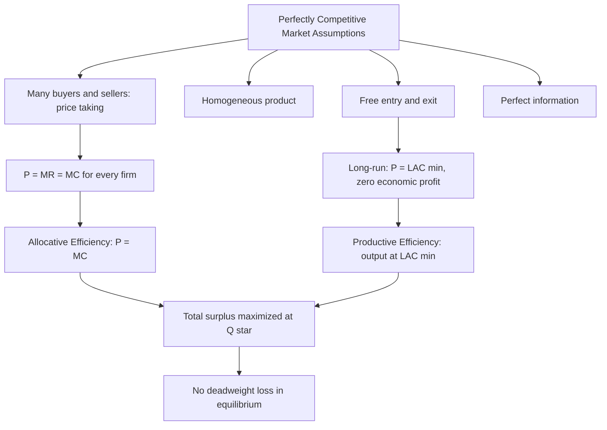

## Efficiency in Perfectly Competitive Markets

### Definition

Efficiency in perfectly competitive markets refers to the property that, under the standard assumptions of perfect competition (many buyers and sellers, homogeneous product, free entry/exit, perfect information, price-taking behavior), the resulting long-run equilibrium simultaneously achieves productive efficiency, allocative efficiency, and maximizes total economic surplus. This makes the perfectly competitive model the benchmark against which other market structures (monopoly, oligopoly, monopolistic competition) are evaluated for welfare loss.

### Types of Efficiency

**1. Productive (Technical) Efficiency**

A firm is productively efficient when it produces its output at the lowest possible cost given current technology — that is, at the minimum point of its average cost curve.

$$\text{Productive Efficiency: } P = LAC_{min} \text{ for every firm in long-run equilibrium}$$

At the industry level, productive efficiency also implies that total output is produced using the least-cost combination of firms and inputs — no reallocation of production between firms could reduce total cost of producing the same total output, since all active firms produce at identical marginal cost in equilibrium.

**2. Allocative Efficiency**

A market is allocatively efficient when the marginal benefit consumers place on the last unit consumed equals the marginal cost of producing that unit. Since demand reflects consumers' marginal willingness to pay ($MWTP$) and $MC$ reflects the marginal opportunity cost of resources used in production:

$$\text{Allocative Efficiency: } P = MC$$

Because $P$ equals consumers' marginal value ($MWTP = P$ along the demand curve) and $P = MC$ in competitive equilibrium, marginal value equals marginal cost exactly:

$$MWTP = P = MC$$

This means resources are allocated to their highest-valued use: no reallocation of resources toward or away from this good could make anyone better off without making someone else worse off.

**3. Dynamic Efficiency (supplementary concept)**

Refers to the rate at which an industry innovates and adopts new technology over time. Perfect competition provides continuous pressure to minimize costs (since firms earning above-average costs are driven out), but the model is static by construction and does not explicitly model R&D incentives; this is a caveat frequently discussed when comparing perfect competition's efficiency properties to those of markets with imperfect competition, where retained profits might fund innovation. **[Unverified/contested — an active area of debate in industrial organization]** whether perfectly competitive or more concentrated markets generate faster innovation is not settled by the static competitive model itself.

### Consumer and Producer Surplus in Competitive Equilibrium

**Consumer Surplus (CS)**: the difference between what consumers are willing to pay and what they actually pay, summed across all units purchased.

$$CS = \int_{0}^{Q^*} [D^{-1}(Q) - P^*] \, dQ$$

Graphically, the area between the demand curve and the equilibrium price line, up to equilibrium quantity.

**Producer Surplus (PS)**: the difference between the price producers receive and their marginal cost of production, summed across all units sold. In the short run, this equals revenue minus variable cost; in the long run (with $P = LAC_{min}$), producer surplus for firms earning zero economic profit collapses toward representing returns to any fixed or scarce factors of production.

$$PS = \int_{0}^{Q^*} [P^* - S^{-1}(Q)] \, dQ$$

Graphically, the area between the equilibrium price line and the supply curve, up to equilibrium quantity.

**Total Surplus (Social Welfare)**:

$$TS = CS + PS$$

Perfect competition maximizes $TS$ at the equilibrium quantity $Q^*$ where $S = D$ (equivalently, where $MC = MWTP$).

### Diagram: Consumer and Producer Surplus at Competitive Equilibrium

<svg xmlns="http://www.w3.org/2000/svg" viewBox="0 0 700 460" font-family="Helvetica, Arial, sans-serif">
<text x="350" y="24" text-anchor="middle" font-size="16" font-weight="bold" fill="#1a1a1a">Total Surplus at Market Equilibrium (svg_diagram)</text>
<line x1="80" y1="400" x2="650" y2="400" stroke="#333" stroke-width="2" />
<line x1="80" y1="400" x2="80" y2="60" stroke="#333" stroke-width="2" />
<text x="660" y="405" font-size="13" fill="#333">Q</text>
<text x="65" y="55" font-size="13" fill="#333">P</text>

<line x1="110" y1="370" x2="530" y2="90" stroke="#c0392b" stroke-width="2.5" />
<text x="535" y="85" font-size="12" fill="#c0392b">S = MC</text>

<line x1="110" y1="90" x2="530" y2="370" stroke="#2980b9" stroke-width="2.5" />
<text x="535" y="375" font-size="12" fill="#2980b9">D = MWTP</text>

<circle cx="320" cy="230" r="5" fill="#2c3e50" />
<line x1="80" y1="230" x2="320" y2="230" stroke="#888" stroke-dasharray="4,3" />
<line x1="320" y1="230" x2="320" y2="400" stroke="#888" stroke-dasharray="4,3" />
<text x="55" y="234" font-size="12" fill="#333">P*</text>
<text x="315" y="415" font-size="12" fill="#333">Q*</text>

<polygon points="110,90 320,230 110,230" fill="#2980b9" opacity="0.25" />
<text x="160" y="180" font-size="12" fill="#1a5276" font-weight="bold">CS</text>

<polygon points="110,370 320,230 110,230" fill="#c0392b" opacity="0.25" />
<text x="160" y="290" font-size="12" fill="#922b21" font-weight="bold">PS</text>
</svg>

**How to read this diagram:** The equilibrium at $Q^*$, $P^*$ maximizes the sum of the blue (consumer surplus) and red (producer surplus) triangles. Any quantity restriction away from $Q^*$ — whether below or above — reduces total surplus, creating deadweight loss.

### Why Restricting Output Below Q* Creates Deadweight Loss

If output is restricted to $Q_1 < Q^*$ (e.g., through a quota, tax, or monopoly-like restriction), units between $Q_1$ and $Q^*$ go unproduced even though consumers' marginal willingness to pay for those units exceeds the marginal cost of producing them:

$$\text{For } Q_1 < Q < Q^*: \quad MWTP(Q) > MC(Q)$$

This represents a **missed mutually beneficial exchange** — a transaction that would make at least one party better off without making anyone worse off. The lost surplus from these forgone units is called **deadweight loss (DWL)**:

$$DWL = \int_{Q_1}^{Q^*} [MWTP(Q) - MC(Q)] \, dQ$$

Perfect competition, by allowing output to adjust freely to $Q^*$, eliminates this source of inefficiency — which is precisely why monopoly and other output-restricting market structures are compared unfavorably to the competitive benchmark.

### Diagram: Deadweight Loss from Output Restriction

<svg xmlns="http://www.w3.org/2000/svg" viewBox="0 0 700 460" font-family="Helvetica, Arial, sans-serif">
<text x="350" y="24" text-anchor="middle" font-size="16" font-weight="bold" fill="#1a1a1a">Deadweight Loss from Restricted Output (svg_diagram)</text>
<line x1="80" y1="400" x2="650" y2="400" stroke="#333" stroke-width="2" />
<line x1="80" y1="400" x2="80" y2="60" stroke="#333" stroke-width="2" />
<text x="660" y="405" font-size="13" fill="#333">Q</text>
<text x="65" y="55" font-size="13" fill="#333">P</text>

<line x1="110" y1="370" x2="530" y2="90" stroke="#c0392b" stroke-width="2.5" />
<text x="535" y="85" font-size="12" fill="#c0392b">S = MC</text>

<line x1="110" y1="90" x2="530" y2="370" stroke="#2980b9" stroke-width="2.5" />
<text x="535" y="375" font-size="12" fill="#2980b9">D = MWTP</text>

<circle cx="320" cy="230" r="4" fill="#2c3e50" opacity="0.4" />
<text x="325" y="245" font-size="11" fill="#555" opacity="0.7">Q* (efficient)</text>

<line x1="230" y1="150" x2="230" y2="400" stroke="#888" stroke-dasharray="4,3" />
<text x="220" y="415" font-size="12" fill="#333">Q₁ (restricted)</text>

<polygon points="230,150 230,310 320,230" fill="#f39c12" opacity="0.5" />
<text x="245" y="220" font-size="12" fill="#7d5a00" font-weight="bold">DWL</text>
</svg>

**How to read this diagram:** Restricting output from the efficient level $Q^*$ to $Q_1$ creates the orange deadweight-loss triangle — surplus that is neither captured by consumers nor producers, but simply lost, because the units between $Q_1$ and $Q^*$ (where $MWTP > MC$) are never produced or exchanged.

### Numerical Example

Suppose market demand and supply are:

$$Q_D = 200 - 4P \qquad Q_S = 6P - 40$$

**Step 1 — Find equilibrium price and quantity:**

$$200 - 4P = 6P - 40 \implies 240 = 10P \implies P^* = 24$$

$$Q^* = 200 - 4(24) = 200 - 96 = 104$$

**Step 2 — Find Consumer Surplus.** First find the demand curve's vertical (choke) intercept: set $Q_D = 0$:

$$0 = 200 - 4P \implies P = 50$$

$$CS = \frac{1}{2} \times Q^* \times (P_{max} - P^*) = \frac{1}{2} \times 104 \times (50 - 24) = \frac{1}{2} \times 104 \times 26 = 1{,}352$$

**Step 3 — Find Producer Surplus.** Find the supply curve's vertical intercept: set $Q_S = 0$:

$$0 = 6P - 40 \implies P = 6.67$$

$$PS = \frac{1}{2} \times Q^* \times (P^* - P_{min}) = \frac{1}{2} \times 104 \times (24 - 6.67) = \frac{1}{2} \times 104 \times 17.33 \approx 901.16$$

**Step 4 — Total Surplus:**

$$TS = CS + PS = 1{,}352 + 901.16 = 2{,}253.16$$

This total surplus is the maximum achievable in this market; any deviation from $Q^* = 104$ (via quota, tax, price control, or market power) would reduce $TS$ below this value.

### Efficiency and the First Fundamental Welfare Theorem

The First Fundamental Welfare Theorem states that, under a specific set of conditions, any competitive equilibrium is **Pareto efficient** — no reallocation of resources can make any individual better off without making another individual worse off. Perfectly competitive markets satisfy the theorem's key conditions:

- Price-taking behavior by all agents (no market power)
- Complete markets (no missing markets for relevant goods)
- No externalities (all costs and benefits are fully reflected in market prices)
- No public goods problems (rivalrous, excludable goods)
- Perfect information

$$\text{Perfect Competition} + \text{No Externalities} + \text{Complete Markets} \implies \text{Pareto Efficiency}$$

### Conditions That Break Efficiency (Preview of Market Failure)

Perfect competition's efficiency result depends critically on the assumptions above. When these assumptions fail, the competitive equilibrium may no longer be efficient — this motivates the study of market failure:

| Assumption Violated | Resulting Problem | Effect on Efficiency |
| --- | --- | --- |
| Market power exists | Monopoly / oligopoly | $P > MC$; underproduction relative to $Q^*$ |
| Externalities present | Pollution, positive spillovers | Private $MC$ or $MWTP$ diverges from social $MC$/$MWTP$ |
| Asymmetric information | Adverse selection, moral hazard | Markets may not clear efficiently, or may unravel |
| Public goods | Non-rivalrous, non-excludable goods | Free-rider problem; underprovision |

### Mermaid Diagram: Conditions Leading to Efficient Competitive Outcome

### Efficiency Loss Comparison: Perfect Competition vs. Monopoly (Brief Contrast)

While the full treatment belongs to the monopoly chapter, it is useful to note the contrast for understanding *why* perfect competition is the efficiency benchmark:

- **Perfect competition**: $P = MC$, output at $Q^*$, no deadweight loss (assuming no externalities).
- **Monopoly**: $P > MC$, output restricted below $Q^*$ to $Q_m$, generating deadweight loss equal to the forgone surplus on units between $Q_m$ and $Q^*$.

This comparison is the foundation for antitrust and competition-policy arguments favoring competitive market structures where feasible.

### Common Misconceptions

- Students sometimes think "efficient" means "fair" or "good for everyone equally." Economic efficiency (Pareto efficiency, allocative/productive efficiency) says nothing about the *distribution* of surplus between consumers and producers — a market can be perfectly efficient while consumer surplus and producer surplus are very unequal.
- Zero economic profit in the long run is sometimes mistaken for a sign of an *unhealthy* or *failing* market. In fact, it is precisely the hallmark of a maximally efficient market — resources are being used at their lowest cost, and no further gains from entry or exit exist.
- The efficiency result is contingent on the *absence* of externalities and other market failures. Applying the "perfect competition is efficient" conclusion to a market with, say, pollution externalities (private $MC$ below social $MC$) without qualification is a common and important error — the theorem's efficiency claim only holds once these assumptions are satisfied.

### Related Topics

- Long-run equilibrium and zero economic profit
- Entry, exit, and market adjustment
- Deadweight loss and tax incidence
- Externalities and market failure
- The First and Second Fundamental Welfare Theorems
- Monopoly and the welfare cost of market power
- Consumer and producer surplus measurement
- Pareto efficiency and Pareto improvements