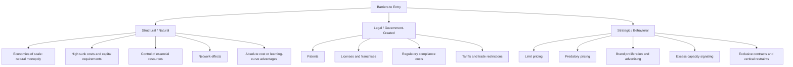

## Sources and Barriers to Entry

### Definition

Barriers to entry are structural, legal, technological, or strategic factors that prevent or discourage new firms from entering an industry, allowing incumbent firms to sustain market power and earn positive economic profit even in the long run. Barriers to entry are the fundamental reason monopoly (and other imperfectly competitive structures) can persist, in contrast to perfect competition, where free entry drives economic profit to zero.

### Why Barriers to Entry Matter

In a perfectly competitive market, positive economic profit attracts entrants until price falls to $LAC_{min}$. A monopolist can only maintain $P > LAC_{min}$ and earn sustained positive economic profit if something prevents this competitive entry process from occurring. Barriers to entry are that "something." Without a barrier, any observed monopoly profit would simply attract competitors and erode over time.

$$\text{Sustained Monopoly Profit} \iff \text{Effective Barrier to Entry Exists}$$

### Classification of Barriers to Entry

Barriers to entry are typically grouped into three broad categories: **structural (natural)**, **legal (government-created)**, and **strategic (behavioral)**.

### 1. Structural (Natural) Barriers

These arise from underlying cost or demand conditions rather than deliberate action by firms or government.

**a) Economies of Scale and Natural Monopoly**

When long-run average cost declines over the entire relevant range of market demand, a single large firm can produce at lower average cost than multiple smaller firms could. This is called a **natural monopoly**.

$$LAC(Q) \text{ is declining over the range of } Q \text{ relevant to market demand}$$

A new entrant, starting small, would face higher average costs than the incumbent and could not profitably undercut its price. Classic examples include utilities requiring large fixed infrastructure investment (water pipelines, electricity transmission grids), where duplicating the network is prohibitively costly relative to serving the entire market with one network.

**b) High Sunk Costs / Capital Requirements**

Sunk costs are expenditures that cannot be recovered upon exit (specialized equipment, R&D, advertising to build brand recognition). Industries requiring very large upfront capital investment deter entry because potential entrants face substantial risk if the venture fails, and the size of the required investment itself may exceed what most potential competitors can raise.

**c) Control of Essential (Scarce) Resources**

If a firm owns or controls a critical input with no close substitute — a raw material deposit, a unique geographic location, specialized expertise — it can prevent rivals from acquiring the resources needed to produce a competing product. A historically cited example is control over the majority of a key mineral deposit relevant to production of a particular good.

**d) Network Effects**

A product's value to each user increases as more users adopt it. This can create a strong incumbency advantage: even a technically superior entrant may struggle to attract users away from an established network, because the value of the incumbent's larger network outweighs the entrant's product-quality edge, at least until the entrant reaches critical mass.

**e) Absolute Cost Advantages**

An incumbent may have access to lower-cost inputs, superior production techniques, or accumulated experience (the **learning curve** or **experience curve** effect) that a new entrant cannot immediately replicate, even ignoring differences in scale.

### 2. Legal (Government-Created) Barriers

These arise directly from government policy or legal frameworks that restrict entry.

**a) Patents**

Patents grant an inventor exclusive rights to produce, use, or sell an invention for a fixed period (commonly around 20 years from filing in many jurisdictions, subject to local law), legally barring competitors from producing the same or a sufficiently similar product during that period. This is especially significant in pharmaceuticals and technology.

**b) Licenses and Government Franchises**

Governments may require a license to operate in certain industries (taxi medallions, broadcasting spectrum, banking charters, professional licensure) or may grant an exclusive franchise to a single firm to provide a service (a common approach for regulated natural monopolies like local utility distribution).

**c) Regulatory Barriers**

Complex compliance requirements, safety standards, environmental regulations, or zoning restrictions can raise the fixed cost of entry substantially, effectively excluding smaller or less-capitalized potential entrants even without an explicit legal prohibition.

**d) Tariffs and Trade Restrictions**

Import tariffs, quotas, and other trade barriers can protect domestic incumbents from foreign competition, functioning as an entry barrier against would-be foreign entrants into the domestic market.

### 3. Strategic (Behavioral) Barriers

These arise from deliberate actions taken by incumbent firms specifically to deter entry (as opposed to barriers being an incidental byproduct of cost structure or law).

**a) Limit Pricing**

An incumbent sets price below the short-run profit-maximizing level specifically to make the market look unattractive to potential entrants, signaling low costs or low potential post-entry profit.

**b) Predatory Pricing**

An incumbent temporarily prices below cost to drive a new entrant out of the market (or deter entry in the first place), planning to raise prices again once the threat is eliminated. **[Unverified — legally and empirically contested]** Predatory pricing is difficult to distinguish from ordinary aggressive competition in practice, and many jurisdictions require proof of both below-cost pricing and a realistic prospect of recouping losses afterward before it is treated as anticompetitive.

**c) Brand Proliferation and Advertising**

Incumbents may saturate the market with multiple product variants or heavy advertising expenditure, raising the marketing cost a new entrant would need to match to gain visibility and consumer trust.

**d) Excess Capacity as a Deterrent**

An incumbent may maintain idle production capacity beyond what is currently needed, signaling a credible threat that it could rapidly increase output and depress price if a new entrant attempted to enter — deterring entry preemptively.

**e) Exclusive Contracts and Vertical Restraints**

Long-term exclusive supply or distribution agreements with key suppliers or retailers can foreclose a new entrant's access to necessary inputs or distribution channels.

### Mermaid Diagram: Classification of Entry Barriers

### Natural Monopoly: Cost Structure Detail

The natural monopoly case deserves closer technical attention because it is the barrier most directly tied to production cost theory. Consider a firm with a large fixed cost component and low, roughly constant marginal cost:

$$TC(Q) = F + cQ$$

where $F$ is a large fixed cost (e.g., laying pipeline or transmission infrastructure) and $c$ is a low constant marginal cost. Then:

$$AC(Q) = \frac{F}{Q} + c$$

As $Q$ increases, $\frac{F}{Q}$ shrinks continuously, so $AC(Q)$ declines over the entire relevant output range — it never turns upward within the range of realistic market demand. This is called **subadditivity of costs**: a single firm can serve the entire market at lower total cost than any combination of two or more firms could.

$$C(Q_1 + Q_2) < C(Q_1) + C(Q_2) \quad \text{for a natural monopoly}$$

### Diagram: Natural Monopoly Cost Structure

<svg xmlns="http://www.w3.org/2000/svg" viewBox="0 0 700 440" font-family="Helvetica, Arial, sans-serif">
<text x="350" y="24" text-anchor="middle" font-size="16" font-weight="bold" fill="#1a1a1a">Natural Monopoly: Declining LAC (svg_diagram)</text>
<line x1="80" y1="380" x2="650" y2="380" stroke="#333" stroke-width="2" />
<line x1="80" y1="380" x2="80" y2="60" stroke="#333" stroke-width="2" />
<text x="660" y="385" font-size="13" fill="#333">Q</text>
<text x="65" y="55" font-size="13" fill="#333">P, C</text>

<path d="M 110 100 C 200 220, 320 300, 500 340 C 560 350, 610 355, 630 358" fill="none" stroke="`#27ae60`" stroke-width="2.5" />

<text x="440" y="300" font-size="12" fill="`#27ae60`" font-weight="bold">LAC (declining throughout)</text>

<line x1="110" y1="330" x2="630" y2="360" stroke="#c0392b" stroke-width="2.5" />
<text x="500" y="378" font-size="12" fill="#c0392b" font-weight="bold">MC</text>

<line x1="110" y1="120" x2="600" y2="330" stroke="#2980b9" stroke-width="2.5" />
<text x="605" y="335" font-size="12" fill="#2980b9">D</text>

<circle cx="440" cy="260" r="5" fill="#2c3e50" />
<text x="450" y="255" font-size="11" fill="#2c3e50">Demand meets LAC before it turns upward</text>
</svg>

**How to read this diagram:** Because $LAC$ is still declining at the quantity where market demand ($D$) intersects it, one firm serving the whole market achieves lower average cost than would result from splitting production between two or more competing firms. This is the structural basis of natural monopoly.

### Sunk Costs vs. Fixed Costs — An Important Distinction

Not all fixed costs act as effective entry barriers; only **sunk** costs do so persistently.

- **Fixed cost**: a cost that does not vary with output level, but may still be recoverable upon exit (e.g., equipment that can be resold).
- **Sunk cost**: a cost that, once incurred, cannot be recovered under any circumstances (e.g., specialized R&D, regulatory approval fees, industry-specific advertising with no resale value).

$$\text{Sunk Costs} \subseteq \text{Fixed Costs}$$

The larger the sunk-cost component of entry, the greater the risk a potential entrant bears, since failure means those costs are permanently lost. This is why sunk costs (not fixed costs generally) are considered the more economically meaningful barrier to entry — a market with high fixed but low sunk costs (e.g., costs recoverable via resale of general-purpose equipment) is described in the theory of **contestable markets** as potentially still competitive despite apparent market concentration, because "hit-and-run" entry remains viable.

### Contestable Markets: A Theoretical Counterpoint

The theory of contestable markets argues that even a market with only one or a few firms can behave competitively if entry and exit are costless (zero sunk costs) — the mere *threat* of entry disciplines incumbent pricing, even without actual entry occurring.

$$\text{Contestability} \iff \text{Free Entry AND Free (Costless) Exit}$$

This theory highlights that barriers to entry, not simply the observed number of firms, are what ultimately determine whether a market yields competitive or monopolistic outcomes. **[Unverified — theoretical benchmark with debated real-world applicability]** perfectly contestable markets (zero sunk cost, instantaneous entry/exit) are rarely, if ever, observed exactly in practice, and the framework functions more as a limiting case for analysis than a literal description of actual industries.

### Comparative Summary Table

| Barrier Category | Example | Primary Mechanism | Can Government Policy Remove It? |
| --- | --- | --- | --- |
| Economies of scale | Utility grid | Cost structure makes single firm most efficient | Difficult; may require regulation instead of removal |
| Sunk cost / capital requirement | Semiconductor fabs | High risk deters entry | Limited; subsidies can lower effective barrier |
| Resource control | Mineral deposit monopoly | Denies entrants a necessary input | Possible via antitrust/resource-access rules |
| Network effects | Social platforms, payment networks | Value tied to user base size | Difficult; interoperability mandates can help |
| Patents | Pharmaceuticals | Legal exclusivity | Yes — patent expires or is invalidated |
| Licensing | Taxi medallions, broadcast spectrum | Government-imposed quantity restriction | Yes — policy can expand licenses |
| Predatory pricing | Below-cost pricing to eliminate rivals | Deliberate short-run loss to deter entry | Yes — antitrust enforcement |

### Common Misconceptions

- Students often assume "barrier to entry" always implies deliberate anticompetitive behavior by the incumbent. In fact, structural barriers (like natural monopoly economies of scale) can arise purely from cost conditions with no strategic intent whatsoever.
- Patents are sometimes treated as permanent barriers; in reality they expire after a statutory term, at which point the market often transitions toward more competitive behavior (e.g., generic drug entry after patent expiration).
- High fixed costs are sometimes equated automatically with high barriers to entry. The more precise criterion is the *sunk* portion of those costs — fixed costs that can be recovered upon exit (e.g., through resale) pose a much weaker deterrent than true sunk costs.

### Related Topics

- Natural monopoly and its regulation (rate-of-return and price-cap regulation)
- Monopoly profit maximization: $MR = MC$
- Price discrimination as a monopoly pricing strategy
- Antitrust policy and merger review
- Contestable markets theory
- Patents, intellectual property, and innovation incentives
- Oligopoly and strategic entry deterrence
- Deadweight loss under monopoly