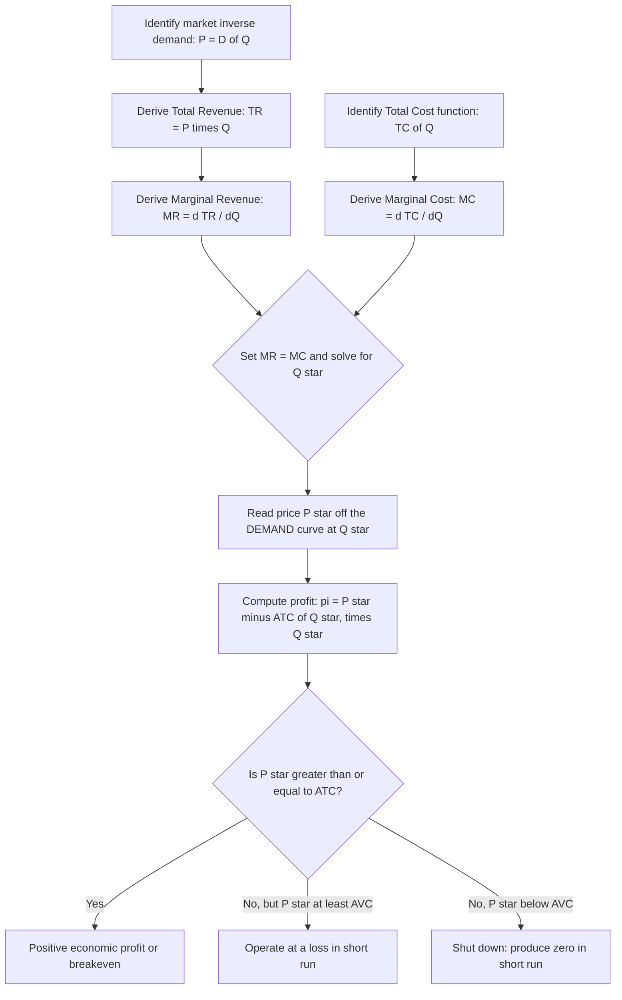

## Profit Maximization Under Monopoly

### Definition

Profit maximization under monopoly is the process by which a single-seller firm, facing the entire downward-sloping market demand curve, selects the output level and corresponding price that maximize its economic profit. Unlike a perfectly competitive firm, the monopolist must account for the fact that increasing output requires lowering price on all units sold, which is captured through the marginal revenue curve lying below demand.

### The Profit-Maximization Condition

A monopolist maximizes profit by choosing the output level $Q^*$ where marginal revenue equals marginal cost:

$$MR(Q^*) = MC(Q^*)$$

This is the same fundamental marginal principle used in perfect competition ($MR = MC$), but the critical difference is that for a monopolist, $MR \neq P$ (since $MR < P$ due to the downward-sloping demand curve), whereas for a competitive firm $MR = P$.

**Step-by-step profit-maximization procedure:**

1. Determine market (inverse) demand: $P = D(Q)$.
2. Derive total revenue: $TR(Q) = P(Q) \times Q$.
3. Derive marginal revenue: $MR(Q) = \frac{d(TR)}{dQ}$.
4. Derive marginal cost from the cost function: $MC(Q) = \frac{d(TC)}{dQ}$.
5. Set $MR(Q) = MC(Q)$ and solve for $Q^*$.
6. Find the profit-maximizing price by plugging $Q^*$ back into the **demand curve** (not the $MR$ curve): $P^* = D(Q^*)$.
7. Verify the second-order condition: $MR$ must be falling faster than (or cutting from above) $MC$ at $Q^*$, i.e., $MR'(Q^*) < MC'(Q^*)$, ensuring a maximum rather than a minimum.

### Why Price Is Read Off the Demand Curve, Not the MR Curve

A common point of confusion: after finding $Q^*$ from $MR = MC$, the price the monopolist actually charges is determined by how much consumers are willing to pay for that quantity — which is given by the **demand curve**, since $D(Q) = AR(Q) = P(Q)$. The $MR$ curve is only an internal marginal calculation tool; it is never the price actually charged to consumers.

$$P^* = D(Q^*) \neq MR(Q^*)$$

Since $MR(Q^*) = MC(Q^*)$ and demand lies above $MR$ everywhere (except at $Q=0$), it follows that:

$$P^* > MC(Q^*)$$

This is the defining pricing signature of monopoly: **price exceeds marginal cost**, in contrast to perfect competition where $P = MC$.

### Diagram: Monopoly Profit Maximization

<svg xmlns="http://www.w3.org/2000/svg" viewBox="0 0 720 480" font-family="Helvetica, Arial, sans-serif">
<text x="360" y="24" text-anchor="middle" font-size="16" font-weight="bold" fill="#1a1a1a">Monopoly Profit Maximization: MR = MC (svg_diagram)</text>
<line x1="80" y1="420" x2="680" y2="420" stroke="#333" stroke-width="2" />
<line x1="80" y1="420" x2="80" y2="60" stroke="#333" stroke-width="2" />
<text x="690" y="425" font-size="13" fill="#333">Q</text>
<text x="65" y="55" font-size="13" fill="#333">P, C</text>

<line x1="120" y1="100" x2="600" y2="390" stroke="#2980b9" stroke-width="2.5" />
<text x="605" y="392" font-size="12" fill="#2980b9">D = AR</text>

<line x1="120" y1="100" x2="360" y2="420" stroke="#c0392b" stroke-width="2.5" />
<text x="365" y="425" font-size="12" fill="#c0392b">MR</text>

<line x1="150" y1="380" x2="550" y2="150" stroke="#27ae60" stroke-width="2.5" />
<text x="555" y="145" font-size="12" fill="#27ae60">MC</text>

<path d="M 170 340 C 250 260, 330 240, 400 245 C 460 250, 520 270, 570 300" fill="none" stroke="`#f39c12`" stroke-width="2.5" />

<text x="575" y="305" font-size="12" fill="`#f39c12`">ATC</text>

<circle cx="290" cy="290" r="5" fill="#2c3e50" />
<line x1="290" y1="290" x2="290" y2="420" stroke="#888" stroke-dasharray="4,3" />
<text x="280" y="435" font-size="12" fill="#333">Qm</text>

<circle cx="290" cy="230" r="5" fill="#2c3e50" />
<line x1="80" y1="230" x2="290" y2="230" stroke="#8e44ad" stroke-dasharray="4,3" />
<text x="50" y="234" font-size="12" fill="#8e44ad">Pm</text>

<circle cx="290" cy="248" r="4" fill="#f39c12" />
<line x1="80" y1="248" x2="290" y2="248" stroke="#f39c12" stroke-dasharray="3,3" />
<text x="50" y="252" font-size="11" fill="#f39c12">ATC(Qm)</text>

<rect x="80" y="230" width="210" height="18" fill="#8e44ad" opacity="0.3" />
<text x="100" y="222" font-size="12" fill="#6c3483" font-weight="bold">Economic Profit = (Pm − ATC) × Qm</text>
</svg>

**How to read this diagram:** The monopolist finds $Q_m$ where $MR$ crosses $MC$, then reads the price $P_m$ off the demand curve directly above $Q_m$. The shaded rectangle — with height $(P_m - ATC(Q_m))$ and width $Q_m$ — represents total economic profit.

### Profit Calculation Formula

$$\pi(Q^*) = TR(Q^*) - TC(Q^*) = [P^* \times Q^*] - [ATC(Q^*) \times Q^*] = [P^* - ATC(Q^*)] \times Q^*$$

If $P^* > ATC(Q^*)$: positive economic profit (as shown in the diagram above).

If $P^* = ATC(Q^*)$: zero economic profit (the monopolist breaks even).

If $P^* < ATC(Q^*)$: economic loss, though the firm may still continue producing in the short run if $P^* \geq AVC(Q^*)$ (same shutdown logic as competitive firms).

### Numerical Example

Suppose a monopolist faces demand $P = 120 - 2Q$ and has total cost function $TC = 10Q + Q^2$.

**Step 1 — Total Revenue and Marginal Revenue:**

$$TR = PQ = (120 - 2Q)Q = 120Q - 2Q^2$$

$$MR = \frac{d(TR)}{dQ} = 120 - 4Q$$

**Step 2 — Marginal Cost:**

$$MC = \frac{d(TC)}{dQ} = 10 + 2Q$$

**Step 3 — Set MR = MC and solve for Q:**

$$120 - 4Q = 10 + 2Q$$

$$110 = 6Q$$

$$Q^* = 18.33$$

**Step 4 — Find price from the demand curve:**

$$P^* = 120 - 2(18.33) = 120 - 36.67 = 83.33$$

**Step 5 — Calculate total cost, total revenue, and profit:**

$$TC(18.33) = 10(18.33) + (18.33)^2 = 183.3 + 335.9 = 519.2$$

$$TR(18.33) = 83.33 \times 18.33 = 1{,}527.6$$

$$\pi = TR - TC = 1{,}527.6 - 519.2 = 1{,}008.4$$

**Step 6 — Compare to marginal cost to confirm price exceeds MC:**

$$MC(18.33) = 10 + 2(18.33) = 46.67$$

Confirms $P^* (83.33) > MC (46.67)$, the expected monopoly pricing signature.

### Mermaid Diagram: Monopoly Decision Process

### The Absence of a Monopoly Supply Curve

A key conceptual result: **a monopolist does not have a well-defined supply curve** in the way a competitive firm does. A competitive firm's supply curve is a unique mapping from each price to a quantity supplied ($P = MC$ defines $Q_S$ for each $P$, independent of demand). For a monopolist, the same $MC$ curve can be associated with different profit-maximizing quantities depending on the *shape* of the demand curve it faces — because price is not a parameter the monopolist takes as given, but a choice variable co-determined with quantity via demand and $MR$.

**[Unverified — a widely-taught theoretical result rather than an empirically testable claim]** This means that, unlike in perfect competition, one cannot construct a unique price-quantity supply relationship for a monopolist independent of the specific demand curve it faces; a shift in demand (holding $MC$ fixed) can produce different profit-maximizing prices for the same underlying cost structure, depending on how the demand shift changes the associated $MR$ curve.

### Long-Run Monopoly Profit: No Erosion by Entry

Unlike perfect competition, where positive short-run profit attracts entry and drives long-run economic profit to zero, a monopolist facing effective barriers to entry can sustain positive economic profit indefinitely in the long run, because no competitors can enter to erode it. The long-run monopoly equilibrium condition is simply the same $MR = MC$ rule applied to long-run cost curves:

$$MR(Q^*) = LMC(Q^*)$$

with no requirement that $P^* = LAC_{min}$, since there is no competitive entry mechanism forcing price down to minimum average cost.

### Special Case: Constant Marginal Cost

If marginal cost is constant ($MC = c$ for all $Q$), the profit-maximization condition simplifies considerably. Using the elasticity-based $MR$ formula:

$$MR = P\left(1 - \frac{1}{|\epsilon_d|}\right) = c$$

Solving for price gives the classic **monopoly markup formula**:

$$P^* = \frac{c}{1 - \frac{1}{|\epsilon_d|}} = c \times \frac{|\epsilon_d|}{|\epsilon_d| - 1}$$

This shows that the monopolist's optimal markup over marginal cost depends inversely on the elasticity of demand it faces: the less elastic (more inelastic) demand is at the optimum, the larger the markup over marginal cost.

### The Lerner Index: Measuring Monopoly Power

The **Lerner Index** quantifies the degree of market power based on the price-cost markup:

$$L = \frac{P - MC}{P} = \frac{1}{|\epsilon_d|}$$

- $L = 0$: no market power (as in perfect competition, where $P = MC$).
- $L \to 1$: very high market power (price far exceeds marginal cost).
- The Lerner Index at the profit-maximizing point always equals the inverse of the absolute value of the price elasticity of demand at that point — this follows directly from the $MR = MC$ condition combined with the elasticity-$MR$ relationship.

### Diagram: Lerner Index and Elasticity Relationship

<svg xmlns="http://www.w3.org/2000/svg" viewBox="0 0 700 320" font-family="Helvetica, Arial, sans-serif">
<text x="350" y="24" text-anchor="middle" font-size="16" font-weight="bold" fill="#1a1a1a">Lerner Index vs. Demand Elasticity (svg_diagram)</text>
<line x1="80" y1="270" x2="620" y2="270" stroke="#333" stroke-width="2" />
<line x1="80" y1="270" x2="80" y2="60" stroke="#333" stroke-width="2" />
<text x="630" y="275" font-size="12" fill="#333">|ε_d| (elasticity)</text>
<text x="45" y="55" font-size="12" fill="#333">L = (P−MC)/P</text>
<path d="M 100 90 C 200 150, 350 220, 600 260" fill="none" stroke="#8e44ad" stroke-width="2.5" />
<text x="150" y="110" font-size="11" fill="#8e44ad">L = 1 / |ε_d|</text>
<line x1="150" y1="60" x2="150" y2="270" stroke="#888" stroke-dasharray="3,3" />
<text x="140" y="285" font-size="10" fill="#333">|ε_d| = 1</text>
<text x="100" y="285" font-size="9" fill="#c0392b">(never chosen: MR=0 here)</text>
</svg>

**How to read this diagram:** As demand becomes more elastic (moving right along the horizontal axis), the Lerner Index falls — market power and markup shrink as consumers become more price-sensitive. As $|\epsilon_d| \to 1$ from above, $L \to 1$, but the monopolist never actually operates at or below $|\epsilon_d| = 1$, since that is the boundary of the inelastic region where $MR \leq 0$.

### Common Misconceptions

- A frequent error is assuming a monopolist "charges whatever price it wants." In fact, the monopolist is still constrained by consumer demand — it chooses a point *on* the demand curve, trading off price and quantity, and cannot set both independently.
- Some students believe monopolists always earn positive economic profit. This is only guaranteed if $P^* > ATC(Q^*)$ at the profit-maximizing quantity; if costs are high relative to demand, a monopolist can earn zero profit or even a loss (and may shut down in the short run under the same $P \geq AVC$ condition as a competitive firm).
- Confusing "maximizing profit" with "maximizing revenue" or "maximizing market share" — the $MR = MC$ rule specifically maximizes profit, and generally implies a lower quantity (and higher price) than what would maximize total revenue alone (which would occur at $MR = 0$).

### Related Topics

- Monopoly demand and marginal revenue
- The Lerner Index and measures of market power
- Deadweight loss under monopoly
- Price discrimination (first, second, and third degree)
- Sources and barriers to entry
- Natural monopoly and regulation
- Multi-plant monopoly and marginal cost aggregation across plants
- Comparing monopoly and perfect competition welfare outcomes