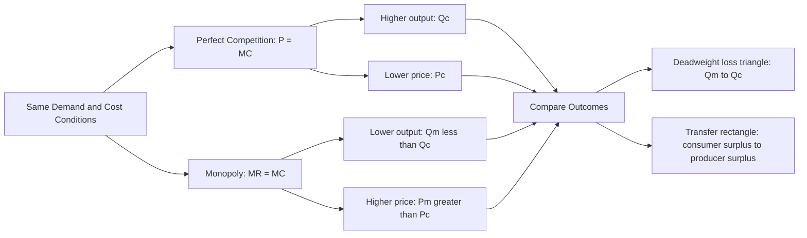

## Monopoly Pricing and Output vs. Competitive Markets

### Definition

This topic compares the equilibrium price and output outcomes of a monopoly against those of a perfectly competitive industry facing identical underlying demand and cost conditions. The comparison isolates the welfare and efficiency consequences that arise purely from market structure (single seller vs. many price-taking sellers), holding technology and demand fixed.

### Setting Up the Comparison

To make a clean comparison, assume the same market demand curve and the same underlying cost structure apply in both cases — the only difference is market structure. For tractability, a standard simplifying approach treats the monopolist's marginal cost curve as equivalent to the horizontal summation of marginal cost curves of all the individual competitive firms that would otherwise populate this industry, meaning the competitive industry's **short-run supply curve** is treated as if it were the "same" $MC$ curve the monopolist faces after a single firm acquires the entire industry.

$$MC_{monopoly}(Q) \equiv S_{competitive}(Q) = \sum MC_i(Q_i)$$

### Competitive Benchmark: P = MC

In a perfectly competitive market, equilibrium output $Q_C$ occurs where market supply (the horizontal sum of firm $MC$ curves) equals market demand:

$$P_C = MC(Q_C) = D(Q_C)$$

Since each competitive firm is a price taker, $MR = P$ for each firm, so the industry-wide outcome satisfies $P = MC$ exactly.

### Monopoly Outcome: MR = MC, but P > MC

Under monopoly, the same underlying $MC$ curve is used, but the profit-maximizing condition is $MR = MC$, not $P = MC$. Because $MR < P$ (from the downward-sloping demand curve), the monopolist's quantity is found where a curve *below* demand intersects $MC$ — that is:

$$MR(Q_M) = MC(Q_M) \implies Q_M < Q_C$$

$$P_M = D(Q_M) > MC(Q_M) = P_C \text{ (at the respective equilibrium quantities)}$$

**Core comparative result:**

$$Q_M < Q_C \qquad \text{and} \qquad P_M > P_C$$

A monopolist restricts output below the competitive level and charges a higher price than would prevail under perfect competition, given the same underlying demand and cost conditions.

### Diagram: Monopoly vs. Competitive Equilibrium (Same Demand and Cost)

<svg xmlns="http://www.w3.org/2000/svg" viewBox="0 0 720 480" font-family="Helvetica, Arial, sans-serif">
<text x="360" y="24" text-anchor="middle" font-size="16" font-weight="bold" fill="#1a1a1a">Monopoly vs. Perfect Competition (svg_diagram)</text>
<line x1="80" y1="420" x2="680" y2="420" stroke="#333" stroke-width="2" />
<line x1="80" y1="420" x2="80" y2="60" stroke="#333" stroke-width="2" />
<text x="690" y="425" font-size="13" fill="#333">Q</text>
<text x="65" y="55" font-size="13" fill="#333">P</text>

<line x1="120" y1="90" x2="620" y2="400" stroke="#2980b9" stroke-width="2.5" />
<text x="625" y="405" font-size="12" fill="#2980b9">D</text>

<line x1="120" y1="90" x2="370" y2="420" stroke="#e67e22" stroke-width="2.5" />
<text x="375" y="425" font-size="12" fill="#e67e22">MR</text>

<line x1="150" y1="380" x2="560" y2="110" stroke="#c0392b" stroke-width="2.5" />
<text x="565" y="105" font-size="12" fill="#c0392b">MC = S</text>

<circle cx="430" cy="230" r="5" fill="#27ae60" />
<line x1="430" y1="230" x2="430" y2="420" stroke="#27ae60" stroke-dasharray="4,3" />
<line x1="80" y1="230" x2="430" y2="230" stroke="#27ae60" stroke-dasharray="4,3" />
<text x="50" y="234" font-size="12" fill="#27ae60">Pc</text>
<text x="420" y="438" font-size="12" fill="#27ae60">Qc</text>
<text x="435" y="222" font-size="10" fill="#27ae60">Ec (P=MC)</text>

<circle cx="290" cy="290" r="5" fill="#8e44ad" />
<line x1="290" y1="290" x2="290" y2="420" stroke="#8e44ad" stroke-dasharray="4,3" />
<circle cx="290" cy="255" r="5" fill="#8e44ad" />
<line x1="80" y1="255" x2="290" y2="255" stroke="#8e44ad" stroke-dasharray="4,3" />
<text x="50" y="259" font-size="12" fill="#8e44ad">Pm</text>
<text x="275" y="438" font-size="12" fill="#8e44ad">Qm</text>
<text x="255" y="248" font-size="10" fill="#8e44ad">Em (MR=MC)</text>

<polygon points="290,255 290,290 430,230" fill="#f39c12" opacity="0.5" />
<text x="310" y="260" font-size="11" fill="#7d5a00" font-weight="bold">DWL</text>
</svg>

**How to read this diagram:** The competitive equilibrium $E_C$ occurs where demand intersects $MC$ (the supply curve). The monopoly equilibrium $E_M$ occurs at a lower quantity, where $MR$ intersects $MC$ — read the monopoly price $P_M$ up to the demand curve at $Q_M$. $P_M > P_C$ and $Q_M < Q_C$. The orange triangle is the deadweight loss created uniquely by monopoly's output restriction.

### Welfare Analysis: Redistribution and Deadweight Loss

Moving from competitive to monopoly equilibrium has two distinct welfare effects:

**1. Transfer from Consumers to the Monopolist**

The rectangle bounded by $P_M$, $P_C$, and $Q_M$ represents surplus that consumers *would have* captured under competition, but which is instead captured by the monopolist as producer surplus/profit under monopoly. This is a **pure transfer** — it does not represent a loss to society as a whole, only a redistribution between consumers and the firm.

**2. Deadweight Loss (Efficiency Loss)**

The triangle between $Q_M$ and $Q_C$ (bounded by demand and $MC$) represents mutually beneficial transactions that do not occur under monopoly, because the monopolist restricts output to avoid depressing $MR$ (and thus price) on inframarginal units. This is a genuine **net loss to society** — no one captures this surplus; it simply vanishes.

$$DWL = \frac{1}{2} \times (Q_C - Q_M) \times (P_M - MC(Q_M))$$

for the linear-demand, linear-MC case (using the standard triangle-area formula).

### Numerical Example

Suppose market demand is $P = 100 - Q$ and marginal cost is constant at $MC = 20$ (assume this is also the competitive industry supply curve, i.e., $S = MC = 20$ regardless of $Q$, for simplicity).

**Competitive outcome:**

Set $P = MC$:

$$100 - Q_C = 20 \implies Q_C = 80, \quad P_C = 20$$

**Monopoly outcome:**

$$TR = (100 - Q)Q = 100Q - Q^2 \implies MR = 100 - 2Q$$

Set $MR = MC$:

$$100 - 2Q_M = 20 \implies Q_M = 40$$

$$P_M = 100 - 40 = 60$$

**Comparison:**

| Metric | Competitive | Monopoly |
| --- | --- | --- |
| Quantity | 80 | 40 |
| Price | $20 | $60 |

**Consumer Surplus:**

Competitive: $CS_C = \frac{1}{2}(100-20)(80) = \frac{1}{2}(80)(80) = 3{,}200$

Monopoly: $CS_M = \frac{1}{2}(100-60)(40) = \frac{1}{2}(40)(40) = 800$

**Producer Surplus:**

Competitive: since $MC$ is constant at 20 and $P_C = 20$, $PS_C = 0$ (no producer surplus with constant $MC$ equal to price — all producer surplus in this simplified case only arises from a rising $MC$, which is absent here by construction).

Monopoly: $PS_M = (P_M - MC) \times Q_M = (60 - 20)(40) = 1{,}600$

**Total Surplus and Deadweight Loss:**

$$TS_C = CS_C + PS_C = 3{,}200 + 0 = 3{,}200$$

$$TS_M = CS_M + PS_M = 800 + 1{,}600 = 2{,}400$$

$$DWL = TS_C - TS_M = 3{,}200 - 2{,}400 = 800$$

Verification using the triangle formula:

$$DWL = \frac{1}{2} \times (Q_C - Q_M) \times (P_M - MC) = \frac{1}{2} \times (80-40) \times (60-20) = \frac{1}{2}(40)(40) = 800 \checkmark$$

### Mermaid Diagram: Comparative Outcomes

### Summary Comparison Table

| Feature | Perfect Competition | Monopoly |
| --- | --- | --- |
| Number of firms | Many | One |
| Price vs. MC | $P = MC$ | $P > MC$ |
| Price vs. MR | $P = MR$ | $P > MR$ |
| Output level | $Q_C$ (higher) | $Q_M < Q_C$ (lower) |
| Long-run economic profit | Zero (free entry) | Can be positive (barriers to entry) |
| Productive efficiency | Yes, at $LAC_{min}$ | Not guaranteed |
| Allocative efficiency | Yes, $P = MC$ | No, $P > MC$ |
| Deadweight loss | None (absent externalities) | Present |
| Consumer surplus | Higher | Lower |
| Lerner Index ($\frac{P-MC}{P}$) | 0 | $> 0$, equal to $\frac{1}{ |

### Caveats to the Simple Comparison

**[Unverified — theoretical caveats to the standard textbook comparison, not universal outcomes]** The clean welfare comparison above assumes cost conditions are identical whether the industry is organized as a monopoly or as many competitive firms. In practice, several complications can qualify the conclusion that monopoly is unambiguously worse:

- **Economies of scale**: if the underlying technology exhibits substantial economies of scale (as in a natural monopoly), a single large firm may achieve much lower average costs than an artificially fragmented competitive industry could, potentially offsetting some or all of the deadweight loss from monopoly pricing.
- **Innovation incentives**: some economists (following the Schumpeterian tradition) argue that the prospect of monopoly profit incentivizes greater R&D investment and innovation than would occur under perfect competition, where profits are competed away — though this claim is empirically and theoretically contested, and the static comparison above does not model dynamic innovation effects at all.
- **Price discrimination**: if the monopolist can price discriminate (charge different prices to different consumers or units), some or all of the output restriction and associated deadweight loss can be reduced or eliminated relative to the single-price monopoly case analyzed here, though this typically involves a different distribution of surplus between consumers and the firm.

### Common Misconceptions

- A common error is assuming monopoly is inefficient purely because the monopolist earns high profit. The efficiency loss (deadweight loss) is analytically distinct from the profit transfer — even a monopolist earning zero economic profit due to high fixed costs would still generate deadweight loss if $P > MC$ at its chosen output.
- Students sometimes think the monopoly quantity is determined by cost alone; in fact it depends jointly on cost ($MC$) and the shape of demand (through $MR$), meaning identical cost structures under different demand curves would yield different degrees of departure from the competitive benchmark.
- The comparison is sometimes mistakenly treated as a general prediction that breaking up any monopoly always increases total welfare. As the natural monopoly caveat shows, this depends on whether the underlying cost structure genuinely supports efficient multi-firm production at the relevant scale.

### Related Topics

- Deadweight loss under monopoly (detailed welfare derivation)
- Monopoly demand and marginal revenue
- Profit maximization under monopoly
- The Lerner Index and measuring market power
- Sources and barriers to entry
- Natural monopoly and regulation (price-cap and rate-of-return regulation)
- Price discrimination and its welfare effects
- Antitrust policy and structural remedies