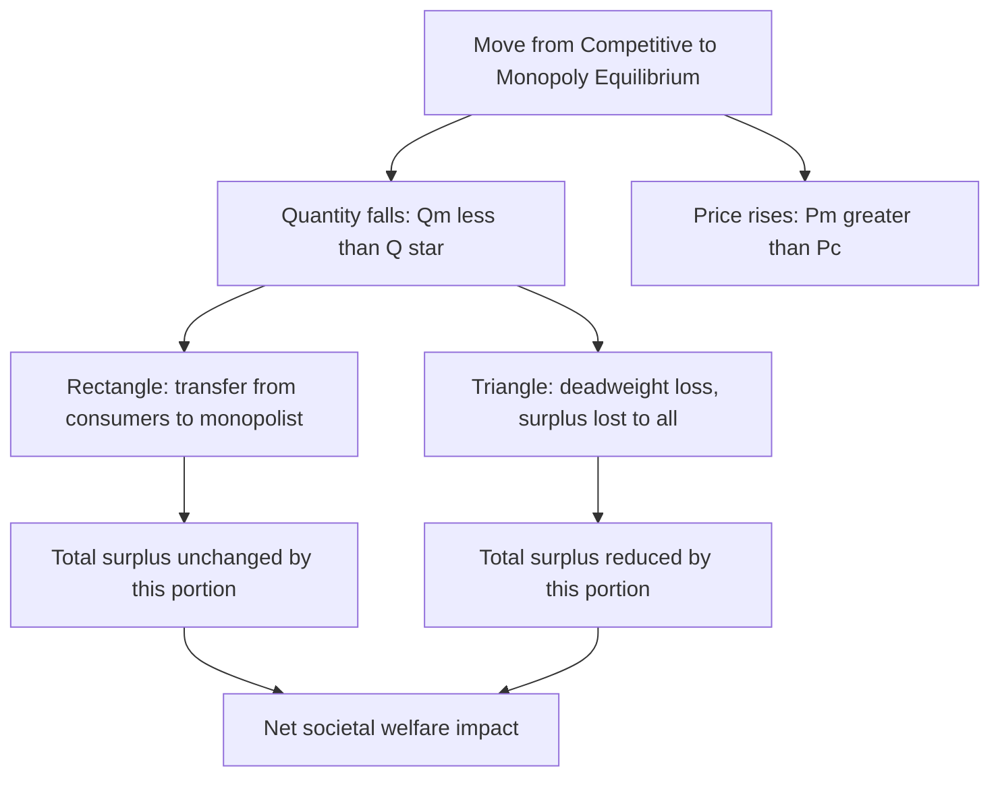

## Deadweight Loss of Monopoly

### Definition

Deadweight loss (DWL) of monopoly is the net reduction in total economic surplus that results from a monopolist restricting output below the socially efficient (perfectly competitive) level and charging a price above marginal cost. It represents mutually beneficial transactions between consumers and producers that fail to occur, capturing the pure efficiency cost of monopoly power — distinct from the transfer of surplus from consumers to the monopolist, which does not itself reduce total welfare.

### Conceptual Foundation

Total economic surplus is maximized when output occurs at the level where price equals marginal cost, since this ensures every unit for which a consumer's marginal willingness to pay exceeds the marginal cost of production is actually produced and exchanged:

$$\text{Efficient quantity: } Q^* \text{ such that } MWTP(Q^*) = MC(Q^*)$$

A monopolist, by contrast, restricts output to $Q_M < Q^*$ (where $MR = MC$), leaving a range of units unproduced — specifically all units between $Q_M$ and $Q^*$ — for which:

$$MWTP(Q) > MC(Q) \quad \text{for } Q_M < Q < Q^*$$

Each of these unproduced units represents forgone surplus that neither the consumer nor the monopolist captures. This forgone surplus, summed across the entire unproduced range, constitutes the deadweight loss.

### Formal Derivation

$$DWL = \int_{Q_M}^{Q^*} \left[ MWTP(Q) - MC(Q) \right] dQ = \int_{Q_M}^{Q^*} \left[ D(Q) - MC(Q) \right] dQ$$

where $D(Q)$ is the inverse demand function and $MC(Q)$ is marginal cost. Graphically, this integral is the area of the triangle-like region bounded by the demand curve above, the marginal cost curve below, spanning from $Q_M$ to $Q^*$.

### Diagram: Deadweight Loss Region Under Monopoly

<svg xmlns="http://www.w3.org/2000/svg" viewBox="0 0 720 480" font-family="Helvetica, Arial, sans-serif">
<text x="360" y="24" text-anchor="middle" font-size="16" font-weight="bold" fill="#1a1a1a">Deadweight Loss Under Monopoly (svg_diagram)</text>
<line x1="80" y1="420" x2="680" y2="420" stroke="#333" stroke-width="2" />
<line x1="80" y1="420" x2="80" y2="60" stroke="#333" stroke-width="2" />
<text x="690" y="425" font-size="13" fill="#333">Q</text>
<text x="65" y="55" font-size="13" fill="#333">P</text>

<line x1="120" y1="90" x2="620" y2="400" stroke="#2980b9" stroke-width="2.5" />
<text x="625" y="405" font-size="12" fill="#2980b9">D = MWTP</text>

<line x1="120" y1="90" x2="370" y2="420" stroke="#e67e22" stroke-width="2.5" />
<text x="375" y="425" font-size="12" fill="#e67e22">MR</text>

<line x1="150" y1="380" x2="560" y2="110" stroke="#c0392b" stroke-width="2.5" />
<text x="565" y="105" font-size="12" fill="#c0392b">MC</text>

<circle cx="430" cy="230" r="5" fill="#27ae60" />
<line x1="430" y1="230" x2="430" y2="420" stroke="#27ae60" stroke-dasharray="4,3" />
<text x="420" y="438" font-size="12" fill="#27ae60">Q*</text>

<circle cx="290" cy="290" r="5" fill="#8e44ad" />
<line x1="290" y1="290" x2="290" y2="420" stroke="#8e44ad" stroke-dasharray="4,3" />
<circle cx="290" cy="255" r="5" fill="#8e44ad" />
<line x1="80" y1="255" x2="290" y2="255" stroke="#8e44ad" stroke-dasharray="4,3" />
<text x="50" y="259" font-size="12" fill="#8e44ad">Pm</text>
<text x="275" y="438" font-size="12" fill="#8e44ad">Qm</text>

<line x1="80" y1="230" x2="430" y2="230" stroke="#27ae60" stroke-dasharray="4,3" />
<text x="50" y="234" font-size="12" fill="#27ae60">Pc = MC</text>

<polygon points="290,255 290,230 430,230" fill="#2980b9" opacity="0.3" />
<polygon points="290,255 290,290 430,230" fill="#f39c12" opacity="0.5" />
<text x="330" y="255" font-size="12" fill="#7d5a00" font-weight="bold">DWL</text>
<text x="300" y="238" font-size="9" fill="#1a5276">lost CS portion</text>
<text x="300" y="278" font-size="9" fill="#7d5a00">lost PS portion</text>
</svg>

**How to read this diagram:** The deadweight loss triangle spans from the monopoly quantity $Q_M$ to the efficient quantity $Q^*$. Its upper portion (bounded by demand and the horizontal price line) represents consumer surplus that vanishes entirely — neither transferred nor retained. Its lower portion (bounded by the price line and $MC$) represents producer surplus that vanishes as well, since the monopolist does not produce those units either.

### Decomposing the Welfare Change: Transfer vs. Loss

Moving from the competitive benchmark to monopoly produces two distinct effects, which must be kept conceptually separate:

**1. Transfer (Rectangle)**

The rectangle with height $(P_M - P_C)$ and width $Q_M$ represents surplus that consumers would have enjoyed under competitive pricing but which the monopolist now captures as additional profit. This is **not** a loss to society — it is a redistribution of existing surplus from consumers to the firm.

$$\text{Transfer} = (P_M - P_C) \times Q_M$$

**2. Deadweight Loss (Triangle)**

The triangle described above is surplus that disappears entirely — captured by no one. This is the true efficiency cost attributable to monopoly.

$$DWL = \frac{1}{2} \times (Q^* - Q_M) \times (P_M - MC(Q_M))$$

(using the standard triangle-area formula, valid when demand and $MC$ are approximately linear over the relevant range)

### Numerical Example

Suppose market demand is $P = 200 - Q$ and the monopolist's (and hypothetical competitive industry's) marginal cost is constant: $MC = 40$.

**Step 1 — Find the competitive (efficient) benchmark**, where $P = MC$:

$$200 - Q^* = 40 \implies Q^* = 160$$

**Step 2 — Find the monopoly quantity**, where $MR = MC$:

$$TR = (200-Q)Q = 200Q - Q^2 \implies MR = 200 - 2Q$$

$$200 - 2Q_M = 40 \implies Q_M = 80$$

**Step 3 — Find the monopoly price:**

$$P_M = 200 - 80 = 120$$

**Step 4 — Calculate deadweight loss using the triangle formula:**

$$DWL = \frac{1}{2} \times (Q^* - Q_M) \times (P_M - MC) = \frac{1}{2} \times (160 - 80) \times (120 - 40)$$

$$DWL = \frac{1}{2} \times 80 \times 80 = 3{,}200$$

**Step 5 — Verify using the integral definition:**

$$DWL = \int_{80}^{160} \left[(200 - Q) - 40\right] dQ = \int_{80}^{160} (160 - Q) \, dQ$$

$$= \left[160Q - \frac{Q^2}{2}\right]_{80}^{160} = \left(160(160) - \frac{160^2}{2}\right) - \left(160(80) - \frac{80^2}{2}\right)$$

$$= (25{,}600 - 12{,}800) - (12{,}800 - 3{,}200) = 12{,}800 - 9{,}600 = 3{,}200 \checkmark$$

**Step 6 — Calculate the transfer for comparison:**

$$\text{Transfer} = (P_M - MC) \times Q_M = (120-40) \times 80 = 6{,}400$$

This confirms the transfer ($6,400 moving from consumers to the monopolist) is a separate and larger quantity than the deadweight loss ($3,200 in surplus lost to society entirely) in this example — illustrating that the two effects, while both consequences of monopoly, are analytically and often numerically distinct.

### Mermaid Diagram: Decomposing Monopoly's Welfare Effect

### The Harberger Triangle: Historical and Empirical Context

The deadweight loss triangle associated with monopoly power is sometimes referred to in the literature as a **"Harberger triangle,"** named for the economist whose mid-20th-century empirical estimates of monopoly deadweight loss across U.S. industries famously found the aggregate welfare loss to be relatively small as a share of GDP.

**[Unverified — a long-running empirical debate, not a settled figure]** Subsequent research has both supported and challenged Harberger's original estimates; some economists argue the triangle understates true welfare costs because it excludes rent-seeking behavior (resources firms spend *trying to acquire or maintain* monopoly power, such as lobbying or wasteful advertising), which some economists model as converting the deadweight-loss triangle into an even larger welfare loss once these additional costs are included. This extension is often associated with the concept of a **"Tullock rectangle"** capturing resources dissipated in rent-seeking competition for monopoly rights.

### Determinants of Deadweight Loss Magnitude

The size of the deadweight loss triangle depends on several factors:

- **Price elasticity of demand**: More elastic demand near the monopoly price generally produces a larger gap between $Q_M$ and $Q^*$ for a given markup, though the precise relationship depends on the specific functional forms involved.
- **The markup itself** ($P_M - MC$): a larger price-cost margin (reflected in a higher Lerner Index) widens the vertical dimension of the deadweight loss triangle.
- **Degree of market power / barriers to entry**: stronger barriers allow more sustained and larger deviations from the competitive price, increasing both the transfer and the deadweight loss.

Since $DWL = \frac{1}{2} \times \Delta Q \times \Delta P$, and both $\Delta Q$ and $\Delta P$ tend to increase together as market power intensifies, deadweight loss typically grows more than proportionally with the degree of monopoly power (roughly following a relationship where DWL scales with the square of the markup, for a linear demand approximation).

### How Price Discrimination Can Reduce Deadweight Loss

A monopolist practicing **perfect (first-degree) price discrimination** charges each unit at the maximum price a consumer is willing to pay for it, rather than a single uniform price. Because $MR = P$ under perfect price discrimination (there is no need to lower price on inframarginal units), the profit-maximizing quantity moves all the way to $Q^*$, the efficient level:

$$\text{Perfect Price Discrimination: } Q_M \to Q^*, \quad DWL \to 0$$

In this case, the deadweight loss is eliminated entirely, but the entire surplus (both what would have been consumer surplus and producer surplus under competition) is captured by the monopolist as profit — a pure and complete transfer with no efficiency loss, though with a very different distributional outcome than perfect competition.

**Second- and third-degree price discrimination** typically fall between these extremes: they can reduce deadweight loss relative to single-price monopoly (by expanding output toward $Q^*$ in some segments), but generally do not eliminate it entirely, since price still generally exceeds marginal cost in at least some market segments.

### Comparison Table: DWL Across Pricing Regimes

| Pricing Regime | Quantity | Deadweight Loss |
| --- | --- | --- |
| Perfect competition | $Q^*$ | Zero |
| Single-price monopoly | $Q_M < Q^*$ | Positive (Harberger triangle) |
| Third-degree price discrimination | Between $Q_M$ and $Q^*$ (segment-dependent) | Positive, typically smaller than single-price monopoly |
| Perfect (first-degree) price discrimination | $Q^*$ | Zero |

### Common Misconceptions

- A very common error is treating the entire monopoly profit as deadweight loss. Only the triangle (forgone mutually beneficial trades) is deadweight loss; the rectangle is a *transfer*, not a loss to society as a whole.
- Students sometimes assume any positive monopoly profit implies deadweight loss must also be present. While it's true that single-price monopoly with $P > MC$ generally does create deadweight loss whenever output is restricted below $Q^*$, the *existence* of profit and the *existence* of deadweight loss are distinct claims — a monopolist earning zero economic profit (due to very high fixed costs) can still create deadweight loss through output restriction relative to marginal cost.
- The claim "monopoly deadweight loss is small in practice" (following Harberger) is sometimes treated as an uncontroversial settled fact. As noted above, this is an active empirical debate, particularly once rent-seeking costs are factored into a broader accounting of monopoly's social cost.

### Related Topics

- Monopoly pricing and output vs. competitive markets
- Profit maximization under monopoly
- Price discrimination (first, second, and third degree)
- The Lerner Index and market power measurement
- Rent-seeking and the Tullock rectangle
- Sources and barriers to entry
- Natural monopoly and regulation
- Efficiency in perfectly competitive markets (the benchmark case)