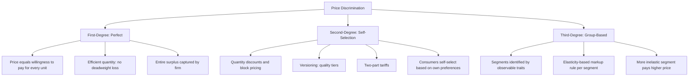

## Price Discrimination

### Definition

Price discrimination is the practice of charging different prices to different consumers, or for different units of the same good, for reasons unrelated to differences in the cost of supplying those units. It is a strategy available primarily to firms with market power (most commonly analyzed in the context of monopoly), allowing the firm to capture a greater share of consumer surplus than is possible under uniform (single) pricing.

### Necessary Conditions for Price Discrimination

A firm can only successfully price discriminate if three conditions hold simultaneously:

1. **Market power**: the firm must face a downward-sloping demand curve (i.e., it must not be a price taker), since a firm in perfect competition cannot charge above the market price without losing all customers.
2. **Ability to identify or sort consumers/units by willingness to pay**: the firm must be able to distinguish, directly or indirectly, between consumers or purchase occasions with different price sensitivities.
3. **Prevention of resale (no arbitrage)**: the firm must be able to prevent consumers who buy at a low price from reselling to those who would otherwise pay a high price, since unrestricted resale would undermine the price differential and cause the market to converge toward a single price.

$$\text{Price Discrimination Viable} \iff \text{Market Power} \land \text{Sorting Ability} \land \text{No Arbitrage}$$

### The Three Degrees of Price Discrimination

Economists classify price discrimination into three canonical categories, originally due to the economist A.C. Pigou.

### First-Degree (Perfect) Price Discrimination

The firm charges each individual unit at exactly the maximum price that particular consumer is willing to pay for that unit — capturing the entire area under the demand curve as revenue.

$$P(Q) = MWTP(Q) \text{ for every unit } Q$$

Because the firm extracts the full willingness to pay on every unit, the marginal revenue from selling an additional unit equals the price of that unit exactly (no need to lower price on previously sold units, since each unit is priced individually):

$$MR = P \text{ (under perfect price discrimination)}$$

**Profit-maximizing output:** the firm produces up to the point where $P(Q) = MC(Q)$ — the same quantity as the perfectly competitive/efficient outcome, $Q^*$.

**Welfare implications:** since output reaches the efficient level, deadweight loss is eliminated entirely. However, the entire surplus (what would have been consumer surplus *and* producer surplus under competition) becomes producer surplus/profit under perfect price discrimination — a complete transfer to the firm with no efficiency loss, but with an extreme distributional outcome unfavorable to consumers.

**Practical prevalence:** perfect price discrimination requires the firm to know each consumer's exact willingness to pay, which is rarely achievable in practice. **[Unverified — an idealized theoretical benchmark]** Perfect first-degree price discrimination is generally treated as a limiting case rather than something regularly observed in unmodified form; real-world practices such as personalized pricing algorithms, negotiated pricing (e.g., car sales, some B2B contracts), or auction mechanisms are sometimes cited as approximations that move toward this benchmark without achieving it exactly.

### Diagram: First-Degree Price Discrimination

<svg xmlns="http://www.w3.org/2000/svg" viewBox="0 0 700 420" font-family="Helvetica, Arial, sans-serif">
<text x="350" y="24" text-anchor="middle" font-size="16" font-weight="bold" fill="#1a1a1a">First-Degree Price Discrimination (svg_diagram)</text>
<line x1="80" y1="370" x2="650" y2="370" stroke="#333" stroke-width="2" />
<line x1="80" y1="370" x2="80" y2="60" stroke="#333" stroke-width="2" />
<text x="660" y="375" font-size="13" fill="#333">Q</text>
<text x="65" y="55" font-size="13" fill="#333">P</text>

<line x1="110" y1="90" x2="580" y2="350" stroke="#2980b9" stroke-width="2.5" />
<text x="585" y="355" font-size="12" fill="#2980b9">D = MWTP</text>

<line x1="130" y1="330" x2="500" y2="130" stroke="#c0392b" stroke-width="2.5" />
<text x="505" y="125" font-size="12" fill="#c0392b">MC</text>

<circle cx="360" cy="230" r="5" fill="#27ae60" />
<line x1="360" y1="230" x2="360" y2="370" stroke="#888" stroke-dasharray="4,3" />
<text x="350" y="388" font-size="12" fill="#333">Q* (all units sold)</text>

<polygon points="110,90 360,230 130,330 110,370" fill="#8e44ad" opacity="0.3" />
<text x="180" y="230" font-size="12" fill="#6c3483" font-weight="bold">Entire surplus captured as profit</text>
</svg>

**How to read this diagram:** Because each unit is sold at its own point on the demand curve, the entire shaded area under demand and above $MC$, up to $Q^*$, becomes the monopolist's profit. No deadweight loss remains, but consumers retain no surplus at all.

### Second-Degree Price Discrimination

The firm offers a menu of different price-quantity (or price-quality) bundles, and consumers self-select into the bundle that best suits their own preferences. The firm does not need to directly identify each consumer's type; instead, it designs a set of options such that different consumer types voluntarily reveal their willingness to pay through their choice among options.

**Common real-world forms:**

- **Quantity discounts / block pricing**: charging a lower per-unit price for larger purchase quantities (e.g., bulk discounts, tiered subscription plans).
- **Versioning**: offering different quality tiers of essentially the same product (e.g., "basic," "premium," "deluxe" versions), where high-willingness-to-pay consumers self-select into the higher-priced, higher-quality tier.
- **Two-part tariffs**: charging a fixed fee plus a per-unit price (e.g., a membership fee plus a per-visit charge, common in club or subscription-based pricing models).

**Key design principle — incentive compatibility**: the firm must design the menu so that each consumer type genuinely prefers the bundle intended for them over any other bundle in the menu, which typically requires the firm to accept giving up *some* surplus to higher-willingness-to-pay consumers to prevent them from mimicking lower-type consumers (an application of mechanism design / screening theory).

**Welfare implications**: second-degree price discrimination generally increases total output relative to single-price monopoly (since it allows the firm to serve some lower-willingness-to-pay consumers it otherwise would have excluded), which can reduce deadweight loss relative to uniform pricing — but it typically does not eliminate deadweight loss entirely, since not every unit is priced exactly at that consumer's individual willingness to pay.

### Two-Part Tariff — Numerical Illustration

Suppose a firm sets a two-part tariff consisting of a fixed membership fee $T$ plus a per-unit price $p$ for each unit consumed. For a single representative consumer with demand $Q = 20 - P$ and marginal cost $MC = 4$:

**Step 1 — Optimal per-unit price**: to maximize the total surplus available for the firm to extract via the fixed fee, the firm sets $p = MC = 4$ (this maximizes the total surplus generated, which the fixed fee can then capture).

**Step 2 — Quantity purchased at this price:**

$$Q = 20 - 4 = 16$$

**Step 3 — Consumer surplus at this quantity (this becomes the maximum fixed fee the firm can charge)**:

Find the demand curve's vertical intercept: at $Q=0$, $P = 20$.

$$CS = \frac{1}{2} \times (20 - 4) \times 16 = \frac{1}{2}(16)(16) = 128$$

**Step 4 — Set the fixed fee**: $T = 128$ (extracting the entire consumer surplus, assuming a single consumer type and the firm knows this consumer's exact demand curve).

**Step 5 — Total firm profit:**

$$\pi = T + (p - MC) \times Q = 128 + (4-4)(16) = 128$$

This example shows the classic two-part tariff result: by setting the per-unit price equal to marginal cost, the firm maximizes total surplus (achieving the efficient quantity), then extracts that entire surplus via the fixed fee — replicating the perfect price discrimination outcome in the special case of a single known consumer type. With multiple consumer types with different demand curves, the analysis becomes a more complex second-degree discrimination / screening problem, where the firm cannot set $T$ equal to the highest-surplus consumer's full surplus without losing lower-surplus consumers entirely.

### Third-Degree Price Discrimination

The firm segments consumers into identifiable, easily verifiable groups (based on observable characteristics like age, location, student status, or time of purchase) and charges a different uniform price to each group, based on each group's distinct demand elasticity.

**Optimal pricing rule across segments:** the firm sets $MR$ equal to a common $MC$ across all segments (assuming shared production capacity), which yields the standard elasticity-adjusted markup rule for each segment $i$:

$$P_i = \frac{MC}{1 - \frac{1}{|\epsilon_i|}}$$

**Key qualitative result:** the segment with the **more inelastic** demand is charged a **higher** price, and the segment with **more elastic** demand is charged a **lower** price. This follows directly from the markup formula: a smaller $|\epsilon_i|$ (more inelastic) drives the denominator smaller and the resulting price higher.

$$|\epsilon_1| > |\epsilon_2| \implies P_1 < P_2$$

**Common real-world examples:** student and senior discounts (younger/older groups often have more elastic demand for certain goods), regional pricing (different countries have different price sensitivities and income levels), time-of-day or seasonal pricing (peak vs. off-peak), and business vs. leisure airline ticket pricing (business travelers typically have less elastic demand).

### Numerical Example: Third-Degree Price Discrimination

Suppose a firm serves two markets with demands:

$$Q_1 = 60 - 2P_1 \qquad Q_2 = 40 - P_2$$

and constant marginal cost $MC = 10$.

**Step 1 — Invert demands and find MR for each market:**

Market 1: $P_1 = 30 - 0.5Q_1 \implies TR_1 = 30Q_1 - 0.5Q_1^2 \implies MR_1 = 30 - Q_1$

Market 2: $P_2 = 40 - Q_2 \implies TR_2 = 40Q_2 - Q_2^2 \implies MR_2 = 40 - 2Q_2$

**Step 2 — Set MR = MC in each market separately:**

Market 1: $30 - Q_1 = 10 \implies Q_1 = 20 \implies P_1 = 30 - 0.5(20) = 20$

Market 2: $40 - 2Q_2 = 10 \implies Q_2 = 15 \implies P_2 = 40 - 15 = 25$

**Step 3 — Verify with elasticities at these prices:**

Market 1 elasticity at $(P_1, Q_1) = (20, 20)$: using $\epsilon_1 = \frac{dQ_1}{dP_1} \times \frac{P_1}{Q_1} = (-2) \times \frac{20}{20} = -2$

Market 2 elasticity at $(P_2, Q_2) = (25, 15)$: $\epsilon_2 = \frac{dQ_2}{dP_2} \times \frac{P_2}{Q_2} = (-1) \times \frac{25}{15} = -1.67$

Since $|\epsilon_1| = 2 > |\epsilon_2| = 1.67$, market 1 has more elastic demand, and indeed receives the **lower** price ($P_1 = 20 < P_2 = 25$), confirming the qualitative rule.

### Diagram: Third-Degree Price Discrimination Across Two Markets

<svg xmlns="http://www.w3.org/2000/svg" viewBox="0 0 760 420" font-family="Helvetica, Arial, sans-serif">
<text x="380" y="24" text-anchor="middle" font-size="16" font-weight="bold" fill="#1a1a1a">Third-Degree Price Discrimination (svg_diagram)</text>

<text x="190" y="50" text-anchor="middle" font-size="13" font-weight="bold" fill="#333">Market 1 (elastic)</text>

<line x1="70" y1="370" x2="330" y2="370" stroke="#333" stroke-width="2" />

<line x1="70" y1="370" x2="70" y2="70" stroke="#333" stroke-width="2" />

<line x1="90" y1="90" x2="300" y2="350" stroke="`#2980b9`" stroke-width="2" />

<text x="305" y="355" font-size="10" fill="`#2980b9`">D1</text>

<line x1="90" y1="90" x2="200" y2="370" stroke="`#e67e22`" stroke-width="2" />

<text x="205" y="375" font-size="10" fill="`#e67e22`">MR1</text>

<line x1="70" y1="220" x2="330" y2="220" stroke="`#c0392b`" stroke-width="2" />

<text x="335" y="224" font-size="10" fill="`#c0392b`">MC</text>

<circle cx="160" cy="220" r="4" fill="`#2c3e50`" />

<line x1="160" y1="220" x2="160" y2="370" stroke="#888" stroke-dasharray="3,3" />

<circle cx="160" cy="180" r="4" fill="`#8e44ad`" />

<line x1="70" y1="180" x2="160" y2="180" stroke="`#8e44ad`" stroke-dasharray="3,3" />

<text x="40" y="184" font-size="10" fill="`#8e44ad`">P1 (lower)</text>

<text x="580" y="50" text-anchor="middle" font-size="13" font-weight="bold" fill="#333">Market 2 (inelastic)</text>

<line x1="440" y1="370" x2="700" y2="370" stroke="#333" stroke-width="2" />

<line x1="440" y1="370" x2="440" y2="70" stroke="#333" stroke-width="2" />

<line x1="480" y1="90" x2="620" y2="350" stroke="`#2980b9`" stroke-width="2" />

<text x="625" y="355" font-size="10" fill="`#2980b9`">D2</text>

<line x1="480" y1="90" x2="550" y2="370" stroke="`#e67e22`" stroke-width="2" />

<text x="555" y="375" font-size="10" fill="`#e67e22`">MR2</text>

<line x1="440" y1="220" x2="700" y2="220" stroke="`#c0392b`" stroke-width="2" />

<text x="705" y="224" font-size="10" fill="`#c0392b`">MC</text>

<circle cx="515" cy="220" r="4" fill="`#2c3e50`" />

<line x1="515" y1="220" x2="515" y2="370" stroke="#888" stroke-dasharray="3,3" />

<circle cx="515" cy="150" r="4" fill="`#8e44ad`" />

<line x1="440" y1="150" x2="515" y2="150" stroke="`#8e44ad`" stroke-dasharray="3,3" />

<text x="405" y="154" font-size="10" fill="`#8e44ad`">P2 (higher)</text>

</svg>

**How to read this diagram:** Both markets share the same marginal cost. The market with more elastic demand (left) is charged the lower price, while the market with more inelastic demand (right) is charged the higher price — the firm exploits differing price sensitivities across segments to increase total profit beyond what a single uniform price could achieve.

### Mermaid Diagram: Classification of Price Discrimination

### Comparative Summary Table

| Feature | First-Degree | Second-Degree | Third-Degree |
| --- | --- | --- | --- |
| Basis for price variation | Individual unit / consumer | Self-selected bundle | Observable group membership |
| Information required by firm | Complete (each consumer's exact demand) | Partial (menu design only) | Group-level demand/elasticity |
| Resulting output | Efficient ($Q^*$) | Between monopoly and efficient | Between monopoly and efficient (segment-dependent) |
| Deadweight loss | Eliminated | Reduced, not eliminated | Reduced, not eliminated |
| Consumer surplus | Fully captured by firm | Partially captured by firm | Reduced relative to uniform pricing for inelastic segment |
| Real-world prevalence | Rare in pure form | Very common | Very common |

### Welfare Effects: A More Nuanced View

**[Unverified — an important qualification, not a universal guarantee]** While first-degree price discrimination unambiguously raises total welfare relative to single-price monopoly (by eliminating deadweight loss entirely), the welfare effect of second- and third-degree price discrimination is *ambiguous* in general — it depends on whether the increase in output in some segments (which reduces deadweight loss there) outweighs any reduction in output in other segments. It is possible, though not guaranteed, for third-degree price discrimination to reduce total welfare relative to single-price monopoly, if the price increase in some markets causes output there to fall more than output rises in others; a common sufficient condition discussed in the literature is that total output overall must rise for total welfare to be assured of improving.

### Common Misconceptions

- Students often assume all price differences constitute price discrimination. Price differences that reflect genuine differences in the *cost* of serving different customers (e.g., higher shipping costs to remote areas) are **not** price discrimination in the economic sense — the term specifically refers to price differences unrelated to cost differences.
- A common error is believing price discrimination is always bad for consumers as a whole. While it typically transfers surplus from at least some consumers to the firm, it can also expand output and allow some consumers (those previously priced out entirely) to be served who would not have been served under single-price monopoly — the net effect on total consumer welfare is ambiguous and segment-dependent.
- Assuming perfect price discrimination is common in practice. It is an important theoretical benchmark clarifying the maximum possible profit extraction and the elimination of deadweight loss, but it requires informational precision rarely achieved outside stylized examples or select modern data-rich contexts.

### Related Topics

- Deadweight loss of monopoly
- Monopoly demand and marginal revenue
- Profit maximization under monopoly
- Two-part tariffs and non-linear pricing
- Peak-load pricing
- Bundling and tying as related pricing strategies
- Consumer and producer surplus measurement
- Antitrust treatment of price discrimination (e.g., Robinson-Patman-type concerns)