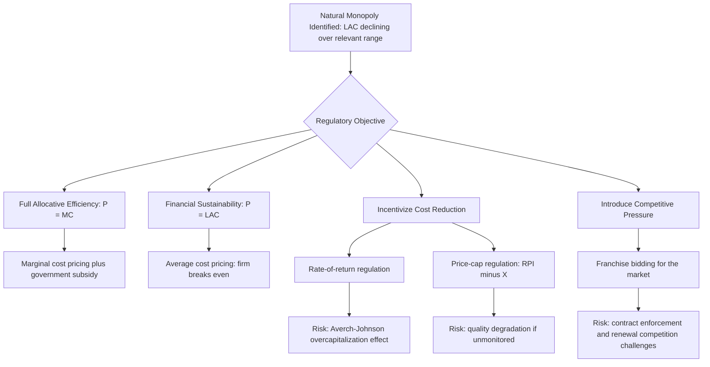

## Natural Monopoly

### Definition

A natural monopoly is an industry in which the underlying cost structure — specifically, long-run average cost that continues to decline over the entire relevant range of market demand — makes it more efficient for a single firm to produce the industry's entire output than for multiple competing firms to divide production among themselves. Unlike monopolies sustained by legal barriers or strategic entry deterrence, a natural monopoly arises purely from cost conditions (economies of scale).

### The Core Cost Condition

A natural monopoly exists when long-run average cost is falling throughout the range of output relevant to satisfying market demand:

$$\frac{d(LAC)}{dQ} < 0 \quad \text{for all } Q \text{ up to the quantity demanded at a competitive or regulated price}$$

This typically arises from cost structures with a very large fixed (often sunk) cost component combined with low marginal cost:

$$TC(Q) = F + cQ$$

$$LAC(Q) = \frac{F}{Q} + c$$

As $Q$ increases, the fixed cost $F$ is spread over more units, causing $\frac{F}{Q}$ (and therefore $LAC$) to decline continuously. If market demand is satisfied well before $LAC$ would eventually turn upward (if it ever does, given the specific cost function), the industry is a natural monopoly over the relevant range.

### Subadditivity of Costs: The Formal Criterion

The technically precise definition of natural monopoly relies on **cost subadditivity**: a single firm's cost of producing total market output $Q$ is strictly less than the sum of costs if that same output were split among two or more firms:

$$C(Q) < C(Q_1) + C(Q_2) + \dots + C(Q_n) \quad \text{where } Q = Q_1 + Q_2 + \dots + Q_n$$

**[Unverified — an important technical refinement, less commonly emphasized at introductory level]** Subadditivity is the economically precise condition for natural monopoly and is not exactly identical to "declining average cost everywhere," though the two conditions coincide in most standard textbook cost functions used for illustration; in principle a cost function could have subadditivity hold only over the relevant demand range without $LAC$ declining literally everywhere.

### Diagram: Natural Monopoly Cost Structure

<svg xmlns="http://www.w3.org/2000/svg" viewBox="0 0 700 440" font-family="Helvetica, Arial, sans-serif">
<text x="350" y="24" text-anchor="middle" font-size="16" font-weight="bold" fill="#1a1a1a">Natural Monopoly: Cost and Demand (svg_diagram)</text>
<line x1="80" y1="390" x2="650" y2="390" stroke="#333" stroke-width="2" />
<line x1="80" y1="390" x2="80" y2="60" stroke="#333" stroke-width="2" />
<text x="660" y="395" font-size="13" fill="#333">Q</text>
<text x="65" y="55" font-size="13" fill="#333">P, C</text>

<path d="M 110 110 C 200 230, 320 310, 500 350 C 560 360, 600 365, 620 368" fill="none" stroke="`#27ae60`" stroke-width="2.5" />

<text x="430" y="315" font-size="12" fill="`#27ae60`" font-weight="bold">LAC</text>

<line x1="110" y1="340" x2="620" y2="375" stroke="#c0392b" stroke-width="2.5" />
<text x="480" y="392" font-size="12" fill="#c0392b" font-weight="bold">MC</text>

<line x1="110" y1="130" x2="580" y2="340" stroke="#2980b9" stroke-width="2.5" />
<text x="585" y="345" font-size="12" fill="#2980b9">D</text>

<circle cx="420" cy="290" r="5" fill="#2c3e50" />
<text x="430" y="285" font-size="11" fill="#2c3e50">D meets LAC while still falling</text>
</svg>

**How to read this diagram:** Market demand $D$ intersects $LAC$ at a point where $LAC$ is still declining — this is the hallmark of natural monopoly. A single firm serving the whole market achieves lower average cost than would result from splitting production among competitors.

### Why Competition Is Inefficient in a Natural Monopoly

If two or more firms attempted to compete in a natural monopoly setting, each would produce a smaller share of total market output, operating further up (or left) on the still-declining portion of $LAC$ — meaning each firm's average cost would be *higher* than if a single firm served the entire market. This makes fragmenting production genuinely wasteful from a resource-cost standpoint, even though competition is normally associated with efficiency gains in other market structures.

$$\text{Two firms each producing } Q/2: \quad LAC(Q/2) > LAC(Q)$$

This is precisely why natural monopoly represents a case where the standard argument for promoting competition (as the route to lower prices and greater efficiency) does not straightforwardly apply — breaking up a natural monopoly into competing firms can raise total industry costs rather than lower them.

### The Regulatory Dilemma: Efficiency vs. Market Power

An unregulated natural monopolist, facing no competitive discipline, would still set $MR = MC$ like any monopolist, restricting output below the efficient level and charging a price above marginal cost — generating the standard monopoly deadweight loss. The regulatory challenge is to capture the cost-efficiency benefits of single-firm production while curbing the exercise of monopoly pricing power.

$$\text{Unregulated Natural Monopoly: } P_M > MC(Q_M), \quad Q_M < Q^* \implies DWL > 0$$

### Diagram: The Regulatory Dilemma

<svg xmlns="http://www.w3.org/2000/svg" viewBox="0 0 720 460" font-family="Helvetica, Arial, sans-serif">
<text x="360" y="24" text-anchor="middle" font-size="16" font-weight="bold" fill="#1a1a1a">Natural Monopoly Regulation Options (svg_diagram)</text>
<line x1="80" y1="410" x2="680" y2="410" stroke="#333" stroke-width="2" />
<line x1="80" y1="410" x2="80" y2="60" stroke="#333" stroke-width="2" />
<text x="690" y="415" font-size="13" fill="#333">Q</text>
<text x="65" y="55" font-size="13" fill="#333">P, C</text>

<path d="M 120 120 C 220 250, 340 320, 520 360 C 580 370, 620 375, 640 378" fill="none" stroke="`#27ae60`" stroke-width="2.5" />

<text x="450" y="325" font-size="12" fill="`#27ae60`">LAC</text>

<line x1="120" y1="350" x2="640" y2="385" stroke="#c0392b" stroke-width="2.5" />
<text x="510" y="402" font-size="12" fill="#c0392b">MC</text>

<line x1="120" y1="130" x2="600" y2="360" stroke="#2980b9" stroke-width="2.5" />
<text x="605" y="365" font-size="12" fill="#2980b9">D</text>

<line x1="120" y1="130" x2="360" y2="410" stroke="#e67e22" stroke-width="2" />
<text x="365" y="415" font-size="11" fill="#e67e22">MR</text>

<circle cx="270" cy="290" r="5" fill="#8e44ad" />
<line x1="270" y1="290" x2="270" y2="410" stroke="#8e44ad" stroke-dasharray="3,3" />
<circle cx="270" cy="250" r="5" fill="#8e44ad" />
<line x1="80" y1="250" x2="270" y2="250" stroke="#8e44ad" stroke-dasharray="3,3" />
<text x="35" y="254" font-size="10" fill="#8e44ad">Pm (unregulated)</text>

<circle cx="440" cy="335" r="5" fill="#c0392b" />
<line x1="440" y1="335" x2="440" y2="410" stroke="#c0392b" stroke-dasharray="3,3" />
<text x="445" y="330" font-size="10" fill="#c0392b">P=MC (efficient, but firm loses money)</text>

<circle cx="380" cy="323" r="5" fill="#f39c12" />
<line x1="380" y1="323" x2="380" y2="410" stroke="#f39c12" stroke-dasharray="3,3" />
<text x="385" y="318" font-size="10" fill="#f39c12">P=LAC (breakeven, second-best)</text>
</svg>

**How to read this diagram:** The unregulated monopoly point (purple) reflects high price and low output. Marginal cost pricing (red point, where $P=MC$) is allocatively efficient but occurs where $LAC$ still exceeds $MC$, meaning the firm would incur a loss at that price — since $LAC > MC$ everywhere on a declining $LAC$ curve. Average cost pricing (orange point, $P=LAC$) allows the firm to break even but does not achieve full allocative efficiency, since price still exceeds marginal cost there.

### Why P = MC Regulation Causes a Loss

Because $LAC$ is declining, it must be true that $MC < LAC$ at every relevant output level (a mathematical property of any average cost curve that is falling — the marginal must pull the average down). Therefore, if a regulator forces the firm to price at marginal cost ($P = MC$):

$$P = MC < LAC(Q) \implies P \times Q < LAC(Q) \times Q = TC(Q)$$

The firm's revenue falls short of total cost, generating a loss equal to:

$$\text{Loss} = [LAC(Q) - MC(Q)] \times Q$$

This is a fundamental tension in natural monopoly regulation: the allocatively efficient price is not financially sustainable for the firm without some form of subsidy or alternative revenue mechanism.

### Regulatory Approaches to Natural Monopoly

**1. Marginal Cost Pricing with Subsidy**

The regulator mandates $P = MC$ (achieving full allocative efficiency) and covers the resulting loss through a government subsidy funded by general tax revenue. This achieves efficiency but requires a funding mechanism and raises questions about the source and distortion of the taxes used to fund the subsidy.

**2. Average Cost Pricing ("Second-Best" Regulation)**

The regulator sets $P = LAC(Q)$, the price at which the firm exactly breaks even (zero economic profit) without requiring a subsidy. This is a common practical compromise: it does not achieve full allocative efficiency (since $P > MC$ still holds), but eliminates monopoly profit and keeps the firm financially self-sustaining.

$$P_{AC} = LAC(Q_{AC}) \quad \text{where } Q_{AC} \text{ is found from the intersection of } D \text{ and } LAC$$

**3. Rate-of-Return (Cost-of-Service) Regulation**

The regulator allows the firm to set prices sufficient to cover operating costs plus a specified, regulator-approved rate of return on invested capital. Historically common for utilities. **[Unverified — a well-documented but debated regulatory concern]** A frequently cited critique, known as the **Averch-Johnson effect**, holds that rate-of-return regulation can create an incentive for firms to over-invest in capital relative to the cost-minimizing input mix, since a higher capital base (up to the point regulators disallow it) can increase the absolute dollar return the firm is permitted to earn.

**4. Price-Cap Regulation**

The regulator sets a cap on the price (or an index of prices) the firm may charge, often adjusted over time for inflation and an expected productivity offset (commonly summarized as "**RPI − X**" regulation, where RPI is a retail price index and $X$ is a target efficiency/productivity improvement factor). Unlike rate-of-return regulation, price-cap regulation allows the firm to retain the benefits of any cost reductions it achieves below the cap, which proponents argue creates stronger incentives for efficiency and innovation. **[Unverified — genuinely debated in the regulatory economics literature]** Critics note that price-cap regulation can create incentives to reduce service quality if quality is not separately monitored and regulated alongside price.

**5. Franchise Bidding / Competition "for the market"**

Rather than regulating an incumbent's price directly, the government periodically auctions the exclusive right to serve the market (the franchise) to whichever firm commits to the lowest price or best terms, introducing competitive pressure at the bidding stage even though only one firm ultimately serves the market at any given time. **[Unverified — implementation success varies significantly by context]** the effectiveness of franchise bidding depends heavily on the ability to write and enforce long-term contracts and on maintaining genuine competition among bidders at each renewal.

### Mermaid Diagram: Natural Monopoly Regulatory Options

### Numerical Example: Comparing Regulatory Approaches

Suppose a natural monopoly has cost function $TC(Q) = 1{,}000 + 5Q$, so $MC = 5$ and $LAC = \frac{1{,}000}{Q} + 5$. Market demand is $P = 45 - 0.5Q$.

**Unregulated monopoly outcome:**

$$TR = (45-0.5Q)Q = 45Q - 0.5Q^2 \implies MR = 45 - Q$$

Set $MR = MC$: $45 - Q = 5 \implies Q_M = 40$, $P_M = 45 - 0.5(40) = 25$

**Marginal cost pricing outcome ($P = MC = 5$):**

$$45 - 0.5Q = 5 \implies Q_{MC} = 80$$

Check financial viability: $LAC(80) = \frac{1{,}000}{80} + 5 = 12.5 + 5 = 17.5$. Since $P = 5 < LAC = 17.5$, the firm loses $(17.5 - 5) \times 80 = 1{,}000$ (exactly equal to the fixed cost, as expected, since price only covers marginal cost and none of the fixed cost).

**Average cost pricing outcome ($P = LAC$):**

Set demand equal to $LAC$:

$$45 - 0.5Q = \frac{1{,}000}{Q} + 5$$

$$40Q - 0.5Q^2 = 1{,}000$$

$$0.5Q^2 - 40Q + 1{,}000 = 0$$

$$Q^2 - 80Q + 2{,}000 = 0$$

Using the quadratic formula:

$$Q = \frac{80 \pm \sqrt{6{,}400 - 8{,}000}}{2}$$

Since the discriminant is negative ($6,400 - 8,000 = -1,600$), there is no real solution with these particular numbers — indicating that, in this specific example, demand and $LAC$ do not intersect at a feasible point (demand is too low relative to the fixed cost for average-cost pricing to be viable at all with this cost structure). This illustrates an important practical point: average-cost pricing is only feasible when demand is sufficiently robust relative to the fixed-cost burden; when it is not, subsidy-based marginal cost pricing or a much higher constrained price may be the only viable regulatory options.

### Real-World Examples Commonly Cited

**[Unverified — illustrative examples per common textbook treatment, not exhaustively verified against current market structures]** Natural monopoly characteristics have traditionally been associated with:

- Local electricity and water distribution networks (physical infrastructure duplication is highly costly)
- Local landline telephone networks (historically, prior to substantial technological change)
- Natural gas pipeline distribution
- Rail track infrastructure (as distinct from rail *operating* services, which can sometimes be run competitively on shared track)

**Important caveat**: technological change has eroded the natural monopoly characteristics of some historically-cited examples (for instance, the emergence of wireless and satellite technology reduced the natural monopoly characteristics of local telephone service). Whether a given industry constitutes a natural monopoly is not a permanent, fixed classification — it depends on the current state of technology and cost structure, and can change over time.

### Common Misconceptions

- Students sometimes assume "natural monopoly" simply means "a monopoly that occurs naturally" without government intervention, in a loose sense. The term has the precise technical meaning of cost subadditivity/declining average cost — it is not merely a synonym for any unregulated monopoly.
- A common error is assuming that breaking up any natural monopoly into competing firms would necessarily lower prices for consumers. Given genuine economies of scale, fragmenting production can raise total industry costs, potentially leaving consumers worse off even if the resulting price includes a smaller markup per firm.
- Confusing marginal cost pricing and average cost pricing as interchangeable regulatory tools. They generate different outcomes for both efficiency (only $P=MC$ is fully allocatively efficient) and firm solvency (only $P=LAC$ avoids a loss without subsidy) — the choice between them reflects a genuine policy trade-off, not simply two labels for the same regulatory target.

### Related Topics

- Sources and barriers to entry
- Deadweight loss of monopoly
- Rate-of-return regulation and the Averch-Johnson effect
- Price-cap regulation (RPI − X)
- Contestable markets theory
- Public utility regulation and franchise bidding
- Monopoly pricing and output vs. competitive markets
- Antitrust policy and structural vs. behavioral remedies