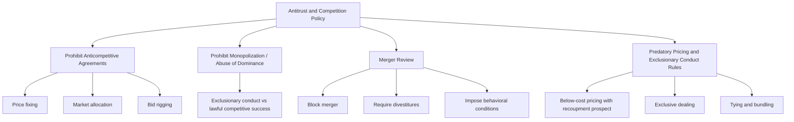
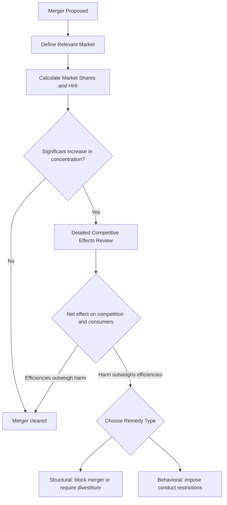

## Antitrust and Regulation of Monopoly

### Definition

Antitrust (competition) policy and regulation refer to the body of government laws, enforcement institutions, and rules designed to prevent, constrain, or remedy the exercise of monopoly power, with the goal of protecting or restoring the efficiency benefits associated with competitive markets. These tools range from structural interventions (breaking up firms, blocking mergers) to behavioral and price-based regulation of firms whose market power cannot or should not be eliminated entirely (such as natural monopolies).

### The Economic Rationale for Intervention

The theoretical basis for antitrust and regulatory policy rests directly on the welfare analysis of monopoly: unregulated market power leads to $P > MC$, output restriction below the efficient level, and deadweight loss.

$$\text{Unregulated Monopoly: } Q_M < Q^*, \quad P_M > MC(Q_M) \implies DWL > 0$$

Policy intervention aims to move outcomes closer to the competitive/efficient benchmark, either by preventing monopoly power from arising or being abused, or by directly constraining a monopolist's pricing and behavior once market power exists.

### Two Broad Categories of Intervention

### 1. Antitrust (Competition) Law

Antitrust law targets the *creation, maintenance, or abuse* of market power through legal prohibitions and enforcement, generally applicable across industries (as opposed to price regulation, which is usually industry-specific).

**a) Prohibiting Anticompetitive Agreements**

Laws typically prohibit agreements between competitors that restrain trade, such as price-fixing (competitors agreeing on prices rather than competing), market allocation (dividing customers or territories to avoid competing), and bid-rigging (coordinating bids on contracts to predetermine an outcome). These "horizontal" agreements between direct competitors are usually treated with the strictest legal scrutiny, since they directly reduce or eliminate rivalry that antitrust law aims to preserve.

**b) Prohibiting Monopolization / Abuse of Dominance**

Beyond outright agreements, laws in many jurisdictions prohibit a firm from unlawfully acquiring or maintaining monopoly power through exclusionary conduct — as opposed to acquiring monopoly power lawfully through superior efficiency, better products, or business acumen (which most legal frameworks do not, by itself, penalize). Distinguishing lawful competitive success from unlawful exclusionary conduct is one of the most legally and analytically contested areas of antitrust practice.

**c) Merger Review**

Government competition authorities typically review proposed mergers and acquisitions above certain size thresholds to assess whether the transaction would substantially reduce competition (e.g., by creating or strengthening a dominant firm, or facilitating coordination among remaining competitors). Authorities may block a merger, require divestitures of certain assets/business lines as a condition of approval, or impose other behavioral remedies.

**d) Predatory Pricing and Exclusionary Conduct Rules**

Antitrust law in many jurisdictions addresses conduct such as predatory pricing (pricing below cost to eliminate rivals, with intent and a realistic prospect of recouping losses afterward), exclusive dealing arrangements that foreclose rivals' access to customers or inputs, and tying/bundling practices that may leverage market power in one product into an adjacent market.

### Mermaid Diagram: Categories of Antitrust Intervention

### 2. Direct Economic Regulation

For industries where monopoly arises from genuine cost conditions (natural monopoly) rather than anticompetitive conduct, breaking up the firm may be economically counterproductive (since it would raise total production costs by sacrificing economies of scale). In these cases, governments often opt for direct regulation of price and/or entry rather than structural antitrust remedies.

**a) Rate-of-Return (Cost-of-Service) Regulation**

Regulators allow the firm to charge prices sufficient to cover operating costs plus an approved rate of return on invested capital. This method aims to prevent excessive monopoly profit while allowing the firm to remain financially viable, but it has been associated with the **Averch-Johnson effect** — an incentive for the firm to over-invest in capital, since a larger capital base can increase the total dollar profit permitted under a fixed percentage rate of return. **[Unverified — theoretically well established but empirically contested in magnitude]** the extent to which the Averch-Johnson effect materializes in real regulated firms is a matter of ongoing empirical debate.

**b) Price-Cap Regulation ("RPI − X")**

Regulators cap the rate of price increase a firm can impose, often tied to a general price index (RPI) minus an expected productivity/efficiency factor ($X$). This approach lets the firm keep the benefits of cost reductions achieved below the cap, which proponents argue improves incentives for efficiency relative to rate-of-return regulation, though critics point to a risk of quality degradation if service quality is not monitored alongside price.

**c) Marginal Cost / Average Cost Pricing Rules**

As detailed in the treatment of natural monopoly, regulators may mandate marginal-cost pricing (efficient, but often requires a subsidy given falling $LAC$) or average-cost pricing (financially self-sustaining, but not fully allocatively efficient).

**d) Structural Separation**

In some regulated industries, the "natural monopoly" segment (e.g., the physical transmission/distribution network) is separated — structurally or through accounting — from potentially competitive segments (e.g., electricity generation or retail supply), allowing competition to be introduced in the segments that are not subject to natural monopoly cost conditions, while the genuine natural-monopoly segment remains regulated.

### Diagram: Regulatory vs. Antitrust Approach Decision Framework

<svg xmlns="http://www.w3.org/2000/svg" viewBox="0 0 700 420" font-family="Helvetica, Arial, sans-serif">
<text x="350" y="24" text-anchor="middle" font-size="16" font-weight="bold" fill="#1a1a1a">Choosing Between Antitrust and Regulation (svg_diagram)</text>
<rect x="260" y="50" width="180" height="50" rx="8" fill="#f4f4f4" stroke="#333" stroke-width="1.5" />
<text x="350" y="80" text-anchor="middle" font-size="12" fill="#333">Source of Market Power?</text>
<line x1="290" y1="100" x2="150" y2="160" stroke="#333" stroke-width="1.5" />
<line x1="410" y1="100" x2="550" y2="160" stroke="#333" stroke-width="1.5" />
<rect x="60" y="160" width="200" height="60" rx="8" fill="#eaf2f8" stroke="#2980b9" stroke-width="1.5" />
<text x="160" y="185" text-anchor="middle" font-size="11" fill="#2980b9" font-weight="bold">Anticompetitive Conduct</text>
<text x="160" y="203" text-anchor="middle" font-size="10" fill="#333">(mergers, agreements, exclusionary acts)</text>
<rect x="440" y="160" width="200" height="60" rx="8" fill="#fdecea" stroke="#c0392b" stroke-width="1.5" />
<text x="540" y="185" text-anchor="middle" font-size="11" fill="#c0392b" font-weight="bold">Genuine Cost Structure</text>
<text x="540" y="203" text-anchor="middle" font-size="10" fill="#333">(economies of scale, natural monopoly)</text>
<line x1="160" y1="220" x2="160" y2="270" stroke="#333" stroke-width="1.5" />
<line x1="540" y1="220" x2="540" y2="270" stroke="#333" stroke-width="1.5" />
<rect x="60" y="270" width="200" height="60" rx="8" fill="#eaf2f8" stroke="#2980b9" stroke-width="1.5" />
<text x="160" y="295" text-anchor="middle" font-size="11" fill="#2980b9" font-weight="bold">Antitrust Enforcement</text>
<text x="160" y="313" text-anchor="middle" font-size="10" fill="#333">Prevent, block, or remedy conduct</text>
<rect x="440" y="270" width="200" height="60" rx="8" fill="#fdecea" stroke="#c0392b" stroke-width="1.5" />
<text x="540" y="295" text-anchor="middle" font-size="11" fill="#c0392b" font-weight="bold">Direct Economic Regulation</text>
<text x="540" y="313" text-anchor="middle" font-size="10" fill="#333">Regulate price, allow single firm to operate</text>
</svg>

### Merger Analysis: A Simplified Framework

Competition authorities commonly assess proposed mergers using tools including:

**Market Definition**: identifying the relevant product and geographic market in which competitive effects should be assessed, often using tests examining whether consumers would switch to substitute products in response to a small but significant price increase.

**Market Concentration Measures**: a widely used tool is the **Herfindahl-Hirschman Index (HHI)**, calculated as the sum of squared market shares (expressed as whole numbers, e.g., a 30% share enters as 30) of all firms in the relevant market:

$$HHI = \sum_{i=1}^{n} s_i^2$$

where $s_i$ is firm $i$'s percentage market share. A market with a single monopolist has $HHI = 100^2 = 10{,}000$ (the maximum possible value), while a market with many small, equal-share firms has a low HHI approaching zero. Competition authorities in various jurisdictions have historically used HHI thresholds and the *change* in HHI resulting from a proposed merger as one input (among several) into deciding whether closer scrutiny is warranted. **[Unverified — specific numerical thresholds and their application vary by jurisdiction and change over time]** Claude does not have a current, jurisdiction-specific figure to cite reliably here; a person needing exact current thresholds should consult the relevant competition authority's current guidelines directly.

### Numerical Example: HHI Calculation

Suppose an industry has four firms with market shares of 40%, 30%, 20%, and 10%.

$$HHI = 40^2 + 30^2 + 20^2 + 10^2 = 1{,}600 + 900 + 400 + 100 = 3{,}000$$

If the two largest firms (40% and 30% shares) propose to merge, the post-merger HHI (assuming the combined firm simply holds the sum of the two shares, 70%) becomes:

$$HHI_{post} = 70^2 + 20^2 + 10^2 = 4{,}900 + 400 + 100 = 5{,}400$$

$$\Delta HHI = 5{,}400 - 3{,}000 = 2{,}400$$

A large increase in HHI of this magnitude, combined with a resulting HHI level well above common "highly concentrated" thresholds used in various jurisdictions' merger guidelines, would typically trigger detailed scrutiny of the proposed merger's likely competitive effects — though HHI is only one input among many (including entry conditions, buyer power, efficiencies claims, and evidence of actual competitive dynamics) that authorities generally weigh in a full merger review.

### The Efficiency Defense in Merger Review

Merging parties in many jurisdictions may argue that a proposed merger, despite increasing concentration, generates cost efficiencies (economies of scale, elimination of duplicated fixed costs, improved logistics) sufficient to offset any anticompetitive price effects, potentially leaving consumers no worse off or even better off. Authorities generally weigh claimed efficiencies against the likelihood and magnitude of anticompetitive harm, though the evidentiary bar for efficiency claims (verifiability, merger-specificity, and the likelihood that savings will be passed through to consumers rather than fully retained as profit) is typically demanding.

### Structural vs. Behavioral Remedies

When a competition authority or court finds harm from existing conduct or a proposed merger, remedies generally fall into two categories:

**Structural remedies**: directly changing the structure of the firm or market — divesting business units, blocking a merger outright, or (historically, in landmark cases) breaking up an existing dominant firm into separate, independent competitors.

**Behavioral (conduct) remedies**: allowing the firm's structure to remain intact but imposing ongoing restrictions or obligations on its conduct — such as prohibiting specific exclusionary practices, requiring non-discriminatory access to an essential facility, or mandating interoperability/data-sharing requirements.

**[Unverified — a live, unsettled policy debate]** There is ongoing debate among economists and legal scholars about the relative merits of structural versus behavioral remedies: structural remedies are often viewed as more durable and easier to monitor (since they don't require ongoing enforcement of specific behaviors), while behavioral remedies can be more surgically targeted and may preserve efficiency benefits of an integrated firm, but they typically require sustained regulatory oversight and can be more easily circumvented over time.

### Mermaid Diagram: Merger Review and Remedy Process

### Historical and Institutional Context (General, Non-Jurisdiction-Specific)

Antitrust and competition law exists in most major economies, generally administered by a dedicated competition authority or agency alongside courts. **[Unverified — Claude's knowledge of specific current agency names, current case status, and jurisdiction-specific statutory details may be outdated; verify against a jurisdiction's official competition authority website for current, authoritative information]** Because competition law, enforcement priorities, specific statutory thresholds, and major ongoing cases evolve frequently and vary substantially by country, students seeking current details on a specific jurisdiction's antitrust framework or a particular enforcement action should consult that jurisdiction's competition authority directly or a recent, dated source, rather than relying solely on general economic theory.

### Trade-offs and Limitations of Antitrust and Regulation

- **Regulatory capture**: a risk, discussed extensively in the public choice and regulatory economics literature, that regulators may over time come to serve the interests of the regulated industry rather than the public interest that regulation was intended to protect. **[Unverified — a theoretical concern with mixed empirical support depending on context]** the extent and prevalence of regulatory capture varies significantly across industries, agencies, and time periods studied.
- **Information asymmetry**: regulators typically have less detailed information about the firm's true costs and demand conditions than the firm itself, complicating the design of efficient price regulation (e.g., setting an accurate rate-of-return base or an appropriately calibrated price cap).
- **Dynamic vs. static efficiency trade-off**: aggressive antitrust enforcement or price regulation that captures most static efficiency gains (moving price toward marginal cost) may, in some views, reduce firms' incentives to invest and innovate, since expected future profits partly motivate such investment — this remains a genuinely contested empirical and theoretical question in the field.
- **International and jurisdictional complexity**: firms and mergers increasingly span multiple countries, requiring coordination (or creating potential conflict) across multiple national competition authorities with potentially different legal standards and enforcement priorities.

### Common Misconceptions

- Students often assume any large or highly profitable firm is automatically an antitrust target. In most legal frameworks, achieving a dominant position through superior products, innovation, or efficiency is not itself unlawful — the legal concern is typically with *exclusionary conduct* or *anticompetitive agreements*, not size or profitability alone.
- A common error is treating "regulation" and "antitrust" as interchangeable terms. Antitrust law generally addresses conduct and market structure across industries through ex-post legal enforcement and merger review; direct economic regulation (price caps, rate-of-return rules) is typically industry-specific and ongoing, most often applied where a natural monopoly or similar persistent market-power condition exists.
- Assuming market concentration measures like HHI provide a definitive, mechanical answer about whether a merger should be blocked. HHI is one input among several that competition authorities generally weigh alongside entry conditions, evidence of actual rivalry, efficiencies, and other case-specific factors.

### Related Topics

- Natural monopoly and its regulation
- Deadweight loss of monopoly
- Sources and barriers to entry
- Monopoly pricing and output vs. competitive markets
- Oligopoly and strategic behavior (relevant to merger analysis in concentrated markets)
- Rate-of-return and price-cap regulation in detail
- Contestable markets theory
- Regulatory capture and public choice theory