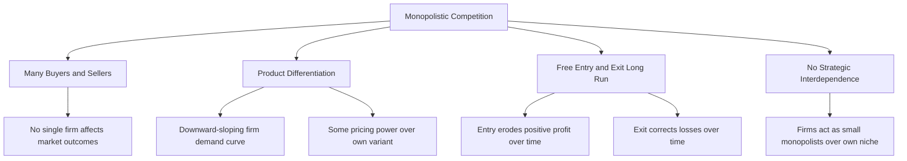

## Characteristics of Monopolistic Competition

### Definition

Monopolistic competition is a market structure characterized by many firms selling differentiated (but similar) products, with relatively free entry and exit in the long run. It combines features of both perfect competition (many sellers, free entry/exit) and monopoly (downward-sloping demand for each firm due to product differentiation), making it a hybrid market structure with its own distinct equilibrium properties.

### The Four Core Defining Characteristics

**1. Many Buyers and Sellers**

The industry contains a relatively large number of independent firms, each supplying only a small share of total market output. As in perfect competition, no single firm's output decision has a perceptible strategic effect on rivals' decisions — firms do not need to consider how competitors will specifically react to their individual pricing or output choices (unlike oligopoly, where strategic interdependence is central).

**2. Product Differentiation**

Each firm sells a product that is similar to, but not identical to, its competitors' products. Differentiation can arise from:

- **Physical/functional differences**: variations in features, ingredients, design, or quality
- **Location**: geographic convenience differentiates otherwise similar retailers or service providers
- **Branding and perceived differences**: marketing, packaging, and brand image can create differentiation even when underlying products are functionally very similar
- **Service and ancillary attributes**: customer service, warranty terms, or shopping experience

Because products are differentiated (imperfect substitutes for one another, rather than perfect substitutes as in perfect competition), each firm faces a **downward-sloping demand curve** — it can raise its price somewhat without losing all its customers to competitors, since some consumers prefer its particular variant enough to pay a premium.

$$\text{Perfect Competition: perfectly elastic (horizontal) firm demand}$$

$$\text{Monopolistic Competition: downward-sloping, but relatively elastic firm demand}$$

**3. Free Entry and Exit in the Long Run**

As in perfect competition, there are no significant barriers preventing new firms from entering the industry (with a differentiated variant of the product) when incumbents earn positive economic profit, or exiting when incumbents suffer losses. This free entry/exit condition, combined with product differentiation, produces the distinctive long-run equilibrium properties of the model (detailed separately in the long-run equilibrium topic).

**4. Independent Decision-Making (No Strategic Interdependence)**

Despite facing a downward-sloping demand curve like a monopolist, each monopolistically competitive firm is assumed to set its price and output without needing to predict or react to the specific pricing decisions of any individual rival — this is sometimes summarized as firms behaving as "small monopolists" over their own differentiated product niche, in contrast to oligopoly, where a small number of firms must explicitly account for rivals' likely reactions.

### Diagram: Where Monopolistic Competition Sits Among Market Structures

<svg xmlns="http://www.w3.org/2000/svg" viewBox="0 0 720 380" font-family="Helvetica, Arial, sans-serif">
<text x="360" y="24" text-anchor="middle" font-size="16" font-weight="bold" fill="#1a1a1a">The Spectrum of Market Structures (svg_diagram)</text>
<line x1="80" y1="200" x2="640" y2="200" stroke="#333" stroke-width="2" />
<polygon points="640,200 625,192 625,208" fill="#333" />
<text x="360" y="230" text-anchor="middle" font-size="12" fill="#333">Increasing Market Power / Decreasing Number of Firms →</text>

<circle cx="120" cy="200" r="8" fill="#27ae60" />
<text x="120" y="170" text-anchor="middle" font-size="12" font-weight="bold" fill="#27ae60">Perfect Competition</text>
<text x="120" y="255" text-anchor="middle" font-size="10" fill="#333">Many firms</text>
<text x="120" y="270" text-anchor="middle" font-size="10" fill="#333">Homogeneous product</text>
<text x="120" y="285" text-anchor="middle" font-size="10" fill="#333">Price taker</text>

<circle cx="290" cy="200" r="8" fill="#2980b9" />
<text x="290" y="170" text-anchor="middle" font-size="12" font-weight="bold" fill="#2980b9">Monopolistic Competition</text>
<text x="290" y="255" text-anchor="middle" font-size="10" fill="#333">Many firms</text>
<text x="290" y="270" text-anchor="middle" font-size="10" fill="#333">Differentiated product</text>
<text x="290" y="285" text-anchor="middle" font-size="10" fill="#333">Some price-setting power</text>

<circle cx="470" cy="200" r="8" fill="#e67e22" />
<text x="470" y="170" text-anchor="middle" font-size="12" font-weight="bold" fill="#e67e22">Oligopoly</text>
<text x="470" y="255" text-anchor="middle" font-size="10" fill="#333">Few firms</text>
<text x="470" y="270" text-anchor="middle" font-size="10" fill="#333">Homogeneous or differentiated</text>
<text x="470" y="285" text-anchor="middle" font-size="10" fill="#333">Strategic interdependence</text>

<circle cx="620" cy="200" r="8" fill="#8e44ad" />
<text x="620" y="170" text-anchor="middle" font-size="12" font-weight="bold" fill="#8e44ad">Monopoly</text>
<text x="620" y="255" text-anchor="middle" font-size="10" fill="#333">Single firm</text>
<text x="620" y="270" text-anchor="middle" font-size="10" fill="#333">Unique product</text>
<text x="620" y="285" text-anchor="middle" font-size="10" fill="#333">Full pricing power (within demand)</text>
</svg>

**How to read this diagram:** Monopolistic competition sits between perfect competition and oligopoly on the spectrum of market power — it shares perfect competition's large firm count and free entry/exit, but shares monopoly's downward-sloping firm-level demand curve (though typically far more elastic than a true monopolist's, given the availability of close, though imperfect, substitutes).

### Mermaid Diagram: Characteristics Overview

### Firm-Level Demand Curve: Why It Slopes Downward but Is Relatively Elastic

Because a monopolistically competitive firm's product has close substitutes (other firms' differentiated variants), a price increase by one firm causes some, but not all, of its customers to switch to competing variants. This produces a demand curve that is:

- **Downward sloping**: unlike a perfectly competitive firm's horizontal demand curve, since the firm's own price affects the quantity it can sell.
- **Relatively (but not perfectly) elastic**: much flatter than a true monopolist's demand curve, because close substitutes exist. The precise degree of elasticity depends on how strongly consumers perceive the firm's variant as differentiated from rivals — the more distinctive the product feels to consumers, the steeper (more inelastic) the firm's own demand curve becomes.

$$|\epsilon_{d, \text{perfect competition}}| = \infty \; > \; |\epsilon_{d, \text{monopolistic competition}}| \; > \; |\epsilon_{d, \text{monopoly}}|$$

### Two Demand Curves: "d" (Perceived) vs. "D" (Actual)

A subtlety specific to monopolistic competition, important for understanding both short-run and long-run analysis, is the distinction between two related but different demand curves facing each firm:

- **The perceived (or "d") demand curve**: the demand curve the firm believes it faces, holding all *rivals'* prices constant — this is the curve relevant to the individual firm's own profit-maximizing pricing decision at a point in time.
- **The actual (or "D") demand curve**: traces out what happens to the firm's sales as *all firms in the industry* (including the firm itself) simultaneously adjust their prices together — for instance, if the whole industry raises prices in response to entry, exit, or a common cost shock. This curve is generally steeper (less elastic) than the perceived curve, since all rivals' prices are moving together rather than the firm assuming rivals hold still.

$$d \text{ (perceived): relatively flat, rivals' prices held fixed}$$

$$D \text{ (actual): relatively steep, all firms' prices move together}$$

**[Unverified — an important but sometimes omitted refinement in introductory treatments]** This $d$/$D$ distinction is central to a fully rigorous graphical treatment of long-run equilibrium adjustment in monopolistic competition, since a firm may believe it can increase profit by moving along its perceived demand curve $d$, but if all firms attempt the same move simultaneously, actual outcomes trace along the steeper $D$ curve instead — this is a key mechanism explaining how the long-run zero-profit equilibrium is reached even though each individual firm continues to perceive a (locally) profitable-seeming demand curve.

### Diagram: Perceived vs. Actual Demand Curve

<svg xmlns="http://www.w3.org/2000/svg" viewBox="0 0 700 400" font-family="Helvetica, Arial, sans-serif">
<text x="350" y="24" text-anchor="middle" font-size="16" font-weight="bold" fill="#1a1a1a">Perceived (d) vs. Actual (D) Demand (svg_diagram)</text>
<line x1="80" y1="350" x2="620" y2="350" stroke="#333" stroke-width="2" />
<line x1="80" y1="350" x2="80" y2="60" stroke="#333" stroke-width="2" />
<text x="630" y="355" font-size="13" fill="#333">Q</text>
<text x="65" y="55" font-size="13" fill="#333">P</text>

<line x1="150" y1="120" x2="450" y2="330" stroke="#c0392b" stroke-width="2.5" />
<text x="455" y="335" font-size="12" fill="#c0392b" font-weight="bold">D (actual, all firms move together)</text>

<line x1="180" y1="150" x2="520" y2="280" stroke="#2980b9" stroke-width="2.5" />
<text x="525" y="285" font-size="12" fill="#2980b9" font-weight="bold">d (perceived, rivals fixed)</text>

<circle cx="330" cy="215" r="5" fill="#2c3e50" />
<text x="335" y="210" font-size="11" fill="#2c3e50">Initial price-quantity point</text>
</svg>

**How to read this diagram:** At the current price, the firm's perceived demand curve $d$ (flatter) is what the firm uses for its own pricing decision. But if the firm raises price and all rivals do too (as happens during industry-wide adjustment), actual sales trace along the steeper $D$ curve — the firm sells less than it would have expected from $d$ alone, because rivals did not, in fact, hold their prices fixed.

### Comparative Summary Table

| Feature | Perfect Competition | Monopolistic Competition | Monopoly |
| --- | --- | --- | --- |
| Number of firms | Very many | Many | One |
| Product | Homogeneous | Differentiated | Unique (no close substitute) |
| Firm demand curve | Perfectly elastic (horizontal) | Downward sloping, relatively elastic | Downward sloping, entire market demand |
| Price vs. MR | $P = MR$ | $P > MR$ | $P > MR$ |
| Entry/exit barriers | None | None (or very low) | High (by definition) |
| Long-run economic profit | Zero | Zero | Can be positive |
| Pricing power | None | Some (limited by substitutes) | Full (within demand constraint) |

### Non-Price Competition

Because monopolistically competitive firms compete partly on product differentiation rather than price alone, **non-price competition** plays a substantial role in this market structure — firms invest in advertising, branding, product quality improvements, packaging, and customer service to differentiate their offering and shift/steepen their perceived demand curve, rather than competing purely by lowering price. This is a notable contrast with perfect competition, where product homogeneity leaves firms with no scope for such differentiation-based strategies, and with pure monopoly, where the absence of rivals reduces (though does not eliminate) the strategic need for such differentiation.

### Real-World Examples Commonly Cited

**[Unverified — illustrative, commonly-cited textbook examples rather than a rigorously verified industry classification]** Industries frequently used to illustrate monopolistic competition include restaurants, hair salons and personal services, clothing and apparel retailers, and consumer products with strong branding (where many firms sell functionally similar goods but differentiate through brand identity, location, or perceived quality). Whether any specific real-world industry precisely satisfies all four theoretical characteristics (in particular, perfectly free entry/exit) is, as with most stylized market-structure models, a matter of degree rather than an exact real-world match.

### Common Misconceptions

- Students sometimes conflate monopolistic competition with oligopoly because both involve product differentiation. The key distinguishing feature is firm count and strategic behavior: monopolistic competition assumes *many* firms with *no* strategic interdependence, while oligopoly involves a *small* number of firms that explicitly account for rivals' likely reactions.
- A common error is assuming a downward-sloping firm demand curve automatically implies substantial market power comparable to monopoly. In monopolistic competition, this demand curve is typically much more elastic than a true monopolist's, precisely because differentiated but close substitutes are widely available from many competing firms.
- Confusing product differentiation with a barrier to entry. Product differentiation affects the *shape* of each firm's demand curve (giving it some downward slope), but it does not, by the core assumptions of this model, prevent new firms from entering with their *own* differentiated variant — entry remains free, unlike in models with genuine differentiation-based entry barriers (e.g., extremely strong brand loyalty or network effects, which would push the model closer to monopoly or oligopoly).

### Related Topics

- Short-run equilibrium in monopolistic competition
- Long-run equilibrium and excess capacity in monopolistic competition
- Non-price competition, advertising, and product differentiation strategies
- Comparing monopolistic competition to perfect competition: welfare implications
- Oligopoly and strategic interdependence
- Monopoly demand and marginal revenue
- The perceived (d) vs. actual (D) demand curve distinction in equilibrium adjustment