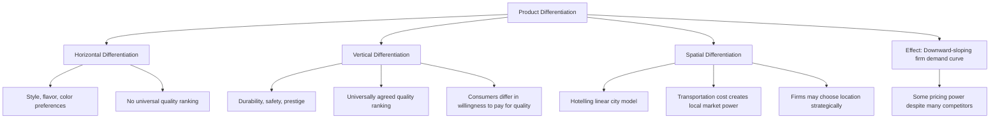

## Product Differentiation

### Definition

Product differentiation is the practice by which firms make their goods or services distinct from competitors' offerings — through physical characteristics, location, branding, perceived quality, or ancillary services — so that consumers view the product as an imperfect rather than perfect substitute for rivals' products. It is the defining structural feature that gives monopolistically competitive firms a downward-sloping (rather than perfectly elastic) demand curve, and it is the primary mechanism through which firms compete on dimensions other than price.

### Why Product Differentiation Matters Economically

In a market with a homogeneous (undifferentiated) product, as in perfect competition, consumers are indifferent between suppliers, so the firm's demand curve is perfectly elastic — any price increase above the market price loses all customers instantly to competitors offering the identical product. Product differentiation breaks this perfect substitutability: because at least some consumers have a genuine or perceived preference for one firm's particular variant, that firm retains some customers even at a somewhat higher price than competitors charge.

$$\text{Homogeneous product: } |\epsilon_d| \to \infty \quad \text{(perfectly elastic)}$$

$$\text{Differentiated product: } |\epsilon_d| \text{ finite and typically much smaller}$$

This is the direct mechanism by which product differentiation translates into a firm's ability to exercise at least some pricing power — the less perfect the substitutability perceived by consumers, the steeper (more inelastic) the firm's own demand curve becomes, and the greater its scope to set price above marginal cost.

### Types of Product Differentiation

**1. Horizontal Differentiation**

Products differ along a dimension where no single variant is objectively "better" for all consumers — different consumers simply have different preferences over the available variants, and these preferences are not correlated with income or willingness to pay in a systematic way. Examples include differences in flavor, style, color, or location (a coffee shop closer to one's home is horizontally differentiated from one farther away, for a given consumer, independent of price or quality).

**2. Vertical Differentiation**

Products differ along a dimension of quality that (nearly) all consumers agree ranks variants from better to worse, but consumers differ in how much they are willing to pay for the higher-quality option. Examples include differences in durability, safety features, or brand prestige tied to genuinely higher input quality.

**3. Spatial Differentiation**

A special and analytically prominent case of horizontal differentiation, where "location" (either literal geographic location or a location in some abstract characteristic/attribute space) is the relevant dimension of differentiation. Spatial differentiation is commonly modeled using the **Hotelling model**, in which firms are located at different points along a line (representing either physical space or a continuum of product characteristics), and consumers incur a "transportation cost" (literal or figurative) in patronizing a firm located farther from their own ideal point.

### The Hotelling Linear City Model — Illustrative Framework

Consider consumers distributed uniformly along a line of length 1 (representing, for instance, a street, or more abstractly a spectrum of product characteristics such as "sweetness level" in a cereal market). Two firms, A and B, are located at points $x_A$ and $x_B$ along this line. A consumer located at point $x$ incurs a "transportation cost" $t$ per unit of distance to reach their chosen firm, in addition to that firm's price.

**Consumer's total cost of purchasing from firm A:**

$$C_A(x) = P_A + t|x - x_A|$$

**Consumer's total cost of purchasing from firm B:**

$$C_B(x) = P_B + t|x - x_B|$$

Each consumer chooses whichever firm offers the lower total cost. The consumer located exactly indifferent between the two firms, $x^*$, satisfies $C_A(x^*) = C_B(x^*)$, and this indifferent consumer's location determines the market share split between the two firms.

### Diagram: Hotelling Linear City Model

<svg xmlns="http://www.w3.org/2000/svg" viewBox="0 0 700 320" font-family="Helvetica, Arial, sans-serif">
<text x="350" y="24" text-anchor="middle" font-size="16" font-weight="bold" fill="#1a1a1a">Hotelling Linear City Model (svg_diagram)</text>

<line x1="80" y1="180" x2="620" y2="180" stroke="#333" stroke-width="3" />
<text x="70" y="205" font-size="12" fill="#333">0</text>
<text x="620" y="205" font-size="12" fill="#333">1</text>

<circle cx="180" cy="180" r="7" fill="#2980b9" />
<text x="180" y="150" text-anchor="middle" font-size="12" fill="#2980b9" font-weight="bold">Firm A (xA)</text>
<text x="180" y="230" text-anchor="middle" font-size="11" fill="#2980b9">Price PA</text>

<circle cx="480" cy="180" r="7" fill="#c0392b" />
<text x="480" y="150" text-anchor="middle" font-size="12" fill="#c0392b" font-weight="bold">Firm B (xB)</text>
<text x="480" y="230" text-anchor="middle" font-size="11" fill="#c0392b">Price PB</text>

<circle cx="330" cy="180" r="6" fill="#2c3e50" />
<line x1="330" y1="130" x2="330" y2="230" stroke="#888" stroke-dasharray="4,3" />
<text x="330" y="120" text-anchor="middle" font-size="11" fill="#2c3e50">Indifferent consumer x*</text>

<text x="255" y="260" text-anchor="middle" font-size="11" fill="`#2980b9`">← Firm A's market share →</text>

<text x="405" y="260" text-anchor="middle" font-size="11" fill="`#c0392b`">← Firm B's market share →</text>

</svg>

**How to read this diagram:** Consumers to the left of $x^*$ purchase from Firm A; consumers to the right purchase from Firm B. Each firm's market share is the fraction of the total line segment (representing the consumer population) closer to it in total cost terms. Firms can influence $x^*$ (and thus their market share) both by adjusting price and, in an extended version of the model, by choosing their location.

### Numerical Example: Finding the Indifferent Consumer

Suppose $x_A = 0$, $x_B = 1$ (firms located at opposite ends), transportation cost $t = 10$, $P_A = 20$, $P_B = 30$.

**Step 1 — Set up the indifference condition:**

$$P_A + t|x^* - x_A| = P_B + t|x^* - x_B|$$

$$20 + 10x^* = 30 + 10(1 - x^*)$$

**Step 2 — Solve for x*:**

$$20 + 10x^* = 30 + 10 - 10x^*$$

$$20 + 10x^* = 40 - 10x^*$$

$$20x^* = 20$$

$$x^* = 1$$

At these prices, the indifferent consumer is located at the very edge of the line (at Firm B's own location), meaning Firm A captures the entire market — because Firm A's price advantage of $10 fully compensates even the consumer standing right next to Firm B for the full transportation cost of traveling the entire distance ($t \times 1 = 10$) to reach Firm A instead. This illustrates how a sufficiently large price difference can overwhelm the differentiation-based "insulation" firms otherwise enjoy from direct price competition.

**Contrast with smaller price gap:** if instead $P_A = 24$ and $P_B = 26$ (only a $2 difference):

$$24 + 10x^* = 26 + 10(1-x^*)$$

$$24 + 10x^* = 36 - 10x^*$$

$$20x^* = 12$$

$$x^* = 0.6$$

Firm A now serves 60% of the market and Firm B 40% — illustrating that with a smaller price gap, market shares split more evenly around the midpoint, reflecting genuine differentiation-based customer loyalty (transportation cost) rather than one firm capturing the entire market.

### Mermaid Diagram: Types and Mechanisms of Product Differentiation

### Product Differentiation and Advertising

Firms often use advertising as a tool to reinforce or create perceived product differentiation, even when underlying products are functionally very similar. Economists distinguish two broad views on the economic role of advertising in this context:

- **Informative view**: advertising conveys genuinely useful information to consumers (product existence, price, features, availability), reducing search costs and improving the efficiency of consumer choice.
- **Persuasive/differentiating view**: advertising creates or reinforces brand loyalty and perceived (rather than necessarily functional) differentiation, potentially steepening the firm's demand curve and increasing pricing power without changing the underlying physical product at all.

**[Unverified — a long-standing, genuinely unsettled debate in industrial organization]** Which view better describes advertising's economic role in a given market is empirically contested and likely varies substantially by industry and type of advertising; most economists would regard both mechanisms as operating to varying degrees simultaneously rather than treating them as mutually exclusive explanations.

### The Trade-off: Variety Benefits vs. Potential Costs

Product differentiation generates a genuine economic trade-off relevant to welfare analysis of monopolistic competition:

**Benefits of variety:**

- Consumers with heterogeneous preferences can find products closer to their ideal preferences than would be available under a single homogeneous product, increasing consumer surplus through better preference matching.
- Competition on non-price dimensions can spur genuine product improvement and innovation.

**Potential costs:**

- Because each firm operates with some downward-sloping demand and market power, monopolistically competitive equilibrium typically involves firms producing at a quantity below the minimum-efficient-scale point of their average cost curve (the "excess capacity" result, covered in the long-run equilibrium topic), implying some degree of allocative and productive inefficiency relative to the (impractical, given heterogeneous consumer preferences) perfectly competitive benchmark.
- Resources devoted to differentiation and advertising represent a real economic cost; whether this cost is offset by the informational or variety benefits it may also provide is often industry-specific and, again, empirically contested.

### Common Misconceptions

- Students sometimes assume product differentiation is purely a marketing or branding phenomenon with no genuine economic substance. In fact, differentiation frequently corresponds to real differences in physical characteristics, quality, or location that generate genuine, non-arbitrary consumer preferences — branding-based differentiation (where products are functionally near-identical) is one type among several, not the defining case.
- A common error is treating horizontal and vertical differentiation as interchangeable. The key distinction is whether all consumers agree on a quality ranking (vertical) or whether preferences are genuinely heterogeneous with no universal ranking (horizontal) — this distinction matters for how firms compete and how consumer welfare is affected by variety.
- Confusing the Hotelling model's "transportation cost" with literal travel expense only. In most modern applications, the transportation cost represents a general disutility of consuming a product that deviates from one's ideal preference point along some characteristic (not necessarily geographic) dimension — the framework is used to model preference-based differentiation broadly, not merely physical distance.

### Related Topics

- Characteristics of monopolistic competition
- Short-run and long-run equilibrium in monopolistic competition
- Excess capacity theorem in monopolistic competition
- Non-price competition and advertising
- The Hotelling model and spatial competition (extended to oligopoly contexts)
- Monopoly demand and marginal revenue
- Price discrimination as related to differentiated pricing strategies
- Brand loyalty and switching costs in industrial organization