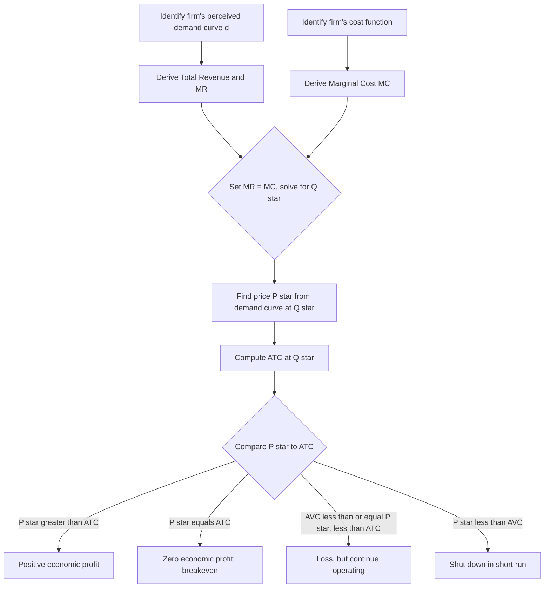

## Short-run Profit Maximization

### Definition

Short-run profit maximization in monopolistic competition describes how an individual firm, facing its own downward-sloping (perceived) demand curve due to product differentiation, chooses price and output to maximize economic profit before the entry or exit of rival firms has had time to occur. Because the number of firms in the industry is fixed in the short run, this analysis closely mirrors monopoly profit maximization at the level of a single firm, applied to its own differentiated-product demand curve.

### The Profit-Maximization Condition

Exactly as with a monopolist, a monopolistically competitive firm maximizes profit where marginal revenue equals marginal cost:

$$MR(Q^*) = MC(Q^*)$$

Because the firm faces a downward-sloping demand curve (due to product differentiation), $MR$ lies below the firm's demand curve at every positive quantity — just as with monopoly — meaning the price the firm charges will exceed marginal cost at the profit-maximizing output.

$$P^* = d(Q^*) > MC(Q^*)$$

where $d(Q)$ denotes the firm's perceived demand curve (holding rivals' prices fixed), which is the relevant curve for its own short-run pricing decision.

### Step-by-Step Procedure

1. Identify the firm's perceived (short-run) demand curve: $P = d(Q)$.
2. Derive total revenue: $TR(Q) = P(Q) \times Q$.
3. Derive marginal revenue: $MR(Q) = \frac{d(TR)}{dQ}$.
4. Derive marginal cost from the firm's cost function: $MC(Q) = \frac{d(TC)}{dQ}$.
5. Set $MR(Q) = MC(Q)$ and solve for $Q^*$.
6. Find price by plugging $Q^*$ into the demand curve (not the $MR$ curve): $P^* = d(Q^*)$.
7. Compare $P^*$ to average total cost $ATC(Q^*)$ to determine whether the firm earns positive economic profit, breaks even, or incurs a loss.

### Diagram: Short-run Profit Maximization in Monopolistic Competition

<svg xmlns="http://www.w3.org/2000/svg" viewBox="0 0 720 480" font-family="Helvetica, Arial, sans-serif">
<text x="360" y="24" text-anchor="middle" font-size="16" font-weight="bold" fill="#1a1a1a">Short-run Profit Maximization (svg_diagram)</text>
<line x1="80" y1="420" x2="680" y2="420" stroke="#333" stroke-width="2" />
<line x1="80" y1="420" x2="80" y2="60" stroke="#333" stroke-width="2" />
<text x="690" y="425" font-size="13" fill="#333">Q</text>
<text x="65" y="55" font-size="13" fill="#333">P, C</text>

<line x1="120" y1="130" x2="600" y2="360" stroke="#2980b9" stroke-width="2.5" />
<text x="605" y="365" font-size="12" fill="#2980b9">d (perceived demand)</text>

<line x1="120" y1="130" x2="360" y2="420" stroke="#e67e22" stroke-width="2.5" />
<text x="365" y="425" font-size="12" fill="#e67e22">MR</text>

<line x1="150" y1="390" x2="550" y2="160" stroke="#c0392b" stroke-width="2.5" />
<text x="555" y="155" font-size="12" fill="#c0392b">MC</text>

<path d="M 170 350 C 250 270, 330 245, 400 250 C 460 255, 520 275, 570 300" fill="none" stroke="`#27ae60`" stroke-width="2.5" />

<text x="575" y="305" font-size="12" fill="`#27ae60`">ATC</text>

<circle cx="290" cy="300" r="5" fill="#2c3e50" />
<line x1="290" y1="300" x2="290" y2="420" stroke="#888" stroke-dasharray="4,3" />
<text x="280" y="435" font-size="12" fill="#333">Q*</text>

<circle cx="290" cy="238" r="5" fill="#2c3e50" />
<line x1="80" y1="238" x2="290" y2="238" stroke="#8e44ad" stroke-dasharray="4,3" />
<text x="45" y="242" font-size="12" fill="#8e44ad">P*</text>

<circle cx="290" cy="252" r="4" fill="#27ae60" />
<line x1="80" y1="252" x2="290" y2="252" stroke="#27ae60" stroke-dasharray="3,3" />
<text x="45" y="256" font-size="10" fill="#27ae60">ATC(Q*)</text>

<rect x="80" y="238" width="210" height="14" fill="#8e44ad" opacity="0.3" />
<text x="100" y="228" font-size="12" fill="#6c3483" font-weight="bold">Economic Profit = (P* − ATC) × Q*</text>
</svg>

**How to read this diagram:** The firm finds $Q^*$ where $MR$ intersects $MC$, then reads price $P^*$ directly above $Q^*$ on its own perceived demand curve $d$. Since $P^* > ATC(Q^*)$ in this diagram, the firm earns positive economic profit in the short run — represented by the shaded rectangle.

### Profit Formula

$$\pi(Q^*) = [P^* - ATC(Q^*)] \times Q^*$$

Three possible short-run outcomes, exactly paralleling the monopoly and competitive-firm cases:

- **$P^* > ATC(Q^*)$**: positive economic profit.
- **$P^* = ATC(Q^*)$**: zero economic profit (breakeven).
- **$AVC(Q^*) \leq P^* < ATC(Q^*)$**: economic loss, but the firm continues to operate in the short run since it covers variable costs (same shutdown logic as competitive and monopoly firms).
- **$P^* < AVC(Q^*)$**: the firm shuts down in the short run.

### Numerical Example

Suppose a monopolistically competitive firm faces the short-run (perceived) demand curve:

$$P = 60 - 2Q$$

and has total cost function:

$$TC(Q) = 100 + 4Q + Q^2$$

**Step 1 — Total Revenue and Marginal Revenue:**

$$TR = PQ = (60-2Q)Q = 60Q - 2Q^2$$

$$MR = \frac{d(TR)}{dQ} = 60 - 4Q$$

**Step 2 — Marginal Cost:**

$$MC = \frac{d(TC)}{dQ} = 4 + 2Q$$

**Step 3 — Set MR = MC and solve for Q*:**

$$60 - 4Q = 4 + 2Q$$

$$56 = 6Q$$

$$Q^* = 9.33$$

**Step 4 — Find price from the demand curve:**

$$P^* = 60 - 2(9.33) = 60 - 18.67 = 41.33$$

**Step 5 — Calculate ATC at Q*:**

$$ATC(Q^*) = \frac{TC(Q^*)}{Q^*} = \frac{100 + 4(9.33) + (9.33)^2}{9.33} = \frac{100 + 37.33 + 87.09}{9.33} = \frac{224.42}{9.33} \approx 24.06$$

**Step 6 — Calculate profit:**

$$\pi = [P^* - ATC(Q^*)] \times Q^* = (41.33 - 24.06) \times 9.33 \approx 17.27 \times 9.33 \approx 161.11$$

Since $P^* (\$41.33) > ATC(Q^*) (\$24.06)$, this firm earns a positive short-run economic profit of approximately $161.11.

### Mermaid Diagram: Short-run Decision Process

### The Crucial Short-run vs. Long-run Distinction

The profit-maximization procedure described here is identical in mechanics to monopoly profit maximization — the key economic difference is that this short-run outcome is **not sustainable** in the long run if positive economic profit is present. Because monopolistic competition assumes free entry and exit (unlike monopoly, which assumes barriers to entry), any positive economic profit earned in the short run, as calculated in the example above, will attract new entrants offering their own differentiated variants of the product.

$$\text{Short-run: } \pi > 0 \text{ is possible} \implies \text{attracts entry} \implies \text{firm's demand curve shifts left over time}$$

This entry process — and its effect on each incumbent firm's perceived demand curve — is the mechanism explored in detail in the long-run equilibrium topic; the short-run analysis presented here represents only a temporary snapshot before that adjustment occurs.

### Why the Firm's Own Price and Output Still Depend on Product Differentiation

Even though the mechanics of $MR = MC$ profit maximization mirror monopoly exactly, the underlying economic source of the firm's downward-sloping demand curve is different: it is not due to being the sole supplier of a unique good (as with true monopoly), but due to the firm's variant being sufficiently differentiated from close substitutes that some consumers are willing to pay a premium rather than switch entirely. The **degree** of this differentiation directly determines how steep (inelastic) the firm's demand curve is, which in turn affects the size of its short-run markup and profit:

$$\text{Stronger differentiation} \implies \text{steeper (less elastic) } d \implies \text{larger markup, } (P^* - MC(Q^*))$$

$$\text{Weaker differentiation} \implies \text{flatter (more elastic) } d \implies \text{smaller markup, closer to } P^* \approx MC(Q^*)$$

### Comparing the Short-run Outcome Across Related Market Structures

| Feature | Perfect Competition (short run) | Monopolistic Competition (short run) | Monopoly (short run) |
| --- | --- | --- | --- |
| Profit condition | $P = MC$ | $MR = MC$ | $MR = MC$ |
| Price vs. MC | $P = MC$ | $P > MC$ | $P > MC$ |
| Can earn positive profit short run? | Yes | Yes | Yes |
| Sustainable into long run? | No (entry erodes it) | No (entry erodes it) | Yes (barriers block entry) |
| Demand curve shape | Perfectly elastic | Downward sloping, relatively elastic | Downward sloping, full market demand |

### Common Misconceptions

- Students frequently assume the short-run profit-maximization process for monopolistic competition must differ mechanically from monopoly because "many firms" are involved. In fact, at the level of the *individual firm's own decision*, the mathematics of $MR = MC$ applied to its own perceived demand curve is identical to a monopolist's decision — the crucial structural difference is what happens *afterward*, through entry and exit, not in the profit-maximizing calculation itself.
- A common error is reading the profit-maximizing price directly from the $MR$ curve rather than the (perceived) demand curve — exactly the same error that arises in monopoly analysis, and equally incorrect here.
- Some students assume any monopolistically competitive firm will always find $P^* > ATC(Q^*)$ in the short run — that is, that positive profit is a certainty. This is not the case; a firm with low demand or high costs may find itself at a loss even before considering long-run entry/exit adjustment, following exactly the same $AVC$-based shutdown logic as any other firm type.

### Related Topics

- Long-run equilibrium and excess capacity in monopolistic competition
- Characteristics of monopolistic competition
- Product differentiation
- Profit maximization under monopoly (identical marginal-analysis mechanics)
- The perceived (d) vs. actual (D) demand curve distinction
- Short-run supply curve of the firm (perfectly competitive benchmark)
- Non-price competition and advertising