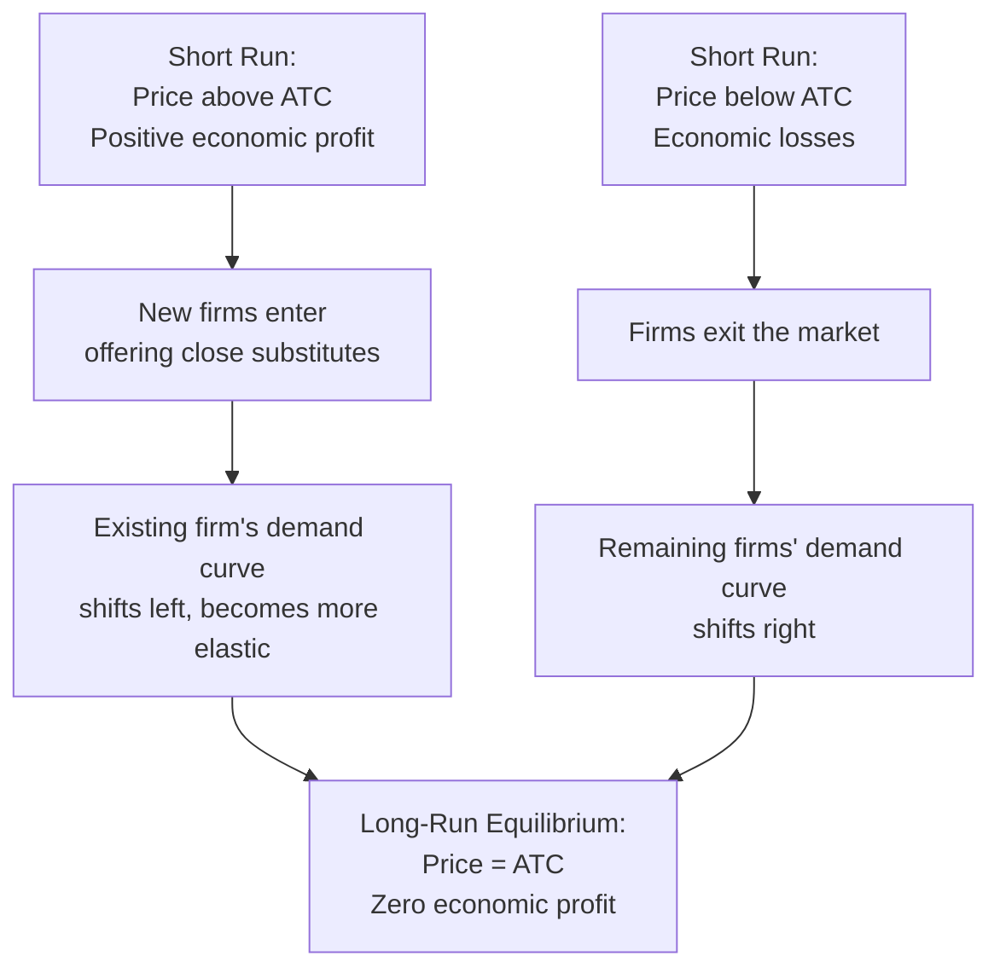

## Long-Run Equilibrium and Excess Capacity

### Definitions

**Long-Run Equilibrium (Monopolistic Competition)**: The state a monopolistically competitive market settles into once free entry and exit have eliminated economic profit — each firm earns zero economic profit, but firms retain some price-setting power due to product differentiation.

**Excess Capacity**: The gap between a firm's profit-maximizing output level and the output level at which its average total cost (ATC) is minimized. In long-run equilibrium under monopolistic competition, firms produce *less* than the output that would minimize ATC.

### Setup: Market Structure Characteristics

**Key Points**

- Many sellers, each producing a differentiated (not identical) product.
- Free entry and exit in the long run.
- Each firm faces a downward-sloping demand curve for its own variant (due to differentiation), unlike the horizontal demand curve of perfect competition.
- Firms have some control over price but face competition from close substitutes.

### Short-Run Position

In the short run, a monopolistically competitive firm behaves like a monopolist for its own brand: it sets output where marginal revenue equals marginal cost ($MR = MC$) and reads price off its demand curve.

$$MR = MC \implies Q^*_{SR}$$

$$P^*_{SR} = D(Q^*_{SR})$$

If $P^*_{SR} > ATC(Q^*_{SR})$, the firm earns positive economic profit in the short run.

### The Adjustment Process: From Short Run to Long Run

**Key Points**

- Positive economic profits attract new entrants offering similar (but not identical) products.
- As new firms enter, the existing firm's product faces more substitutes, so its demand curve shifts **left** (fewer customers at each price) and typically becomes **more elastic** (more substitutes available, so customers respond more to a price change).
- This process continues until economic profit is driven to zero.
- If firms were incurring losses instead, the reverse occurs: firms exit, remaining firms' demand curves shift right, until losses are eliminated.

### Long-Run Equilibrium Conditions

Two conditions hold simultaneously in long-run monopolistically competitive equilibrium:

**1. Profit-maximization condition:**

$$MR(Q^*) = MC(Q^*)$$

**2. Zero-economic-profit (free entry/exit) condition:**

$$P^* = ATC(Q^*)$$

Because the firm's demand curve is downward-sloping (not horizontal), the tangency of the demand curve to the ATC curve at $Q^*$ is what enforces the zero-profit condition — the demand curve touches (is tangent to) the ATC curve at exactly one point, $Q^*$, rather than intersecting it, since if it crossed ATC there would exist a nearby quantity with $P > ATC$, contradicting the equilibrium.

**Long-Run Equilibrium: Demand Tangent to ATC (svg_diagram)**

<svg xmlns="http://www.w3.org/2000/svg" viewBox="0 0 620 420" font-family="sans-serif">
<text x="310" y="24" text-anchor="middle" font-size="16" font-weight="bold">Long-Run Equilibrium: Demand Tangent to ATC (svg_diagram)</text>
<line x1="70" y1="370" x2="590" y2="370" stroke="black" stroke-width="1.5" />
<line x1="70" y1="370" x2="70" y2="60" stroke="black" stroke-width="1.5" />
<text x="600" y="375" font-size="12">Q</text>
<text x="40" y="60" font-size="12">P, Cost</text>

<path d="M 100 320 C 180 180, 280 140, 340 140 S 440 190, 520 300" stroke="#1d4ed8" stroke-width="2.5" fill="none" />
<text x="440" y="180" font-size="12" fill="#1d4ed8">ATC</text>

<path d="M 100 300 C 180 220, 260 150, 340 140 S 420 155, 480 190" stroke="#7c3aed" stroke-width="2.5" fill="none" />
<text x="470" y="180" font-size="12" fill="#7c3aed">MC</text>

<line x1="150" y1="150" x2="450" y2="260" stroke="#dc2626" stroke-width="2.5" />
<text x="455" y="265" font-size="12" fill="#dc2626">Demand (d)</text>

<line x1="150" y1="150" x2="330" y2="330" stroke="#dc2626" stroke-width="1.5" stroke-dasharray="5,3" />
<text x="335" y="330" font-size="12" fill="#dc2626">MR</text>

<circle cx="300" cy="200" r="5" fill="black" />
<text x="230" y="195" font-size="11">Tangency point (Q*, P*)</text>

<line x1="300" y1="200" x2="300" y2="370" stroke="#999" stroke-dasharray="4,4" />
<line x1="300" y1="200" x2="70" y2="200" stroke="#999" stroke-dasharray="4,4" />
<text x="290" y="385" font-size="11">Q*</text>
<text x="45" y="205" font-size="11">P*</text>

<line x1="340" y1="140" x2="340" y2="370" stroke="#16a34a" stroke-dasharray="2,2" />
<text x="345" y="385" font-size="11" fill="#16a34a">Q(min ATC)</text>
</svg>

### Excess Capacity Explained

**Key Points**

- The output level that minimizes ATC (call it $Q_{eff}$, the "efficient scale") occurs where $MC = ATC$ (the bottom of the U-shaped ATC curve).
- Because the firm's demand curve is downward-sloping and tangent to ATC (not vertical/tangent at the ATC minimum), the tangency point $Q^*$ necessarily occurs to the **left** of $Q_{eff}$.
- Therefore: $Q^* < Q_{eff}$ — the firm produces less than the output that would minimize its average cost.

$$\text{Excess Capacity} = Q_{eff} - Q^*$$

**Why this must be true geometrically**: A downward-sloping line can only be tangent to a U-shaped curve on the curve's downward-sloping (left) segment — if it touched the curve at or past its minimum, the line would necessarily cross the curve rather than merely touch it, since the U-shaped curve would be rising while the demand line continues falling. This forces the tangency point to lie strictly left of the ATC minimum.

**Example**

Suppose the ATC-minimizing output for a boutique coffee shop's blend is 500 cups per week. Due to product differentiation, the shop faces a downward-sloping demand curve for its specific blend, and in long-run equilibrium it may only sell 350 cups per week at a price equal to ATC at that quantity. The shop is producing below its efficient scale — it has "excess capacity" of 150 cups per week that it could produce at a lower average cost if it operated at $Q_{eff}$, but doing so would require cutting price below what covers ATC at that higher quantity (since a downward-sloping demand curve means higher quantity requires a lower price).

### Comparison with Perfect Competition

| Feature | Perfect Competition (Long Run) | Monopolistic Competition (Long Run) |
| --- | --- | --- |
| Demand curve facing firm | Horizontal (perfectly elastic) | Downward-sloping |
| Equilibrium condition | $P = MR = MC = ATC_{min}$ | $P = ATC$, but $MR = MC$ at $Q^* < Q_{eff}$ |
| Output relative to efficient scale | Produces at $Q_{eff}$ (minimum ATC) | Produces below $Q_{eff}$ (excess capacity) |
| Economic profit | Zero | Zero |
| Productive efficiency | Yes (produces at minimum ATC) | No (excess capacity — allocative inefficiency relative to minimum-cost production) |
| Product variety | None (homogeneous good) | Yes (differentiated products) |

### Efficiency Interpretation and the Variety Trade-Off

**Key Points**

- The excess capacity result is often cited as evidence that monopolistic competition is less productively efficient than perfect competition, since firms operate with idle capacity relative to their cost-minimizing scale.
- However, mainstream treatments typically note a trade-off: the "inefficiency" of excess capacity may be offset by the **value of product variety** that consumers gain from differentiation — consumers are not forced to consume a single homogeneous good, and many are willing to pay a premium for variety.
- [Inference] Whether the welfare loss from excess capacity outweighs the welfare gain from variety is a normative/empirical question that depends on consumer preferences for differentiation and is not resolved by the basic model alone — the excess capacity theorem describes a cost inefficiency, not necessarily an overall welfare judgment.
- This trade-off is central to why monopolistic competition is not simply classified as "worse" than perfect competition in applied welfare analysis, despite failing the productive efficiency criterion.

### Non-Price Competition in Long-Run Equilibrium

Because price competition alone cannot sustain profit in the long run (entry drives $P = ATC$), monopolistically competitive firms often compete on:

- **Advertising and branding**, to shift and steepen their own demand curve.
- **Product quality and design differentiation.**
- **Location or service differentiation** (e.g., convenience).

[Unverified] The extent to which advertising expenditure itself should be counted as a cost that further reduces allocative efficiency, versus as a source of genuinely valuable information to consumers, is a matter of ongoing debate in industrial organization literature and is not a settled empirical conclusion.

### Common Pitfalls

- Assuming zero economic profit in monopolistic competition implies the same allocative outcome as perfect competition — it does not, because price still exceeds marginal cost ($P^* > MC$ at $Q^*$) even though $P^* = ATC$.
- Confusing "zero economic profit" with "zero accounting profit" — zero economic profit still allows for a normal (opportunity-cost) return on invested capital.
- Assuming excess capacity means the firm is behaving irrationally — the firm is still profit-maximizing at $MR = MC$; excess capacity is a structural feature of equilibrium under downward-sloping demand, not a mistake by the firm.
- Treating the excess-capacity result as proof that monopolistic competition is unambiguously bad for welfare, without accounting for the variety benefit trade-off.

**Related Topics**

- Product Differentiation and Firm Demand Elasticity
- Short-Run Profit Maximization in Monopolistic Competition
- Perfect Competition Long-Run Equilibrium (comparison benchmark)
- Advertising and Non-Price Competition
- Allocative vs. Productive Efficiency
- Free Entry and Exit Dynamics
- Welfare Analysis of Product Variety