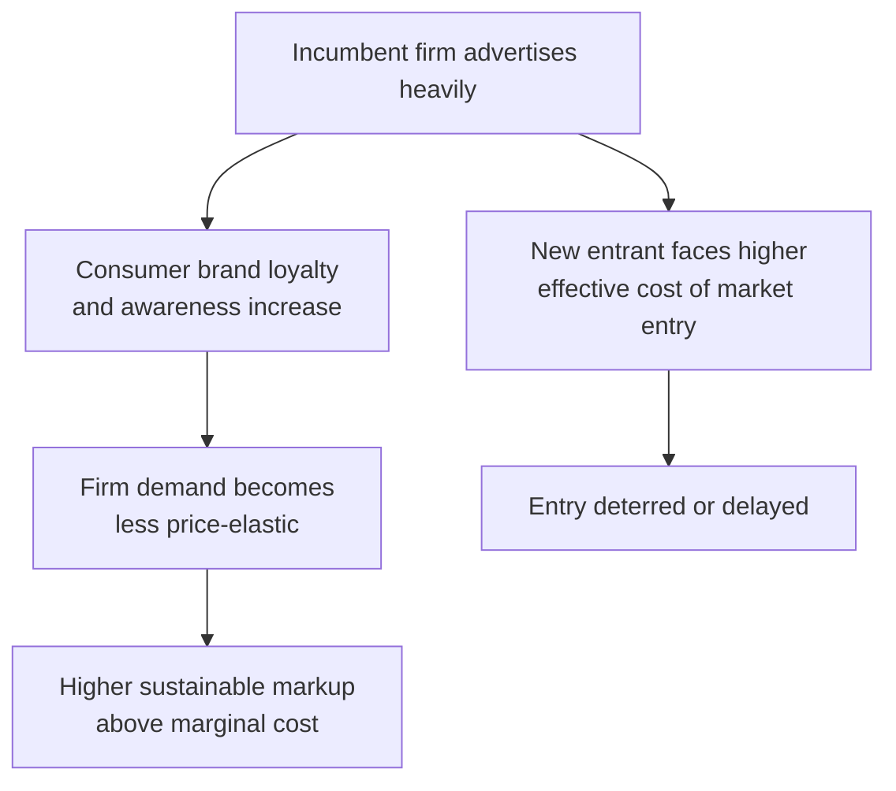

## Advertising and Brand Competition

### Definitions

**Advertising**: Firm expenditure aimed at informing consumers about a product and/or persuading them to prefer it over substitutes, typically used by firms with some degree of market power (monopolistic competition, oligopoly) rather than by price-taking firms in perfect competition.

**Brand Competition**: Rivalry between firms based on perceived product differentiation (real or psychological) rather than solely on price, where brand identity itself becomes a differentiating attribute that can generate consumer loyalty and reduce demand elasticity.

### Why Advertising Arises Under Monopolistic Competition

**Key Points**

- Firms in monopolistic competition face downward-sloping demand curves due to product differentiation, meaning they retain some pricing power.
- Since price competition alone tends to erode profit toward zero in long-run equilibrium (see [[Long-run equilibrium and excess capacity]]), firms seek non-price strategies to sustain or increase profitability.
- Advertising is a primary tool for **demand-curve manipulation**: shifting the firm's demand curve rightward (more sales at each price) and/or making it less elastic (reducing sensitivity to price changes, allowing higher markups).
- Firms in perfect competition (homogeneous goods, price-takers) have little incentive to advertise, since consumers already view all sellers' output as identical substitutes.

### Effect of Advertising on the Firm's Demand and Cost Curves

$$\pi = TR(Q) - TC(Q) - A$$

where $A$ is advertising expenditure, and successful advertising shifts the demand curve $D(P)$ such that $TR(Q)$ rises at each price point, or reduces the price elasticity of demand $\varepsilon_D$.

**Demand Curve Shift from Successful Advertising (svg_diagram)**

<svg xmlns="http://www.w3.org/2000/svg" viewBox="0 0 600 400" font-family="sans-serif">
<text x="300" y="24" text-anchor="middle" font-size="16" font-weight="bold">Demand Curve Shift from Successful Advertising (svg_diagram)</text>
<line x1="70" y1="350" x2="560" y2="350" stroke="black" stroke-width="1.5" />
<line x1="70" y1="350" x2="70" y2="60" stroke="black" stroke-width="1.5" />
<text x="570" y="355" font-size="12">Q</text>
<text x="40" y="60" font-size="12">P</text>
<line x1="120" y1="120" x2="380" y2="300" stroke="#dc2626" stroke-width="2.5" />
<text x="130" y="115" font-size="12" fill="#dc2626">D0 (before advertising)</text>
<line x1="200" y1="100" x2="500" y2="280" stroke="#16a34a" stroke-width="2.5" />
<text x="410" y="270" font-size="12" fill="#16a34a">D1 (after advertising)</text>
<line x1="70" y1="200" x2="500" y2="200" stroke="#999" stroke-dasharray="4,4" />
<text x="45" y="195" font-size="10">P0</text>
<line x1="260" y1="200" x2="260" y2="350" stroke="#999" stroke-dasharray="2,2" />
<line x1="360" y1="200" x2="360" y2="350" stroke="#999" stroke-dasharray="2,2" />
<text x="250" y="365" font-size="10">Q0</text>
<text x="350" y="365" font-size="10">Q1</text>

<text x="150" y="330" font-size="11" fill="#555">More quantity demanded at price P0</text>

</svg>

### Optimal Advertising: The Dorfman-Steiner Condition

**Key Points**

[Confirmed] A standard result in industrial organization economics — the **Dorfman-Steiner condition** — characterizes the profit-maximizing advertising-to-sales ratio for a firm with market power:

$$\frac{A}{PQ} = \frac{\varepsilon_A}{\varepsilon_P}$$

where:

- $A$ = advertising expenditure
- $PQ$ = total revenue
- $\varepsilon_A$ = advertising elasticity of demand (responsiveness of quantity demanded to advertising spending)
- $\varepsilon_P$ = (absolute value of) price elasticity of demand

**Interpretation**: Firms should advertise more (as a share of revenue) when advertising is highly effective at generating sales ($\varepsilon_A$ large) and when demand is relatively price-inelastic ($\varepsilon_P$ small) — the latter condition holding because inelastic demand implies each unit sold contributes more to markup over marginal cost, making the return on generating an additional unit of demand higher.

[Inference] This model assumes advertising's only effect is through elasticities and treats consumer response functions as known and stable, which simplifies away dynamic effects like habit formation, competitor reaction, and diminishing returns to repeated ad exposure — real-world advertising budgeting typically incorporates these additional considerations empirically rather than relying solely on this formula.

### Classifying Advertising: Informative vs. Persuasive

| Type | Function | Economic Effect |
| --- | --- | --- |
| **Informative advertising** | Provides consumers with genuine information about product existence, price, features, or availability | Can improve market efficiency by reducing search costs and enabling better-informed consumer choices; may increase demand elasticity (informed consumers compare more effectively) |
| **Persuasive advertising** | Aims to shape consumer preferences or create a sense of product uniqueness not necessarily grounded in objective differences | Can decrease price elasticity of demand (creates brand loyalty), potentially allowing firms to sustain higher markups above marginal cost |
| **Complementary advertising** | Advertising as a good that is jointly consumed with the product itself (e.g., prestige branding is part of the product experience) | Advertising literally changes the utility derived from consumption, not just information about it |

[Unverified] The empirical weight of informative versus persuasive effects varies substantially by industry, product category, and advertising medium, and is a long-debated question in industrial organization and marketing economics without a single settled resolution across all contexts.

### Advertising as a Barrier to Entry

**Key Points**

- Heavy advertising by incumbent firms can raise the effective cost of entry for new competitors, since a new entrant may need substantial advertising expenditure just to make consumers aware of its existence and to overcome established brand loyalty.
- This can contribute to market concentration even in industries without significant technical economies of scale in production.
- Some economists argue advertising-based barriers are a source of allocative inefficiency (protecting incumbents from competition); others argue advertising can be a legitimate competitive tool that a well-financed entrant can also use, and that established brand loyalty reflects genuine past positive consumer experience rather than an artificial barrier — this is a genuinely contested area in industrial organization theory.

### Brand Loyalty and Price Elasticity

**Key Points**

- Successful brand-building reduces the cross-price elasticity of demand between the branded good and its substitutes — consumers become less willing to switch to a competitor's product even if its price falls.
- This gives the firm greater pricing power: it can raise price with a smaller-than-proportional decline in quantity sold, compared to a less-differentiated competitor.
- Brand equity can also enable **price discrimination** strategies and premium positioning (e.g., charging more for a branded good that is functionally similar to a generic alternative).

**Example**

Two firms sell functionally similar over-the-counter pain relievers. Firm A invests heavily in advertising establishing brand trust and recognition; Firm B sells a generic version at a lower price with minimal advertising. Despite near-identical chemical composition, Firm A can often sustain a higher price because its brand advertising has reduced the perceived substitutability of Firm B's product in the eyes of loyal consumers — this reflects [Inference] a lower cross-price elasticity of demand for Firm A's brand relative to what would exist absent the advertising investment, though the exact magnitude varies by market and is an empirical question in any specific case.

### Advertising Intensity and Market Structure

| Market Structure | Typical Advertising Intensity | Reasoning |
| --- | --- | --- |
| Perfect competition | Very low to none | Homogeneous product; no differentiation to advertise; firms are price-takers |
| Monopolistic competition | Moderate to high | Product differentiation exists and can be reinforced; firms compete on non-price dimensions to sustain markups |
| Oligopoly | Often high, especially with differentiated oligopoly (e.g., consumer branded goods) | Advertising can be a form of non-price competition and strategic rivalry; may also function as a deterrent to entry |
| Monopoly | Can be moderate (demand-building/legitimizing) but no rival-directed motive | No direct competitor to differentiate against, though advertising can still expand overall market demand |

### Welfare and Policy Considerations

**Key Points**

- **Informative advertising** is generally viewed favorably in welfare analysis, as it can reduce consumer search costs and support more competitive markets by enabling comparison.
- **Persuasive advertising** raises more contested welfare questions: critics argue it represents a socially wasteful arms race between rival firms competing to shift consumer preferences, absorbing resources that could otherwise go toward production or price reduction; defenders argue advertising can fund media and content production, convey signal value about firm quality/confidence (a firm investing heavily in advertising for a low-quality product risks the expenditure without repeat purchases), and that consumers ultimately value brand-associated attributes like status or trust.
- [Speculation] Aggregate welfare conclusions about the net social value of advertising expenditure in a given economy depend heavily on assumptions about consumer rationality, the substitutability of goods, and whether advertising is treated as adding genuine utility (via image/status value) or as a pure transfer/rent-seeking cost — this remains one of the more normatively contested areas of industrial organization.

### Common Pitfalls

- Assuming all advertising functions identically — informative and persuasive advertising have different economic effects on elasticity and welfare, and most real advertising blends both to varying degrees.
- Treating advertising expenditure as automatically wasteful; it can improve market information and consumer welfare, particularly in markets with genuine information asymmetry about product existence or attributes.
- Confusing brand loyalty (a demand-side, consumer-preference phenomenon) with switching costs (a distinct concept involving actual transactional or logistical costs of changing suppliers) — both reduce elasticity but through different mechanisms.
- Applying the Dorfman-Steiner condition as a literal real-world budgeting formula without accounting for the model's simplifying assumptions about known, stable elasticities.

**Related Topics**

- Long-Run Equilibrium and Excess Capacity
- Product Differentiation Strategies
- Price Elasticity of Demand
- Barriers to Entry
- Oligopoly and Non-Price Competition
- Signaling and Asymmetric Information
- Price Discrimination