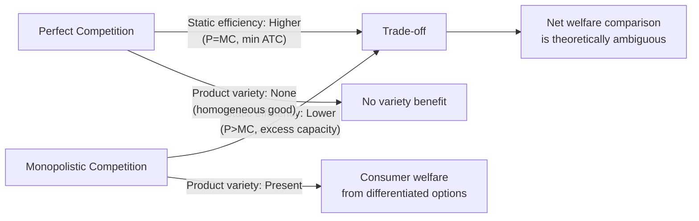

## Efficiency Comparisons with Perfect Competition

### Definitions

**Productive (Technical) Efficiency**: A firm produces at the minimum point of its average total cost (ATC) curve, i.e., at the output level where $ATC = MC$ and average cost is minimized for the given technology.

**Allocative Efficiency**: Resources are allocated such that price equals marginal cost ($P = MC$), meaning the value consumers place on the last unit produced (reflected in price) exactly equals the marginal resource cost of producing it — no reallocation of resources could make someone better off without making someone else worse off (a Pareto-efficient outcome in the relevant market).

**Dynamic Efficiency**: The rate at which an industry generates innovation, product improvement, and cost-reducing technological progress over time — a longer-run efficiency concept not captured by static productive/allocative efficiency analysis.

### Framework for Comparison

The two market structures are compared along the same long-run equilibrium logic (zero economic profit via free entry/exit) but differ critically in the shape of the demand curve each firm faces.

| Criterion | Perfect Competition (Long Run) | Monopolistic Competition (Long Run) |
| --- | --- | --- |
| Demand curve facing the firm | Horizontal (perfectly elastic, $P = MR$) | Downward-sloping (imperfectly elastic) |
| Profit-max condition | $MR = MC \Rightarrow P = MC$ | $MR = MC$, but $P > MC$ |
| Zero-profit condition | $P = ATC_{min}$ | $P = ATC$, but not at $ATC_{min}$ |
| Productive efficiency | Yes — produces at $ATC_{min}$ | No — produces below $ATC_{min}$ output (excess capacity) |
| Allocative efficiency | Yes — $P = MC$ | No — $P > MC$ |
| Product homogeneity | Identical products across firms | Differentiated products |
| Product variety | None | Yes |

### Productive Efficiency Comparison

**Perfect Competition**: In long-run equilibrium, entry continues until $P = ATC_{min}$, which coincides with $MC = ATC_{min}$. The horizontal (perfectly elastic) demand curve is tangent to the ATC curve exactly at its minimum point, since a horizontal line can only be tangent to a U-shaped curve where that curve is also flat — i.e., at the ATC minimum.

**Monopolistic Competition**: The firm's downward-sloping demand curve is tangent to ATC at a point to the **left** of the ATC minimum (see [[Long-run equilibrium and excess capacity]] for the full derivation). This is the source of the **excess capacity** result:

$$Q^*_{MC} < Q_{eff} \quad \text{where } Q_{eff} = \arg\min ATC(Q)$$

**Productive Efficiency Comparison (svg_diagram)**

<svg xmlns="http://www.w3.org/2000/svg" viewBox="0 0 700 420" font-family="sans-serif">
<text x="350" y="24" text-anchor="middle" font-size="16" font-weight="bold">Productive Efficiency Comparison (svg_diagram)</text>

<line x1="50" y1="370" x2="330" y2="370" stroke="black" stroke-width="1.5" />
<line x1="50" y1="370" x2="50" y2="70" stroke="black" stroke-width="1.5" />
<text x="150" y="60" text-anchor="middle" font-size="13" font-weight="bold">Perfect Competition</text>
<text x="335" y="375" font-size="11">Q</text>
<path d="M 80 330 C 140 190, 200 150, 240 150 S 300 190, 320 280" stroke="#1d4ed8" stroke-width="2.5" fill="none" />
<text x="250" y="140" font-size="11" fill="#1d4ed8">ATC</text>
<line x1="60" y1="150" x2="320" y2="150" stroke="#dc2626" stroke-width="2.5" />
<text x="270" y="145" font-size="11" fill="#dc2626">D = MR = P</text>
<circle cx="240" cy="150" r="5" fill="black" />
<line x1="240" y1="150" x2="240" y2="370" stroke="#999" stroke-dasharray="3,3" />
<text x="215" y="385" font-size="10">Q = ATC_min</text>
<text x="245" y="130" font-size="10">Tangent at minimum</text>

<line x1="390" y1="370" x2="670" y2="370" stroke="black" stroke-width="1.5" />
<line x1="390" y1="370" x2="390" y2="70" stroke="black" stroke-width="1.5" />
<text x="500" y="60" text-anchor="middle" font-size="13" font-weight="bold">Monopolistic Competition</text>
<text x="675" y="375" font-size="11">Q</text>
<path d="M 420 330 C 480 190, 540 150, 580 150 S 640 190, 660 280" stroke="#1d4ed8" stroke-width="2.5" fill="none" />
<text x="590" y="140" font-size="11" fill="#1d4ed8">ATC</text>
<line x1="450" y1="130" x2="640" y2="240" stroke="#dc2626" stroke-width="2.5" />
<text x="590" y="235" font-size="11" fill="#dc2626">D (downward-sloping)</text>
<circle cx="520" cy="178" r="5" fill="black" />
<line x1="520" y1="178" x2="520" y2="370" stroke="#999" stroke-dasharray="3,3" />
<line x1="580" y1="150" x2="580" y2="370" stroke="#16a34a" stroke-dasharray="2,2" />
<text x="490" y="385" font-size="10">Q*</text>
<text x="585" y="385" font-size="10" fill="#16a34a">Q_eff</text>
<text x="410" y="200" font-size="10" fill="#dc2626">Excess capacity gap</text>
</svg>

### Allocative Efficiency Comparison

**Perfect Competition**: $P = MR = MC$ in equilibrium. Price reflects both the marginal value consumers place on the good and the marginal cost of producing it — no deadweight loss exists at the market-clearing quantity.

**Monopolistic Competition**: Because $MR < P$ for a firm facing a downward-sloping demand curve, and the firm sets $MR = MC$, it follows that:

$$P^* > MC(Q^*)$$

This is formally identical to the source of deadweight loss in a standard monopoly diagram, though the effect is smaller in magnitude in monopolistic competition because demand for any single firm's product is relatively elastic (many close substitutes exist).

$$\text{Markup} = \frac{P - MC}{P} = \frac{1}{|\varepsilon_D|}$$

(the Lerner Index, showing markup as inversely related to the elasticity of demand facing the firm — greater differentiation typically reduces $|\varepsilon_D|$, permitting a larger markup)

### Why the Gap Is Typically Smaller Than Under Monopoly

**Key Points**

- Free entry in monopolistic competition means new firms continually enter to compete away supernormal profits, unlike monopoly where entry barriers persist.
- The presence of many close substitutes keeps each firm's demand curve relatively elastic even though it is downward-sloping, which — via the Lerner Index relationship — limits how far $P$ can exceed $MC$ compared to a single-firm monopolist facing much less elastic market demand.
- [Inference] The precise magnitude of the efficiency gap in any real differentiated-product market is an empirical question dependent on the actual cross-price elasticities between competing brands, which vary substantially by industry and cannot be inferred from the theoretical model alone.

### The Variety Trade-Off: Reframing the Efficiency Comparison

**Key Points**

- Textbook static efficiency analysis (productive + allocative) unambiguously favors perfect competition's outcome over monopolistic competition's.
- However, this comparison holds product characteristics fixed and ignores that monopolistic competition generates **product variety** that perfect competition (by definition, with homogeneous goods) cannot.
- Consumers may derive genuine utility from having differentiated options (different flavors, styles, locations, quality tiers) even at a cost of some productive/allocative inefficiency per firm.
- The relevant welfare question becomes: does the marginal consumer surplus gained from additional variety exceed the deadweight loss and excess-capacity cost of monopolistic competition? [Speculation] This trade-off cannot be resolved in the abstract and depends on how strongly consumers in a specific market value variety relative to lower prices — different economists and different empirical contexts can reach different conclusions on this question.

### Dynamic Efficiency Considerations

**Key Points**

- Perfect competition's assumption of homogeneous products and free information leaves little incentive or ability for firms to innovate on product characteristics (there is nothing to differentiate).
- Monopolistic competition's retained (temporary) profit opportunities and product differentiation incentive may support more innovation in product design, marketing, and quality improvement than perfect competition, though firms lack the sustained supernormal profits that some theories (e.g., Schumpeterian competition arguments) suggest are needed to fund large-scale R&D.
- [Unverified] Empirical evidence on whether monopolistically competitive industries systematically innovate more or less than perfectly competitive ones is mixed and highly dependent on the specific industry studied; no general theoretical conclusion definitively ranks the two structures on dynamic efficiency alone.

### Summary Table: Full Efficiency Comparison

| Efficiency Type | Perfect Competition | Monopolistic Competition |
| --- | --- | --- |
| Productive efficiency | Achieved ($Q = ATC_{min}$) | Not achieved (excess capacity) |
| Allocative efficiency | Achieved ($P = MC$) | Not achieved ($P > MC$) |
| Economic profit (long run) | Zero | Zero |
| Product variety | None | Present |
| Consumer choice | Limited to price/quantity | Includes product characteristics |
| Dynamic/innovation incentive | Limited (no differentiation motive) | Present (differentiation and variety motive) |
| Overall welfare ranking | Higher under strict static efficiency criteria | Ambiguous once variety value is included |

### Common Pitfalls

- Concluding that monopolistic competition is unambiguously "worse" for society simply because it fails the productive and allocative efficiency tests that perfect competition passes — this ignores the value of product variety, which is a real component of consumer welfare not captured in the basic $P$ vs. $MC$ comparison.
- Assuming the markup ($P - MC$) under monopolistic competition is comparable in size to a standard monopoly markup — it is typically much smaller due to the high number of close substitutes keeping firm-level demand relatively elastic.
- Treating perfect competition as a realistic benchmark for policy in industries where product differentiation is a genuine feature of consumer demand (e.g., restaurants, retail, consumer branded goods) — the relevant real-world comparison is often between monopolistic competition and oligopoly, not between monopolistic competition and an idealized homogeneous-good market that may not be achievable given genuine underlying product heterogeneity.
- Forgetting that both models assume free entry and exit are the mechanism driving the zero-economic-profit long-run outcome; the difference in efficiency stems purely from the shape of the demand curve each type of firm faces, not from a difference in the competitive discipline of free entry itself.

**Related Topics**

- Long-Run Equilibrium and Excess Capacity
- Advertising and Brand Competition
- Lerner Index and Markup Pricing
- Deadweight Loss Under Imperfect Competition
- Product Differentiation and Variety
- Perfect Competition Long-Run Equilibrium
- Schumpeterian Competition and Innovation