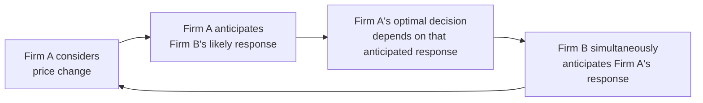

## Characteristics of Oligopoly

### Definition

**Oligopoly**: A market structure characterized by a small number of firms whose individual actions (pricing, output, advertising, product decisions) significantly affect one another, creating **strategic interdependence** — each firm must consider rivals' likely reactions when making decisions, unlike in perfect competition or monopolistic competition where individual firms are too small to affect market-wide outcomes.

### Core Defining Characteristics

**Key Points**

**1. Few Sellers (Small Number of Firms)**

- The market is dominated by a small number of large firms, though the exact threshold ("few") is not rigidly defined and varies by context.
- Market concentration is often measured using the **Concentration Ratio** (e.g., $CR_4$ = combined market share of the four largest firms) or the **Herfindahl-Hirschman Index (HHI)**:

$$HHI = \sum_{i=1}^{n} s_i^2$$

where $s_i$ is the market share (as a percentage) of firm $i$. A higher HHI indicates greater concentration. [Unverified] Specific numerical thresholds used to classify a market as an oligopoly for antitrust purposes vary by jurisdiction and regulatory body, so no single universal cutoff applies across all contexts.

**2. Strategic Interdependence**

- The defining behavioral feature of oligopoly: each firm's optimal decision depends on what it expects rivals to do, and rivals' decisions depend on what they expect the firm to do.
- This mutual dependence distinguishes oligopoly from perfect competition and monopolistic competition, where firms are price-takers or too numerous for individual rival reactions to matter.
- Firms must anticipate reactions before acting — this is the foundation for applying **game theory** to oligopoly analysis.

**3. Barriers to Entry**

- Significant barriers typically protect incumbent oligopolists from new entrants, allowing supernormal (economic) profits to persist in the long run — unlike perfect competition or monopolistic competition, where free entry erodes profit to zero.
- Common sources of barriers include:
  - **Economies of scale**: high minimum efficient scale relative to market size (see [[Economies and diseconomies of scale]])
  - **High capital/start-up costs**: large upfront investment required (e.g., automobile manufacturing, telecommunications infrastructure)
  - **Legal barriers**: patents, licenses, regulatory approval requirements
  - **Control of essential inputs or distribution channels**
  - **Brand loyalty and advertising**: established incumbents' marketing investments raise the effective cost of entry (see [[Advertising and brand competition]])
  - **Network effects**: products/services that become more valuable as more users adopt them, favoring incumbents with an existing user base

**4. Product Differentiation May or May Not Exist**

- Oligopoly can involve either:
  - **Homogeneous (pure) oligopoly**: identical or near-identical products (e.g., commodity-like industries such as steel or cement)
  - **Differentiated oligopoly**: branded, distinguishable products (e.g., automobiles, smartphones, soft drinks)
- [Inference] The degree of differentiation affects the intensity and type of competition observed — homogeneous oligopolies tend to compete more directly on price (with a stronger risk of price wars), while differentiated oligopolies often compete more on branding, features, and advertising, though real-world firms frequently blend both strategies depending on context.

**5. Mutual Interdependence in Pricing and Output**

- Because firms are few, a price cut or output expansion by one firm is large enough relative to total market size to noticeably affect rivals' sales and profits, provoking a strategic response.
- This interdependence is a key reason oligopoly prices often exhibit "stickiness" — firms may be reluctant to change prices frequently because of uncertainty about how rivals will react (see the kinked demand curve model as one theoretical explanation).

**6. Potential for Both Competition and Collusion**

- Firms may compete vigorously (price wars, advertising battles, innovation races) or may seek to coordinate behavior (explicit collusion via cartels, or tacit collusion/parallel behavior) to jointly restrict output and raise prices closer to monopoly levels.
- Explicit collusion (price-fixing agreements) is illegal under antitrust/competition law in most jurisdictions; tacit coordination (parallel pricing without direct communication) occupies a legally and economically more ambiguous middle ground.

### Comparison Across Market Structures

| Feature | Perfect Competition | Monopolistic Competition | Oligopoly | Monopoly |
| --- | --- | --- | --- | --- |
| Number of firms | Many | Many | Few | One |
| Product type | Homogeneous | Differentiated | Homogeneous or differentiated | Unique (no close substitutes) |
| Barriers to entry | None | Low | Significant | Very high / total |
| Firm interdependence | None (price-taker) | Minimal | High (strategic) | Not applicable (no rivals) |
| Long-run economic profit | Zero | Zero | Can be positive | Can be positive |
| Price-setting ability | None | Some (limited by substitutes) | Significant (constrained by rivals) | Full (constrained by demand) |
| Relevant analytical tool | Supply and demand | Monopolistic competition model | Game theory | Monopoly profit-maximization model |

### Measuring Concentration: Illustrative Example

**Example**

Consider an industry with the following market shares: Firm A = 35%, Firm B = 25%, Firm C = 20%, Firm D = 10%, remaining firms = 10% combined.

$CR_4 = 35 + 25 + 20 + 10 = 90\%$ — a high concentration ratio, indicating an oligopolistic structure.

$$HHI = 35^2 + 25^2 + 20^2 + 10^2 + (\text{shares of remaining firms})^2 \approx 1225 + 625 + 400 + 100 + \dots \approx 2350+$$

[Unverified] Regulatory classification thresholds for HHI (e.g., "moderately concentrated" vs. "highly concentrated") differ by jurisdiction and are periodically revised, so any specific numeric threshold cited should be checked against the current relevant regulatory guidelines rather than treated as a fixed universal rule.

### Behavioral Models Associated with Oligopoly

**Key Points**

Because no single model universally describes oligopoly behavior (unlike the single $MR=MC$ rule in monopoly or perfect competition), several distinct theoretical frameworks are used depending on assumed firm conduct:

- **Cournot model**: firms compete by simultaneously choosing output quantities, assuming rivals' quantities are fixed.
- **Bertrand model**: firms compete by simultaneously choosing prices, assuming rivals' prices are fixed.
- **Stackelberg model**: firms move sequentially, with a leader firm choosing output first and a follower reacting.
- **Kinked demand curve model**: explains price rigidity by assuming rivals match price cuts but not price increases.
- **Cartel/collusion models**: analyze coordinated output restriction to maximize joint industry profit, and the incentive problems (cheating) that can destabilize such arrangements.

[Inference] The appropriate model to apply depends heavily on the specific institutional and strategic context of the industry in question (e.g., whether firms compete primarily on price or on capacity/output, whether moves are simultaneous or sequential) — there is no single "correct" oligopoly model that applies universally across all real-world markets.

### Real-World Examples of Oligopolistic Industries

[Inference] Industries commonly cited as oligopolistic due to high concentration and significant barriers to entry include commercial aircraft manufacturing, wireless telecommunications carriers, and integrated steel production in many national markets — though the precise degree of concentration and competitive dynamics can shift over time with regulatory changes, technological disruption, or new entrants, so any specific current classification should be verified against up-to-date market data rather than assumed static.

### Common Pitfalls

- Assuming oligopoly always implies collusion — many oligopolistic industries are intensely competitive (e.g., price wars, R&D races) rather than coordinated.
- Treating "few firms" as a precise numerical threshold — there is no universally agreed cutoff (e.g., exactly 3, 4, or 5 firms) that defines oligopoly; it is better understood via the qualitative criterion of strategic interdependence combined with concentration measures like $CR_4$ or HHI.
- Confusing oligopoly with monopolistic competition — the key distinguishing feature is strategic interdependence (each firm's decisions meaningfully affect and are affected by specific rivals), which is largely absent in monopolistic competition due to the larger number of firms.
- Assuming all oligopolies behave identically — the appropriate model (Cournot, Bertrand, Stackelberg, kinked demand, cartel) depends on the specific strategic variable and timing structure relevant to that industry.

**Related Topics**

- Cournot and Bertrand Competition Models
- Stackelberg Leadership Model
- Kinked Demand Curve and Price Rigidity
- Cartels, Collusion, and the Prisoner's Dilemma
- Game Theory and Nash Equilibrium
- Concentration Ratios and the Herfindahl-Hirschman Index
- Barriers to Entry