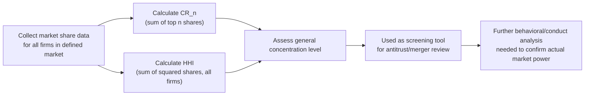

## Concentration Ratios and Measuring Market Power

### Definitions

**Market Concentration**: The extent to which total output or sales in an industry are accounted for by a small number of firms — a structural indicator used as a proxy for the degree of competition (or lack thereof) in a market.

**Market Power**: A firm's ability to profitably set price above marginal cost (or above the competitive level) without immediately losing all its customers to rivals — the behavioral outcome that concentration measures attempt to predict or approximate.

**Key distinction**: Concentration is a *structural* measure (based on market shares); market power is a *behavioral/outcome* measure (based on pricing conduct relative to cost). High concentration is often associated with greater market power, but the relationship is not automatic or purely mechanical.

### Concentration Ratio (CR)

The **n-firm concentration ratio** sums the market shares of the largest $n$ firms in an industry:

$$CR_n = \sum_{i=1}^{n} s_i$$

where $s_i$ is the market share (percentage of total industry sales, output, or employment) of the $i$-th largest firm. The most common variants are $CR_4$ (four-firm) and $CR_8$ (eight-firm).

**Interpretation Bands** [Inference — specific numeric bands vary across textbooks and regulatory bodies and should not be treated as universal fixed thresholds]:

| $CR_4$ Range | Typical Classification |
| --- | --- |
| 0–40% | Low concentration (competitive market structure) |
| 40–60% | Moderate concentration |
| 60–100% | High concentration (oligopoly or near-monopoly) |

**Example**

An industry has five firms with market shares: 30%, 25%, 15%, 10%, and 20% (remaining smaller firms).

$$CR_4 = 30 + 25 + 15 + 10 = 80\%$$

This indicates the top four firms control 80% of the market — a highly concentrated, oligopolistic structure.

### Limitations of the Concentration Ratio

**Key Points**

- **Ignores distribution within the top n firms**: $CR_4 = 80\%$ could result from four firms each holding roughly 20% (a fairly balanced oligopoly) or from one firm holding 65% and three firms holding 5% each (effectively dominated by a single firm) — the ratio cannot distinguish between these very different competitive dynamics.
- **Ignores firms outside the top n**: says nothing about the number or size distribution of remaining smaller competitors.
- **Sensitive to market definition**: results depend heavily on how the relevant market is defined geographically (local, national, global) and by product scope (narrow vs. broad product category), and different reasonable definitions can produce very different ratios.
- **Static snapshot**: does not capture the threat of potential entry or the pace of market share turnover between firms over time (contestability).

### Herfindahl-Hirschman Index (HHI)

The HHI addresses the "distribution within top firms" limitation of the CR by squaring each firm's market share (expressed as a whole number percentage) and summing over *all* firms in the market:

$$HHI = \sum_{i=1}^{n} s_i^2$$

Because shares are squared, the HHI gives disproportionately more weight to larger firms, making it more sensitive to the presence of a dominant player than the concentration ratio.

**Range**: HHI ranges from near 0 (many firms, each with negligible share — approaching perfect competition) to 10,000 (a single firm with 100% market share — pure monopoly).

**Example Comparison**

*Scenario A*: Four firms, each with 20% share (remaining 20% split among many small firms).

$$HHI_A = 20^2 \times 4 = 1600 \;(\text{plus a small contribution from remaining firms})$$

*Scenario B*: One firm with 65% share, three firms with 5% each (remaining 20% split among many small firms).

$$HHI_B = 65^2 + 5^2 \times 3 = 4225 + 75 = 4300 \;(\text{plus a small contribution from remaining firms})$$

Both scenarios could show a similar $CR_4$ (roughly 80%), but the HHI reveals Scenario B is far more concentrated around a dominant firm — illustrating why HHI captures information that CR alone misses.

**Regulatory Use** [Unverified — specific numeric thresholds are periodically revised by antitrust authorities and vary by jurisdiction; consult current official guidelines for precise figures]:

Antitrust agencies in various jurisdictions use HHI thresholds (and the *change* in HHI resulting from a proposed merger) as a screening tool to flag transactions warranting closer scrutiny, with higher HHI levels and larger increases in HHI from a merger generally triggering greater regulatory concern.

### Measuring Market Power Directly: The Lerner Index

While CR and HHI are *structural* proxies, the **Lerner Index** measures market power more directly by comparing price to marginal cost:

$$L = \frac{P - MC}{P}$$

- $L = 0$: price equals marginal cost (perfect competition benchmark — no market power).
- $L \to 1$: price far exceeds marginal cost (substantial market power).
- For a profit-maximizing firm facing demand elasticity $\varepsilon_D$, the Lerner Index equals the inverse of the (absolute value of) price elasticity of demand facing that firm:

$$L = \frac{1}{|\varepsilon_D|}$$

**Key Points**

- The Lerner Index directly measures the *outcome* (markup over cost) rather than the *structural precondition* (number/size of firms) — two firms in equally concentrated markets could have very different Lerner Index values if they face different demand elasticities or engage in different competitive conduct.
- A practical limitation is that marginal cost is often difficult to observe directly from public data, making the Lerner Index harder to estimate empirically than concentration ratios (which rely on more readily available sales/output data).

### Structure-Conduct-Performance (SCP) Paradigm

**Key Points**

[Inference] The traditional economic framework linking concentration measures to market outcomes is the **Structure-Conduct-Performance** paradigm, which posits a causal chain:

$$\text{Market Structure (concentration, barriers to entry)} \rightarrow \text{Firm Conduct (pricing, collusion, R\&D)} \rightarrow \text{Market Performance (profitability, efficiency, innovation)}$$

- This framework historically motivated using concentration ratios as a policy proxy for likely anticompetitive conduct.
- However, the SCP paradigm has been significantly critiqued in later industrial organization literature: causality may run in multiple directions (e.g., successful, efficient firms may become large and gain market share *because* of superior performance, rather than concentration *causing* poor performance), and the relationship between structure and conduct is not deterministic — some highly concentrated industries remain intensely competitive, while some less concentrated industries exhibit coordinated behavior.
- [Unverified] The degree to which modern antitrust economics relies on structural proxies (CR, HHI) versus direct behavioral/effects-based analysis varies by jurisdiction and has evolved over time; current regulatory practice in many jurisdictions increasingly emphasizes case-specific effects analysis rather than structural screens alone, though structural measures remain a standard initial screening tool.

### Other Considerations in Measuring Market Power

**Key Points**

- **Market contestability**: A market with high concentration but low barriers to entry (a "contestable market") may still exhibit competitive pricing behavior because incumbents fear entry even without actual current competitors — concentration alone can overstate market power in highly contestable markets.
- **Geographic and product market definition**: The choice of market boundaries substantially affects both CR and HHI calculations; antitrust practice typically involves careful market definition analysis (e.g., using the "hypothetical monopolist test" / SSNIP test) before applying concentration measures.
- **Cross-border and global competition**: For industries facing significant import competition, concentration measured using only domestic firms can overstate effective market power if foreign competitors constrain pricing.
- **Dynamic/innovation competition**: Static concentration measures do not capture competitive pressure from potential future entrants, disruptive innovation, or emerging substitute products/technologies.

### Comparison Summary

| Measure | What It Captures | Key Limitation |
| --- | --- | --- |
| $CR_n$ | Combined share of top $n$ firms | Ignores distribution within top firms and firms outside top $n$ |
| HHI | Weighted concentration across all firms (favors larger firms) | Still a structural proxy, not a direct behavioral measure; sensitive to market definition |
| Lerner Index | Direct price-cost markup (behavioral) | Marginal cost often hard to observe/estimate empirically |
| SCP paradigm | Conceptual link from structure to conduct to performance | Causality can run in multiple directions; not deterministic |

### Common Pitfalls

- Treating concentration (CR or HHI) as automatically equivalent to market power — a concentrated market can still be competitive if it is highly contestable, while a less concentrated market could exhibit tacit coordination.
- Comparing CR or HHI values across studies or industries without checking whether the underlying market definition (geographic scope, product scope) is consistent — differing definitions make direct numeric comparisons potentially misleading.
- Assuming a specific numeric HHI or CR threshold constitutes a fixed, universal legal standard — actual regulatory thresholds are periodically revised and vary by jurisdiction.
- Using the Lerner Index as if marginal cost data were as readily available as market share data — in practice, market share-based measures (CR, HHI) are far more commonly used precisely because marginal cost is difficult to observe.

**Related Topics**

- Characteristics of Oligopoly
- Structure-Conduct-Performance Paradigm
- Antitrust Policy and Merger Review
- Contestable Markets Theory
- Lerner Index and Price-Cost Markups
- Barriers to Entry
- Market Definition (Hypothetical Monopolist / SSNIP Test)