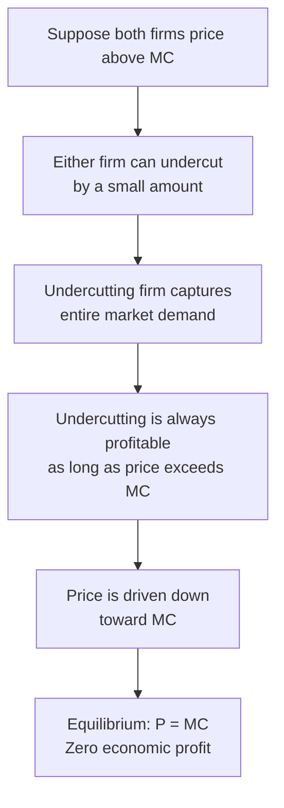
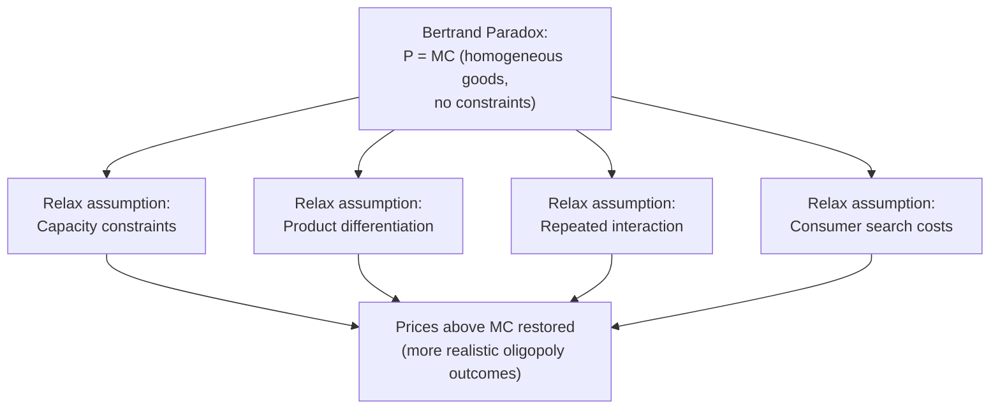

## Bertrand Competition

### Definition

**Bertrand Competition**: A model of oligopoly in which firms compete by **simultaneously and independently choosing prices** (rather than quantities), with each firm assuming its rivals' prices are fixed when determining its own profit-maximizing price. Consumers then purchase entirely from whichever firm charges the lowest price (assuming homogeneous goods). Named after Joseph Bertrand, who introduced the model in 1883 as a critique of Cournot's quantity-setting approach.

### Core Assumptions

**Key Points**

- A small number of firms (most commonly presented as a **duopoly**, generalizing to $n$ firms).
- Firms produce a **homogeneous product** in the baseline model (differentiated-goods extensions relax this).
- Firms choose **prices** simultaneously and independently.
- Consumers have perfect information and buy exclusively from the lowest-price seller (in the homogeneous-goods case), since the products are perfect substitutes from the consumer's perspective.
- If firms set equal prices, demand is typically assumed to split evenly between them (a common tie-breaking convention).
- Firms have sufficient capacity to serve the entire market at their chosen price (no capacity constraints in the baseline model).
- Constant marginal cost is commonly assumed for tractability.

### The Demand-Splitting Rule

For two firms with prices $P_1$ and $P_2$ and market demand $Q(P)$:

$$Q_1 = \begin{cases} Q(P_1) & \text{if } P_1 < P_2 \\ \frac{1}{2}Q(P_1) & \text{if } P_1 = P_2 \\ 0 & \text{if } P_1 > P_2 \end{cases}$$

and symmetrically for $Q_2$. This discontinuous demand structure is what drives the model's central result.

### The Bertrand Paradox

**Key Points**

With homogeneous products and identical constant marginal cost $c$ for both firms, the unique Nash equilibrium of the Bertrand game is:

$$P_1^* = P_2^* = c$$

**Why this must hold** (equilibrium logic by contradiction):

- If both firms priced above $c$ (say at some $P > c$), either firm could undercut the other by an arbitrarily small amount $\varepsilon$, capture the *entire* market, and still earn positive profit per unit sold — so pricing at $P > c$ symmetrically is not a Nash equilibrium (each firm has a profitable deviation).
- If one firm priced below $c$, it would earn negative profit on every unit sold — not profit-maximizing.
- Only when both firms price exactly at $P = c$ does neither firm have an incentive to deviate: undercutting further would mean pricing below cost (a loss), and raising price would mean losing all sales to the rival.

**Result**: Even with just **two** firms, the Bertrand model with homogeneous goods and identical marginal costs predicts the **perfectly competitive outcome** ($P = MC$, zero economic profit) — a result often called the **Bertrand Paradox**, since it seems paradoxical that so few firms could produce a fully competitive price outcome typically associated with many firms.

**Bertrand Paradox: Undercutting Dynamic (svg_diagram)**

<svg xmlns="http://www.w3.org/2000/svg" viewBox="0 0 600 350" font-family="sans-serif">
<text x="300" y="24" text-anchor="middle" font-size="16" font-weight="bold">Bertrand Paradox: Undercutting Dynamic (svg_diagram)</text>
<line x1="70" y1="300" x2="560" y2="300" stroke="black" stroke-width="1.5" />
<line x1="70" y1="300" x2="70" y2="60" stroke="black" stroke-width="1.5" />
<text x="570" y="305" font-size="12">Time / Iteration</text>
<text x="40" y="60" font-size="12">Price</text>
<line x1="70" y1="90" x2="560" y2="90" stroke="#999" stroke-dasharray="3,3" />
<text x="500" y="85" font-size="11">Monopoly Price</text>
<line x1="70" y1="260" x2="560" y2="260" stroke="#16a34a" stroke-width="2" />
<text x="480" y="278" font-size="11" fill="#16a34a">MC (equilibrium price)</text>
<path d="M 100 90 L 160 100 L 160 110 L 220 120 L 220 130 L 280 145 L 280 155 L 340 175 L 340 185 L 400 210 L 400 220 L 460 245 L 460 255 L 520 258" stroke="#dc2626" stroke-width="2" fill="none" />
<text x="150" y="80" font-size="10" fill="#dc2626">Sequential undercutting toward MC</text>
</svg>

### Reaction Functions in Bertrand Competition

Unlike Cournot's smooth, downward-sloping reaction functions, Bertrand reaction functions are **discontinuous**:

- Firm 1's best response to any $P_2 > c$ is to price at $P_2 - \varepsilon$ (just below the rival) to capture the whole market, as long as $P_2 - \varepsilon > c$ remains profitable.
- Once $P_2 = c$, Firm 1's best response is also $P_1 = c$ (matching, not undercutting below cost).

This discontinuity is the technical reason the model yields a single-point equilibrium at $P = MC$ rather than a smooth intersection of reaction curves as in Cournot.

### Comparison: Bertrand vs. Cournot

| Feature | Cournot | Bertrand |
| --- | --- | --- |
| Strategic variable | Quantity | Price |
| Equilibrium price (duopoly, homogeneous goods, constant MC) | $P > MC$ (above competitive level) | $P = MC$ (competitive level) |
| Number of firms needed to reach competitive outcome | Requires $n \to \infty$ | Reached with just 2 firms |
| Reaction function shape | Continuous, downward-sloping | Discontinuous |
| Strategic relationship | Strategic substitutes | Strategic complements (in differentiated version) |
| Underlying variable committed to | Output/capacity | Price |

[Inference] The dramatic difference between these two models' predictions for the *same* number of firms (2) illustrates that the choice of strategic variable is a first-order determinant of predicted market outcomes in oligopoly theory — selecting whether a real-world industry is better modeled as Cournot-like or Bertrand-like requires judgment about the industry's actual competitive dynamics (e.g., whether firms can flexibly and rapidly adjust prices versus being constrained by pre-committed production capacity).

### Resolving the Paradox: Extensions That Restore Positive Markups

The stark $P = MC$ prediction is widely regarded as failing to match many real-world oligopoly markets, which typically show prices above marginal cost even with just a few firms. Standard extensions relax one or more baseline assumptions:

**1. Capacity Constraints**

- If firms cannot produce enough to serve the entire market alone at the low price (i.e., limited capacity), undercutting to capture "the whole market" is not fully effective — some consumers cannot be served by the low-price firm and must buy from the higher-price rival.
- [Confirmed] This insight underlies the **Edgeworth model** and later work (notably by Kreps and Scheinkman) showing that Bertrand price competition with capacity constraints chosen in a prior stage can reproduce Cournot-like outcomes — an important theoretical bridge between the two models.

**2. Product Differentiation**

- If goods are imperfect substitutes (branded, differentiated products), a firm does not lose *all* its customers by pricing slightly above a rival — some consumers have brand preferences.
- This transforms Bertrand reaction functions into smooth, continuous, **upward-sloping** curves — unlike homogeneous-goods Bertrand, prices become **strategic complements** (if one firm raises its price, the other's best response is also to raise its price, since some of the first firm's customers become available to capture at a higher price than before).
- Equilibrium in differentiated Bertrand models typically yields prices above marginal cost, avoiding the stark paradox.

**3. Repeated Interaction**

- In a one-shot game, undercutting is always tempting; but in a **repeated game**, firms may sustain higher, tacitly collusive prices supported by the credible threat of reverting to competitive (or punishing) pricing if a rival deviates — a result formalized via the **Folk Theorem** in repeated game theory.

**4. Search Costs and Imperfect Information**

- If consumers face costs to compare prices across sellers (rather than having perfect, costless information), firms retain some ability to price above marginal cost without losing all customers to a slightly cheaper rival.

### Differentiated Bertrand: Brief Formal Sketch

With differentiated products, a common linear demand specification for Firm 1 is:

$$Q_1 = a - bP_1 + dP_2$$

where $d > 0$ captures substitutability between the two firms' products (a higher rival price increases demand for Firm 1's product). Solving each firm's profit-maximization problem yields upward-sloping, continuous reaction functions:

$$P_1^* = \frac{a + c b + dP_2}{2b}$$

and symmetrically for $P_2^*$, with a stable equilibrium at their intersection where **both** firms charge a price above marginal cost $c$. [Inference] The exact functional form and equilibrium values depend on the specific demand specification chosen, so this should be understood as an illustrative example of the differentiated-Bertrand structure rather than a single canonical formula applicable to all differentiated markets.

### Example: Comparing Homogeneous vs. Differentiated Bertrand Outcomes

**Example**

Two firms sell an identical commodity (e.g., a standardized industrial chemical) with marginal cost $10/unit. Under baseline homogeneous-goods Bertrand logic, competitive pressure should theoretically drive the price toward $10, since either firm could capture the entire market by pricing even slightly lower.

Contrast this with two firms selling differentiated products (e.g., two competing brands of running shoes) with the same $10 marginal cost. Because some consumers prefer one brand even at a modest price premium, both firms can sustain prices well above $10 (e.g., $45–$60) in equilibrium without losing their entire customer base to the rival — illustrating how product differentiation is a key real-world resolution to the stark homogeneous-goods Bertrand prediction.

### Common Pitfalls

- Assuming the Bertrand Paradox result ($P=MC$ with just 2 firms) is a realistic description of most real-world duopolies — it is a stylized theoretical benchmark whose starkness is precisely why so many extensions (capacity, differentiation, repetition, search costs) were developed to better match observed market behavior.
- Confusing Bertrand's price-setting assumption with Cournot's quantity-setting assumption — the choice of strategic variable is the fundamental modeling distinction between the two, not merely a labeling difference.
- Assuming Bertrand and Cournot always give different predictions — under certain conditions (e.g., Bertrand with capacity constraints as in the Edgeworth/Kreps-Scheinkman framework), the two frameworks can converge toward similar equilibrium outcomes.
- Overlooking the tie-breaking rule (equal-price demand splitting) — this convention, while a minor technical detail, is necessary to fully specify the game and confirm that $P=P_2=c$ is indeed a Nash equilibrium (deviating firms cannot improve their payoff, including via ties).

**Related Topics**

- Cournot Competition
- Product Differentiation in Oligopoly Models
- Capacity Constraints and the Edgeworth Model
- Repeated Games and the Folk Theorem
- Stackelberg Leadership Model
- Characteristics of Oligopoly
- Game Theory and Nash Equilibrium