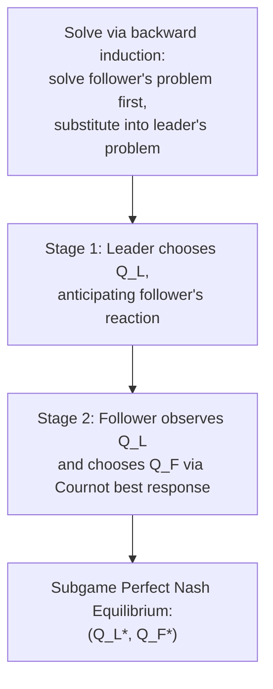

## Stackelberg Leadership Model

### Definition

**Stackelberg Leadership Model**: A model of oligopoly in which firms compete by choosing **output quantities sequentially** rather than simultaneously. One firm (the **leader**) moves first and commits to an output level; the other firm (the **follower**) observes the leader's choice and then chooses its own output to maximize its own profit given that observed quantity. Named after Heinrich von Stackelberg, who introduced the model in 1934 as a sequential-move extension of Cournot's simultaneous-move framework.

### Core Assumptions

**Key Points**

- Two firms (in the basic model): a **leader** and a **follower** — generalizable to more firms with more complex leader/follower hierarchies.
- Moves occur **sequentially**: the leader chooses output first, and this choice is publicly observed before the follower moves.
- The follower's best response is fully anticipated by the leader — the leader has "first-mover advantage" precisely because it can strategically account for how the follower will react.
- The **follower's problem is identical to a Cournot best-response problem**: given the leader's quantity, the follower simply maximizes its own profit treating that quantity as fixed.
- The **leader's problem differs from Cournot**: rather than treating the rival's quantity as fixed, the leader anticipates and substitutes in the follower's reaction function when choosing its own output.
- The solution concept is **subgame perfect Nash equilibrium (SPNE)**, solved via backward induction.

### Solving the Model: Backward Induction

**Step 1 — Follower's Problem (Stage 2)**

Given the leader has already chosen $Q_L$, the follower chooses $Q_F$ to maximize its own profit, taking $Q_L$ as fixed — this is exactly the Cournot best-response/reaction function derived previously:

$$Q_F^*(Q_L) = \frac{a - c - bQ_L}{2b}$$

(using the same linear demand $P = a - b(Q_L + Q_F)$ and constant marginal cost $c$ as in the standard Cournot setup)

**Step 2 — Leader's Problem (Stage 1)**

The leader anticipates the follower will respond according to $Q_F^*(Q_L)$ above, and substitutes this reaction function directly into its own profit function *before* optimizing:

$$\pi_L = [a - b(Q_L + Q_F^*(Q_L))]Q_L - cQ_L$$

Substituting $Q_F^*(Q_L) = \frac{a-c-bQ_L}{2b}$:

$$\pi_L = \left[a - bQ_L - b\left(\frac{a-c-bQ_L}{2b}\right)\right]Q_L - cQ_L$$

Simplifying:

$$\pi_L = \left[\frac{a-c}{2} - \frac{bQ_L}{2}\right]Q_L$$

Maximizing with respect to $Q_L$:

$$\frac{\partial \pi_L}{\partial Q_L} = \frac{a-c}{2} - bQ_L = 0$$

$$Q_L^* = \frac{a-c}{2b}$$

**Step 3 — Substitute Back to Find Follower's Output**

$$Q_F^* = \frac{a-c-b\left(\frac{a-c}{2b}\right)}{2b} = \frac{a-c}{4b}$$

### Comparing Stackelberg to Cournot Outcomes

Using the same demand and cost parameters as the earlier Cournot example ($a=100$, $b=1$, $c=10$):

| Model | Firm 1 (Leader in Stackelberg) | Firm 2 (Follower in Stackelberg) | Total Output | Price |
| --- | --- | --- | --- | --- |
| **Cournot (simultaneous)** | $\frac{a-c}{3b} = 30$ | $\frac{a-c}{3b} = 30$ | 60 | $\frac{a+2c}{3} = 40$ |
| **Stackelberg (sequential)** | $\frac{a-c}{2b} = 45$ | $\frac{a-c}{4b} = 22.5$ | 67.5 | $a - b(67.5) = 32.5$ |

**Key Points**

- The leader produces **more** than its Cournot output ($45 > 30$), and the follower produces **less** than its Cournot output ($22.5 < 30$) — this asymmetric result is the defining feature of Stackelberg equilibrium.
- **Total industry output is higher** in Stackelberg than in Cournot ($67.5 > 60$), and correspondingly, **market price is lower** ($32.5 < 40$).
- The leader earns **higher profit** than it would under Cournot (verified by the derivation itself — the leader is solving an unconstrained optimization that includes the Cournot outcome as a feasible but suboptimal choice, so its optimized profit must be at least as high).
- The follower earns **lower profit** than it would under Cournot, since it is forced into a smaller residual market after the leader has committed to a large quantity.

### First-Mover Advantage: Why It Arises

**Key Points**

- The leader's advantage comes from **commitment**: by publicly and credibly committing to a large output *before* the follower decides, the leader effectively forces the follower to accommodate a smaller residual market — the follower's best response to a large $Q_L$ is a correspondingly smaller $Q_F$ (since reaction functions slope downward, per the strategic-substitutes logic inherited from Cournot).
- This is fundamentally a **strategic commitment device**: the leader benefits precisely because it moves first and this move is irreversible and observable — if the leader could secretly deviate after observing the follower's choice, the equilibrium would collapse back toward the simultaneous Cournot outcome.
- [Inference] This highlights that the source of the leader's advantage is not superior information or lower costs, but purely the sequential *timing* structure and the credibility of the leader's commitment — in the basic symmetric-cost model, the outcome would reverse if the follower could instead move first.

**Stackelberg Leader's Output vs. Cournot Output (svg_diagram)**

<svg xmlns="http://www.w3.org/2000/svg" viewBox="0 0 600 420" font-family="sans-serif">
<text x="300" y="24" text-anchor="middle" font-size="16" font-weight="bold">Stackelberg Leader's Output vs. Cournot Output (svg_diagram)</text>
<line x1="70" y1="370" x2="560" y2="370" stroke="black" stroke-width="1.5" />
<line x1="70" y1="370" x2="70" y2="60" stroke="black" stroke-width="1.5" />
<text x="570" y="375" font-size="12">Q1 (leader)</text>
<text x="40" y="60" font-size="12">Q2 (follower)</text>

<line x1="90" y1="100" x2="460" y2="360" stroke="#1d4ed8" stroke-width="2.5" />
<text x="330" y="300" font-size="12" fill="#1d4ed8">Follower's Reaction: R_F(Q_L)</text>

<circle cx="230" cy="230" r="5" fill="#16a34a" />
<text x="200" y="215" font-size="11" fill="#16a34a">Cournot (Q1=Q2)</text>

<path d="M 100 350 C 200 200, 320 130, 420 160" stroke="#dc2626" stroke-width="1.5" fill="none" stroke-dasharray="5,3" />
<text x="380" y="150" font-size="10" fill="#dc2626">Leader's iso-profit curve</text>

<circle cx="340" cy="170" r="5" fill="black" />
<text x="345" y="165" font-size="11" font-weight="bold">Stackelberg (Q_L &gt; Q_F)</text>
<line x1="340" y1="170" x2="340" y2="370" stroke="#999" stroke-dasharray="3,3" />
<line x1="340" y1="170" x2="70" y2="170" stroke="#999" stroke-dasharray="3,3" />
</svg>

### Why Simultaneous Deviation Doesn't Undo the Leader's Advantage

**Key Points**

- One might ask: why doesn't the follower simply ignore the leader's choice and produce its own Cournot-optimal quantity regardless? The answer is that once $Q_L$ is fixed and observed, the follower's *own* profit-maximizing response genuinely is the smaller quantity $Q_F^*(Q_L)$ — producing the original Cournot quantity would not be profit-maximizing given the leader's now-larger output, since more total output means a lower price, and the follower optimizes its own profit taking that price effect into account.
- The credibility of the leader's commitment (an irreversible capacity/output decision, publicly observable before the follower acts) is essential to the model's logic — without genuine commitment, both firms would have an incentive to wait and see what the other does, collapsing the sequential structure back toward simultaneous-move Cournot behavior.

### Sustainability of Leadership: Which Firm Becomes the Leader?

**Key Points**

- The basic Stackelberg model takes the leader/follower assignment as **exogenously given** — it does not explain *why* one firm becomes the leader rather than the other.
- [Inference] In applied settings, plausible explanations for observed leadership often include: an incumbent's ability to commit to capacity or output before a new entrant can (a first-mover advantage rooted in timing of market entry), superior information or lower costs enabling more credible commitment, or established industry conventions — but these are situational explanations rather than conclusions derived from within the basic Stackelberg model itself.
- If both firms simultaneously wish to be the leader, this creates an "**endogenous timing**" question addressed in extensions of the basic model (e.g., the **Hamilton-Slutsky** endogenous-timing framework), which is beyond the scope of the baseline sequential-quantity model presented here.

### Comparison Table: Cournot vs. Stackelberg vs. Perfect Competition

| Feature | Cournot | Stackelberg | Perfect Competition |
| --- | --- | --- | --- |
| Move structure | Simultaneous | Sequential | N/A (price-taking) |
| Total output | Lower | Higher (closer to competitive) | Highest |
| Market price | Higher | Lower (closer to competitive) | Lowest ($=MC$) |
| Firm symmetry | Symmetric outcomes (identical firms) | Asymmetric (leader produces more) | Not meaningfully applicable |
| Leader's profit vs. Cournot profit | N/A | Strictly higher | N/A |
| Follower's profit vs. Cournot profit | N/A | Strictly lower | N/A |

### Common Pitfalls

- Solving the leader's problem using the *same* first-order condition as in Cournot — this is incorrect. The leader must substitute the *follower's reaction function* into its own profit function *before* differentiating, since the leader's decision explicitly accounts for the follower's anticipated response (unlike Cournot, where each firm treats the rival's output as literally fixed and unresponsive).
- Assuming the Stackelberg leader always earns strictly higher profit than it would in *any* alternative market structure — the correct and specific comparison is that the leader earns higher profit than it *would earn as either firm in simultaneous Cournot competition*, not a universal claim across all market structures.
- Forgetting that the model requires a genuinely credible, observable, and irreversible commitment by the leader — if the leader's output choice could be secretly revised after observing the follower, the sequential logic and the resulting equilibrium would not hold.
- Treating the leader/follower assignment as something the basic model explains — the baseline Stackelberg framework assumes this hierarchy exogenously; explaining *why* a particular firm leads requires additional context or extended models.

**Related Topics**

- Cournot Competition
- Bertrand Competition
- Subgame Perfect Nash Equilibrium and Backward Induction
- First-Mover Advantage and Commitment Strategies
- Endogenous Timing in Oligopoly (Hamilton-Slutsky Model)
- Characteristics of Oligopoly
- Game Theory and Extensive-Form Games