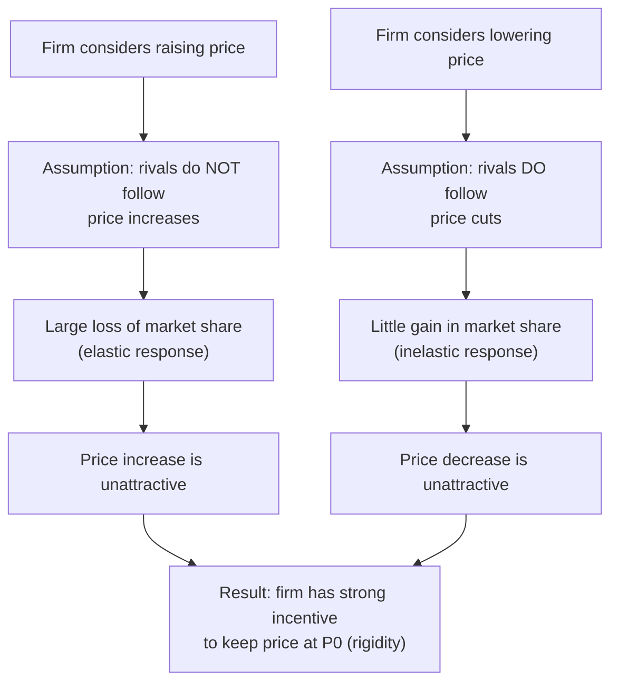

## Kinked Demand Curve Model

### Definition

**Kinked Demand Curve Model**: A theoretical model of oligopoly pricing behavior that explains **price rigidity** (stickiness) observed in many oligopolistic markets, based on the asymmetric assumption that rival firms will **match price cuts** but **ignore (not match) price increases**. This asymmetric conjecture produces a demand curve with a "kink" at the prevailing price, which in turn creates a discontinuity in the marginal revenue curve — allowing marginal cost to shift within a range without inducing any change in the profit-maximizing price. Developed independently by Paul Sweezy (1939) and by Hall and Hitch (1939).

### Core Behavioral Assumption

**Key Points**

- If a firm **raises** its price above the current market price, rivals are assumed to **not follow** — they keep their prices unchanged, so the price-raising firm loses substantial market share to now-relatively-cheaper competitors. This implies demand is **highly elastic** for price increases (a small price rise causes a large drop in quantity demanded, since customers switch to rivals).
- If a firm **lowers** its price below the current market price, rivals are assumed to **follow suit** (matching the cut) to avoid losing market share themselves. This implies demand is **relatively inelastic** for price decreases (a price cut does not gain the firm much additional quantity, since rivals cut prices too, and total demand for the product is unlikely to expand dramatically).
- This asymmetric conjecture about rival reactions produces two distinct demand curve segments meeting at the current price — a **kink** at the prevailing market price and quantity.

### Constructing the Kinked Demand Curve

At the prevailing price $P_0$ and quantity $Q_0$:

- **Above $P_0$**: the relevant demand curve segment is relatively **flat (elastic)**, reflecting the assumption that rivals do not follow price increases.
- **Below $P_0$**: the relevant demand curve segment is relatively **steep (inelastic)**, reflecting the assumption that rivals do follow price decreases.

**Kinked Demand Curve and Discontinuous MR (svg_diagram)**

<svg xmlns="http://www.w3.org/2000/svg" viewBox="0 0 620 480" font-family="sans-serif">
<text x="310" y="24" text-anchor="middle" font-size="16" font-weight="bold">Kinked Demand Curve and Discontinuous MR (svg_diagram)</text>
<line x1="70" y1="420" x2="580" y2="420" stroke="black" stroke-width="1.5" />
<line x1="70" y1="420" x2="70" y2="60" stroke="black" stroke-width="1.5" />
<text x="590" y="425" font-size="12">Q</text>
<text x="40" y="60" font-size="12">P</text>

<line x1="150" y1="110" x2="320" y2="230" stroke="#dc2626" stroke-width="2.5" />
<text x="150" y="100" font-size="11" fill="#dc2626">Elastic segment (above P0)</text>

<line x1="320" y1="230" x2="440" y2="380" stroke="#dc2626" stroke-width="2.5" />
<text x="350" y="395" font-size="11" fill="#dc2626">Inelastic segment (below P0)</text>

<circle cx="320" cy="230" r="5" fill="black" />
<text x="325" y="220" font-size="11" font-weight="bold">Kink (P0, Q0)</text>
<line x1="320" y1="230" x2="320" y2="420" stroke="#999" stroke-dasharray="3,3" />
<line x1="320" y1="230" x2="70" y2="230" stroke="#999" stroke-dasharray="3,3" />
<text x="310" y="435" font-size="10">Q0</text>
<text x="45" y="235" font-size="10">P0</text>

<line x1="150" y1="110" x2="290" y2="330" stroke="#1d4ed8" stroke-width="2" stroke-dasharray="6,3" />

<line x1="290" y1="330" x2="290" y2="270" stroke="#1d4ed8" stroke-width="3" />
<text x="200" y="340" font-size="11" fill="#1d4ed8">MR (discontinuous gap at Q0)</text>
<line x1="290" y1="270" x2="440" y2="150" stroke="#1d4ed8" stroke-width="2" stroke-dasharray="6,3" />

<line x1="150" y1="290" x2="440" y2="290" stroke="#16a34a" stroke-width="2" />
<text x="150" y="305" font-size="11" fill="#16a34a">MC1</text>
<line x1="150" y1="310" x2="440" y2="310" stroke="#059669" stroke-width="2" />
<text x="150" y="325" font-size="11" fill="#059669">MC2</text>
</svg>

### The Discontinuous Marginal Revenue Curve

**Key Points**

- Each demand segment has its own corresponding marginal revenue (MR) curve.
- Because the elastic (upper) segment and inelastic (lower) segment have different slopes, their respective MR curves do not connect smoothly at $Q_0$ — instead, the **MR curve has a vertical discontinuity (gap)** directly below the kink point.
- This gap is the model's central mechanical feature: as long as the firm's marginal cost curve passes through this vertical gap, the profit-maximizing quantity ($MR=MC$) remains at $Q_0$, and the profit-maximizing price remains at $P_0$ — **even if marginal cost shifts up or down within the gap**.

### Explaining Price Rigidity

**Key Points**

- The central prediction of the model is **price stability (stickiness)** in oligopolistic markets: firms are reluctant to change price even when their cost conditions change moderately, because:
  - A price **increase** risks losing substantial market share (rivals won't follow), so it is unattractive even if costs have risen somewhat.
  - A price **decrease** would be matched by rivals, yielding little or no gain in market share while sacrificing revenue per unit — so it is unattractive even if costs have fallen somewhat.
- As long as a marginal cost shift stays within the vertical MR discontinuity, the profit-maximizing price and quantity **do not change at all** — providing a theoretical explanation for observed oligopoly price rigidity without requiring formal collusion.
- Only a **sufficiently large** cost shock (one that moves MC outside the discontinuous gap) would induce a price change under this model.

### Example

**Example**

Consider three gas stations located near each other, currently all pricing at $3.50/gallon. If Station A raises its price to $3.70, drivers can easily observe competitors' prices (common with roadside signage) and switch to Station B or C, which keep their price at $3.50 — Station A loses substantial volume (elastic response to the price increase). If Station A instead cuts its price to $3.30, Stations B and C are likely to match the cut to avoid losing customers, so Station A's volume gain is limited to a modest increase in total gasoline demand rather than a large shift of customers from rivals (inelastic response to the price decrease). This asymmetry gives Station A a strong incentive to keep its price at $3.50 rather than adjust it in either direction, consistent with the kinked demand curve's prediction.

### Strengths and Limitations of the Model

**Key Points**

*Strengths*:

- Offers an intuitive, plausible behavioral explanation for observed price rigidity in many oligopolistic markets without requiring an assumption of explicit collusion.
- Highlights the importance of **conjectural variation** — firms' beliefs about how rivals will react — as a determinant of oligopoly outcomes, a theme that recurs across oligopoly theory more broadly.

*Limitations*:

[Inference] Several significant theoretical and empirical criticisms have been raised against the model in the economics literature:

- **Does not explain how $P_0$ is initially determined.** The model takes the prevailing price as a given starting point and explains why it tends to persist, but offers no theory of how that specific price level was arrived at in the first place.
- **The underlying behavioral assumption (rivals match cuts but not increases) is asserted rather than derived** from an underlying game-theoretic optimization — unlike Cournot, Bertrand, or Stackelberg, which derive firm behavior from explicit profit-maximization given clearly specified strategic assumptions, the kinked demand curve model largely assumes its central behavioral premise directly.
- **Empirical support is mixed.** [Unverified] Studies attempting to directly test the model's predictions (e.g., whether oligopoly prices are actually less responsive to cost changes than in other market structures, and whether the specific asymmetric rival-matching behavior is empirically observed) have produced inconsistent results across different industries and time periods, and the model is generally regarded in modern industrial organization economics as a useful heuristic for price rigidity rather than a rigorously validated general theory.
- **Does not incorporate strategic interaction as fully as game-theoretic models.** Unlike Cournot, Bertrand, or repeated-game collusion models, it does not model rivals as themselves optimizing firms making a genuine strategic calculation — it simply assumes a fixed behavioral rule for how they respond.

### Comparison with Other Oligopoly Models

| Model | Strategic Variable | Explains | Derivation Basis |
| --- | --- | --- | --- |
| Cournot | Quantity | Equilibrium output/price with simultaneous moves | Formal profit-maximization + Nash equilibrium |
| Bertrand | Price | Price competition dynamics, potential paradox | Formal profit-maximization + Nash equilibrium |
| Stackelberg | Quantity (sequential) | First-mover advantage | Formal profit-maximization + backward induction |
| **Kinked Demand Curve** | Price (given) | **Price rigidity/stickiness** | Assumed asymmetric rival reaction (not derived from formal game-theoretic optimization) |

### Common Pitfalls

- Treating the kinked demand curve model as explaining oligopoly *pricing levels* — it explains price *rigidity* (resistance to change) around an already-established price, not how that initial price level was determined.
- Assuming the model's asymmetric rival-reaction assumption is empirically universal — real-world rival behavior varies substantially by industry, and the model's core behavioral premise is a simplifying assumption rather than a confirmed general law of oligopoly conduct.
- Confusing the kinked demand curve's discontinuous MR gap with a genuine kink or discontinuity in the underlying marginal cost curve — the MC curve itself is typically assumed smooth; it is the *demand-derived MR curve* that has the discontinuity, which is what allows MC to shift within a range without affecting the optimal price.
- Presenting this model as a rigorously derived game-theoretic equilibrium akin to Cournot or Bertrand — it is more accurately described as a **conjectural** or behavioral model built on an assumed (not derived) pattern of rival response.

**Related Topics**

- Cournot Competition
- Bertrand Competition
- Price Rigidity and Menu Costs
- Conjectural Variations in Oligopoly
- Characteristics of Oligopoly
- Tacit Collusion and Price Leadership
- Game Theory and Nash Equilibrium