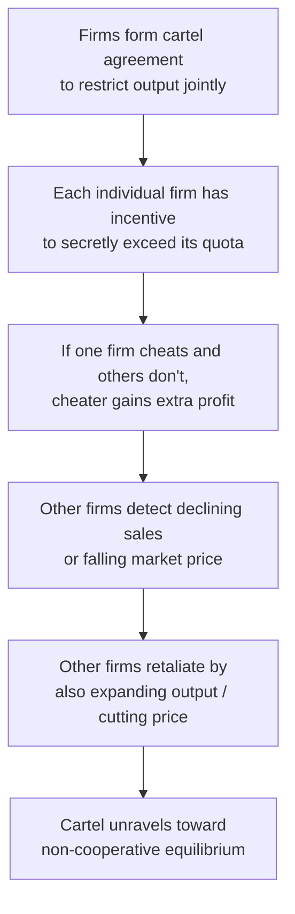

## Cartels and Collusion

### Definitions

**Collusion**: Coordinated behavior among firms in an oligopoly aimed at restricting competition — typically by jointly restricting output and/or raising prices — to increase combined industry profits above the level that would prevail under non-cooperative (competitive) behavior.

**Cartel**: A formal, explicit agreement among firms to coordinate output, pricing, or market allocation decisions, effectively acting as if they were a single joint monopolist to maximize combined industry profit.

**Explicit Collusion**: Direct communication and formal agreement among firms (e.g., price-fixing meetings, output quotas) — illegal under antitrust/competition law in most jurisdictions.

**Tacit Collusion**: Coordinated pricing or output behavior achieved *without* direct communication or formal agreement, often through repeated interaction, price signaling, or mutual recognition of interdependence — occupies a more legally ambiguous position than explicit collusion in most competition law frameworks.

### The Economic Logic of Collusion: Joint Profit Maximization

**Key Points**

- A cartel, if perfectly coordinated, behaves like a **multi-plant monopolist**: it sets total industry output where industry marginal revenue equals the (aggregated) industry marginal cost, then allocates production among member firms.
- This joint-profit-maximizing outcome generally involves **lower total industry output and higher prices** than any of the non-cooperative oligopoly equilibria (Cournot, Bertrand, Stackelberg) would produce, since a cartel internalizes the negative externality that each firm's output expansion imposes on rivals via lower market price.

$$MR_{industry}(Q_{total}) = MC_{industry}(Q_{total})$$

**Example**

Returning to the earlier linear demand example ($P = 100 - Q$, marginal cost $c=10$ for all firms), if firms instead form a cartel and jointly maximize industry profit as a monopolist would:

$$Q_{cartel} = 45, \quad P_{cartel} = 55$$

Compare this to the non-cooperative Cournot duopoly outcome derived earlier ($Q_{Cournot} = 60$, $P_{Cournot} = 40$). The cartel produces **less** and charges **more** than firms would choose independently — the cartel outcome replicates the monopoly outcome, since perfect collusion is mathematically equivalent to joint profit maximization.

### The Fundamental Instability Problem: Incentive to Cheat

**Key Points**

- Even though the cartel as a whole earns higher joint profit than non-cooperative competition, **each individual member has a private incentive to secretly produce more than its assigned quota** (or secretly undercut the cartel price) — because at the cartel price (which exceeds marginal cost), any single firm can increase its own profit by expanding output, as long as other members maintain their agreed-upon restricted output.
- This is structurally identical to a **Prisoner's Dilemma**: mutual cooperation (honoring the cartel agreement) yields a jointly superior outcome, but each individual firm's dominant strategy (in a one-shot setting) is to defect (cheat) — because cheating is profitable regardless of what the other firm does, given the price still remains above marginal cost after a single firm's small output increase.

### Prisoner's Dilemma Payoff Structure (Illustrative)

|  | Firm B: Honor Quota | Firm B: Cheat |
| --- | --- | --- |
| **Firm A: Honor Quota** | Both earn cartel profit $\pi_{cartel}$ (high, shared) | A earns low profit; B earns highest possible profit (cheater's gain) |
| **Firm A: Cheat** | A earns highest possible profit; B earns low profit | Both earn Cournot-level (non-cooperative) profit — lower than $\pi_{cartel}$ but higher than being the sole honorer |

[Inference] In a single, one-shot interaction, "Cheat" is a dominant strategy for both firms regardless of what the other does, leading to mutual defection (the Cournot-like outcome) even though both firms would jointly prefer to sustain the cartel — this is the standard prisoner's dilemma logic applied to cartel behavior, and its precise numeric payoffs depend on the specific demand and cost parameters of the industry in question.

### Sustaining Collusion: Repeated Games and the Folk Theorem

**Key Points**

- The prisoner's dilemma logic applies most starkly to a **single, one-shot interaction**. Real-world oligopolies typically interact repeatedly over many periods, which changes the incentive structure substantially.
- In a **repeated game**, cartel stability can be sustained through **trigger strategies**: firms honor the cartel agreement as long as all members continue to cooperate, but immediately (or after a delay) revert to punishing, non-cooperative behavior (e.g., a price war, or reverting permanently to the Cournot/Bertrand equilibrium) if any member is detected cheating.
- The threat of future punishment can make honoring the cartel agreement individually rational *today*, as long as the discounted value of continued cartel profits exceeds the one-time gain from cheating plus the discounted cost of subsequent punishment.
- [Confirmed] This logic is formalized in game theory via the **Folk Theorem**, which broadly states that a wide range of cooperative outcomes (including full collusion) can be sustained as equilibria in infinitely (or indefinitely) repeated games, provided firms are sufficiently patient (i.e., the discount factor is high enough) and can credibly detect and punish deviations.

$$\text{Cartel sustainable if: } \frac{\pi_{cartel}}{1-\delta} \geq \pi_{cheat} + \frac{\delta \cdot \pi_{punishment}}{1-\delta}$$

where $\delta$ is the firm's discount factor (weight placed on future profits). [Inference] This condition is a simplified representation of the general repeated-game sustainability logic; the exact formulation depends on the specific trigger strategy and punishment scheme assumed (e.g., permanent reversion to Cournot vs. finite-period punishment vs. other punishment structures).

### Factors Affecting Cartel Stability

**Key Points**

*Factors that make collusion **more** stable*:

- **Small number of firms**: easier to reach and monitor agreement.
- **Homogeneous products**: easier to agree on and monitor a single price.
- **High market transparency**: easier to detect if a member is secretly cutting price or exceeding output quotas.
- **Frequent interaction / repeated orders**: allows quicker detection of and response to cheating.
- **High barriers to entry**: prevents new entrants from undermining the cartel's ability to restrict industry-wide output.
- **Similar cost structures across firms**: makes it easier to agree on a mutually acceptable output allocation or price.
- **Credible and severe punishment mechanisms**: strengthens the deterrent against cheating.

*Factors that make collusion **less** stable*:

- **Large number of firms**: harder to coordinate and monitor.
- **Differentiated products**: harder to agree on a single coordinated price across varied products.
- **Low market transparency / secret discounting**: easier for a member to cheat undetected (e.g., via hidden rebates, non-price concessions).
- **Demand or cost volatility**: makes it harder to distinguish a rival's falling sales due to cheating versus due to legitimate demand fluctuations, complicating detection.
- **Low barriers to entry**: new entrants can undercut the cartel price, eroding its ability to sustain higher-than-competitive prices.
- **Asymmetric costs or capacities among members**: makes it harder to agree on a mutually acceptable quota allocation.

### Antitrust and Legal Treatment

**Key Points**

- Explicit price-fixing cartels are illegal under competition/antitrust law in most jurisdictions worldwide (e.g., prohibited under the Sherman Act in the United States, and under Article 101 of the Treaty on the Functioning of the European Union in the EU), typically treated as a serious ("per se" or similarly strict) violation subject to significant fines and, in some jurisdictions, criminal penalties for individuals involved.
- **Tacit collusion** (parallel pricing behavior without direct communication or explicit agreement) occupies a more legally ambiguous space: many jurisdictions do not treat mere parallel pricing behavior alone as sufficient evidence of an illegal agreement, since firms in a genuinely competitive oligopoly might independently arrive at similar pricing decisions due to shared market conditions and mutual awareness of interdependence, without any actual communication or agreement.
- **Leniency programs**: [Confirmed] Many antitrust authorities (including the US Department of Justice and the European Commission) operate formal leniency (amnesty) programs offering reduced penalties to cartel members who voluntarily disclose the cartel's existence and cooperate with investigators — explicitly designed to exploit the same cheating-incentive instability that makes cartels inherently fragile, by making early defection to authorities more attractive than continued participation.
- [Unverified] The precise legal standards, penalty structures, and leniency program terms vary significantly across jurisdictions and are subject to periodic legislative and regulatory change, so specific current details should be verified against the relevant jurisdiction's current competition authority guidance.

### International Cartel Example: OPEC

[Inference] The Organization of the Petroleum Exporting Countries (OPEC) is commonly cited in economics textbooks as a real-world example of an international cartel attempting to coordinate crude oil production quotas among member countries to influence global oil prices. Its history illustrates core cartel-stability themes: periods of successful coordination alternating with episodes of member countries exceeding agreed production quotas (a real-world manifestation of the cheating incentive), demonstrating that even a long-standing, prominent cartel faces the same underlying game-theoretic tensions as smaller cartels. [Unverified] Since specific current OPEC production levels, member compliance, and market conditions change frequently, any claim about OPEC's present-day cartel effectiveness or specific quota figures should be checked against current reporting rather than assumed from general historical characterization.

### Comparison: Cartel vs. Non-Cooperative Oligopoly Outcomes

| Outcome Measure | Cartel (Perfect Collusion) | Non-Cooperative Oligopoly (e.g., Cournot) |
| --- | --- | --- |
| Total industry output | Lowest (monopoly-equivalent) | Higher than cartel, lower than perfect competition |
| Market price | Highest (monopoly-equivalent) | Lower than cartel, higher than perfect competition |
| Joint industry profit | Maximized | Lower than cartel-optimal joint profit |
| Individual firm's temptation to deviate | Strong (cheating is individually profitable) | Not applicable (already in individually optimal equilibrium) |
| Stability | Inherently fragile absent repeated-game enforcement | Stable (each firm is already best-responding) |

### Common Pitfalls

- Assuming a cartel agreement is automatically self-enforcing simply because it raises joint industry profit — the core economic insight is that joint profit maximization and *individual* incentive compatibility are distinct requirements, and the latter is what makes cartels inherently unstable absent repeated-game enforcement mechanisms.
- Confusing tacit collusion (parallel behavior without direct communication) with explicit cartel agreements — they are treated very differently under most competition law frameworks, even though both can produce similar pricing outcomes.
- Assuming all cartels inevitably collapse — while cartels face a structural incentive problem, the Folk Theorem shows that sufficiently patient firms with credible detection and punishment mechanisms can sustain collusion indefinitely in a repeated-game setting; historical persistence of some cartels over extended periods is consistent with this theoretical possibility.
- Treating cartel formation as a mechanical inevitability whenever oligopoly firms interact — the factors affecting cartel stability (concentration, product homogeneity, transparency, entry barriers, etc.) vary substantially across industries, so the likelihood and durability of actual collusion is an empirical question specific to each market.

**Related Topics**

- Cournot Competition
- Prisoner's Dilemma and Game Theory
- Repeated Games and the Folk Theorem
- Kinked Demand Curve Model
- Antitrust Policy and Merger Review
- Characteristics of Oligopoly
- Price Leadership and Tacit Coordination