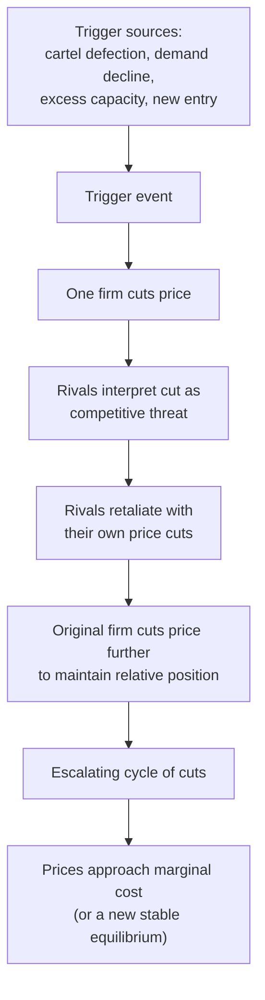
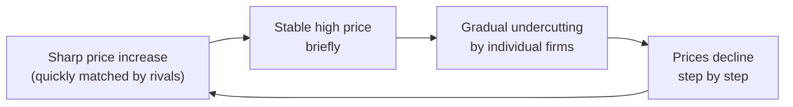

## Price Wars and Competitive Dynamics

### Definitions

**Price War**: A period of successive, escalating price reductions among competing firms in an oligopolistic market, typically initiated when one firm cuts price to gain market share and rivals retaliate with further cuts, often driving prices down toward (or in extreme cases below) marginal cost.

**Competitive Dynamics**: The broader pattern of strategic action and reaction among oligopoly firms over time — encompassing price wars but also non-price rivalry (advertising, capacity expansion, product innovation) as firms continuously adjust strategy in response to rivals' moves and anticipated countermoves.

### Why Price Wars Occur

**Key Points**

- **Breakdown of tacit or explicit coordination**: If firms had been sustaining prices above the non-cooperative equilibrium (via tacit collusion or an unstable cartel), a price war often erupts when one firm defects/cheats (see [[Cartels and collusion]]), prompting retaliatory price cuts from rivals.
- **Demand or capacity shocks**: A decline in overall market demand, or excess industry capacity relative to demand, can trigger aggressive price cutting as firms compete over a shrinking or insufficient pool of customers to utilize existing capacity.
- **New entry**: A new entrant may cut price aggressively to build market share and customer base quickly, provoking incumbent retaliation.
- **Signaling and reputation-building**: A firm may deliberately initiate an aggressive price cut to signal low costs or to deter future entry/expansion by rivals, even at short-term profit cost (a strategic, forward-looking rationale rather than a simple reactive response).
- **Misperception of rival behavior**: [Inference] Under incomplete or imperfect information, a firm may misinterpret a rival's price cut as aggressive market-share-grabbing behavior (prompting retaliation) when the actual cause was, for example, a cost reduction or an isolated promotional action — asymmetric or imperfect information about the true cause of a rival's price move can itself contribute to unintended escalation.

### Modeling Price Wars: The Bertrand Connection

**Key Points**

- The theoretical logic of a price war mirrors the undercutting dynamic in the **Bertrand model** (see [[Bertrand competition]]): as long as price remains above marginal cost, each firm retains an incentive to undercut rivals to capture additional market share, and the process of mutual undercutting can, in the limiting case, converge toward marginal cost.
- In practice, real-world price wars are typically **finite episodes** rather than instantaneous jumps to the Bertrand equilibrium, since price adjustments occur over time, involve strategic timing considerations, and are often eventually halted before reaching pure marginal-cost pricing — due to factors like capacity constraints, product differentiation, or a return to tacit coordination once firms recognize the mutual damage being inflicted.
- [Inference] Repeated-game reasoning (see the Folk Theorem discussion under [[Cartels and collusion]]) suggests that price wars can also function as a **punishment phase** within an otherwise cooperative long-run relationship — firms may deliberately engage in a temporary price war specifically to punish a rival's earlier deviation from tacit or explicit coordination, with the expectation of returning to higher, more cooperative pricing once the punishment has served its deterrent purpose.

### Price Wars as Punishment in Repeated Games

Using a simplified trigger-strategy framework, industry pricing behavior over time can be modeled as alternating between cooperative and punishment phases:

$$\text{Price}_t = \begin{cases} P_{cartel} & \text{if no deviation detected in period } t-1 \\ P_{competitive} & \text{for } T \text{ periods following a detected deviation (punishment phase)} \\ P_{cartel} & \text{resuming after punishment phase ends} \end{cases}$$

[Inference] The specific length and severity of the punishment phase $T$, and whether punishment is permanent (as in a "grim trigger" strategy) or temporary, depends on the particular repeated-game strategy assumed to be in use by firms in the industry — the general Folk Theorem framework accommodates a range of possible punishment structures, and no single universal punishment length applies across all real-world oligopoly settings.

### Cyclical Price Wars: Edgeworth Cycles

**Key Points**

[Confirmed] A well-documented empirical and theoretical pattern in some markets — particularly retail gasoline pricing in various countries — is the **Edgeworth price cycle**: a repeated pattern of a sharp, rapid price *increase* (often initiated by one firm and quickly matched by rivals) followed by a slower, gradual sequence of undercutting price *decreases*, before the cycle restarts with another sharp increase.

- This differs from a "one-shot" price war primarily in its **cyclical, recurring nature** rather than a single episode of escalating cuts terminating in a new stable price.
- [Inference] Edgeworth cycles are generally understood in the industrial organization literature as arising from capacity constraints combined with the difficulty of perfectly coordinating simultaneous price increases across firms (any single firm raising price first risks losing customers if others don't immediately follow, but if enough firms eventually do follow, a rapid collective price restoration becomes profitable) — but the precise conditions generating cycles versus a single one-shot price war in a specific market remain an active area of applied research and can vary by market structure and institutional detail.

### Consequences of Price Wars

**Key Points**

*For firms*:

- Reduced short-run profit margins, potentially pushing weaker or higher-cost firms toward losses.
- Can accelerate market consolidation if financially weaker firms exit or are acquired following sustained losses.
- May permanently alter consumer price expectations or brand positioning even after the price war ends (e.g., establishing a "value" reputation that is difficult to reverse).
- Can serve a strategic entry-deterrence function if incumbents are willing to sustain losses long enough to convince potential entrants that the market is unprofitable to contest ([Inference] this connects to predatory pricing theory, discussed further below, and the credibility of such deterrence depends on the incumbent's financial resources relative to the target).

*For consumers*:

- Short-run benefit from lower prices during the price war period.
- [Inference] Potential longer-run harm if the price war leads to reduced competition (through exit or consolidation) and subsequently higher prices once the war ends and remaining firms restore pricing power — though whether this longer-run harm actually materializes, and to what extent, depends on the specific market's post-war competitive structure and barriers to entry, and is not a certainty in every case.

### Predatory Pricing: The Legal and Economic Boundary

**Key Points**

- **Predatory pricing** refers to a firm deliberately pricing below cost with the specific intent of driving rivals out of the market (or deterring entry), planning to recoup losses later via higher prices once competitors have been eliminated.
- This is distinguished from ordinary competitive price-cutting (which is generally legal and often economically beneficial to consumers) by the **intent** to eliminate competition and the **capacity to recoup losses** afterward through subsequently higher, less competitive pricing.
- Most competition law frameworks require evidence that price was set below a measure of cost (commonly average variable cost or a similar benchmark) *and* that recoupment of the initial losses via later higher pricing was a realistic prospect, before predatory pricing claims are upheld — since simply having lower prices than a competitor is not, by itself, illegal or even necessarily anticompetitive.
- [Unverified] The specific legal tests, cost benchmarks, and evidentiary standards used to distinguish lawful aggressive competition from unlawful predatory pricing vary by jurisdiction and are periodically refined through case law, so any characterization of a specific real-world pricing episode as "predatory" in a legal sense should be checked against current jurisdiction-specific competition law rather than inferred from economic theory alone.
- [Inference] Some economists have historically questioned how often true predatory pricing strategies are actually rational and successfully executed in practice, since the "recoupment" phase requires the predating firm to later raise prices without immediately attracting new entrants back into the now-apparently-profitable market — this remains a debated point in industrial organization and antitrust economics rather than a settled empirical consensus.

### Non-Price Competitive Dynamics

**Key Points**

While price wars are the most visible form of oligopoly rivalry, competitive dynamics also occur through non-price channels, often as an alternative to price competition precisely because price wars are mutually damaging:

- **Capacity expansion races**: firms may pre-emptively build excess production capacity to deter rivals from expanding, since a credible capacity commitment can shift subsequent competitive outcomes (connecting to Stackelberg-style first-mover logic, see [[Stackelberg leadership model]]).
- **Advertising and brand-building escalation**: firms compete via marketing spend rather than price to build demand-side loyalty and reduce future price sensitivity (see [[Advertising and brand competition]]).
- **Product innovation races**: firms compete by improving product quality/features rather than cutting price, aiming to differentiate and reduce direct price comparability with rivals.
- [Inference] Firms may rationally prefer sustained non-price competition over price wars precisely because non-price rivalry, while still costly, does not directly erode the pricing structure of the entire market in the same immediately visible and mutually damaging way that an escalating price war does — though this preference is a strategic judgment specific to each firm's competitive context rather than a universal rule.

### Comparison: Price War vs. Sustained Tacit Coordination

| Feature | Price War | Sustained Tacit Coordination |
| --- | --- | --- |
| Price trend | Falling, potentially toward marginal cost | Stable, typically above competitive level |
| Industry profit | Depressed (temporarily or persistently) | Elevated relative to non-cooperative baseline |
| Trigger | Defection, demand shock, new entry, misperception | Mutual recognition of interdependence, repeated interaction |
| Duration | Often temporary (episode-based) or cyclical (Edgeworth cycles) | Can persist for extended periods if stability factors are favorable |
| Consumer impact (short run) | Beneficial (lower prices) | Less beneficial (higher, less competitive prices) |

### Common Pitfalls

- Assuming price wars always represent purely "irrational" or purely destructive behavior — they can arise from rational strategic calculations (punishment phases, entry deterrence, capacity utilization pressures) even though they reduce short-run industry profit.
- Confusing ordinary aggressive but lawful price competition with illegal predatory pricing — the legal and economic distinction hinges specifically on below-cost pricing combined with anticompetitive intent and a realistic prospect of recouping losses later, not merely on a firm having the lowest price.
- Treating every observed period of low or falling oligopoly prices as evidence of a "price war" in the technical sense — sustained lower prices can also simply reflect a stable, genuinely competitive equilibrium (e.g., a Bertrand-like or highly contestable market) rather than an unstable, escalating dynamic.
- Assuming Edgeworth cycles and one-shot price wars are the same phenomenon — cycles are specifically characterized by their recurring, rhythmic pattern of sharp increases followed by gradual decreases, distinct from a single episode of escalating cuts that settles into a new stable price.

**Related Topics**

- Bertrand Competition
- Cartels and Collusion
- Predatory Pricing and Antitrust Law
- Stackelberg Leadership Model
- Advertising and Brand Competition
- Repeated Games and the Folk Theorem
- Characteristics of Oligopoly