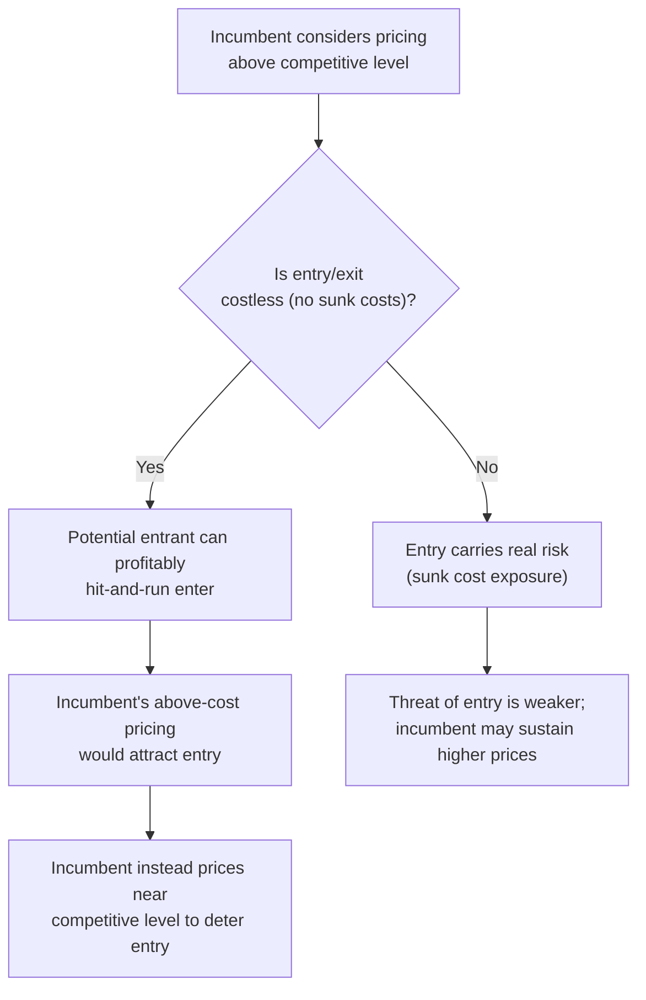

## Contestable Markets

### Definition

**Contestable Market**: A market in which incumbent firms behave competitively (pricing close to average cost, avoiding excessive profits) not necessarily because of the current number of competitors actually operating in the market, but because of the **credible threat of potential entry** by outside firms. The theory, developed principally by William Baumol, John Panzar, and Robert Willig in the early 1980s, argues that market structure (number of incumbent firms) is not, by itself, a reliable predictor of competitive conduct — what matters more is the **ease of entry and exit**.

### Core Conditions for Perfect Contestability

**Key Points**

A market is considered **perfectly contestable** when three conditions hold:

**1. Free entry**: A potential entrant faces no cost or regulatory disadvantage relative to incumbents and can enter the market on equal terms.

**2. Free exit / no sunk costs**: A firm that enters and later decides to leave the market can do so without incurring **sunk costs** — costs that cannot be recovered upon exit (e.g., specialized equipment with no resale value, non-recoverable marketing investments). This is often considered the most critical condition.

**3. "Hit-and-run" entry is possible**: A potential entrant can enter the market quickly, undercut the incumbent's price to capture profitable sales, and exit again before the incumbent has time to retaliate (e.g., by cutting its own price in response).

**Key Points**

- The absence of sunk costs is what makes "hit-and-run" entry a **credible threat**: if entry requires substantial irrecoverable investment, a potential entrant bears real risk if the incumbent retaliates after entry, discouraging entry in the first place. But if entry and exit are essentially costless, a potential entrant can profitably swoop in whenever incumbents price above the competitive level, then withdraw without loss if incumbents respond aggressively.

### The Central Theoretical Claim

**Key Points**

- In a perfectly contestable market, even a **monopolist or a small oligopoly** (in terms of the actual number of firms currently operating) will be forced to price near average cost and avoid persistent economic profit — **not** because of competition from firms currently in the market, but purely due to the disciplining threat of potential entry.
- This directly challenges the traditional **Structure-Conduct-Performance** framework's assumption (see [[Concentration ratios and measuring market power]]) that a small number of incumbent firms (high concentration) necessarily implies weak competitive discipline and elevated market power — contestability theory argues that structure (firm count/concentration) can be a poor predictor of conduct when the entry/exit conditions are sufficiently favorable.
- [Inference] This reframes market power analysis: the relevant policy question shifts from "how many firms currently compete?" toward "how easily could a new firm enter, compete, and exit if incumbents priced above the competitive level?"

### Contestable Market Equilibrium: Price and Cost

**Key Points**

- In a perfectly contestable market, the equilibrium is characterized by:
  - Price equal to average cost ($P = AC$), yielding zero economic profit — even with very few (or a single) incumbent firm(s).
  - No firm operating with productive inefficiency that a hit-and-run entrant could exploit (an inefficient incumbent would be vulnerable to entry by a more efficient rival).
- This is a stronger and more surprising result than the standard oligopoly models (Cournot, Bertrand, Stackelberg) discussed elsewhere in this chapter, since those models generally predict prices *above* marginal cost for any finite number of firms (except the Bertrand homogeneous-goods case) — contestability theory suggests that even a **natural monopoly** structure can, under the right entry/exit conditions, be forced toward competitive pricing.

**Contestable Market: Incumbent Pricing Constrained by Entry Threat (svg_diagram)**

<svg xmlns="http://www.w3.org/2000/svg" viewBox="0 0 600 400" font-family="sans-serif">
<text x="300" y="24" text-anchor="middle" font-size="16" font-weight="bold">Contestable Market: Incumbent Pricing Constrained by Entry Threat (svg_diagram)</text>
<line x1="70" y1="350" x2="560" y2="350" stroke="black" stroke-width="1.5" />
<line x1="70" y1="350" x2="70" y2="60" stroke="black" stroke-width="1.5" />
<text x="570" y="355" font-size="12">Q</text>
<text x="40" y="60" font-size="12">P, Cost</text>
<path d="M 100 300 C 180 150, 260 100, 320 100 S 420 150, 500 280" stroke="#1d4ed8" stroke-width="2.5" fill="none" />
<text x="410" y="140" font-size="12" fill="#1d4ed8">AC</text>
<line x1="90" y1="170" x2="500" y2="230" stroke="#7c3aed" stroke-width="2" />
<text x="440" y="225" font-size="11" fill="#7c3aed">Market Demand</text>
<line x1="70" y1="150" x2="560" y2="150" stroke="#999" stroke-dasharray="4,4" />
<text x="500" y="145" font-size="10">Monopoly price (unconstrained)</text>
<circle cx="330" cy="205" r="5" fill="black" />
<text x="335" y="195" font-size="11" font-weight="bold">Contestable equilibrium: P = AC</text>
<line x1="330" y1="205" x2="330" y2="350" stroke="#999" stroke-dasharray="3,3" />
</svg>

### Distinction from Traditional Perfect Competition

| Feature | Perfect Competition | Perfectly Contestable Market |
| --- | --- | --- |
| Number of firms required | Many | Can be one (natural monopoly) or few |
| Source of competitive discipline | Actual rivalry among many existing firms | Credible **threat** of potential entry |
| Products | Homogeneous | Can be homogeneous or differentiated |
| Entry/exit condition | Free entry (implicit) | Free entry **and** exit with **no sunk costs** (explicit, essential condition) |
| Applicability to natural monopoly | Not applicable | Central application — even a natural monopolist can be disciplined |

### Application to Natural Monopoly

**Key Points**

- Traditional theory treats **natural monopoly** (where technical economies of scale mean a single firm can serve the market at lowest cost — see [[Economies and diseconomies of scale]]) as requiring regulatory intervention (e.g., price caps, rate-of-return regulation) to prevent monopoly pricing, since there is no expectation of competitive discipline from existing rivals.
- Contestability theory offers an alternative view: if entry and exit into the natural monopoly's market are sufficiently costless (no significant sunk costs), the *threat* of potential competition can discipline the incumbent's pricing even without any actual competitor currently operating — potentially reducing or eliminating the need for direct price regulation.
- [Inference] This theoretical possibility was particularly influential in debates over deregulation of certain industries (e.g., U.S. airline deregulation in the late 1970s/early 1980s is commonly cited in economics textbooks as motivated partly by contestability-theory reasoning, on the basis that airlines could relatively easily redeploy aircraft between routes) — though the practical applicability of the "no sunk cost" assumption to any specific real-world industry is a matter of empirical judgment, not a guaranteed feature of deregulating any given market.

### Critiques and Limitations of Contestability Theory

**Key Points**

[Inference] Contestable markets theory, while influential, has faced significant critique in subsequent industrial organization literature:

- **Real-world sunk costs are rarely zero.** Most industries involve at least some genuinely irrecoverable investment (specialized equipment, reputation-building, regulatory compliance costs, or industry-specific expertise) — the "perfectly contestable" benchmark is a theoretical idealization rarely fully met in practice, meaning actual market outcomes may deviate substantially from the theory's predictions.
- **Speed of entry/exit matters enormously.** Hit-and-run entry requires the entrant to act *before* the incumbent can respond — but if incumbents can adjust price quickly (which is often realistic, especially compared to the time needed for a genuine new entrant to establish operations, even in low-sunk-cost industries), the hit-and-run strategy may not be as immediately profitable as the theory assumes in its cleanest form.
- **Empirical tests have produced mixed results.** [Unverified] Studies examining whether specific deregulated or low-barrier industries actually exhibit the near-competitive pricing predicted by contestability theory have found inconsistent evidence across different industries and time periods, and the theory is generally regarded in current industrial organization economics as a useful conceptual framework and a valuable corrective to overly rigid structure-based reasoning, rather than as an empirically confirmed general prediction that applies reliably across most markets.
- **Reputation and switching costs can act like informal sunk costs** even where physical capital is easily redeployed — consumer relationships, brand trust, or contractual lock-in can dampen the practical threat of hit-and-run entry even in industries with low physical capital sunk costs.

### Policy Implications

**Key Points**

- Contestability theory shifted some antitrust and regulatory attention away from a narrow focus on current market concentration (see [[Concentration ratios and measuring market power]]) toward a broader assessment of **barriers to entry and exit** as the more fundamental determinant of competitive conduct.
- This has practical relevance for merger review and deregulation policy: a proposed merger creating high concentration might be judged less concerning if the relevant market is genuinely highly contestable (low sunk costs, easy entry), whereas the same concentration level in a market with substantial sunk costs and entry barriers would raise greater concern.
- [Unverified] The specific weight given to contestability considerations (versus direct structural concentration measures) in actual antitrust enforcement decisions varies by jurisdiction and has evolved over time, so any claim about current regulatory practice on this point should be checked against the relevant competition authority's current guidelines.

### Common Pitfalls

- Confusing contestable markets theory with perfect competition — contestability does not require many firms or homogeneous products; it requires low/zero sunk costs and easy entry/exit, and can apply even to a single-firm (natural monopoly) market structure.
- Assuming any market with low entry barriers is automatically "contestable" in the strict theoretical sense — the theory's strongest results depend specifically on the **absence of sunk costs** (not merely low entry costs alone) and on entry/exit being fast enough to support genuine hit-and-run behavior.
- Treating contestability theory's predictions as a reliable real-world guarantee that deregulating any given industry will produce competitive outcomes — the theory's conclusions are conditional on assumptions (near-zero sunk costs, rapid entry/exit) that are frequently only partially met in actual markets, and empirical support for the theory's predictions has been mixed.
- Overlooking those non-physical-capital barriers (brand loyalty, consumer switching costs, informational asymmetries) can undermine contestability even in industries where physical capital itself is easily redeployed without sunk loss.

**Related Topics**

- Concentration Ratios and Measuring Market Power
- Economies and Diseconomies of Scale
- Natural Monopoly and Regulation
- Barriers to Entry
- Structure-Conduct-Performance Paradigm
- Bertrand Competition
- Sunk Costs and Firm Exit Decisions