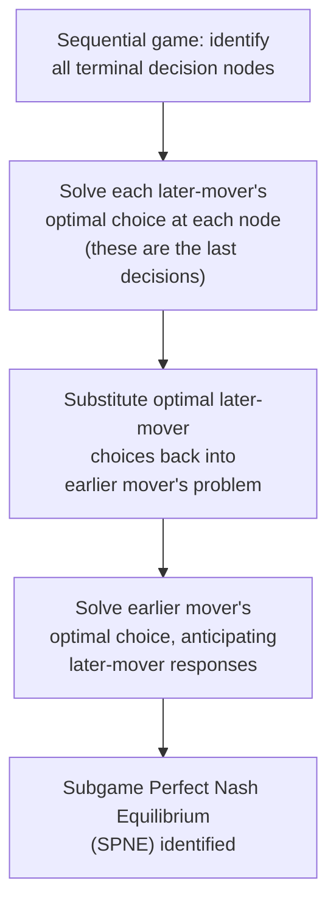

## Simultaneous vs Sequential Games

### Definitions

**Simultaneous Game**: A game in which players choose their actions at the same time (or, more precisely, without observing the other player's chosen action before making their own decision) — even if the actual timing is not literally identical, what matters is that no player has information about the other's move before committing to their own.

**Sequential Game**: A game in which players move in a defined order, with at least one player observing an earlier player's action before choosing their own — later movers can condition their strategy on what they have observed.

### Representation: Normal Form vs. Extensive Form

**Key Points**

- **Simultaneous games** are typically represented in **normal form** (also called strategic form) — a payoff matrix listing each player's possible strategies and the resulting payoffs for every combination of choices.
- **Sequential games** are typically represented in **extensive form** — a game tree showing the order of moves, the information available to each player at each decision point, and the resulting payoffs at each terminal node (endpoint of the tree).
- [Inference] Any sequential game can, in principle, also be represented in normal form (by treating each player's full contingent plan as a single strategy), and conversely, a simultaneous game can be represented as a sequential game with an added information constraint (each player's information set does not distinguish between the other player's possible prior moves) — the two representations are formally connected, though the extensive-form tree is generally the more natural and informative representation for genuinely sequential decision problems.

**Normal Form (Simultaneous) — Payoff Matrix Example**

|  | Player B: Left | Player B: Right |
| --- | --- | --- |
| **Player A: Up** | (3, 3) | (0, 5) |
| **Player A: Down** | (5, 0) | (1, 1) |

**Extensive Form (Sequential) — Game Tree Example (svg_diagram)**

<svg xmlns="http://www.w3.org/2000/svg" viewBox="0 0 600 400" font-family="sans-serif">
<text x="300" y="24" text-anchor="middle" font-size="16" font-weight="bold">Extensive Form Game Tree (svg_diagram)</text>
<circle cx="300" cy="70" r="6" fill="black" />
<text x="310" y="65" font-size="12">Player A moves</text>
<line x1="300" y1="70" x2="150" y2="160" stroke="black" stroke-width="1.5" />
<text x="200" y="110" font-size="12">Up</text>
<line x1="300" y1="70" x2="450" y2="160" stroke="black" stroke-width="1.5" />
<text x="400" y="110" font-size="12">Down</text>
<circle cx="150" cy="160" r="6" fill="black" />
<text x="90" y="155" font-size="11">Player B moves</text>
<circle cx="450" cy="160" r="6" fill="black" />
<text x="460" y="155" font-size="11">Player B moves</text>
<line x1="150" y1="160" x2="70" y2="260" stroke="black" stroke-width="1.5" />
<text x="80" y="210" font-size="11">Left</text>
<line x1="150" y1="160" x2="230" y2="260" stroke="black" stroke-width="1.5" />
<text x="190" y="210" font-size="11">Right</text>
<line x1="450" y1="160" x2="370" y2="260" stroke="black" stroke-width="1.5" />
<text x="380" y="210" font-size="11">Left</text>
<line x1="450" y1="160" x2="530" y2="260" stroke="black" stroke-width="1.5" />
<text x="490" y="210" font-size="11">Right</text>

<text x="55" y="280" font-size="12" font-weight="bold">(3, 3)</text>

<text x="215" y="280" font-size="12" font-weight="bold">(0, 5)</text>

<text x="355" y="280" font-size="12" font-weight="bold">(5, 0)</text>

<text x="515" y="280" font-size="12" font-weight="bold">(1, 1)</text>

<text x="130" y="330" font-size="11" fill="#555">Player B observes A's move</text>

<text x="330" y="330" font-size="11" fill="#555">before choosing own action</text>

</svg>

### The Critical Distinguishing Feature: Information

**Key Points**

- The essential difference is not literally about clock time, but about **information available at the time of decision**: does a player know what the other player has already chosen before making their own choice?
- In sequential games, this is formalized using **information sets** — a follower's information set at their decision node reflects exactly what they can observe about the prior mover's action.
- A game can technically have moves occurring at different calendar times but still be *analytically* simultaneous if neither player can observe the other's choice before committing (e.g., two firms submitting sealed competitive bids on different days, but neither sees the other's bid beforehand) — this is why economists emphasize the informational structure of the game over the literal timing.

### Equilibrium Concepts

| Game Type | Standard Solution Concept | Solved By |
| --- | --- | --- |
| Simultaneous | **Nash Equilibrium** | Finding mutual best responses (each player's strategy is optimal given the other's strategy) |
| Sequential | **Subgame Perfect Nash Equilibrium (SPNE)** | **Backward induction** (solving later decision nodes first, then working back to the initial move) |

**Key Points**

- **Nash Equilibrium** (simultaneous games): a set of strategies, one for each player, such that no player can improve their payoff by unilaterally deviating, given the strategies chosen by all other players.
- **Subgame Perfect Nash Equilibrium** (sequential games): a refinement of Nash equilibrium requiring that players' strategies constitute a Nash equilibrium not just for the overall game, but for **every subgame** (every possible decision point that could be reached) — this rules out non-credible threats that could otherwise support a Nash equilibrium in the overall game but that a rational player would not actually carry out if that decision point were actually reached.
- **Backward induction** is the standard solution technique for sequential games: solve the last-mover's optimal decision at each possible final decision node first, then substitute this into the prior mover's decision problem, working backward to the first move (this is exactly the technique used to solve the [[Stackelberg leadership model]] earlier in this course).

### Why the Distinction Matters: Non-Credible Threats

**Key Points**

- A key reason sequential-game analysis requires a *stronger* solution concept (SPNE) than simple Nash equilibrium is to rule out **non-credible threats** — strategies that look like a Nash equilibrium of the overall extensive-form game (when analyzed in normal form) but that involve a later player threatening an action they would not actually find optimal to carry out if that decision point were genuinely reached.
- **Example**: An incumbent firm might publicly threaten to flood the market with output (a price war) if a potential entrant enters. If flooding the market would actually be unprofitable for the incumbent *once entry has already occurred* (compared to simply accommodating the new entrant), this threat is **not credible** — a potential entrant, reasoning through backward induction, would correctly predict the incumbent will not actually follow through, and would enter anyway. Backward induction and SPNE correctly rule out equilibria resting on such empty threats, whereas naive application of Nash equilibrium to the reduced normal-form game might not.

### Comparative Application Across This Course's Oligopoly Models

**Key Points**

This distinction directly explains why different oligopoly models (covered earlier in this chapter) require different solution techniques:

| Model | Move Structure | Solution Concept |
| --- | --- | --- |
| Cournot Competition | Simultaneous (quantities) | Nash Equilibrium (via reaction functions) |
| Bertrand Competition | Simultaneous (prices) | Nash Equilibrium |
| Stackelberg Leadership Model | Sequential (leader then follower) | Subgame Perfect Nash Equilibrium (via backward induction) |

[Inference] This is precisely why the Stackelberg leader's problem (see [[Stackelberg leadership model]]) required substituting the follower's reaction function directly into the leader's profit function *before* optimizing, rather than simply solving two independent first-order conditions simultaneously as in Cournot — the sequential structure and resulting need for backward induction is the direct source of that methodological difference between the two models.

### First-Mover vs. Second-Mover Advantage

**Key Points**

- Sequential games can feature either a **first-mover advantage** (as in the Stackelberg model, where committing early to a large output benefits the leader) or, in other strategic settings, a **second-mover advantage** (where observing the first mover's action before responding is more valuable than moving first) — which one applies depends on the specific structure of the game (e.g., whether strategies are **strategic substitutes**, favoring first-mover commitment, or **strategic complements**, which can favor waiting to observe and match).
- [Inference] Whether a real-world strategic situation exhibits first-mover or second-mover advantage is a case-specific empirical and structural question — there is no general rule that moving first (or second) is always preferable across all sequential games; it depends on the payoff structure and the nature of the strategic interaction (e.g., quantity competition with substitute strategic effects, as in Stackelberg, typically favors the first mover, whereas certain price-matching or "wait and see" contexts might favor the second mover, who can adapt to the leader's revealed choice).

### Simultaneous Games with Repeated Interaction

**Key Points**

- A **repeated game** consists of the same simultaneous (or sequential) "stage game" played multiple times, with players able to observe outcomes of previous rounds before playing again.
- This transforms the strategic environment substantially: even if each individual stage game is simultaneous (e.g., a one-shot Prisoner's Dilemma or Cournot game), the *repeated* structure introduces a form of **implicit sequentiality across rounds** — players can condition their round-$t$ strategy on the observed history of play in rounds $1$ through $t-1$.
- This is the mechanism underlying sustained cartel cooperation via trigger strategies, discussed in [[Cartels and collusion]] — a technically "simultaneous" stage game (e.g., simultaneous output or pricing decisions each period) can support cooperative outcomes across the repeated game as a whole, precisely because of the sequential, round-by-round observability of past actions.

### Common Pitfalls

- Assuming "simultaneous" strictly means "at the exact same clock time" — the defining feature is the *informational* structure (whether a player can observe the other's action before choosing), not literal timing.
- Applying ordinary Nash equilibrium analysis directly to a sequential game's normal-form representation without checking for subgame perfection — this can mistakenly validate equilibria that rely on non-credible threats which a rational player would not actually carry out if the relevant decision point were reached.
- Assuming first-mover advantage is a universal feature of all sequential games — whether moving first or observing and reacting second is more advantageous depends on the specific payoff structure (strategic substitutes vs. strategic complements) of the particular game.
- Confusing a repeated simultaneous game (multiple rounds of a simultaneous stage game, with history observable between rounds) with a genuinely sequential game (where within a single round, one player observes another's move before acting) — these are distinct structures, even though both can support outcomes not achievable in a single one-shot simultaneous interaction.

**Related Topics**

- Nash Equilibrium and Best-Response Analysis
- Subgame Perfect Nash Equilibrium and Backward Induction
- Stackelberg Leadership Model
- Cournot and Bertrand Competition
- Repeated Games and the Folk Theorem
- Credible Threats and Commitment Devices
- Cartels and Collusion