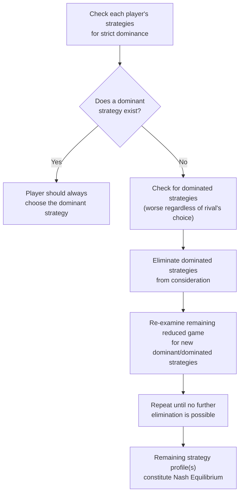

## Payoff Matrices and Strategic Form Games

### Definitions

**Strategic Form Game** (also called **Normal Form Game**): A representation of a game specifying (1) the set of players, (2) the set of possible strategies available to each player, and (3) the payoff each player receives for every possible combination of strategies chosen by all players. This representation is most naturally suited to simultaneous-move games (see [[Simultaneous vs sequential games]]), since it does not explicitly show timing or sequencing of moves.

**Payoff Matrix**: The standard visual representation of a two-player strategic form game, organized as a grid where rows represent one player's strategies, columns represent the other player's strategies, and each cell contains an ordered pair of payoffs (Row player's payoff, Column player's payoff) resulting from that particular strategy combination.

### Formal Components of a Strategic Form Game

A strategic form game is formally defined by the triple $G = (N, S, u)$:

- $N = \{1, 2, \dots, n\}$ — the finite set of players.
- $S = S_1 \times S_2 \times \dots \times S_n$ — the set of strategy profiles, where $S_i$ is the strategy set available to player $i$.
- $u = (u_1, u_2, \dots, u_n)$ — the payoff (utility) functions, where $u_i: S \rightarrow \mathbb{R}$ maps each strategy profile to a real-valued payoff for player $i$.

### Constructing and Reading a Payoff Matrix

**Example: Basic Two-Player, Two-Strategy Game**

|  | Player B: Strategy X | Player B: Strategy Y |
| --- | --- | --- |
| **Player A: Strategy 1** | (4, 4) | (1, 5) |
| **Player A: Strategy 2** | (5, 1) | (2, 2) |

**Key Points**

- By strict convention, the **first number** in each ordered pair is the **row player's** payoff, and the **second number** is the **column player's** payoff.
- To find the outcome of a specific strategy combination (e.g., Player A chooses Strategy 2, Player B chooses Strategy X), locate the corresponding cell: Row "Strategy 2," Column "Strategy X" → payoff pair $(5, 1)$ — Player A receives 5, Player B receives 1.
- The matrix fully specifies the game **only** for simultaneous, one-shot interactions where each player chooses their strategy without observing the other's choice — this is what makes it appropriate for representing Cournot or Bertrand-style interactions but insufficient (without extension) for genuinely sequential games like Stackelberg.

### Finding Nash Equilibria via the Payoff Matrix

**Key Points**

A **Nash Equilibrium** is a strategy profile in which no player can improve their own payoff by unilaterally changing their strategy, given the other player's chosen strategy. The standard method for identifying Nash equilibria directly from a payoff matrix is the **best-response (underline) method**:

1. For each of Player B's possible strategies (each column), identify Player A's best response (the row giving A the highest payoff in that column) and underline A's payoff.
2. For each of Player A's possible strategies (each row), identify Player B's best response (the column giving B the highest payoff in that row) and underline B's payoff.
3. Any cell where **both** payoffs are underlined is a **pure-strategy Nash Equilibrium**.

**Worked Example: Best-Response Method**

|  | Player B: X | Player B: Y |
| --- | --- | --- |
| **Player A: 1** | (4, <u>4</u>) | (<u>1</u>, 5) |
| **Player A: 2** | (<u>5</u>, 1) | (2, 2) |

- Column X: Player A compares 4 (Strategy 1) vs. 5 (Strategy 2) → best response is Strategy 2 (payoff 5, underlined).
- Column Y: Player A compares 1 (Strategy 1) vs. 2 (Strategy 2) → best response is Strategy 2 (payoff 2), but let's re-check: since 2 > 1, A's best response to Y is Strategy 2 as well — this example, on reflection, has no cell with both entries underlined using these particular payoffs, illustrating that not every payoff matrix has a pure-strategy Nash equilibrium (discussed further below).

[Note: the classic textbook illustration of this method is the Prisoner's Dilemma, shown next, which cleanly demonstrates a unique pure-strategy Nash equilibrium.]

### Classic Example: The Prisoner's Dilemma

|  | Player B: Cooperate | Player B: Defect |
| --- | --- | --- |
| **Player A: Cooperate** | (-1, -1) | (-10, 0) |
| **Player A: Defect** | (0, -10) | (-5, -5) |

**Key Points**

- Applying the best-response method: regardless of what Player B chooses, Player A's payoff from "Defect" is always higher than from "Cooperate" (0 > -1 if B cooperates; -5 > -10 if B defects) — "Defect" is a **dominant strategy** for Player A. By symmetry, "Defect" is also a dominant strategy for Player B.
- The unique Nash equilibrium is **(Defect, Defect)**, yielding payoffs $(-5,-5)$ — even though **(Cooperate, Cooperate)**, yielding $(-1,-1)$, would make both players better off. This illustrates the central insight of the Prisoner's Dilemma: individually rational behavior (each player best-responding) can lead to a **jointly (Pareto) inferior outcome**.
- This exact logical structure underlies the cartel-cheating instability discussed in [[Cartels and collusion]] — each cartel member has a dominant incentive to "defect" (cheat on the agreed quota) even though mutual "cooperation" (honoring the cartel) would yield higher joint profit.

### Dominant and Dominated Strategies

**Key Points**

- A **dominant strategy** is a strategy that yields a player a higher payoff than any of their other strategies, **regardless** of what the other player(s) choose — a player possessing a dominant strategy should always choose it, since no belief about the rival's action changes this conclusion.
- A **dominated strategy** is a strategy that yields a lower payoff than some other available strategy for a player, no matter what the other player(s) do — rational players should never choose a strictly dominated strategy.
- **Iterated elimination of dominated strategies**: a solution technique in which strictly dominated strategies are successively removed from the game (since no rational player would ever choose them), progressively simplifying the game — in some games, this process narrows the game down to a single remaining strategy profile, which must then be the unique Nash equilibrium.

### When No Pure-Strategy Nash Equilibrium Exists: Mixed Strategies

**Key Points**

- Some payoff matrices have **no pure-strategy Nash equilibrium** at all — no single deterministic strategy combination satisfies the mutual best-response condition.
- **Example: Matching Pennies**

|  | Player B: Heads | Player B: Tails |
| --- | --- | --- |
| **Player A: Heads** | (1, -1) | (-1, 1) |
| **Player A: Tails** | (-1, 1) | (1, -1) |

Applying the best-response method to every cell reveals that in each cell, at least one player would prefer to switch — there is no cell where both payoffs are simultaneously best responses.

- In such games, equilibrium exists only in **mixed strategies** — where each player randomizes across their available pure strategies according to a specific probability distribution, chosen such that the opponent is made indifferent between their own strategies (removing any incentive to deviate). [Confirmed] Nash's existence theorem guarantees that every finite strategic form game has at least one Nash equilibrium, provided mixed strategies are allowed — this is a foundational result in game theory, though calculating mixed-strategy equilibria requires additional technique beyond the basic pure-strategy best-response method shown above.

### Application: Representing Cournot and Bertrand as Strategic Form Games

**Key Points**

- The [[Cournot competition]] and [[Bertrand competition]] models covered earlier in this chapter are, at their foundation, strategic form (simultaneous) games — though because firms typically choose from a *continuum* of possible quantities or prices (rather than a small finite set of discrete strategies), they are usually analyzed via calculus-based reaction functions rather than a small finite payoff matrix, even though the underlying strategic logic (simultaneous choice, mutual best response, Nash equilibrium) is identical to the finite-matrix games shown in this section.
- [Inference] A finite payoff matrix is most useful pedagogically for illustrating core game-theoretic concepts clearly (dominant strategies, the Prisoner's Dilemma structure, mixed strategies) with a small number of discrete options, while continuous-strategy models like Cournot and Bertrand require the reaction-function approach to handle the infinite strategy space — but both rest on the same underlying Nash equilibrium solution concept.

### Comparison: Strategic Form vs. Extensive Form

| Feature | Strategic (Normal) Form | Extensive Form |
| --- | --- | --- |
| Best suited for | Simultaneous games | Sequential games |
| Representation | Payoff matrix | Game tree |
| Shows timing/order of moves | No (implicitly simultaneous) | Yes, explicitly |
| Standard solution concept | Nash Equilibrium | Subgame Perfect Nash Equilibrium |
| Solution technique | Best-response / dominance analysis | Backward induction |

### Common Pitfalls

- Mislabeling payoffs in the matrix — forgetting the row-player-first, column-player-second convention leads to systematically incorrect identification of best responses and equilibria.
- Assuming every payoff matrix has a pure-strategy Nash equilibrium — as the Matching Pennies example demonstrates, some games require mixed-strategy analysis to identify any equilibrium at all.
- Confusing a **dominant strategy** (best regardless of the rival's choice) with simply the strategy that happens to yield the highest payoff in one particular cell — dominance requires the comparison to hold across *every* possible action by the rival, not just one.
- Assuming the Prisoner's Dilemma's mutually-defecting Nash equilibrium implies players are behaving "irrationally" — each player is fully rational and correctly best-responding; the socially inferior outcome arises precisely *because* of individually rational behavior, which is the core insight of the model, not a contradiction of it.

**Related Topics**

- Simultaneous vs. Sequential Games
- Nash Equilibrium and Best-Response Analysis
- Prisoner's Dilemma and Dominant Strategies
- Mixed-Strategy Equilibria
- Cournot and Bertrand Competition
- Cartels and Collusion
- Iterated Elimination of Dominated Strategies