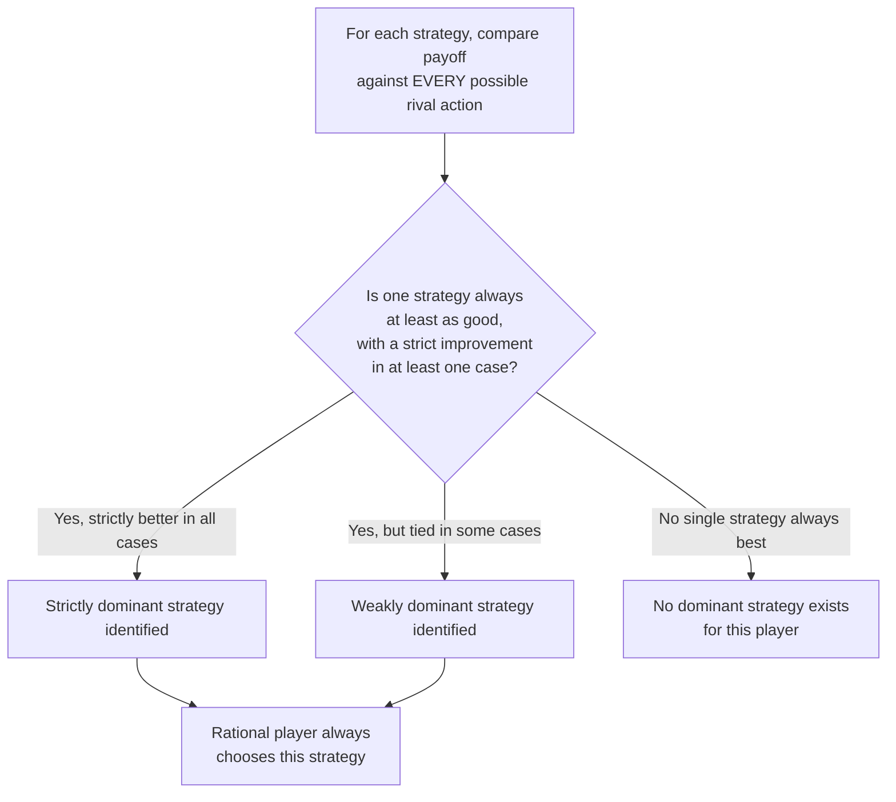
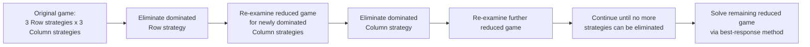

## Dominant and Dominated Strategies

### Definitions

**Dominant Strategy**: A strategy that yields a player a strictly (or weakly) higher payoff than every other available strategy, **regardless** of what strategy the other player(s) choose. A player possessing a dominant strategy should always choose it, since no belief about rivals' actions could ever change this conclusion.

**Dominated Strategy**: A strategy that yields a player a strictly (or weakly) lower payoff than some other available strategy, **regardless** of what the other player(s) choose. A rational player should never select a strictly dominated strategy, since an alternative exists that performs at least as well against every possible rival action.

### Strict vs. Weak Dominance

**Key Points**

**Strict Dominance**: Strategy $s_i$ strictly dominates strategy $s_i'$ for player $i$ if:

$$u_i(s_i, s_{-i}) > u_i(s_i', s_{-i}) \quad \text{for every possible strategy } s_{-i} \text{ of the other player(s)}$$

That is, $s_i$ yields a **strictly higher** payoff than $s_i'$ against every possible rival strategy, with no exceptions.

**Weak Dominance**: Strategy $s_i$ weakly dominates strategy $s_i'$ if:

$$u_i(s_i, s_{-i}) \geq u_i(s_i', s_{-i}) \quad \text{for every possible } s_{-i}, \quad \text{with strict inequality for at least one } s_{-i}$$

That is, $s_i$ is **at least as good** as $s_i'$ against every rival strategy, and **strictly better** against at least one.

**Key Points**

- The distinction matters for solution technique reliability: eliminating **strictly** dominated strategies never removes a strategy that could be part of a Nash equilibrium, so iterated strict elimination is always a safe simplification technique. Eliminating **weakly** dominated strategies can, in some games, eliminate a strategy that was part of a legitimate Nash equilibrium — [Inference] this is a recognized technical subtlety in the game theory literature, meaning that iterated elimination of *weakly* dominated strategies must be applied with more caution than the strict version, since the order of elimination can, in some cases, affect the final outcome reached.

### Identifying a Dominant Strategy: Worked Example

Consider a payoff matrix (Row player, Column player):

|  | Column: Left | Column: Right |
| --- | --- | --- |
| **Row: Up** | (6, 4) | (6, 1) |
| **Row: Down** | (2, 3) | (3, 0) |

**Checking Row player's strategies**:

- If Column plays Left: Row gets 6 (Up) vs. 2 (Down) → Up is better.
- If Column plays Right: Row gets 6 (Up) vs. 3 (Down) → Up is better.
- Since **Up** yields a strictly higher payoff than Down regardless of Column's choice, **Up is a strictly dominant strategy** for Row.

**Checking Column player's strategies**:

- If Row plays Up: Column gets 4 (Left) vs. 1 (Right) → Left is better.
- If Row plays Down: Column gets 3 (Left) vs. 0 (Right) → Left is better.
- **Left is a strictly dominant strategy** for Column.

**Conclusion**: Since both players have a dominant strategy, the game has a straightforward, unique **dominant strategy equilibrium**: (Up, Left), yielding payoffs $(6, 4)$.

### Iterated Elimination of Dominated Strategies (IEDS)

**Key Points**

When no player has an outright dominant strategy, a useful solution technique is **Iterated Elimination of Dominated Strategies**: successively remove strategies that are dominated (for any player), on the logic that a rational player would never choose them — this can shrink the game step by step, sometimes down to a single remaining strategy profile.

**Worked Example**

|  | Column: X | Column: Y | Column: Z |
| --- | --- | --- | --- |
| **Row: A** | (3, 2) | (2, 3) | (1, 1) |
| **Row: B** | (4, 1) | (0, 4) | (1, 0) |
| **Row: C** | (2, 2) | (2, 3) | (0, 1) |

**Step 1**: Compare Row's strategies. Row C is dominated by Row A: A gives (3,2,1) across columns X,Y,Z vs. C's (2,2,0) — A is at least as good in every column and strictly better in columns X and Z. Eliminate Row C.

**Step 2**: With Row C removed, compare Column's strategies (against remaining Rows A, B only). Column Z gives Column player (1, 0) across A, B — compare to Column X's (2, 1): Column X strictly dominates Column Z. Eliminate Column Z.

**Step 3**: With Columns reduced to X, Y and Rows reduced to A, B: compare Row A (3, 2) vs. Row B (4, 0) across remaining columns X, Y. Neither strictly dominates the other (A is better in Y, B is better in X) — no further row elimination via strict dominance.

**Result**: The reduced game (Rows A, B; Columns X, Y) requires further analysis (e.g., best-response method) to find the final Nash equilibrium, but IEDS has meaningfully simplified the problem by removing Row C and Column Z, which no rational player would ever choose.

### The Prisoner's Dilemma: A Canonical Dominant Strategy Example

|  | Player B: Cooperate | Player B: Defect |
| --- | --- | --- |
| **Player A: Cooperate** | (-1, -1) | (-10, 0) |
| **Player A: Defect** | (0, -10) | (-5, -5) |

**Key Points**

- For Player A: comparing Defect vs. Cooperate — if B cooperates, A gets 0 (Defect) vs. -1 (Cooperate); if B defects, A gets -5 (Defect) vs. -10 (Cooperate). **Defect strictly dominates Cooperate** for Player A regardless of B's choice.
- By symmetry, Defect is also strictly dominant for Player B.
- Because both players have a strictly dominant strategy, the unique equilibrium is (Defect, Defect), yielding $(-5,-5)$ — even though (Cooperate, Cooperate), yielding $(-1,-1)$, would make **both** players better off. This is the central paradox of the Prisoner's Dilemma: the presence of dominant strategies guarantees a straightforward, unambiguous prediction of play, but that predicted outcome is **Pareto-inferior** to an alternative both players would prefer.
- This exact structure is the formal foundation for why cartel agreements are inherently unstable (see [[Cartels and collusion]]): "cheat" functions as each firm's dominant strategy in the one-shot cartel game, exactly analogous to "defect" in the classic Prisoner's Dilemma.

### Practical Significance of Dominant Strategies

**Key Points**

- When a dominant strategy exists, it provides an unusually **robust prediction** of rational behavior — a player does not need to form any beliefs or expectations about what the rival will do, since the dominant strategy is optimal against every possible rival action. This is a stronger, more reliable equilibrium concept than one requiring correct beliefs about rivals' likely behavior.
- **Dominant Strategy Equilibrium** (when *every* player has a dominant strategy) is always a Nash Equilibrium — since each player is, by definition, best-responding to every possible rival strategy (including whatever the rival's actual equilibrium strategy turns out to be), it must also be a best response to that specific strategy. However, **not every Nash Equilibrium arises from dominant strategies** — many games (e.g., Cournot competition, most coordination games) have a Nash equilibrium without either player possessing an outright dominant strategy.

### Comparison: Dominant Strategy Equilibrium vs. Nash Equilibrium

| Concept | Requirement | Relationship |
| --- | --- | --- |
| Dominant Strategy Equilibrium | Each player's strategy is best against **every** possible rival strategy | A special (stronger) case — always also a Nash Equilibrium |
| Nash Equilibrium | Each player's strategy is best against the **specific** rival strategy actually chosen in equilibrium | More general — does not require dominance, only mutual best response at the equilibrium point |

[Inference] Games like Cournot or Bertrand competition (see [[Cournot competition]] and [[Bertrand competition]]) are typically solved via Nash equilibrium (mutual best response) precisely because no dominant strategy generally exists in those settings — a firm's optimal quantity or price depends on what it expects the rival to choose, unlike in dominant-strategy games where the optimal choice is invariant to the rival's action.

### Common Pitfalls

- Confusing "the strategy with the highest payoff in one cell" with a genuinely dominant strategy — dominance requires the comparison to hold against **every** possible action by the rival, not merely the one that happens to occur or the one initially considered.
- Applying iterated elimination of **weakly** dominated strategies without care regarding elimination order — unlike strict dominance elimination (which is always safe), the order of eliminating weakly dominated strategies can, in some games, affect which equilibria remain, a subtlety strict-dominance elimination does not share.
- Assuming every game has a dominant strategy for at least one player — many important economic models (Cournot, Bertrand, most coordination and matching games) have no dominant strategy for either player, requiring full Nash equilibrium (mutual best-response) analysis instead.
- Treating the Prisoner's Dilemma's dominant-strategy equilibrium as evidence of "irrational" behavior — the players are behaving perfectly rationally; the model's insight is precisely that individual rationality (following one's dominant strategy) can produce a jointly worse outcome than mutual cooperation would.

**Related Topics**

- Payoff Matrices and Strategic Form Games
- Nash Equilibrium and Best-Response Analysis
- Prisoner's Dilemma
- Simultaneous vs. Sequential Games
- Mixed-Strategy Equilibria
- Cartels and Collusion
- Cournot and Bertrand Competition