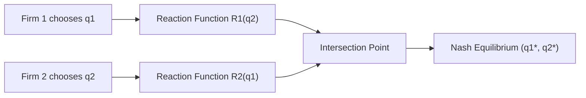

## Nash Equilibrium

### Definition and Core Concept

A Nash equilibrium is a solution concept in non-cooperative game theory describing a set of strategies, one for each player, such that no player can improve their own payoff by unilaterally changing their strategy while all other players keep theirs fixed. Formally, for a game with players $i = 1, \ldots, n$, strategy profile $s^* = (s_1^*, s_2^*, \ldots, s_n^*)$ is a Nash equilibrium if for every player $i$:

$$u_i(s_i^*, s_{-i}^*) \geq u_i(s_i, s_{-i}^*) \quad \forall s_i \in S_i$$

where $u_i$ is player $i$'s payoff function, $s_{-i}^*$ denotes the equilibrium strategies of all players other than $i$, and $S_i$ is player $i$'s strategy space.

The equilibrium represents mutual best responses: each player's chosen strategy is optimal given what everyone else is doing. It does not require that outcomes be efficient, fair, or even individually satisfying — only that no single player has an incentive to deviate alone.

### Key Points

- **Named after John Nash**, who proved existence in finite games in his 1950 dissertation, building on earlier work by Cournot (1838) on oligopoly best responses.
- **Self-enforcing, not cooperative**: no external enforcement or communication is required for players to sustain the equilibrium — it is stable because deviation is individually irrational.
- **Not necessarily unique**: many games have multiple Nash equilibria (in pure or mixed strategies).
- **Not necessarily efficient**: equilibria can be Pareto-dominated by other outcomes (see Prisoner's Dilemma below).
- **Existence**: [Inference — depends on game structure] every finite game with a finite number of players and finite strategy sets has at least one Nash equilibrium, possibly in mixed strategies (Nash's existence theorem, proved via Kakutani's fixed-point theorem).

### Types of Nash Equilibrium

#### Pure Strategy Nash Equilibrium (PSNE)

Each player commits to a single, specific action with certainty. Found by checking each strategy profile to see if any player benefits from deviating.

#### Mixed Strategy Nash Equilibrium (MSNE)

Players randomize over their available actions according to a probability distribution when no pure-strategy equilibrium exists, or in addition to existing pure equilibria. A mixed strategy is an equilibrium when each player is indifferent between the actions they place positive probability on, given the other player's mixed strategy — otherwise they would shift all probability toward the higher-payoff action.

### Finding Nash Equilibria: The Best Response Method

The standard technique for a normal-form (matrix) game:

1. For each strategy the opposing player might choose, identify the row/column player's best response (the payoff-maximizing choice).
2. Underline or mark best responses for both players across all combinations.
3. Any cell where **both** players' payoffs are marked as best responses is a pure-strategy Nash equilibrium.

**Example — Coordination Game:**

|  | Left | Right |
| --- | --- | --- |
| **Up** | 3, 3 | 0, 0 |
| **Down** | 0, 0 | 2, 2 |

Both (Up, Left) and (Down, Right) are pure-strategy Nash equilibria — neither player gains by deviating alone from either cell. This illustrates the multiplicity problem: the game alone doesn't tell us which equilibrium will occur without additional coordination devices (focal points, communication, convention).

### Example: The Prisoner's Dilemma

|  | Cooperate | Defect |
| --- | --- | --- |
| **Cooperate** | −1, −1 | −8, 0 |
| **Defect** | 0, −8 | −5, −5 |

(Payoffs represent years in prison lost, i.e., negative utility; higher/less-negative is better.)

- If Player 2 cooperates, Player 1's best response is Defect (0 > −1).
- If Player 2 defects, Player 1's best response is still Defect (−5 > −8).
- **Defect** is a strictly dominant strategy for both players, so **(Defect, Defect)** is the unique Nash equilibrium.

This is the canonical illustration that Nash equilibria need not be Pareto efficient: both players would be strictly better off at (Cooperate, Cooperate), yet neither can unilaterally move there without being exploited.

### Example: Mixed Strategy Equilibrium (Matching Pennies)

|  | Heads | Tails |
| --- | --- | --- |
| **Heads** | 1, −1 | −1, 1 |
| **Tails** | −1, 1 | 1, −1 |

No pure-strategy Nash equilibrium exists here — for any pure profile, one player always wants to switch. The equilibrium is in mixed strategies: each player plays Heads and Tails each with probability $p = \frac{1}{2}$.

**Derivation via indifference condition**: Let Player 2 play Heads with probability $q$. Player 1's expected payoff from Heads is $q(1) + (1-q)(-1)$; from Tails it is $q(-1) + (1-q)(1)$. Setting these equal:

$$q - (1-q) = -q + (1-q) \implies 4q = 2 \implies q = \frac{1}{2}$$

By symmetry, Player 1 also randomizes 50/50. Neither player can improve by deviating, since both actions yield the same expected payoff.

### Applications in Microeconomics

#### Cournot Duopoly (Quantity Competition)

Two firms choose output quantities $q_1, q_2$ simultaneously. Market price is $P(Q) = a - b(q_1 + q_2)$, and each firm has constant marginal cost $c$. Firm $i$ maximizes:

$$\pi_i = [a - b(q_1 + q_2) - c] q_i$$

Taking the first-order condition with respect to $q_i$ and solving simultaneously yields each firm's **reaction function**:

$$q_i^* = \frac{a - c - b q_j}{2b}$$

The Cournot–Nash equilibrium is the intersection of both reaction functions, where each firm's output is a best response to the other's:

$$q_1^* = q_2^* = \frac{a - c}{3b}$$

Equilibrium price and quantity lie between the competitive and monopoly outcomes — a standard result of oligopoly theory.

#### Bertrand Price Competition

Firms compete on price instead of quantity with homogeneous goods and constant marginal cost $c$. The unique Nash equilibrium is $p_1^* = p_2^* = c$ (price equals marginal cost), because any price above $c$ invites undercutting by the rival to capture the entire market, driving prices down to cost — the **Bertrand paradox**, since even two firms replicate the competitive outcome.

#### Entry Deterrence and Market Structure

Nash equilibrium analysis underlies models of strategic entry deterrence, where an incumbent's capacity or pricing choice is a best response anticipating a potential entrant's best response, often solved via backward induction in the dynamic (extensive-form) version — see Subgame Perfect Equilibrium below.

### Relationship to Dominant Strategy Equilibrium

A dominant strategy equilibrium (where each player has one strategy that is best regardless of what others do) is always a Nash equilibrium, but the reverse is not true — most Nash equilibria (like the coordination game above) involve strategies that are best responses only to the specific strategies chosen by others, not universally dominant.

### Refinements of Nash Equilibrium

Because Nash equilibrium in extensive-form (sequential) games can permit implausible outcomes sustained only by non-credible threats, several refinements are commonly used:

- **Subgame Perfect Nash Equilibrium (SPNE)**: requires the strategy profile to induce a Nash equilibrium in every subgame, typically solved via backward induction. Eliminates equilibria relying on incredible threats.
- **Bayesian Nash Equilibrium**: extends the concept to games of incomplete information, where players have private information (types) and best-respond given beliefs about others' types.
- **Perfect Bayesian Equilibrium / Sequential Equilibrium**: further refine Bayesian Nash equilibrium in dynamic games with incomplete information, requiring consistent beliefs updated via Bayes' rule where possible.

### Limitations and Critiques

- **Multiplicity**: many games yield multiple equilibria with no theory-internal way to select among them (addressed by equilibrium refinements, focal points, or evolutionary/learning dynamics).
- **Rationality assumptions**: Nash equilibrium presumes common knowledge of rationality and correct beliefs about others' strategies; [Inference] real-world behavior in experimental settings (e.g., ultimatum game, repeated Prisoner's Dilemma) frequently deviates from Nash predictions.
- **Efficiency is not guaranteed**: as shown in the Prisoner's Dilemma, equilibrium outcomes can be strictly worse for all players than a jointly feasible alternative.
- **Behavioral claims about deviation may vary** depending on players' actual information, risk preferences, and repeated-game reputation effects not captured in the static, one-shot formulation.

### Visual Summary: Best Response Intersection (Cournot Model)

<svg xmlns="http://www.w3.org/2000/svg" viewBox="0 0 500 400">
<text x="150" y="20" font-size="14" font-weight="bold" fill="black">Cournot Reaction Functions (svg_diagram)</text>
<line x1="50" y1="350" x2="450" y2="350" stroke="black" stroke-width="1.5" />
<line x1="50" y1="350" x2="50" y2="30" stroke="black" stroke-width="1.5" />
<text x="460" y="355" font-size="12" fill="black">q1</text>
<text x="30" y="25" font-size="12" fill="black">q2</text>
<line x1="50" y1="80" x2="420" y2="330" stroke="blue" stroke-width="2" />
<text x="300" y="220" font-size="12" fill="blue">R2(q1)</text>
<line x1="80" y1="330" x2="380" y2="60" stroke="red" stroke-width="2" />
<text x="330" y="100" font-size="12" fill="red">R1(q2)</text>
<circle cx="238" cy="197" r="5" fill="black" />
<text x="248" y="190" font-size="12" fill="black">Nash Eq. (q1*, q2*)</text>
</svg>

### Related Topics

- Dominant and dominated strategy elimination
- Subgame perfect equilibrium and backward induction
- Bayesian games and incomplete information
- Cournot vs. Bertrand oligopoly models
- Repeated games and the Folk Theorem
- Evolutionarily stable strategies (ESS)
- Mechanism design and Nash implementation
- Correlated equilibrium (Aumann)