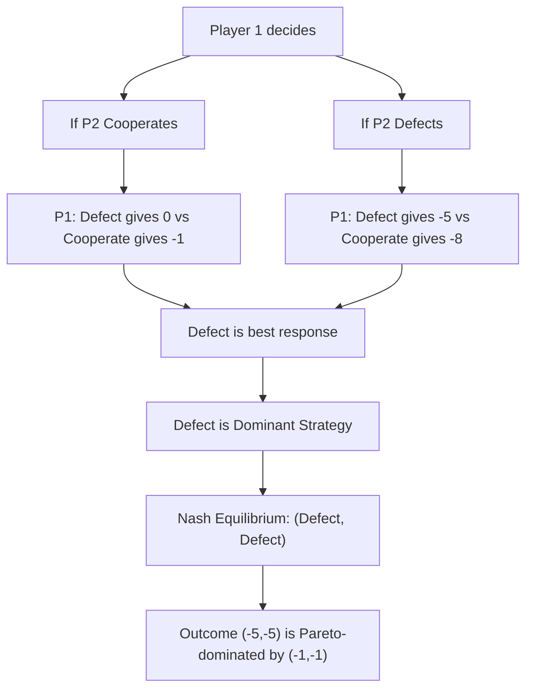

## Prisoner's Dilemma

### Definition and Core Concept

The Prisoner's Dilemma is a foundational non-cooperative game illustrating the tension between individual rationality and collective welfare. Two players, each acting to maximize their own payoff without communication or binding agreements, arrive at an outcome that is worse for both than an alternative they could have jointly achieved. It demonstrates that a Nash equilibrium need not be Pareto efficient.

### Origin

The game was formalized in 1950 by Merrill Flood and Melvin Dresher at the RAND Corporation, with the "prisoner" framing and name attributed to Albert W. Tucker, who used it to illustrate the concept to a psychology audience.

### The Classic Story and Payoff Structure

Two suspects are arrested and interrogated separately, unable to communicate. Each is offered the same deal:

- If both stay silent (**Cooperate** with each other), both receive a light sentence.
- If one betrays the other (**Defect**) while the other stays silent, the betrayer goes free and the silent one receives a harsh sentence.
- If both betray each other, both receive a moderate sentence — worse than mutual silence but better than being the lone silent one.

**Payoff Matrix (years in prison; lower is better, shown as negative utility):**

|  | Player 2: Cooperate | Player 2: Defect |
| --- | --- | --- |
| **Player 1: Cooperate** | −1, −1 | −8, 0 |
| **Player 1: Defect** | 0, −8 | −5, −5 |

The general structure requires the payoff ranking (from each player's perspective, best to worst): **Temptation** (unilateral defection) > **Reward** (mutual cooperation) > **Punishment** (mutual defection) > **Sucker's payoff** (unilateral cooperation), commonly denoted:

$$T > R > P > S$$

with the additional condition $2R > T + S$ ensuring mutual cooperation is not merely a compromise but genuinely efficient relative to alternating exploitation.

### Strategic Analysis: Why Defection Dominates

#### Dominant Strategy Reasoning

Consider Player 1's decision:

- If Player 2 cooperates: Player 1 gets 0 by defecting vs. −1 by cooperating → **Defect is better**.
- If Player 2 defects: Player 1 gets −5 by defecting vs. −8 by cooperating → **Defect is better**.

Defection is a **strictly dominant strategy** — optimal regardless of the opponent's choice. Since both players reason identically, **(Defect, Defect)** is the unique Nash equilibrium, reached through iterated elimination of dominated strategies without needing to guess the opponent's move.

#### The Dilemma Itself

Mutual cooperation, $(-1, -1)$, **Pareto dominates** the equilibrium outcome $(-5, -5)$ — both players would be strictly better off. Yet neither can move there unilaterally: if Player 1 cooperates hoping Player 2 will too, Player 1 risks the sucker's payoff of −8 if Player 2 defects instead. Individual rationality prevents the collectively rational outcome from being sustained.

### Visualizing the Logic

<svg xmlns="http://www.w3.org/2000/svg" viewBox="0 0 520 380">
<text x="120" y="20" font-size="14" font-weight="bold" fill="black">Prisoner's Dilemma Payoff Space (svg_diagram)</text>
<line x1="60" y1="330" x2="480" y2="330" stroke="black" stroke-width="1.5" />
<line x1="60" y1="330" x2="60" y2="40" stroke="black" stroke-width="1.5" />
<text x="485" y="335" font-size="12" fill="black">Player 1 payoff</text>
<text x="20" y="35" font-size="12" fill="black">Player 2 payoff</text>
<circle cx="150" cy="260" r="6" fill="red" />
<text x="160" y="265" font-size="12" fill="red">(Defect,Defect) = Nash Eq.</text>
<circle cx="330" cy="120" r="6" fill="green" />
<text x="340" y="115" font-size="12" fill="green">(Cooperate,Cooperate) = Pareto Optimal</text>
<circle cx="440" cy="300" r="6" fill="blue" />
<text x="330" y="315" font-size="11" fill="blue">(Defect,Cooperate)</text>
<circle cx="90" cy="70" r="6" fill="blue" />
<text x="95" y="60" font-size="11" fill="blue">(Cooperate,Defect)</text>
<line x1="150" y1="260" x2="330" y2="120" stroke="gray" stroke-dasharray="4" stroke-width="1" />
<text x="200" y="205" font-size="10" fill="gray">Efficiency gap</text>
</svg>

### Real-World and Economic Applications

#### Oligopoly and Cartel Instability

Firms in an oligopoly deciding whether to collude on high prices or undercut face a Prisoner's Dilemma structure: mutual high pricing (collusion) yields greater joint profit than mutual price-cutting (competition), but each firm has an individual incentive to secretly undercut the other, which is why cartels are inherently unstable without enforcement mechanisms.

#### Public Goods Provision and Free-Riding

Individuals deciding whether to contribute to a public good (e.g., funding a shared resource) face similar incentives: free-riding (defecting) is individually optimal regardless of others' contributions, but universal free-riding under-provides the good relative to universal contribution — a core justification for taxation and collective enforcement in public economics.

#### Advertising Wars

Two firms deciding whether to advertise heavily: if both advertise, they cancel out each other's market-share gains at high cost (mutual defection); if neither advertises, both save costs while maintaining market share (mutual cooperation); but each firm fears losing share if it unilaterally abstains, so both end up advertising — a frequently cited real-world instance of the dilemma [Inference — stylized characterization of firm behavior, not a universal empirical law].

#### Arms Races and International Relations

Two nations deciding whether to arm or disarm face the same structure: mutual disarmament is jointly preferable to mutual armament, but the fear of unilateral vulnerability drives both toward arming.

### The Iterated Prisoner's Dilemma

When the game is repeated indefinitely (or with unknown end point) between the same players, cooperation can become sustainable as a Nash equilibrium of the repeated game, supported by strategies that punish defection in future rounds.

#### Key Strategies

- **Tit-for-Tat**: cooperate on the first move, then replicate the opponent's previous move. Famous for its strong performance in Robert Axelrod's computer tournaments (1980s) due to being nice, retaliatory, forgiving, and clear.
- **Grim Trigger**: cooperate until the opponent defects once, then defect forever after — a harsh but simple punishment strategy.
- **Win-Stay, Lose-Shift (Pavlov)**: repeat the previous action if it yielded a good outcome; switch otherwise.

#### The Folk Theorem

In infinitely repeated games with sufficiently patient players (discount factor close to 1), the **Folk Theorem** establishes that a wide range of outcomes — including sustained cooperation — can be supported as Nash (or subgame perfect) equilibria, provided deviation is deterred by the threat of future punishment. This result depends on players placing sufficient weight on future payoffs relative to the one-shot temptation to defect [Inference — theoretical result contingent on discount factor and monitoring assumptions; real-world enforcement and observability may vary].

#### Finite Repetition and Backward Induction

If the game is repeated a known, finite number of times, backward induction unravels cooperation entirely: in the last round, defection is dominant (no future to protect), so in the second-to-last round players anticipate this and defect too, and so on — collapsing to defection in every round, even though intuitively repetition might seem to support cooperation. [Inference — a standard theoretical result; experimental behavior often departs from this prediction].

### Distinguishing Prisoner's Dilemma from Other Games

| Game | Key Difference from PD |
| --- | --- |
| **Stag Hunt** | Mutual cooperation is a Nash equilibrium too (no dominant strategy to defect); risk vs. payoff dominance drives the dilemma instead |
| **Chicken (Hawk-Dove)** | Mutual aggression is the worst outcome for both, not an equilibrium; the equilibria involve one player yielding |
| **Coordination Games** | Multiple equilibria exist and are all efficient; the problem is selecting one, not escaping inefficiency |

### Limitations and Critiques

- **Assumes one-shot, no-communication interaction**; real-world strategic settings often allow reputation-building, communication, or repeated interaction that alters incentives substantially.
- **Behavioral evidence**: [Inference] experimental studies frequently find cooperation rates well above the Nash prediction of universal defection, attributed to factors like social preferences, reciprocity, and framing effects not captured in the standard payoff-maximizing model.
- **Payoff structure is stylized**: real strategic interactions may not cleanly satisfy the $T > R > P > S$ ranking, and outcomes can be sensitive to how payoffs are actually specified.

### Related Topics

- Nash equilibrium and dominant strategies
- Iterated games and the Folk Theorem
- Tit-for-Tat and evolutionary game theory
- Public goods games and free-rider problem
- Cartel behavior and antitrust economics
- Stag Hunt and coordination games
- Mechanism design for cooperation enforcement