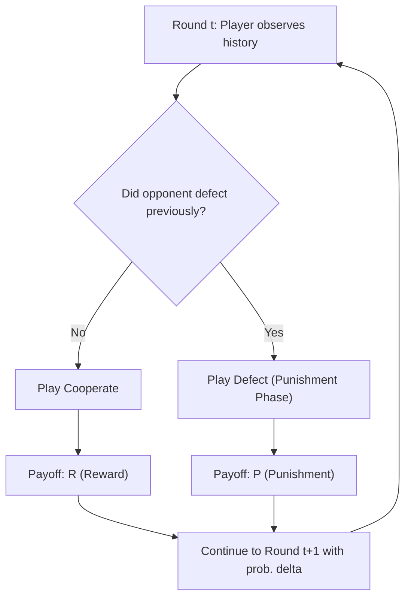

## Repeated Games and Cooperation

### Definition and Core Concept

A repeated game is a dynamic game in which the same set of players engages in the same "stage game" (a one-shot game, such as the Prisoner's Dilemma) multiple times, with players able to observe outcomes of previous rounds before choosing subsequent actions. Repetition fundamentally changes strategic incentives relative to a single one-shot interaction: the possibility of future retaliation or reward allows players to sustain cooperative outcomes that would be unstable if the stage game were played only once.

### Key Distinctions in Repeated Game Structure

#### Finitely Repeated Games

The stage game is played a fixed, commonly known number of times, $T$.

#### Infinitely Repeated Games

The stage game is played an unbounded number of times, or with an unknown, uncertain stopping point each round — modeled via a constant probability of continuation.

#### Discount Factor

Because future payoffs are generally valued less than present payoffs, repeated games incorporate a discount factor $\delta \in (0,1)$, representing either time preference or the probability the game continues to the next round. A player's total payoff across the repeated game is the discounted sum:

$$U_i = \sum_{t=0}^{\infty} \delta^t \, u_i(a^t)$$

where $u_i(a^t)$ is the stage-game payoff to player $i$ from the action profile played in period $t$. A discount factor closer to 1 means players weigh future consequences heavily; closer to 0 means players are impatient and largely ignore future retaliation.

### Why Finite Repetition Fails to Sustain Cooperation

If the Prisoner's Dilemma (or any game with a unique, inefficient stage-game Nash equilibrium) is repeated a known finite number of times, backward induction unravels cooperation entirely:

1. In the final round $T$, there is no future to protect, so both players defect (the dominant strategy of the stage game).
2. Anticipating universal defection in round $T$, players have no incentive to cooperate in round $T-1$ either, since cooperating there cannot influence round $T$ behavior.
3. This reasoning propagates backward through every round, so the unique subgame perfect equilibrium of the finitely repeated game is defection in every single period.

[Inference — this is a standard theoretical result of backward induction under complete information and common knowledge of rationality; experimental behavior frequently departs from this prediction, showing significant cooperation even in finitely repeated settings.]

### The Folk Theorem: Sustaining Cooperation in Infinite Repetition

When the stage game is repeated infinitely (or with unknown end point) and players are sufficiently patient, the **Folk Theorem** establishes that a very broad set of outcomes — including full cooperation — can be supported as a subgame perfect Nash equilibrium of the repeated game, as long as each player's payoff exceeds what they could guarantee themselves by deviating (their "minmax" payoff).

#### Intuition

Because the game continues indefinitely, a player who defects today sacrifices the stream of future cooperative payoffs in exchange for a one-time gain. If the discount factor is high enough, the loss from future punishment outweighs the short-term temptation, making cooperation individually rational.

#### Formal Condition (Grim Trigger Sustaining Cooperation)

Consider the Prisoner's Dilemma with **Temptation** $T$, **Reward** $R$, and **Punishment** $P$ payoffs ($T > R > P$). Under a Grim Trigger strategy (cooperate until any defection occurs, then defect forever), a player's discounted payoff from cooperating forever is:

$$\frac{R}{1 - \delta}$$

The payoff from defecting once (capturing $T$) and then facing permanent punishment $P$ thereafter is:

$$T + \frac{\delta P}{1 - \delta}$$

Cooperation is sustainable when the cooperative payoff is at least as large as the deviation payoff:

$$\frac{R}{1 - \delta} \geq T + \frac{\delta P}{1-\delta}$$

Solving for the discount factor threshold:

$$\delta \geq \frac{T - R}{T - P}$$

This is the **critical discount factor**: if players value the future enough (high $\delta$), sustained cooperation is a subgame perfect equilibrium; if they are too impatient (low $\delta$), defection is inevitable even in infinite repetition.

### Strategies for Sustaining Cooperation

#### Grim Trigger

Cooperate until the first observed defection, then defect in every subsequent period regardless of the opponent's behavior. This is the harshest possible punishment and is simple to describe, but it is unforgiving — a single mistake or misread signal locks both players into permanent defection.

#### Tit-for-Tat

Cooperate on the first move; thereafter, mimic the opponent's previous action. This strategy is nice (never defects first), retaliatory (punishes defection immediately), forgiving (returns to cooperation once the opponent does), and easy for opponents to interpret. Tit-for-Tat performed strongly in Robert Axelrod's iterated tournament experiments in the early 1980s, though its success is context-dependent on the population of competing strategies.

#### Tit-for-Two-Tats

Only retaliates after two consecutive defections by the opponent, offering more tolerance for occasional mistakes or noise, at the cost of being more exploitable by a consistently defecting opponent.

#### Win-Stay, Lose-Shift (Pavlov)

Repeat the previous action if it produced a satisfactory payoff; switch actions if it did not. This strategy can recover from mistakes more gracefully than Grim Trigger and has been shown in some settings to outperform Tit-for-Tat, particularly when actions are observed with noise or error.

### Visualizing the Cooperation-Sustaining Mechanism

<svg xmlns="http://www.w3.org/2000/svg" viewBox="0 0 520 340">
<text x="90" y="20" font-size="14" font-weight="bold" fill="black">Cooperation Sustainability by Discount Factor (svg_diagram)</text>
<line x1="60" y1="290" x2="480" y2="290" stroke="black" stroke-width="1.5" />
<line x1="60" y1="290" x2="60" y2="40" stroke="black" stroke-width="1.5" />
<text x="485" y="295" font-size="12" fill="black">delta (0 to 1)</text>
<text x="20" y="35" font-size="12" fill="black">Payoff</text>
<line x1="60" y1="150" x2="480" y2="150" stroke="green" stroke-width="2" />
<text x="400" y="140" font-size="11" fill="green">Cooperation payoff: R/(1-delta)</text>
<path d="M 60 150 Q 270 220 480 100" stroke="red" stroke-width="2" fill="none" />
<text x="330" y="90" font-size="11" fill="red">Deviation payoff: T + delta*P/(1-delta)</text>
<line x1="270" y1="290" x2="270" y2="40" stroke="gray" stroke-dasharray="4" />
<text x="275" y="60" font-size="11" fill="gray">Critical delta* = (T-R)/(T-P)</text>
<text x="150" y="270" font-size="11" fill="black">Defection dominates</text>
<text x="330" y="270" font-size="11" fill="black">Cooperation sustainable</text>
</svg>

### Applications in Microeconomics

#### Cartel Stability and Collusion

Firms in an oligopoly repeatedly setting prices can sustain collusive (monopoly-like) pricing as a subgame perfect equilibrium if they are sufficiently patient, using trigger strategies that revert to competitive (Bertrand) pricing upon detected deviation. This underlies antitrust economics' concern with repeated interaction among a small number of firms, since **greater patience (high discount factor), better monitoring of rivals' prices, and frequent interaction all raise the likelihood that tacit collusion is sustainable** [Inference — standard theoretical prediction; real-world cartel sustainability also depends on detection technology, demand volatility, and legal enforcement].

#### Reputation and Repeated Interaction in Markets

Firms that interact repeatedly with the same customers (or face repeated entry threats from the same rival) have incentives to maintain quality, honor warranties, or avoid predatory behavior, since defecting from good behavior sacrifices future reputation-based payoffs — a mechanism used to explain brand loyalty enforcement and quality assurance in markets with imperfect contract enforcement.

#### Relational Contracts

In settings where formal contracts are incomplete or unenforceable (e.g., informal supplier relationships, employer-employee trust), repeated game theory explains how self-enforcing "relational contracts" can sustain cooperative behavior (effort, honesty, non-opportunism) through the implicit threat of relationship termination.

#### International Trade Agreements and Tariff Wars

Countries repeatedly deciding whether to maintain low tariffs or defect to protectionism face a structure analogous to the repeated Prisoner's Dilemma, where sustained free trade can be supported by the threat of reciprocal tariff retaliation in future periods.

### Noise, Imperfect Monitoring, and Robustness

Real-world repeated interactions often involve **imperfect monitoring** — players cannot perfectly observe whether a bad outcome was due to the opponent's deliberate defection or an exogenous shock/mistake. This complicates strategy design:

- **Grim Trigger** is especially fragile under noise, since a single misread signal triggers permanent breakdown of cooperation.
- Strategies incorporating **forgiveness** (Tit-for-Two-Tats, Pavlov) or **statistical/lenient punishment** (e.g., punishing only after payoffs fall below a threshold for a sustained period) tend to perform more robustly when signals are noisy [Inference — a general finding in the repeated games literature on private monitoring; specific ranking of strategies is sensitive to the noise structure assumed].

### Limitations and Critiques

- **Multiplicity of equilibria**: the Folk Theorem's strength is also its weakness — because so many outcomes can be supported as equilibria under sufficient patience, the theory alone provides limited predictive power about which specific outcome will emerge without additional refinements or focal-point reasoning.
- **Common knowledge assumptions**: sustaining cooperation typically requires players to have common knowledge of the game structure, payoffs, and rationality, which may not hold in complex real-world strategic settings.
- **Behavior may vary** depending on whether players can communicate, whether monitoring is public or private, and whether the discount factor is common knowledge or must be inferred.

### Related Topics

- Nash equilibrium and subgame perfection
- Prisoner's Dilemma (stage game foundation)
- Tit-for-Tat and evolutionary game theory
- Cartel behavior, collusion, and antitrust economics
- Relational contracts and incomplete contract theory
- Trigger strategies and imperfect public monitoring
- Reputation effects in dynamic markets