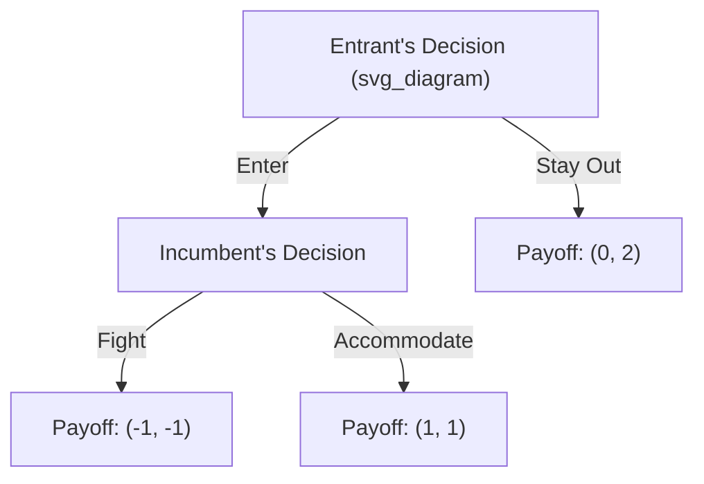
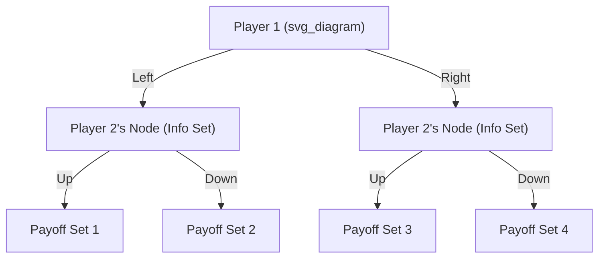

## Sequential Games and Extensive Form

### Definition and Core Concept

A sequential game is a game in which players choose their actions in a specific order, with later-moving players able to observe (fully or partially) the actions taken by earlier movers before making their own decisions. This contrasts with simultaneous games, where players choose actions without knowledge of others' current choices.

The **extensive form** is the formal representation of a sequential game. It captures:

- The order of moves
- The choices available to each player at each decision point
- The information each player has when making a decision
- The payoffs resulting from every possible sequence of actions

### Components of the Extensive Form

**Game Tree**

The extensive form is represented as a tree diagram consisting of:

- **Nodes**: Points where a decision is made (decision nodes) or the game ends (terminal nodes)
- **Root node**: The starting point of the game
- **Branches**: Represent the available actions at each node
- **Terminal nodes**: Endpoints of the tree, each associated with a payoff vector for all players

**Players**

Each decision node is assigned to a specific player who chooses an action at that node.

**Information Sets**

An information set groups decision nodes that a player cannot distinguish between when making a choice. If an information set contains only one node, the player has perfect information at that point. If it contains multiple nodes, the player is uncertain about which node they are actually at (imperfect information).

**Strategies**

A strategy in extensive form is a complete plan of action, specifying what a player would do at *every* information set they might reach — not just the ones reached in the actual course of play.

**Payoffs**

Each terminal node has an associated payoff vector $(u_1, u_2, \ldots, u_n)$ specifying the outcome for each of the $n$ players.

### Perfect vs. Imperfect Information

**Perfect Information**

Every information set is a singleton (contains exactly one node). Each player, when making a move, knows the full history of actions taken previously. Chess and tic-tac-toe are canonical examples.

**Imperfect Information**

At least one information set contains more than one node, meaning a player is uncertain about some aspect of prior play when choosing an action. This often models simultaneous moves embedded within a sequential structure, or hidden actions.

### Example: A Simple Market Entry Game

Consider an incumbent firm and a potential entrant.

1. The entrant moves first: **Enter** or **Stay Out**
2. If the entrant chooses **Enter**, the incumbent then chooses: **Fight** (price war) or **Accommodate**
3. If the entrant chooses **Stay Out**, the game ends immediately

Payoffs (Entrant, Incumbent):

- Stay Out → $(0, 2)$
- Enter, Fight → $(-1, -1)$
- Enter, Accommodate → $(1, 1)$

This tree has perfect information: every node is its own information set, since the entrant observes nothing prior (it moves first) and the incumbent observes the entrant's choice before acting.

### Solving Extensive Form Games: Backward Induction

**Backward induction** is the primary solution technique for finite games of perfect information. The procedure:

1. Start at the terminal nodes and work backward toward the root
2. At each decision node closest to the terminal nodes, determine the action the player at that node would rationally choose, given the payoffs that follow
3. Replace that subtree with the payoff resulting from the optimal choice
4. Repeat the process moving up the tree until the root is reached

**Applying backward induction to the market entry example:**

- At the incumbent's node: comparing $-1$ (Fight) versus $1$ (Accommodate), the incumbent prefers **Accommodate**
- Anticipating this, the entrant compares $0$ (Stay Out) versus $1$ (Enter, knowing the incumbent will accommodate)
- The entrant chooses **Enter**

**Key Points**

- The equilibrium path is: Entrant enters → Incumbent accommodates → Payoffs $(1, 1)$
- Backward induction guarantees a solution concept known as **subgame perfect equilibrium (SPE)**
- Any threat by the incumbent to "Fight" if entry occurs is *not credible*, because once entry has actually occurred, Fighting is not in the incumbent's interest

### Subgames and Subgame Perfect Equilibrium

**Subgame**

A subgame is a portion of the extensive-form game that:

- Begins at a single decision node (which forms its own information set)
- Includes all subsequent nodes and branches following from that node
- Does not cut through any information set (it cannot split a set of nodes that belong to the same information set)

**Subgame Perfect Equilibrium (SPE)**

A strategy profile constitutes a subgame perfect equilibrium if it induces a Nash equilibrium in *every* subgame of the original game, not merely in the game as a whole.

SPE refines the Nash equilibrium concept by eliminating equilibria that rely on **non-credible threats or promises** — commitments that a player would not actually wish to carry out if the relevant decision node were reached.

$$\text{SPE} \subseteq \text{Nash Equilibrium}$$

Every subgame perfect equilibrium is a Nash equilibrium of the full game, but not every Nash equilibrium is subgame perfect.

### Converting Between Normal Form and Extensive Form

Any extensive-form game can be converted into a normal-form (strategic-form) game by listing, for each player, all possible complete strategies (contingent action plans), and computing resulting payoffs for each strategy combination.

**Normal form of the market entry game:**

| Entrant \ Incumbent | Fight | Accommodate |
| --- | --- | --- |
| Enter | $(-1, -1)$ | $(1, 1)$ |
| Stay Out | $(0, 2)$ | $(0, 2)$ |

This normal form has **two Nash equilibria**:

1. (Enter, Accommodate) → payoffs $(1,1)$ — this is the SPE
2. (Stay Out, Fight) → payoffs $(0,2)$ — this is Nash but **not** subgame perfect, because it relies on the incumbent's threat to Fight, which is not credible if the entrant actually entered

This illustrates a central insight: normal-form analysis can miss the non-credibility problem that extensive-form analysis with backward induction reveals.

### Extensive Form with Imperfect Information

When a game has simultaneous-move components embedded in a sequential structure, information sets with multiple nodes are used.

**Example**: Suppose Player 2 moves after Player 1, but cannot observe Player 1's action (effectively simultaneous decision-making despite sequential representation).

Here, nodes B and C belong to the same information set (typically shown with a dashed line or oval enclosing them in a diagram), representing Player 2's inability to distinguish whether Player 1 chose Left or Right. In such cases, backward induction cannot be applied directly at that information set; instead, **Bayesian updating** and **Nash/sequential equilibrium** concepts are used, particularly in games with incomplete information.

### Repeated and Multi-Stage Sequential Games

Sequential structures often extend across multiple stages:

- **Finitely repeated games**: A stage game is played a fixed, known number of times. Backward induction typically unravels cooperation from the last period backward (a classic result in the *repeated prisoner's dilemma*).
- **Infinitely repeated games**: Without a known final period, cooperation can be sustained via strategies such as **Grim Trigger** or **Tit-for-Tat**, supported by the **Folk Theorem**, which states that a wide range of payoffs (including cooperative ones) can be sustained as equilibria if players value future payoffs sufficiently (i.e., a high enough discount factor $\delta$).

### Applications in Microeconomics

**Stackelberg Duopoly (Sequential Quantity Competition)**

A classic economic application of extensive-form games. A **leader** firm chooses output first; a **follower** firm observes this and then chooses its own output.

- The leader internalizes the follower's best-response function when choosing its own quantity
- Solved via backward induction: first derive the follower's reaction function, then substitute it into the leader's profit maximization problem
- Result: the Stackelberg leader typically produces more and earns higher profit than in the simultaneous-move (Cournot) equivalent, due to the **first-mover advantage**

$$q_L^* = \arg\max_{q_L} \; \pi_L(q_L, R_F(q_L))$$

where $R_F(q_L)$ is the follower's reaction (best-response) function.

**Bargaining Games (Rubinstein Alternating Offers)**

Two players alternate making offers to split a surplus, with discounting over time reducing the value of delayed agreement. Backward induction (in finite-horizon versions) or stationarity arguments (in infinite-horizon versions) pin down a unique subgame perfect equilibrium split.

**Sequential Bidding and Signaling Games**

Extensive form is foundational for modeling scenarios where an informed party moves first (e.g., signaling quality through education, warranties, or pricing) and an uninformed party updates beliefs and responds.

### Common Pitfalls and Misconceptions

- **Confusing Nash equilibrium with SPE**: Not all Nash equilibria in the normal-form representation survive as credible outcomes in the extensive form.
- **Ignoring off-equilibrium-path behavior**: A complete strategy must specify actions at *every* node, including those never reached in equilibrium play — this is essential for verifying subgame perfection.
- **Misapplying backward induction under imperfect information**: Backward induction in its basic form only works cleanly when every information set is a singleton; multi-node information sets require alternative equilibrium refinements (e.g., sequential equilibrium, perfect Bayesian equilibrium).

[Inference] In some finitely repeated games with multiple stage-game Nash equilibria, cooperative behavior can be supported in earlier rounds even under backward induction logic, depending on the specific payoff structure — this is a more advanced and situation-dependent result rather than a universal rule.

**Related Topics**

- Simultaneous games and normal (strategic) form
- Nash equilibrium and best-response functions
- Cournot vs. Stackelberg competition models
- Subgame perfect equilibrium and credible commitment
- Repeated games and the Folk Theorem
- Incomplete information games and Bayesian Nash equilibrium
- Signaling and screening models
- Rubinstein bargaining model
- Perfect Bayesian equilibrium and sequential rationality
- Mechanism design and auction theory