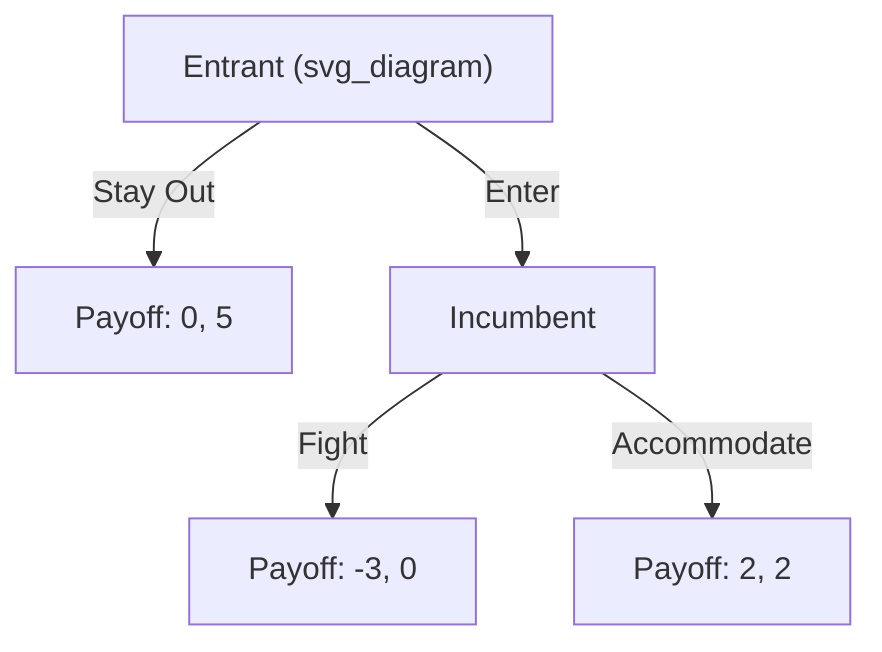

## Backward Induction

### Definition and Core Concept

Backward induction is a method for solving dynamic (sequential-move) games by reasoning from the end of the game toward the beginning. The solver starts at the final decision nodes, determines the optimal action for the player moving last, then steps back one stage at a time, at each stage assuming that all subsequent players will act according to the optimal choices already identified.

The technique rests on the assumption of common knowledge of rationality: every player believes every other player is rational, believes that belief is itself commonly held, and so forth. This assumption lets each player at an earlier node correctly anticipate how later nodes will be resolved.

Backward induction is the standard solution procedure for games of **perfect information** — games in which every player, at every decision point, knows the full history of actions taken so far. It is formally used to compute **subgame perfect Nash equilibria (SPNE)**.

### Extensive-Form Games and Perfect Information

A dynamic game is represented in **extensive form**: a game tree consisting of nodes (decision points), branches (available actions), and terminal nodes (payoffs). Backward induction applies directly only when information is perfect — no simultaneous moves and no hidden information (no information sets containing more than one node).

**Key structural elements:**

- **Decision node**: a point where a specified player chooses an action
- **Terminal node**: an endpoint of the tree carrying a payoff vector for all players
- **Subgame**: any node together with everything following it, provided that node is a singleton (not part of a larger information set)

Because every subgame in a perfect-information game is itself a well-defined smaller game, backward induction can be applied recursively to each one.

### The Algorithm

1. Identify all terminal nodes and their associated payoffs.
2. Locate the decision nodes immediately preceding terminal nodes (the "last-mover" nodes).
3. At each such node, determine the action that maximizes the payoff of the player who moves there.
4. Replace that node with the payoff vector resulting from the optimal action, effectively "pruning" the tree.
5. Move one level up and repeat steps 2–4, treating the now-pruned subtrees as the relevant payoffs.
6. Continue until the root node is reached. The sequence of optimal actions identified at each node constitutes the backward induction outcome.

This produces not just an outcome but a **complete strategy** for each player — a full contingency plan specifying an action at every node the player could conceivably reach, including nodes off the equilibrium path.

### Worked Example: A Simple Entry Deterrence Game

Consider a two-stage game between an **Entrant** and an **Incumbent** firm.

- Stage 1: Entrant chooses **Enter** or **Stay Out**.
- Stage 2: If Entrant chooses Enter, Incumbent chooses **Fight** or **Accommodate**.

Payoffs (Entrant, Incumbent):

- Stay Out: $(0, 5)$
- Enter, then Fight: $(-3, 0)$
- Enter, then Accommodate: $(2, 2)$

**Backward induction reasoning:**

Start at the Incumbent's decision node (reached only if Entrant enters). The Incumbent compares payoffs from Fight ($0$) versus Accommodate ($2$) and chooses **Accommodate**, since $2 > 0$.

Step back to the Entrant's node. The Entrant now anticipates that entering leads to Accommodate, yielding $2$, versus Staying Out, yielding $0$. Since $2 > 0$, the Entrant chooses **Enter**.

**Backward induction outcome:** (Enter, Accommodate), with payoffs $(2, 2)$.

Note that a threat to Fight, if made prior to the game, is **not credible**: once the Entrant has actually entered, Fighting is strictly worse for the Incumbent than Accommodating. Backward induction automatically screens out such non-credible threats, which is precisely why it is used to compute subgame perfect equilibria rather than merely Nash equilibria (the static game's Nash equilibria could include an "Enter deterred by threat to Fight" outcome that is not credible once play actually reaches that node).

### Subgame Perfect Nash Equilibrium (SPNE)

Backward induction is the constructive method for finding SPNE in finite games of perfect information. A strategy profile is a **subgame perfect Nash equilibrium** if it induces a Nash equilibrium in every subgame of the original game, not merely in the game as a whole.

**Relationship to Nash equilibrium:**

- Every SPNE is a Nash equilibrium of the full game.
- Not every Nash equilibrium is subgame perfect — some Nash equilibria rely on incredible threats or promises off the equilibrium path.
- In finite games of perfect information with no ties in payoffs at any decision node, backward induction yields a **unique** SPNE. When ties exist, multiple backward-induction solutions can arise.

### Zermelo's Theorem

**Zermelo's theorem** (1913), originally formulated for chess, establishes that in any finite, two-player, zero-sum game of perfect information, one of the following holds: the first player can force a win, the second player can force a win, or both players can force at least a draw. The theorem guarantees that backward induction always produces a determinate solution in such games — the reasoning underlying modern game-solving in chess, checkers, and similar finite perfect-information games.

### Applications

**Bargaining — the finite-horizon alternating-offers model:**

In a finite Rubinstein-style bargaining game with $T$ rounds, backward induction pins down a unique division. With a discount factor $\delta < 1$ per period, the first-mover's share diminishes with each additional round of allowed delay, and the entire path of offers can be solved by starting from the final round (where the last proposer can claim nearly the full surplus) and working backward. [Inference: the exact closed-form split depends on the specific discounting and proposer-order assumptions used in the model variant.]

**Repeated games with finite horizon — the chain-store paradox:**

If a stage game like Prisoners' Dilemma is repeated a *known, finite* number of times, backward induction implies that mutual defection occurs in every round, including the first. In the final round, no future retaliation is possible, so both players defect; anticipating this, they also defect in the second-to-last round, and so on by induction back to round one. This result — cooperation unraveling completely despite intuitions that repetition should sustain cooperation — is known as the **chain-store paradox** (Selten) and illustrates a discomfort economists have long noted between the theoretical prediction and observed behavior in laboratory and real-world finitely repeated games.

**Sequential bargaining and negotiation strategy**, **market entry/exit decisions**, **legislative agenda-setting models**, and **principal-agent contracting with sequential moves** are all commonly analyzed with backward induction.

### The Centipede Game

The **centipede game** is a canonical illustration of backward induction's sometimes counterintuitive predictions. Two players alternately choose to "take" a growing pot of money or "pass" it to the other player, with the pot shrinking in value for the passer relative to what an immediate take would yield, or growing in total size while shifting relative shares — variants differ in exact payoff structure. Backward induction predicts the first player takes the money immediately at the very first opportunity, since:

- At the last node, the final mover strictly prefers to take.
- Anticipating this, the second-to-last mover also prefers to take rather than pass into a node where they would then be exploited.
- This unravels all the way back to the first move.

Experimental evidence consistently shows that real players pass far more often and far longer than backward induction predicts, making the centipede game one of the most widely cited demonstrations of a gap between the game-theoretic solution and observed human behavior. [Unverified: the precise magnitude of deviation varies substantially across experimental studies, subject pools, and stake sizes, and is not a fixed, universal number.]

### Limitations and Critiques

- **Requires perfect information.** Backward induction cannot be directly applied to games with simultaneous moves or private information; those require Bayesian equilibrium concepts (e.g., Perfect Bayesian Equilibrium) that generalize the backward-induction logic to imperfect-information settings.
- **Infinite horizon problems.** With an infinite or indefinite number of stages, there is no "last node" from which to start the recursion, so backward induction is not directly applicable; alternative techniques (e.g., stationary strategies, one-shot deviation principle, dynamic programming with value functions) are used instead.
- **Epistemic fragility.** The prediction depends on common knowledge of rationality holding at *every* node, including nodes that a fully rational opponent would never reach. Some game theorists (notably Robert Aumann, and critics like Ken Binmore in the ensuing debate) have disputed how this common-knowledge assumption should be interpreted once a "surprising" off-path node is actually reached — does observing a supposedly irrational move update beliefs about the opponent's future rationality? This is an active area of foundational debate rather than a settled technical result. [Inference: characterizing this as fully "settled" or "unsettled" depends on which epistemic framework one adopts; the profession broadly treats SPNE as the standard solution concept while acknowledging the philosophical debate.]
- **Behavioral discrepancies.** As the centipede game and finitely repeated Prisoners' Dilemma show, real subjects frequently deviate from backward-induction predictions, motivating behavioral game theory models incorporating altruism, reciprocity, bounded rationality, or level-k reasoning.

### Backward Induction vs. Forward Induction

Backward induction reasons from the end of the game to the start. **Forward induction**, by contrast, uses a player's past actions to update beliefs about what that player's future actions will be, effectively reasoning that if a player took a costly or unusual action, it must have been done for some rational purpose consistent with a particular continuation strategy. The two concepts can conflict in specific games and represent distinct refinements of Nash equilibrium in extensive-form settings.

**Related Topics**

- Subgame Perfect Nash Equilibrium
- Nash Equilibrium (static games)
- Extensive-Form Games and Game Trees
- Perfect vs. Imperfect Information
- Credible Threats and Commitment Devices
- The Centipede Game and Experimental Game Theory
- Repeated Games (finite vs. infinite horizon)
- The Folk Theorem
- Bayesian and Perfect Bayesian Equilibrium
- Rubinstein Bargaining Model
- Zermelo's Theorem and Combinatorial Game Solving