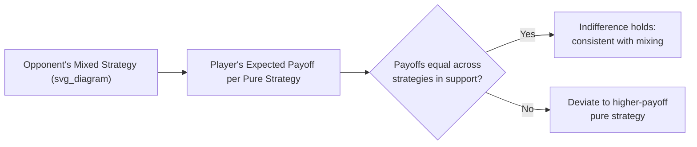

## Mixed Strategies

### Definition and Core Concept

A **mixed strategy** is a probability distribution a player assigns over their available pure strategies, rather than committing deterministically to a single action. If a player has pure strategies $s_1, s_2, \ldots, s_n$, a mixed strategy $\sigma$ assigns probabilities $p_1, p_2, \ldots, p_n$ to each, with $p_i \geq 0$ for all $i$ and

$$\sum_{i=1}^{n} p_i = 1$$

A **pure strategy** is the special case of a mixed strategy that places probability $1$ on a single action. The set of all mixed strategies over $n$ pure strategies forms a **simplex** — a continuous, convex space of probability distributions.

Mixed strategies are relevant primarily in **simultaneous-move games** where no pure-strategy Nash equilibrium exists, or where a pure-strategy equilibrium exists alongside mixed ones. Randomization allows equilibrium existence to be guaranteed even in games where deterministic behavior would leave a player perpetually wanting to deviate.

### Why Randomize? Intuition

In games like Matching Pennies or Rock-Paper-Scissors, any pure strategy can be exploited: if an opponent could predict your action with certainty, they would always respond optimally against it, giving you an incentive to switch — which in turn changes their best response, and so on with no pure strategy ever being stable. Randomizing removes the predictability that an opponent could exploit, and in equilibrium, makes the opponent indifferent among the actions they might use to try to exploit you.

### Expected Payoff Calculation

When players use mixed strategies, payoffs are evaluated in terms of **expected utility**. If Player 1 plays mixed strategy $\sigma_1 = (p, 1-p)$ over two pure strategies and Player 2 plays $\sigma_2 = (q, 1-q)$, and payoffs are given in the standard bimatrix form, Player 1's expected payoff is the probability-weighted sum over all four possible pure-strategy outcome combinations:

$$EU_1(\sigma_1, \sigma_2) = pq \cdot u_1(A,C) + p(1-q) \cdot u_1(A,D) + (1-p)q \cdot u_1(B,C) + (1-p)(1-q) \cdot u_1(B,D)$$

where $A, B$ are Player 1's pure strategies and $C, D$ are Player 2's.

### Worked Example: Matching Pennies

Two players simultaneously choose Heads (H) or Tails (T). Player 1 wins (payoff $+1$, Player 2 gets $-1$) if choices match; Player 2 wins if they differ.

|  | Player 2: H | Player 2: T |
| --- | --- | --- |
| **Player 1: H** | $1, -1$ | $-1, 1$ |
| **Player 1: T** | $-1, 1$ | $1, -1$ |

No pure-strategy Nash equilibrium exists here: for any pure profile, at least one player strictly prefers to deviate. A mixed-strategy equilibrium does exist.

**Finding the equilibrium via the indifference principle:**

Let Player 1 play H with probability $p$ and T with probability $1-p$. For Player 2 to be willing to randomize (rather than strictly preferring one pure action), Player 2 must be indifferent between H and T given Player 1's mix:

$$EU_2(\text{H}) = -p + (1-p) = 1 - 2p$$

$$EU_2(\text{T}) = p - (1-p) = 2p - 1$$

Setting these equal: $1 - 2p = 2p - 1 \Rightarrow p = \frac{1}{2}$.

By the symmetric argument applied to Player 1's indifference condition, Player 2 must also play H with probability $\frac{1}{2}$.

**Equilibrium:** both players randomize $50/50$ between H and T. Each player's expected payoff at equilibrium is $0$.

### The Indifference Principle (General Method)

The **indifference principle** is the standard technique for computing mixed-strategy Nash equilibria in finite games:

1. In equilibrium, if a player mixes over two or more pure strategies with strictly positive probability, that player must be **exactly indifferent** in expected payoff between all pure strategies actually being played with positive probability — otherwise the player would strictly prefer the higher-payoff action and would not randomize.
2. Set up equations equating the expected payoffs of the relevant pure strategies, given the *opponent's* mixing probabilities (this is the key structural feature: a player's own mixing probabilities are pinned down by making the *opponent* indifferent, not by the player's own payoffs directly).
3. Solve the resulting system of equations for the equilibrium probabilities.
4. Verify that no player has an incentive to deviate to a pure strategy outside the support (the set of strategies played with positive probability), i.e., that off-support strategies yield weakly lower expected payoff.

### Worked Example: Battle of the Sexes

Two players (say, a Husband and Wife) want to coordinate on an evening out — Opera (O) or Football (F) — but have conflicting preferences.

|  | Wife: O | Wife: F |
| --- | --- | --- |
| **Husband: O** | $2, 1$ | $0, 0$ |
| **Husband: F** | $0, 0$ | $1, 2$ |

This game has **two pure-strategy Nash equilibria** — (O,O) and (F,F) — plus one mixed-strategy equilibrium.

Let the Husband play O with probability $p$, and the Wife play O with probability $q$.

**Wife's indifference condition** (making the Husband indifferent between O and F):

$$EU_H(\text{O}) = 2q, \quad EU_H(\text{F}) = 1(1-q)$$

$$2q = 1 - q \Rightarrow q = \frac{1}{3}$$

**Husband's indifference condition** (making the Wife indifferent between O and F):

$$EU_W(\text{O}) = 1 \cdot p, \quad EU_W(\text{F}) = 2(1-p)$$

$$p = 2 - 2p \Rightarrow p = \frac{2}{3}$$

**Mixed equilibrium:** Husband plays O with probability $\frac{2}{3}$; Wife plays O with probability $\frac{1}{3}$. Expected payoffs: $EU_H = \frac{2}{3}$, $EU_W = \frac{2}{3}$ — notably **lower** than either pure coordination equilibrium's payoff to the favored party, illustrating that mixed equilibria in coordination games can be payoff-inefficient relative to pure equilibria (a **coordination failure**).

### Existence: Nash's Theorem

**Nash's existence theorem** (1950) guarantees that every finite game (finite number of players, each with a finite set of pure strategies) has at least one Nash equilibrium, possibly in mixed strategies. The proof relies on a fixed-point theorem (Kakutani's fixed-point theorem), applied to each player's best-response correspondence over the space of mixed strategies. This result is precisely why mixed strategies matter: without allowing randomization, equilibrium existence could not be guaranteed for games like Matching Pennies.

### Support and Best-Response Correspondence

The **support** of a mixed strategy is the set of pure strategies assigned strictly positive probability. Key properties:

- A pure strategy **outside** the support of an equilibrium mixed strategy must yield an expected payoff **no higher than** the (common) expected payoff of strategies inside the support — otherwise the player would deviate to it.
- The **best-response correspondence** maps each opponent mixed-strategy profile to the set of mixed strategies maximizing the player's expected payoff; a Nash equilibrium is a fixed point where every player's strategy is a best response to the others'.

### Interpreting Mixed Strategies

Several interpretations exist for what a mixed strategy "means" in practice, an issue debated within game theory:

- **Literal randomization**: the player genuinely uses a randomizing device (a coin flip, a random number generator) to select an action — natural in contexts like sports (e.g., choosing which direction to dive on a penalty kick) or security/auditing (randomized inspection schedules).
- **Population/frequency interpretation**: in a large population of players repeatedly drawn to play the game, the mixed strategy represents the *fraction* of the population playing each pure strategy, rather than any single individual randomizing internally. This is closely related to evolutionary game theory concepts (e.g., evolutionarily stable strategies).
- **Purification (Harsanyi)**: mixed-strategy equilibria can be reinterpreted as the limit of pure-strategy equilibria in a closely related game with slight, private payoff perturbations unobserved by other players — under this view, apparent randomization is actually deterministic behavior responding to small private information, and the "mixing probabilities" reflect the opponent's uncertainty about that private information rather than genuine randomization.
- **Beliefs interpretation**: an opponent's optimal response depends only on their *belief* about the probability distribution over your actions; whether you literally randomize or they merely believe you might is payoff-equivalent from their optimization standpoint.

[Inference: which interpretation is treated as most fundamental varies by subfield and pedagogical tradition — the purification approach is influential in theoretical work, while the literal-randomization view dominates applied and experimental treatments.]

### Mixed Strategies in Zero-Sum Games and the Minimax Theorem

In two-player zero-sum games, mixed strategies connect directly to the **minimax theorem** (von Neumann, 1928): the value a player can guarantee by choosing the mixed strategy that maximizes their minimum guaranteed expected payoff (maximin) equals the value the opponent can guarantee by minimizing the maximum expected payoff they must concede (minimax). This common value is the **value of the game**, and the mixed strategies achieving it constitute a Nash equilibrium (equivalently, in this class of games, minimax and Nash equilibrium strategies coincide). This result underlies applications in security games, resource-allocation auditing games, and classical work on parlor games such as poker bluffing frequencies.

### Computational and Applied Considerations

- Computing mixed-strategy equilibria in games with more than two players or many strategies generally requires solving nonlinear systems or using algorithms such as the **Lemke-Howson algorithm** for two-player games; finding a Nash equilibrium in general games is known to be a computationally hard problem (PPAD-complete). [Inference: exact complexity classification details are a computer-science result adjacent to, rather than core content of, standard microeconomics coverage, but are commonly cited to motivate why mixed-equilibrium computation is nontrivial beyond small examples.]
- Applications include: **penalty kicks in soccer** (empirical studies testing whether professional players' shot/dive frequencies approximate minimax predictions), **auditing and law enforcement** (randomized inspection to deter noncompliance when constant monitoring is too costly), **advertising and market entry timing**, **poker and bluffing strategy**, and **security resource allocation** (e.g., randomized patrol scheduling).

### Mixed Strategies vs. Behavioral Strategies

In dynamic (extensive-form) games, a distinction arises between a **mixed strategy** (a probability distribution chosen once, over entire complete contingency plans) and a **behavioral strategy** (independent randomization at each information set encountered during play). Kuhn's theorem establishes that in games with **perfect recall** (players never forget information they once knew), mixed and behavioral strategies are payoff-equivalent — any mixed strategy has an equivalent behavioral strategy generating the same distribution over outcomes, and vice versa. [Inference: this equivalence result, while standard in graduate game theory, may extend beyond what is typically emphasized in an introductory microeconomics treatment of mixed strategies, which usually focuses on static/simultaneous games.]

### Limitations and Critiques

- **Behavioral realism**: experimental evidence on games like Matching Pennies and penalty-kick studies shows mixing frequencies often deviate from exact theoretical predictions, and observed sequences of choices sometimes display patterns (e.g., avoidance of long streaks) inconsistent with true independent randomization — a documented empirical regularity, though the degree and interpretation vary across studies. [Unverified: precise deviation magnitudes are context- and dataset-dependent and not reducible to a single universal figure.]
- **Cognitive plausibility**: the literal-randomization interpretation requires players to compute precise equilibrium probabilities and then execute genuine randomization, which critics argue is a demanding assumption about real decision-making; this motivates alternative interpretations (population, purification) and behavioral game theory alternatives such as quantal response equilibrium.
- **Equilibrium selection**: in games with multiple equilibria (pure and mixed, as in Battle of the Sexes), theory alone does not specify which equilibrium players will coordinate on, requiring additional selection criteria (focal points, communication, evolutionary dynamics, or refinement concepts).

**Related Topics**

- Nash Equilibrium (Pure Strategy)
- Dominant and Dominated Strategies
- Minimax Theorem and Zero-Sum Games
- Evolutionarily Stable Strategies
- Battle of the Sexes and Coordination Games
- Bayesian Games and Incomplete Information
- Kuhn's Theorem and Behavioral Strategies
- Quantal Response Equilibrium
- Computational Game Theory (Lemke-Howson Algorithm)