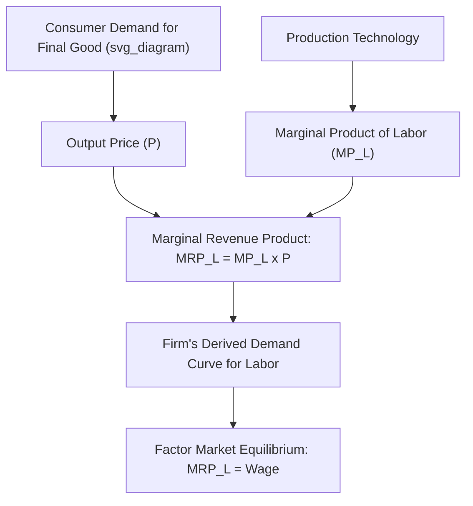

## Derived Demand for Factors of Production

### Definition and Core Concept

**Derived demand** refers to the principle that the demand for a factor of production (labor, capital, land) is not desired for its own sake, but arises indirectly from the demand for the final goods and services that factor helps produce. A firm hires labor or capital not because it values these inputs intrinsically, but because they are instrumental in producing output that consumers want to buy.

This concept was formally articulated by **Alfred Marshall** in *Principles of Economics*, where he identified the factors governing the elasticity of derived demand — now known as the **Marshallian rules of derived demand**.

The core implication: any shift in the demand for a final product (output market) transmits backward to shift the demand for the factors used to produce it. Conversely, changes in factor productivity or factor prices affect final-goods supply and pricing.

### Theoretical Foundation: The Firm's Factor Demand Decision

A profit-maximizing firm operating in a competitive output market and a competitive factor market hires additional units of a factor (say, labor) up to the point where the additional revenue generated equals the additional cost of hiring that unit.

**Marginal Revenue Product of Labor (MRP_L):**

$$MRP_L = MP_L \times MR$$

where $MP_L$ is the marginal physical product of labor (extra output from one more unit of labor) and $MR$ is the marginal revenue from selling that extra output. In a perfectly competitive output market, $MR = P$ (the output price), so:

$$MRP_L = MP_L \times P = VMP_L$$

This quantity, $VMP_L$, is the **Value of Marginal Product of Labor**. It is the mechanism through which output-market conditions (price $P$) and production-technology conditions (marginal product $MP_L$) jointly determine the value of an additional unit of the factor.

**Profit-maximizing hiring rule:** the firm hires labor until

$$MRP_L = W$$

where $W$ is the wage rate (the factor price). The firm's **demand curve for labor** is precisely its $MRP_L$ curve (in the region where it is downward-sloping, reflecting diminishing marginal product), because at every wage level, this curve tells the firm the profit-maximizing quantity of labor to hire.

The same logic extends to capital: firms hire capital up to the point where the **Marginal Revenue Product of Capital ($MRP_K$)** equals the rental price of capital, $r$.

### Why "Derived"? The Transmission Mechanism

The demand curve for labor is derived because $MRP_L = MP_L \times P$ embeds the output price $P$, which itself is set in the market for the final good. Any factor affecting the final-goods market transmits directly into the factor market:

- A **rise in output demand** → higher output price $P$ → higher $MRP_L$ at every quantity of labor → the labor demand curve shifts rightward (firms want to hire more labor at every wage).
- A **fall in output demand** → lower $P$ → lower $MRP_L$ → labor demand curve shifts leftward.
- An **increase in labor productivity** ($MP_L$ rises, e.g., from technological improvement or capital deepening) → higher $MRP_L$ at every quantity → labor demand shifts rightward, even with no change in output price.
- A **change in the price of a complementary or substitute factor** shifts derived demand as firms adjust the input mix (see cross-elasticities and substitution below).

### Worked Numerical Example

Suppose a competitive firm produces a good selling at $P = \$10$ per unit. The table below shows labor's marginal physical product at different levels of employment.

| Labor ($L$) | Total Product | $MP_L$ | $VMP_L = MP_L \times P$ |
| --- | --- | --- | --- |
| 1 | 10 | 10 | $100 |
| 2 | 19 | 9 | $90 |
| 3 | 27 | 8 | $80 |
| 4 | 34 | 7 | $70 |
| 5 | 40 | 6 | $60 |

If the market wage is $W = \$70$, the firm hires labor up to $L = 4$, since $VMP_L = \$70 = W$ at that point; hiring a 5th worker would add only $\$60$ in revenue against a $\$70$ wage cost, a loss of $\$10$.

**Effect of an output-price increase:** if consumer demand for the good rises and $P$ increases to $\$14$, every $VMP_L$ entry scales up proportionally (e.g., at $L=4$, $VMP_L = 7 \times 14 = \$98$). At the original wage of $\$70$, the firm now wants to hire a 5th worker ($VMP_L = 6 \times 14 = \$84 > \$70$), demonstrating the rightward shift in labor demand driven purely by the derived-demand link to the output market.

### The Marshallian Rules of Derived Demand (Determinants of Elasticity)

Marshall identified conditions under which the demand for a factor is **more elastic** (more sensitive to a change in the factor's own price):

1. **Elasticity of demand for the final product**: the more elastic the demand for the output the factor produces, the more elastic the derived demand for the factor. If output demand is highly price-sensitive, a wage-driven rise in production costs and output price causes a larger drop in output sold, and hence a larger drop in labor demanded.
2. **Ease of factor substitution**: the more easily a factor can be substituted with other inputs in production (a higher elasticity of substitution in the production function), the more elastic its derived demand — firms can more readily shift toward the now-relatively-cheaper alternative input if the factor's price rises.
3. **Elasticity of supply of cooperating (complementary) factors**: if the supply of other inputs used alongside the factor is highly elastic, the derived demand for the factor in question tends to be more elastic; if complementary factors are in rigid, inelastic supply, they constrain how much output (and hence factor demand) can adjust.
4. **The proportion of total production cost accounted for by the factor** (related to the **"importance of being unimportant"** principle): if a factor's cost share in total production cost is small, demand for it tends to be *more* elastic, because a given percentage rise in that factor's price has only a small effect on total cost and output price, but the firm has strong incentive to economize sharply on that specific input; conversely, if a factor represents a large cost share, a price rise has a large effect on total costs and output price, which then substantially reduces quantity demanded of the final good — but the *net* effect on elasticity depends on the interaction of this scale effect with the substitution effect, and the "importance of being unimportant" result specifically holds when substitution possibilities are limited. [Inference: this fourth condition is the most nuanced and is often stated with qualifications in different textbook treatments regarding exactly when it strictly holds; some texts present it as approximately true under standard conditions rather than universally.]

### Time Horizon and Elasticity

Derived demand for a factor tends to be **more elastic in the long run** than in the short run, because:

- Firms have more time to adjust the technology and input mix (greater substitution possibilities open up over longer horizons).
- Consumers have more time to adjust their consumption patterns in response to output-price changes stemming from factor-price changes, making final-product demand itself more elastic in the long run.

### Market-Level Derived Demand and General Equilibrium Considerations

The **market demand curve for a factor** is not simply the horizontal sum of individual firms' $MRP$ curves, because when the factor's price falls and *all* firms in the industry expand output simultaneously, the resulting rise in industry-wide output pushes the **output price down** — an effect not captured by any single firm's individual MRP curve (which assumes the firm's own price-taking behavior does not affect market price). Correcting for this general-equilibrium feedback across firms makes the industry-level factor demand curve **less elastic** (steeper) than the naive horizontal sum of individual firm MRP curves would suggest.

### Marginal Productivity Theory of Distribution

Derived demand is the foundation of the **marginal productivity theory of income distribution**, which holds that, under competitive conditions, each factor of production tends to be paid a return equal to the value of its marginal product:

$$W = VMP_L \quad \text{and} \quad r = VMP_K$$

This theory provides a normative and positive explanation for how national income is functionally distributed between labor (wages) and capital (profits/rents), and underlies discussions of factor shares in national income.

**Caveats and critiques:**

- The theory strictly applies under assumptions of perfect competition in both output and factor markets; under **monopsony** (a single buyer of a factor, most commonly analyzed for labor markets) or **monopoly** in the output market, the wage paid diverges from $VMP_L$, since a monopsonist's marginal cost of labor exceeds the wage, and a monopolist's marginal revenue is below price.
- The **Cambridge capital controversy** (debates between economists at Cambridge, UK and Cambridge, Massachusetts, mid-20th century) raised technical objections to aggregating heterogeneous capital goods into a single "capital" measure whose marginal product could be cleanly defined, challenging the theory's applicability at the aggregate (macroeconomic) level, though it remains standard and widely used at the microeconomic, firm-level scale. [Inference: the practical significance of the Cambridge capital controversy for applied microeconomic factor-market analysis, versus its relevance mainly to aggregate growth-theory contexts, is itself a matter of ongoing disagreement among economists, and characterizations of how "resolved" or "unresolved" the debate is vary by source.]

### Cross-Factor Relationships: Substitutes and Complements

Because multiple factors jointly produce output, a change in the price of one factor has a derived-demand effect on other factors:

- **Substitute factors** (e.g., capital automation replacing labor for a given task): a decrease in the price of capital can *decrease* the demand for labor at each wage (a **substitution effect** dominating), as firms reallocate toward the now-cheaper input.
- **Complementary factors** (e.g., skilled labor and specialized capital equipment used together): a decrease in the price of capital can *increase* the demand for labor at each wage (a **scale/output effect** dominating), because cheaper capital lowers overall production costs, expands output, and pulls in more of the complementary input.

The net effect for any specific pair of factors depends on the relative strength of the **substitution effect** versus the **scale effect**, formalized through cross-price elasticities of factor demand and the underlying production function's elasticity of substitution (e.g., in a Cobb-Douglas or CES production framework).

### Applications

- **Labor market analysis**: predicting how sectoral shifts in consumer demand (e.g., growth in e-commerce, decline in traditional retail) shift derived demand for different categories of labor.
- **Minimum wage debates**: analyzing how the elasticity of derived labor demand (via the Marshallian rules) affects the employment impact of a binding minimum wage.
- **Automation and technological change**: assessing how falling capital/technology prices reshape labor demand differently across occupations depending on substitutability versus complementarity with machines/software.
- **Trade and outsourcing**: derived demand explains why demand for domestic labor in import-competing industries falls when cheaper foreign-produced substitute goods enter the market, reducing derived demand for the domestic factors used in that industry.
- **Land and natural resource markets**: demand for agricultural land is derived from demand for agricultural output, linking commodity price cycles directly to land rental/purchase prices.

### Limitations and Critiques

- Real-world factor markets frequently deviate from the perfectly competitive assumptions underlying the clean $MRP = $ factor price condition — monopsony power, labor market frictions (search costs, information asymmetries), unionization, and minimum wage floors all create wedges between observed factor prices and marginal revenue product.
- Measuring $MP_L$ and $VMP_L$ empirically is often difficult in practice, particularly in team-production settings, service industries, or knowledge work where individual marginal contributions are not easily separable or observable. [Inference: the degree of this measurement difficulty and its implications for empirically testing marginal productivity theory is discussed with varying emphasis across labor economics literature.]
- The theory describes the demand side of factor markets only; observed wages and rents also depend on the supply side (labor supply decisions, capital supply/savings behavior) and market-clearing dynamics, which derived demand theory does not by itself determine.

**Related Topics**

- Marginal Productivity Theory of Distribution
- Wage Determination and Labor Market Equilibrium
- Monopsony in Factor Markets
- Elasticity of Substitution Between Factors
- Marshallian Rules of Derived Demand
- Functional Income Distribution (Labor Share vs. Capital Share)
- Minimum Wage Theory and Employment Effects
- Cambridge Capital Controversy
- Factor Price Equalization (International Trade Context)