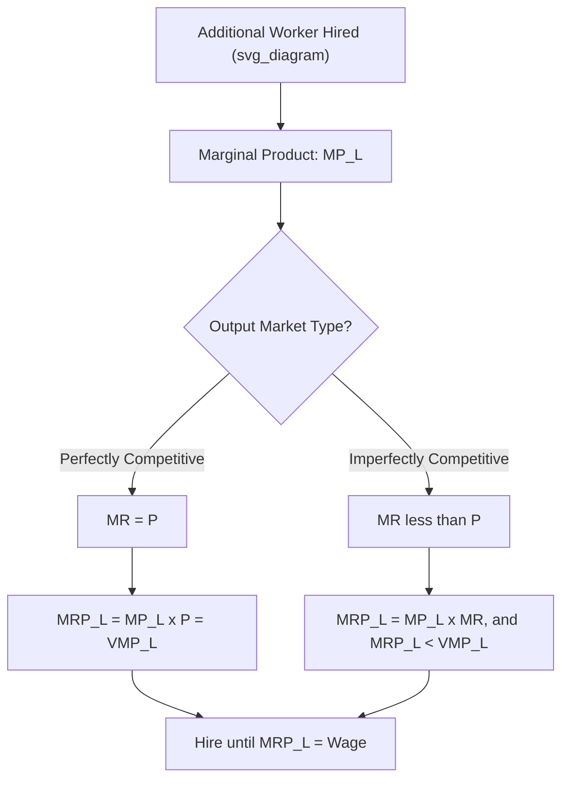

## Marginal Revenue Product of Labor

### Definition and Core Concept

The **Marginal Revenue Product of Labor (MRP_L)** measures the additional revenue a firm earns from employing one more unit of labor. It combines a technological/production element with a market/revenue element:

$$MRP_L = MP_L \times MR$$

where:

- $MP_L$ (**Marginal Product of Labor**) is the additional physical output produced by one more unit of labor, holding other inputs fixed.
- $MR$ (**Marginal Revenue**) is the additional revenue generated from selling one more unit of output.

$MRP_L$ is the central concept linking the firm's production decisions to its labor-hiring decisions, and it constitutes the firm's **demand curve for labor**.

### Derivation and the Chain from Output to Revenue

$MRP_L$ can be understood as a composition of two underlying relationships:

$$MRP_L = \frac{\Delta \text{Output}}{\Delta L} \times \frac{\Delta \text{Revenue}}{\Delta \text{Output}} = \frac{\Delta \text{Revenue}}{\Delta L}$$

This shows $MRP_L$ is precisely the derivative (or discrete change) of total revenue with respect to labor input — it directly answers: "if I hire one more worker, by how much does my total revenue rise?"

### MRP_L Under Perfect Competition: Equivalence to VMP_L

In a **perfectly competitive output market**, the firm is a price-taker, so $MR = P$ (marginal revenue equals the market price, since the firm can sell additional units without affecting price). Under this condition:

$$MRP_L = MP_L \times P = VMP_L$$

This special case is called the **Value of Marginal Product of Labor (VMP_L)**. Under perfect competition in the output market, $MRP_L$ and $VMP_L$ are identical, and the terms are often used interchangeably in introductory treatments — but they diverge once the firm has any pricing power in its output market.

### MRP_L Under Imperfect Competition (Monopoly/Monopolistic Competition in Output Market)

If the firm has some market power in the output market (e.g., it is a monopolist or operates under monopolistic competition), then $MR < P$, because selling an additional unit requires lowering the price on all units sold (assuming a single-price seller, not perfect price discrimination). In this case:

$$MRP_L = MP_L \times MR < MP_L \times P = VMP_L$$

The $MRP_L$ curve lies **below** the $VMP_L$ curve when the firm has output-market power, because each additional unit of output contributes less revenue than its market price would suggest, on account of the price-depressing effect of expanding sales.

### The Profit-Maximizing Hiring Rule

A profit-maximizing firm operating in a competitive labor (input) market hires labor up to the point where:

$$MRP_L = W$$

where $W$ is the wage rate (the marginal cost of an additional unit of labor, i.e., the **Marginal Factor Cost of Labor, $MFC_L$**, which equals $W$ under a competitive labor market where the firm is a wage-taker).

**Logic:** as long as $MRP_L > W$, hiring an additional worker adds more to revenue than to cost, raising profit — the firm should keep hiring. Once $MRP_L < W$, an additional hire would cost more than it contributes, so the firm should not hire that unit. Profit is maximized exactly where $MRP_L = W$.

In a labor market with **monopsony power** (a single or dominant buyer of labor), the relevant hiring condition instead equates $MRP_L$ to the **Marginal Factor Cost of Labor ($MFC_L$)**, which exceeds the wage rate because the monopsonist must raise wages for all workers (not just the marginal hire) to attract additional labor — this drives a wedge between the wage paid and $MRP_L$, distinct from the competitive-market case.

### Worked Numerical Example

A firm operates in a perfectly competitive output market, selling its product at $P = \$8$ per unit. The wage rate is $W = \$56$ per worker.

| Labor ($L$) | Total Product ($Q$) | $MP_L$ | $MRP_L = MP_L \times \$8$ |
| --- | --- | --- | --- |
| 1 | 12 | 12 | $96 |
| 2 | 23 | 11 | $88 |
| 3 | 33 | 10 | $80 |
| 4 | 42 | 9 | $72 |
| 5 | 50 | 8 | $64 |
| 6 | 57 | 7 | $56 |
| 7 | 63 | 6 | $48 |

At $W = \$56$, the firm hires exactly $L = 6$ workers, since $MRP_L = \$56 = W$ precisely at that quantity. Hiring a 7th worker would add only $\$48$ in revenue against a $\$56$ wage cost — a loss of $\$8$ — so the firm stops at 6.

**Effect of a wage decrease:** if $W$ falls to $\$48$, the firm's optimal hiring point shifts to $L = 7$, since $MRP_L = \$48 = W$ there. This traces out the downward-sloping labor demand curve: as $W$ falls, quantity of labor demanded rises, moving along the $MRP_L$ curve.

### Why the MRP_L Curve Slopes Downward

The $MRP_L$ curve is typically downward-sloping over the relevant range of employment due to the **law of diminishing marginal returns**: as more units of labor are added to a fixed quantity of other inputs (e.g., capital, land), the marginal physical product of each additional worker eventually declines. Since $MRP_L = MP_L \times MR$ and $MR$ is constant for a price-taking firm, the declining $MP_L$ directly produces a declining $MRP_L$. (Under imperfect competition, $MR$ itself is also declining as output rises, reinforcing the downward slope of $MRP_L$ even more steeply than the corresponding $VMP_L$ curve.)

### Shifts in the MRP_L Curve

The entire $MRP_L$ curve shifts (rather than a movement along it) in response to changes other than the wage rate:

- **Change in output price ($P$) or market conditions affecting $MR$**: a rise in output demand → higher $P$ (or $MR$) → $MRP_L$ shifts rightward at every quantity of labor.
- **Change in labor productivity ($MP_L$)**: technological improvement, increased capital per worker, improved worker training, or better management practices raise $MP_L$ at every level of employment → $MRP_L$ shifts rightward.
- **Change in the quantity of complementary factors (e.g., capital)**: an increase in the capital stock generally raises the marginal product of labor (more machinery per worker), shifting $MRP_L$ rightward — this is the standard mechanism by which capital deepening raises labor demand and, in equilibrium, real wages.
- **Change in the price of complementary or substitute factors**: analogous to derived-demand shift effects — cheaper capital that complements labor raises $MRP_L$ (scale effect), while cheaper capital that substitutes for labor can lower $MRP_L$ at each wage (substitution effect), with the net effect depending on which dominates.

### MRP_L and the Marginal Productivity Theory of Wage Determination

Under competitive labor markets, the equilibrium condition $MRP_L = W$ is the foundation of the **marginal productivity theory of distribution**: in equilibrium, each worker is paid a wage equal to the value they contribute at the margin. This provides both:

- A **positive** (descriptive) theory of what determines the equilibrium wage in competitive markets.
- A **normative** benchmark sometimes invoked in debates about whether wages "fairly" reflect worker contribution — though this normative use is contested, since $MRP_L$ reflects marginal, not average or total, contribution, and depends on market conditions (e.g., output demand, capital availability) not solely attributable to the individual worker.

### Aggregating to Market-Level Labor Demand

An individual firm's $MRP_L$ curve represents that firm's own labor demand curve. The **market demand curve for labor** in an industry is derived by, in principle, summing the quantity of labor demanded by all firms at each wage level — but this summation is not a simple horizontal addition of individual $MRP_L$ curves. When the wage falls and *all* firms in the industry simultaneously expand employment and output, the increased industry output pushes the **output price down**, which in turn reduces each firm's $MRP_L$ at any given quantity of labor (since $MRP_L$ depends on $P$). Accounting for this feedback effect makes the market labor demand curve **steeper (less elastic)** than a naive horizontal sum would suggest.

### Applications

- **Explaining wage differentials across occupations and skill levels**: differences in $MP_L$ (skill, training, capital-per-worker) and differences in $MR$ (industries/products with more valuable output) both feed into differing $MRP_L$, and thus differing equilibrium wages, across labor market segments.
- **Evaluating minimum wage policy**: when a minimum wage is set above the market-clearing wage, workers whose $MRP_L$ falls below the mandated minimum become unprofitable to employ at that wage, generating a theoretical prediction of unemployment among lower-productivity workers (though the actual empirical employment effects of minimum wage changes are a debated and heavily studied empirical question with mixed findings across contexts). [Unverified: the magnitude and even the sign of minimum-wage employment effects found in empirical labor economics research varies substantially by study, region, time period, and methodology, and is not settled by theory alone.]
- **Analyzing the labor-market effects of automation**: assessing whether new capital/technology raises $MRP_L$ (complementary automation, e.g., tools that make workers more productive) or lowers it (substitutive automation, e.g., machines performing tasks previously done by workers).
- **Sports economics**: a well-known application estimates a professional athlete's $MRP$ from their marginal contribution to team wins and the marginal revenue those wins generate (ticket sales, media rights), used in academic analyses of whether player salaries align with $MRP$.
- **International trade and offshoring**: firms compare domestic $MRP_L$ to the cost of offshored labor (adjusted for productivity differences) when making location decisions for production.

### Limitations and Critiques

- **Measurement difficulty**: precisely isolating one worker's marginal physical contribution is often impractical in team-production, service, or knowledge-work settings where output results from joint, interdependent effort rather than separable individual tasks. [Inference: the severity of this measurement problem, and how much it undermines the theory's practical applicability versus its use as a conceptual benchmark, is a matter on which labor economists place varying emphasis.]
- **Market frictions**: search costs, incomplete information, non-competitive labor markets (monopsony, union bargaining), efficiency wage considerations, and institutional wage-setting (contracts, seniority pay scales) all mean observed wages frequently diverge from a cleanly measured $MRP_L$.
- **Short-run versus long-run distinctions**: the diminishing-marginal-product logic underlying a downward-sloping $MRP_L$ presumes at least one fixed factor (a short-run assumption); in the long run, when all factors are variable, the firm's labor demand analysis becomes more complex, involving cost-minimization across all inputs jointly rather than a single-factor $MRP$ condition in isolation.
- **Behavioral/institutional wage-setting**: in practice, many wages are set through negotiation, custom, internal firm equity considerations, or efficiency-wage motives (paying above market-clearing wages to boost morale/productivity or reduce turnover), which are not fully captured by a static $MRP_L = W$ equilibrium condition.

**Related Topics**

- Derived Demand for Factors of Production
- Value of Marginal Product (VMP)
- Marginal Productivity Theory of Distribution
- Monopsony and Marginal Factor Cost of Labor
- Diminishing Marginal Returns
- Wage Determination in Competitive vs. Imperfect Labor Markets
- Minimum Wage Theory and Employment Effects
- Capital Deepening and Labor Demand
- Efficiency Wage Theory