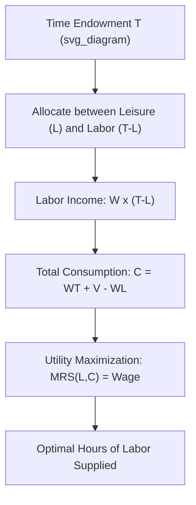
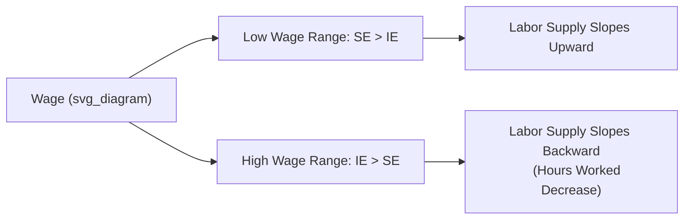

## Labor Supply and the Labor-Leisure Tradeoff

### Definition and Core Concept

The **labor-leisure tradeoff** models an individual's decision about how to allocate a fixed total time endowment (typically 24 hours per day, or some defined period) between **labor** (hours worked, generating income) and **leisure** (all non-work time, including rest, family time, and other non-market activities). Because time is scarce, every hour devoted to leisure is an hour not devoted to labor, and vice versa — the two are perfect substitutes for the individual's finite time budget.

**Labor supply** refers to the quantity of labor (hours) an individual is willing to offer at each possible wage rate. The labor-leisure framework provides the microeconomic foundation for the labor supply curve, derived from standard consumer choice theory applied to the choice between leisure (a "good" yielding utility directly) and income (used to purchase consumption goods).

### The Individual's Budget Constraint

Let $T$ be the total time endowment, $L$ the hours of leisure chosen, and $h = T - L$ the hours of labor supplied. Let $W$ be the wage rate and $V$ any non-labor (unearned) income (e.g., investment income, transfers). The individual's budget constraint for consumption $C$ (with price normalized to $1$) is:

$$C = W(T - L) + V = WT + V - WL$$

Rearranging into the standard linear budget-line form:

$$C + WL = WT + V$$

This is a budget line in $(L, C)$ space with **slope $-W$**: the wage rate is the **opportunity cost of leisure** — for the individual, choosing one more hour of leisure means forgoing $W$ dollars of consumption. The intercept $WT + V$ represents "full income": the maximum income attainable if all available time were spent working (plus non-labor income).

### Utility Maximization and the Optimal Choice

The individual maximizes utility $U(C, L)$ subject to the budget constraint, choosing the combination of consumption and leisure that reaches the highest attainable indifference curve. The tangency condition for an interior optimum (where the individual works a positive number of hours but less than the full time endowment) is:

$$MRS_{L,C} = \frac{MU_L}{MU_C} = W$$

where $MRS_{L,C}$ is the marginal rate of substitution between leisure and consumption. At the optimum, the individual's subjective valuation of an additional hour of leisure (in terms of consumption forgone) exactly equals the market wage rate, which is the objective opportunity cost of that leisure hour.

### Income and Substitution Effects of a Wage Change

A change in the wage rate produces two theoretically distinct effects on the demand for leisure (and hence on labor supply), because a wage change simultaneously changes the **relative price** of leisure and the individual's **real income**.

**Substitution Effect (SE):** a wage increase raises the opportunity cost of leisure (leisure becomes relatively more "expensive" in terms of forgone consumption), inducing the individual to substitute *away* from leisure and toward labor. The substitution effect of a wage increase always **increases hours worked** (decreases leisure), assuming leisure is a normal good in the substitution sense — this is a standard, unambiguous prediction of consumer theory.

**Income Effect (IE):** a wage increase raises the individual's real income at any given hours of work, and — assuming leisure is a **normal good** (demand for leisure rises as income rises) — this induces the individual to consume *more* leisure (work fewer hours). The income effect of a wage increase therefore tends to **decrease hours worked**.

**Net effect on labor supply** depends on which effect dominates:

- If $SE > IE$: a wage increase leads to **more** hours worked (labor supply curve slopes upward in wage).
- If $IE > SE$: a wage increase leads to **fewer** hours worked (labor supply curve slopes backward — the "backward-bending" segment).

### The Backward-Bending Labor Supply Curve

A widely discussed empirical and theoretical pattern is the **backward-bending labor supply curve**: at relatively low wage levels, labor supply typically slopes upward as wages rise (substitution effect dominates, since low income makes the individual highly responsive to the increased reward from working), but beyond some threshold wage, further wage increases can lead to *fewer* hours worked, as the income effect comes to dominate — workers, now earning substantially higher income even at reduced hours, choose to "buy back" leisure time.

[Inference: the specific wage threshold at which the curve bends backward, and how universally this pattern holds, varies across individuals, occupations, and empirical studies — the backward-bending shape is a standard theoretical possibility illustrated in textbooks rather than a single, universally observed empirical regularity at a fixed wage level.]

### Worked Numerical Illustration

Suppose an individual has $T = 16$ available waking hours per day (excluding a fixed 8 hours of sleep), no non-labor income ($V = 0$), and faces wage $W_1 = \$10/\text{hour}$.

Full income at this wage: $WT = 10 \times 16 = \$160$.

Suppose the individual's optimal choice at $W_1 = \$10$ is $L = 10$ hours of leisure, implying $h = 6$ hours of labor and $C = \$60$ of consumption.

Now suppose the wage rises to $W_2 = \$20/\text{hour}$. Two things can happen depending on preferences:

- **Substitution-effect-dominant case**: the individual reduces leisure to $L = 8$ hours, working $h = 8$ hours (labor supply rose from 6 to 8 hours as wage doubled).
- **Income-effect-dominant case**: the individual increases leisure to $L = 12$ hours, working only $h = 4$ hours (labor supply fell from 6 to 4 hours despite the wage doubling), because the individual can now achieve a higher consumption level ($C = 20 \times 4 = \$80$, exceeding the original $\$60$) while working fewer hours — illustrating the backward-bending case.

### Corner Solutions and the Reservation Wage

Not all individuals choose an interior labor supply solution. A **corner solution** at $h = 0$ (choosing not to participate in the labor market at all) occurs when, at the prevailing market wage, the individual's $MRS_{L,C}$ at $L = T$ (all time as leisure) already exceeds the wage — i.e., the individual values the first hour of forgone leisure more than the wage compensates.

The **reservation wage** is the minimum wage at which an individual is just willing to supply a positive number of labor hours — the wage exactly equal to the individual's $MRS_{L,C}$ evaluated at zero hours worked. Below the reservation wage, the individual chooses not to work (labor force non-participation); above it, the individual enters the labor market and chooses positive hours. This concept is central to models of the **labor force participation decision**, distinct from the **hours-of-work decision** conditional on participating.

### From Individual to Market/Aggregate Labor Supply

The **market labor supply curve** aggregates individual labor supply decisions across the population. Even if some individuals' supply curves bend backward at high wages, the *aggregate* market labor supply curve is typically drawn as **upward-sloping** across the empirically relevant wage range, because:

- Higher wages draw additional individuals into labor force participation (the **extensive margin**: whether to work at all), reinforcing an upward slope even if some already-working individuals reduce their hours (the **intensive margin**).
- Empirical labor supply elasticities tend to show a stronger response along the extensive margin (participation) than the intensive margin (hours), particularly for certain demographic groups. [Unverified: the precise magnitude of extensive- versus intensive-margin elasticities varies considerably across studies, demographic groups (e.g., primary versus secondary earners), countries, and time periods, and is an active area of empirical labor economics research rather than a single settled figure.]

### Applications

- **Taxation and labor supply**: analyzing how income taxes (which reduce the effective net wage) affect hours worked, via the same income/substitution effect decomposition — a tax cut has an ambiguous theoretical effect on labor supply for the same reason a wage increase does.
- **Welfare and transfer program design**: means-tested benefits that phase out as earned income rises create effective high marginal tax rates on additional work, a "welfare trap" or "benefit cliff" analyzed through labor-leisure tradeoff logic, since the effective net wage from working an additional hour can be sharply reduced by benefit withdrawal.
- **Retirement and pension policy**: modeling how Social Security or pension benefit rules affect the labor supply decisions of older workers, particularly around eligibility ages and benefit formulas that affect the effective return to additional work.
- **Overtime pay regulations**: analyzing why mandated overtime premiums (e.g., 1.5x wage for hours beyond a threshold) can induce employers and employees toward particular hours configurations, using the same marginal-tradeoff logic.
- **Cross-country differences in average hours worked**: differences in average annual hours worked across developed countries have been analyzed partly through this framework, considering differences in tax rates, social norms, and income levels. [Inference: attributing cross-country hours differences primarily to labor-leisure tradeoff mechanics versus other factors, such as institutional labor market regulations or cultural norms, remains a debated question in comparative labor economics rather than a matter with a single agreed-upon causal decomposition.]

### Limitations and Critiques

- **Hours flexibility assumption**: the basic model assumes workers can freely choose any number of hours at the prevailing wage, but in practice many jobs offer only fixed full-time or part-time hour configurations, limiting workers' ability to make marginal hours adjustments in response to wage changes.
- **Household/family labor supply decisions**: the basic single-individual model abstracts from household bargaining and joint labor supply decisions among household members (e.g., a "collective" or "unitary" household model), which can substantially affect predictions, particularly regarding secondary earners' labor force participation.
- **Non-pecuniary job characteristics**: the simple model treats labor purely as a source of disutility traded off against income, abstracting from intrinsic job satisfaction, career advancement considerations, and other non-wage aspects of work that influence real-world labor supply decisions.
- **Static, single-period framework**: the basic model is often presented statically, whereas real labor supply decisions are made over a lifecycle, with intertemporal considerations (saving, human capital investment, expected future wages) that a full **lifecycle labor supply model** incorporates but the basic tradeoff diagram does not.

**Related Topics**

- Marginal Revenue Product of Labor
- Reservation Wage and Labor Force Participation
- Income and Substitution Effects (General Consumer Theory)
- Monopsony in Labor Markets
- Taxation and Deadweight Loss in Labor Markets
- Human Capital Theory
- Lifecycle Labor Supply Models
- Household Production and Collective Bargaining Models