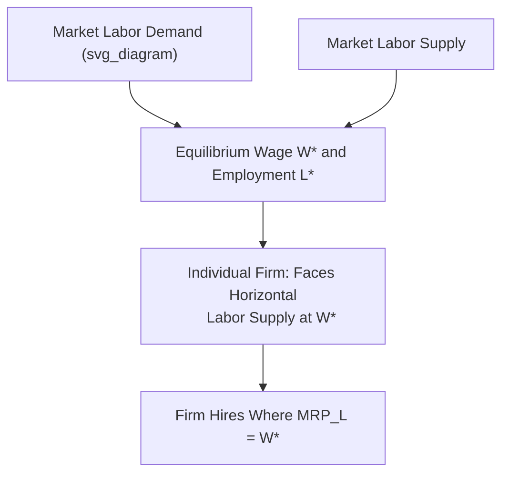
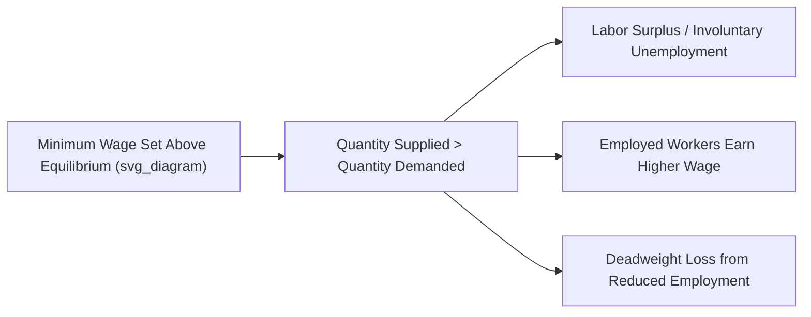

## Competitive Labor Markets

### Definition and Core Assumptions

A **competitive labor market** is a market for labor services in which no single buyer (firm) or seller (worker) has the power to influence the market wage — both sides are **wage-takers**, analogous to price-taking behavior in a perfectly competitive output market. The equilibrium wage and employment level are determined by the intersection of market labor supply and market labor demand.

**Standard assumptions of a competitive labor market:**

- **Many buyers (firms) and many sellers (workers)**, none large enough individually to affect the market wage.
- **Homogeneous labor** within a given labor-market category (workers are perfect substitutes for a given type of job/skill level).
- **Free entry and exit**: workers can freely move between employers, and firms can freely enter or exit the market for labor of this type.
- **Perfect information**: workers know all wage offers and job characteristics; firms know worker productivity.
- **No transaction costs or mobility barriers**: workers can costlessly relocate or switch employers in response to wage differentials.

### Firm-Level Labor Demand in a Competitive Labor Market

An individual firm operating in a competitive labor market faces a **perfectly elastic (horizontal) labor supply curve** at the prevailing market wage $W^*$: the firm can hire as many or as few workers as it wants at that wage without affecting it, because its hiring decisions are a negligible fraction of total market demand for labor.

The firm's **Marginal Factor Cost of Labor ($MFC_L$)** — the additional cost of hiring one more worker — equals the wage rate itself:

$$MFC_L = W^*$$

This is because, in a competitive labor market, the firm does not need to raise wages for existing workers to attract an additional worker; every worker, including the marginal hire, is paid the same going market wage.

The firm hires labor up to the point where its **Marginal Revenue Product of Labor ($MRP_L$)** equals the wage:

$$MRP_L = MFC_L = W^*$$

Because $MRP_L$ is typically downward-sloping (from diminishing marginal product), and $MFC_L$ is a horizontal line at $W^*$, the firm's profit-maximizing employment level is found where the downward-sloping $MRP_L$ curve intersects the horizontal $W^*$ line. The firm's own $MRP_L$ curve is precisely its individual demand curve for labor.

### Market Equilibrium: Supply and Demand for Labor

**Market labor demand** is obtained (with the general-equilibrium output-price feedback caveat noted in derived-demand analysis) by aggregating individual firms' $MRP_L$ curves across the industry — a downward-sloping relationship between the market wage and total quantity of labor demanded.

**Market labor supply** is obtained by aggregating individual workers' labor supply decisions (derived from the labor-leisure tradeoff and labor force participation decisions) — typically an upward-sloping relationship between the market wage and total quantity of labor supplied, driven predominantly by the extensive margin (workers entering/exiting the labor force) reinforcing the intensive margin (existing workers' hours).

**Equilibrium** occurs where market labor demand equals market labor supply, determining the equilibrium wage $W^*$ and equilibrium employment level $L^*$.

### Worked Numerical Example

Suppose the market for a particular category of skilled labor has the following supply and demand schedules (in thousands of workers):

| Wage ($W$) | Quantity Demanded | Quantity Supplied |
| --- | --- | --- |
| $15 | 100 | 40 |
| $20 | 85 | 60 |
| $25 | 70 | 70 |
| $30 | 55 | 85 |
| $35 | 40 | 100 |

**Market equilibrium** occurs at $W^* = \$25$, where quantity demanded equals quantity supplied at $70{,}000$ workers. At any wage above $\$25$ (e.g., $\$30$), quantity supplied ($85{,}000$) exceeds quantity demanded ($55{,}000$), creating a **labor surplus** (unemployment pressure in this specific labor-market segment) that pushes the wage back down toward $\$25$. At any wage below $\$25$ (e.g., $\$20$), quantity demanded ($85{,}000$) exceeds quantity supplied ($60{,}000$), creating a **labor shortage** that pushes the wage up toward $\$25$.

Each individual firm in this market, at the equilibrium wage of $\$25$, treats that wage as fixed and hires workers up to the point where its own $MRP_L = \$25$.

### Efficiency Properties of Competitive Labor Markets

Under the standard competitive assumptions, the equilibrium in a competitive labor market is **allocatively efficient**: the equilibrium wage equals both the value workers place on their marginal hour of forgone leisure ($MRS_{L,C}$, reflected in the labor supply curve) and the value firms derive from the marginal worker's output ($MRP_L$, reflected in the labor demand curve). At equilibrium employment $L^*$:

$$MRS_{L,C} = W^* = MRP_L$$

This equality means no mutually beneficial trade is left unexploited — no worker who would be willing to work for less than $W^*$ is left unemployed while a firm would be willing to pay more than $W^*$ for additional labor, and vice versa. Any deviation from $L^*$ (through a binding wage floor or ceiling, for example) generates **deadweight loss**, since some mutually beneficial employer-employee matches that would occur at the market-clearing wage no longer take place.

### Effects of Government Intervention: Minimum Wage

A **binding minimum wage** ($W_{min} > W^*$) set above the competitive equilibrium wage creates a situation where, at $W_{min}$, quantity of labor supplied exceeds quantity demanded — a **labor surplus**, interpreted as involuntary unemployment in the standard competitive model. Firms hire only $L_{demand}(W_{min}) < L^*$ workers, less than the competitive equilibrium quantity, while more workers ($L_{supply}(W_{min})$) would like to work at that wage than are hired.

**Standard predicted effects** in the simple competitive model:

- Employment falls below the competitive equilibrium level (for workers whose $MRP_L$ falls below $W_{min}$).
- Those who remain employed earn a higher wage than they would have at $W^*$.
- A deadweight loss arises from the reduction in mutually beneficial trades.

[Unverified: this is the textbook prediction of the basic competitive model; the actual empirical employment effects of real-world minimum wage policies are extensively studied and debated, with some empirical research finding smaller or statistically insignificant disemployment effects, particularly in markets with monopsony power — the sign and magnitude of real-world effects is not settled purely by theoretical prediction and varies by study, context, and the degree of competitiveness in the specific labor market examined.]

### Effects of Government Intervention: Payroll Taxes and Wage Subsidies

- **Payroll taxes** (levied on either the employer or employee side) drive a wedge between the wage the firm pays and the wage the worker receives, reducing equilibrium employment below $L^*$ regardless of which side is legally responsible for remitting the tax — the economic incidence (who actually bears the burden) depends on the relative elasticities of labor supply and labor demand, not on the statutory assignment of the tax.
- **Wage subsidies** (e.g., an Earned Income Tax Credit-type subsidy paid per hour worked) shift the effective labor supply curve, generally increasing equilibrium employment and potentially raising net worker take-home pay above the pre-subsidy market wage, at a fiscal cost borne by the government.

### Wage and Employment Adjustment to Demand and Supply Shifts

- A **rightward shift in labor demand** (e.g., from rising output demand, or a productivity-enhancing capital investment, per derived-demand analysis) raises both equilibrium wage and equilibrium employment.
- A **rightward shift in labor supply** (e.g., from population growth, increased labor force participation, or immigration into this labor-market segment) lowers the equilibrium wage while raising equilibrium employment.
- A **leftward shift in labor demand** (e.g., declining demand for the industry's output, or automation reducing labor's marginal product) lowers both equilibrium wage and equilibrium employment.

### Compensating Wage Differentials

Even within a broadly competitive labor market framework, **compensating (equalizing) wage differentials** explain why otherwise-similar jobs pay different wages: jobs with less desirable non-wage characteristics (higher risk, unpleasant conditions, unsociable hours) must offer a wage premium to attract workers at the margin, while jobs with desirable non-wage characteristics (prestige, safety, flexibility) can pay somewhat less and still attract an equivalent quantity and quality of labor. This concept, associated with Adam Smith's original discussion of wage differentials, is consistent with — and often presented as a refinement of — the basic competitive labor market model, since in full equilibrium, workers are indifferent at the margin between jobs once total compensation (wages plus the value of working conditions) is accounted for.

### Departures from the Competitive Benchmark

The competitive labor market model serves as a benchmark against which real-world labor market imperfections are analyzed:

- **Monopsony**: a single or dominant employer faces an upward-sloping labor supply curve (rather than the horizontal curve assumed in the competitive model), giving the firm wage-setting power and generally resulting in both lower wages and lower employment than the competitive outcome.
- **Labor unions and collective bargaining**: unions can act to raise wages above the competitive level for represented workers, functioning somewhat like an effective minimum wage or through direct bargaining power, with corresponding tradeoffs in employment predicted by standard competitive-model logic (though the actual net welfare effects depend on the specific bargaining model and any offsetting productivity effects of unionization).
- **Efficiency wages**: firms may deliberately pay above the market-clearing wage to reduce turnover, increase worker effort, or attract higher-quality applicants, generating a form of equilibrium involuntary unemployment even without a legal wage floor.
- **Search and matching frictions**: real labor markets involve costly search and imperfect information, meaning wages and employment are not instantaneously determined by a simple supply-demand intersection, but rather through a matching process with associated frictional unemployment — formalized in search-and-matching models (e.g., the Diamond-Mortensen-Pissarides framework) that extend beyond the static competitive model.

### Applications

- **Analyzing occupational wage differences**: comparing $MRP_L$-driven demand differences and skill-supply differences across occupations to explain observed wage structures.
- **Immigration policy analysis**: assessing how an influx of workers into a specific labor-market segment (a rightward labor supply shift) affects wages and employment for existing workers in that segment, and how this interacts with complementary versus substitutable labor categories.
- **Regional and sectoral labor market analysis**: explaining wage convergence or divergence across regions/sectors based on labor mobility, migration responses to wage differentials, and demand shocks specific to certain industries.
- **Evaluating labor market policy**: providing the baseline model against which minimum wage, payroll tax, unemployment insurance, and training-subsidy policies are analyzed for their predicted employment and wage effects.

### Limitations and Critiques

- **Homogeneous labor assumption is unrealistic**: real labor markets feature substantial heterogeneity in worker skills, preferences, and job characteristics, requiring more granular labor-market segmentation than the basic single-wage competitive model assumes.
- **Search frictions and imperfect information are pervasive**: workers rarely have complete knowledge of all available job offers, and switching jobs involves real costs, meaning the frictionless, instantaneous-adjustment competitive model is a simplification; more realistic search-theoretic models generate equilibrium unemployment even in the absence of wage floors, unlike the basic competitive model.
- **Monopsony power may be more widespread than traditionally assumed**: an active body of empirical labor economics research has argued that many real-world labor markets exhibit meaningful employer wage-setting power (not just in classic "company town" cases), which would imply that predicted effects of minimum wages or other interventions differ from the pure competitive-model prediction. [Unverified: the extent to which monopsony power is empirically widespread across labor markets, versus concentrated in specific sectors or geographies, remains an actively contested and researched question in labor economics rather than a settled consensus figure.]
- **Institutional and behavioral factors**: wage-setting in practice is often shaped by internal labor market norms, fairness considerations, long-term implicit contracts, and other institutional factors not captured in the spot-market competitive framework.

**Related Topics**

- Marginal Revenue Product of Labor
- Labor Supply and the Labor-Leisure Tradeoff
- Monopsony in Labor Markets
- Minimum Wage Theory and Employment Effects
- Compensating Wage Differentials
- Efficiency Wage Theory
- Labor Unions and Collective Bargaining
- Search and Matching Models of Unemployment
- Payroll Tax Incidence