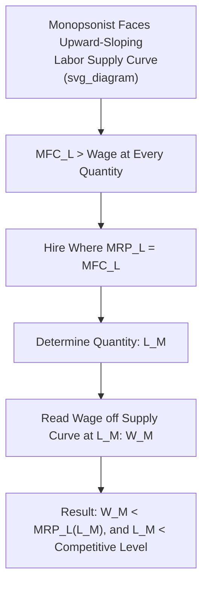

## Monopsony in Labor Markets

### Definition and Core Concept

**Monopsony** in a labor market describes a market structure in which a single firm (or a small number of firms with coordinated wage-setting power, sometimes termed **oligopsony**) is the dominant or sole buyer of a particular type of labor. Unlike a firm in a competitive labor market, which faces a horizontal (perfectly elastic) labor supply curve at the going market wage, a monopsonist faces the **entire upward-sloping market labor supply curve** directly: to hire more workers, it must raise the wage it offers, and — critically — under the standard assumption of a **single wage paid to all workers** (no perfect wage discrimination across workers), it must raise that wage for *all* currently employed workers, not just the marginal new hire.

This structural feature — facing the upward-sloping labor supply curve and having to pay all workers the same wage — is what gives the monopsonist wage-setting power and drives a wedge between the wage paid and the marginal value of labor to the firm.

### The Marginal Factor Cost of Labor Under Monopsony

Because the monopsonist must raise the wage for all workers to hire an additional one, the **Marginal Factor Cost of Labor ($MFC_L$)** — the true marginal cost of hiring one more worker — exceeds the wage rate itself:

$$MFC_L = W + L\frac{dW}{dL}$$

Since the labor supply curve is upward-sloping ($\frac{dW}{dL} > 0$), $MFC_L > W$ at every level of employment beyond the first worker. The intuition: hiring the next worker requires a slightly higher wage $W$, but that higher wage must also be paid to all $L$ previously hired workers, so the total marginal cost of the new hire includes both their own wage and the extra amount paid to everyone already employed.

**Numerical illustration of the wedge:** suppose the labor supply curve facing the monopsonist is $W = 10 + 0.5L$ (wage rises by $0.50 for each additional worker hired). Total labor cost is $TC_L = WL = (10 + 0.5L)L = 10L + 0.5L^2$. Then:

$$MFC_L = \frac{d(TC_L)}{dL} = 10 + L$$

At $L = 20$: $W = 10 + 0.5(20) = \$20$, but $MFC_L = 10 + 20 = \$30$ — the marginal cost of the 20th worker ($\$30$) substantially exceeds that worker's own wage ($\$20$), because the extra $0.50 wage increase must also be paid to the 19 previously hired workers, adding $19 \times 0.50 = \$9.50$ on top of the new worker's own $20 wage ($\$20 + \$9.50 \approx \$30$, consistent up to rounding).

### The Monopsonist's Profit-Maximizing Hiring Rule

The monopsonist maximizes profit by hiring labor up to the point where the **Marginal Revenue Product of Labor ($MRP_L$)** equals the **Marginal Factor Cost of Labor ($MFC_L$)**, rather than equaling the wage directly:

$$MRP_L = MFC_L$$

Once the profit-maximizing quantity of labor $L_M$ is determined by this condition, the actual **wage paid** is read off the labor supply curve at that quantity — i.e., $W_M$ is the wage the monopsonist must offer to attract exactly $L_M$ workers, found from the supply curve, not from the $MFC_L = MRP_L$ condition directly.

### Worked Numerical Example

A monopsonist firm faces a labor supply curve $W = 10 + 0.5L$ (as above), and its marginal revenue product of labor is $MRP_L = 50 - L$.

**Step 1 — Derive $MFC_L$:**

$$TC_L = WL = 10L + 0.5L^2 \quad \Rightarrow \quad MFC_L = 10 + L$$

**Step 2 — Set $MRP_L = MFC_L$ to find optimal employment:**

$$50 - L = 10 + L \quad \Rightarrow \quad 40 = 2L \quad \Rightarrow \quad L_M = 20$$

**Step 3 — Find the wage paid from the supply curve:**

$$W_M = 10 + 0.5(20) = \$20$$

**Comparison to the competitive benchmark:** if this same market were competitive (many employers bidding for this labor, wage-taking behavior), equilibrium would occur where $MRP_L = W$ (the labor supply curve itself, since $W$ *is* the $MFC_L$ under competition):

$$50 - L = 10 + 0.5L \quad \Rightarrow \quad 40 = 1.5L \quad \Rightarrow \quad L_C \approx 26.67$$

$$W_C = 10 + 0.5(26.67) \approx \$23.33$$

**Result:** the monopsonist hires **fewer workers** ($L_M = 20$ versus $L_C \approx 26.67$) and pays a **lower wage** ($W_M = \$20$ versus $W_C \approx \$23.33$) than would prevail under competitive conditions — the standard qualitative prediction of monopsony power.

### Graphical Representation

On a standard wage-employment diagram, the monopsony equilibrium is characterized by:

- The **Marginal Factor Cost curve ($MFC_L$)** lies above the labor supply curve ($S_L$) at every positive quantity of labor (since $MFC_L > W$).
- The **profit-maximizing employment level ($L_M$)** is found at the intersection of $MRP_L$ (labor demand) and $MFC_L$.
- The **wage actually paid ($W_M$)** is found by going *down* to the labor supply curve at $L_M$ — creating a visible gap between $W_M$ and the height of the $MRP_L$ curve at $L_M$, which represents monopsony's wedge (sometimes called "monopsonistic exploitation," a term originating with Joan Robinson): workers are paid a wage below the value of their marginal product, i.e., $W_M < MRP_L(L_M)$.

### Monopsonistic Exploitation and Deadweight Loss

The gap between $MRP_L(L_M)$ and $W_M$ at the monopsony equilibrium — termed **monopsonistic exploitation** by Joan Robinson (1933), who first developed the systematic theory of monopsony — represents the extent to which workers are paid less than the value of what they contribute at the margin. This is analytically parallel to monopoly power in output markets (where price exceeds marginal cost), but operating on the input side.

Because employment under monopsony ($L_M$) falls short of the competitive/efficient level ($L_C$), some mutually beneficial employer-employee matches that would occur under competitive conditions do not take place, generating a **deadweight loss** — a reduction in total surplus (combining firm profit and worker surplus) relative to the competitive benchmark.

### The Counterintuitive Effect of a Minimum Wage Under Monopsony

One of the most theoretically significant results in monopsony analysis concerns the effect of imposing a **binding minimum wage** on a monopsonistic labor market. Unlike in a competitive labor market — where a minimum wage above equilibrium unambiguously reduces employment — under monopsony, a minimum wage set **between** the monopsony wage $W_M$ and the competitive wage $W_C$ can simultaneously:

- **Raise the wage** (by design, since the wage floor is set above $W_M$).
- **Increase employment** (rather than reduce it).

**Intuition:** a minimum wage set in this range effectively converts the monopsonist's relevant $MFC_L$ curve into a horizontal segment at the minimum wage level (up to the quantity where the labor supply curve would naturally reach that wage), removing the incentive to restrict hiring to avoid bidding up wages for inframarginal workers. The firm now faces a flat marginal cost of labor over the relevant range and hires more workers, up to where $MRP_L$ intersects the wage floor. If the minimum wage is set exactly at the competitive wage $W_C$, employment rises all the way to the competitive-efficient level $L_C$ — eliminating the deadweight loss entirely.

**Important caveat:** this result holds only within a specific range. If the minimum wage is set *above* $W_C$, it begins to reduce employment below $L_C$, just as in the competitive-market case, since it then exceeds the level fully justified by the labor demand curve.

[Inference: this monopsony-minimum-wage theoretical result is a well-established feature of the standard model, but its real-world empirical relevance depends on the degree to which actual labor markets exhibit meaningful monopsony power — a matter that has generated substantial empirical debate rather than a single settled conclusion, as noted below.]

### Sources of Monopsony Power

- **Classic "company town" scenarios**: a single dominant employer in a geographically isolated area (historically, mining towns, mill towns) where workers have few or no alternative local employers.
- **Search and mobility frictions**: even without a literal single employer, if workers face significant costs to searching for and switching to alternative jobs (relocation costs, information gaps, licensing/credentialing barriers, non-compete agreements), employers can exercise a degree of **wage-setting power** even in markets with multiple employers — this broader concept is sometimes termed **monopsony power** or **oligopsony power** in modern labor economics, distinct from the pure single-buyer textbook case.
- **Employer collusion or coordination**: explicit or tacit agreements among employers not to compete for each other's workers (e.g., "no-poach" agreements), which have drawn increasing antitrust scrutiny in recent economic policy discussions.
- **Occupational licensing and non-compete clauses**: institutional/legal barriers that reduce a worker's ability to move to alternative employers, functionally increasing the elasticity of labor supply the firm effectively "controls."

### Empirical Relevance and Modern Research

A significant body of modern labor economics research has argued that meaningful monopsony power extends well beyond classic single-employer company towns, citing evidence such as: relatively low estimated elasticities of individual firm-level labor supply (implying firms retain some wage-setting power even in ostensibly competitive-looking markets with multiple employers), and studies of specific minimum wage increases that found employment did not fall as the pure competitive model would predict — interpreted by some researchers as consistent with monopsony-type dynamics.

[Unverified: the appropriate interpretation of this body of evidence — whether it reflects genuine widespread monopsony power, alternative explanations such as efficiency wages or search frictions, or limitations of specific studies' methodologies — remains actively debated among labor economists, and there is no single consensus figure for "how monopsonistic" labor markets generally are. Different studies, sectors, and geographic contexts yield different elasticity estimates.]

### Applications

- **Antitrust and labor market competition policy**: increasing attention from competition authorities to "no-poach" agreements, non-compete clause restrictions, and merger reviews that consider effects on labor market concentration, not just product market concentration.
- **Healthcare labor markets**: hospital and nursing labor markets, particularly in rural or less densely populated areas with few competing employers, are frequently cited as empirical examples where monopsony-type dynamics may be present.
- **Professional sports leagues**: historically, restrictions such as the "reserve clause" in baseball (before free agency) functioned as a form of monopsony power exercised collectively by team owners over players, a frequently cited historical illustration in labor economics teaching.
- **Minimum wage and living wage policy debates**: the monopsony model provides a key theoretical basis for arguments that minimum wage increases, within some range, may not produce the employment declines predicted by the simple competitive model — a consideration frequently invoked in contemporary minimum wage policy debates.
- **Occupational licensing reform**: analyzing how licensing requirements that restrict worker mobility across states or occupations may inadvertently create or reinforce local monopsony power.

### Limitations and Critiques of the Monopsony Model

- **Pure single-buyer monopsony is empirically rare** in its textbook form; most real-world applications rely on the broader, less stark concept of *some degree* of employer wage-setting power (sometimes modeled with **oligopsony** or search-theoretic wage-posting models) rather than a literal sole employer.
- **Quantifying the "right" minimum wage range** (between $W_M$ and $W_C$) that would increase employment requires precise knowledge of the labor demand and labor supply elasticities specific to a market — information that is difficult to estimate with confidence in practice, meaning the theoretical possibility of employment-increasing minimum wage effects does not, by itself, provide clear practical guidance on optimal minimum wage levels without further empirical estimation specific to context.
- **Dynamic and general equilibrium considerations**: static monopsony models do not fully capture longer-run adjustments, such as new firms entering a labor market in response to perceived above-normal profits from monopsony wage-setting, which could erode monopsony power over time in the absence of persistent structural barriers to entry.

**Related Topics**

- Competitive Labor Markets
- Marginal Revenue Product of Labor
- Minimum Wage Theory and Employment Effects
- Marginal Factor Cost
- Monopoly (Output Market Analogy)
- Labor Market Concentration and Antitrust Policy
- Efficiency Wage Theory
- Search and Matching Models of Unemployment
- Non-Compete Agreements and Labor Mobility