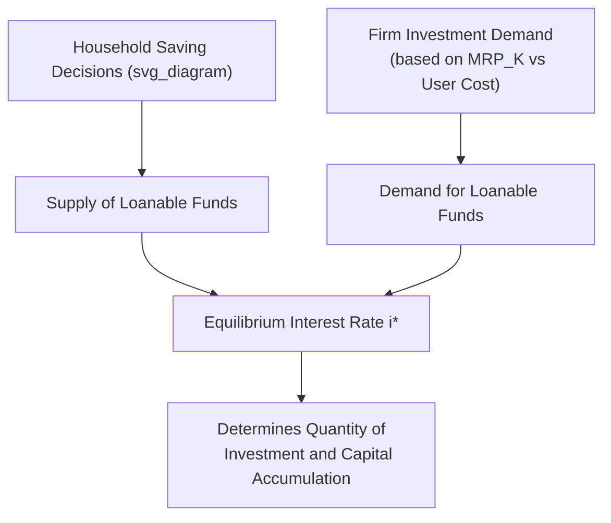

## Capital Markets and Interest Rates

### Definition and Core Concept

**Capital markets**, in the context of factor markets and income distribution, refer to the markets in which the services of **capital** (physical capital equipment, structures, and — in financial-market extensions — loanable funds used to finance capital investment) are bought, sold, or rented. The **interest rate** functions as the price of capital in the sense of being the return earned by suppliers of loanable funds (savers) and the cost paid by demanders of loanable funds (investing firms and borrowers).

Two related but distinct concepts are typically covered under this heading:

- The **rental price of capital ($r$)**: the price a firm pays per unit of time to use a unit of physical capital, analogous to the wage rate in labor markets.
- The **interest rate ($i$)**: the price of borrowing/lending funds over time, connecting the *market for loanable funds* to the *market for capital goods*, since firms typically finance capital purchases by borrowing (or by allocating retained earnings that carry an opportunity cost equal to the interest rate).

### The Firm's Demand for Capital: Marginal Revenue Product of Capital

Analogous to the labor market, a profit-maximizing firm's demand for capital follows from the **Marginal Revenue Product of Capital ($MRP_K$)**:

$$MRP_K = MP_K \times MR$$

where $MP_K$ is the marginal physical product of capital and $MR$ is marginal revenue from the output that capital helps produce. Under perfect competition in the output market, $MR = P$, giving:

$$MRP_K = MP_K \times P = VMP_K$$

The firm's **profit-maximizing rule for capital** hires (rents) units of capital up to the point where:

$$MRP_K = r$$

where $r$ is the market rental price of capital per unit of time. This produces a downward-sloping demand curve for capital, reflecting diminishing marginal product of capital, exactly parallel in structure to the labor-market $MRP_L = W$ condition.

### The Rental Price of Capital and the User Cost of Capital

For a firm that purchases (rather than rents) capital equipment, the effective per-period cost of using that capital — the **user cost of capital** (a concept developed extensively in neoclassical investment theory, associated with Dale Jorgenson) — combines several components:

$$\text{User Cost} = P_K (i + \delta - \pi)$$

where $P_K$ is the purchase price of the capital good, $i$ is the nominal interest rate (or required rate of return), $\delta$ is the **depreciation rate** of the capital good, and $\pi$ is the expected rate of capital-good price appreciation (often approximated as zero or linked to general inflation in simplified treatments). This formula captures: the opportunity cost of funds tied up in the capital good (or the interest cost if the purchase was financed by borrowing), plus the cost of physical wear/obsolescence (depreciation), net of any capital gains from asset appreciation.

Firms invest in additional capital up to the point where the **expected marginal revenue product of capital equals the user cost of capital** — a more complete investment-decision criterion than the simple rental-market $MRP_K = r$ condition, since it explicitly incorporates financing costs and depreciation.

### The Market for Loanable Funds

The **loanable funds market** models how the interest rate is determined as the price that equilibrates the supply of savings (from households, and other net lenders) with the demand for borrowing (primarily from firms financing capital investment, though also including government borrowing and consumer borrowing in broader treatments).

- **Supply of loanable funds**: derived from household saving decisions, which — analogous to the labor-leisure tradeoff — reflect an intertemporal consumption choice between consuming now versus saving to consume more in the future. A higher interest rate generally increases the reward for saving (though, as with labor supply, income and substitution effects of a rate change can theoretically work in opposite directions on saving, since higher returns let savers achieve a given future consumption target with less saved today).
- **Demand for loanable funds**: derived predominantly from firms' investment demand, which is downward-sloping in the interest rate because a higher cost of borrowed funds raises the user cost of capital, reducing the range of investment projects that remain profitable (i.e., fewer capital projects clear the hurdle of having $MRP_K$ exceed the now higher user cost).

**Equilibrium interest rate** occurs where the quantity of loanable funds supplied (saving) equals the quantity demanded (investment plus other borrowing).

### Worked Numerical Example: Rental Market for Capital

Suppose a competitive firm operates in a market where output sells at $P = \$5$, and the following schedule describes the marginal product of capital at different capital stock levels:

| Capital Units ($K$) | $MP_K$ | $MRP_K = MP_K \times \$5$ |
| --- | --- | --- |
| 1 | 20 | $100 |
| 2 | 18 | $90 |
| 3 | 16 | $80 |
| 4 | 14 | $70 |
| 5 | 12 | $60 |
| 6 | 10 | $50 |

If the market rental rate is $r = \$70$ per unit, the firm rents $K = 4$ units of capital, since $MRP_K = \$70 = r$ exactly at that level. Renting a 5th unit would add only $\$60$ in revenue against a $\$70$ rental cost — a net loss — so the firm stops at 4 units.

**Effect of a fall in the interest rate (feeding into a lower rental/user cost):** if the relevant cost of capital falls to $\$50$, the firm expands to $K = 6$ units, illustrating how a lower interest rate increases the quantity of capital demanded, holding technology and output price constant.

### Present Value and Investment Decision Criteria

Because capital investment involves upfront costs and a stream of future returns, evaluating whether a capital project is worthwhile requires **discounting future returns to present value**, using the interest rate (or the firm's required rate of return) as the discount rate:

$$PV = \sum_{t=1}^{n} \frac{R_t}{(1+i)^t}$$

where $R_t$ is the expected net return in period $t$. A project is worth undertaking if the present value of its expected returns exceeds its upfront cost (equivalently, if its **Net Present Value, $NPV$**, is positive):

$$NPV = -C_0 + \sum_{t=1}^{n} \frac{R_t}{(1+i)^t} > 0$$

This discounting relationship is the mechanism through which the market interest rate governs aggregate investment demand: a lower interest rate raises the present value of any given future return stream, making more capital projects pass the NPV-positive threshold and expanding the quantity of investment (and hence capital) demanded — precisely mirroring the downward slope of the loanable funds demand curve.

### The Marginal Efficiency of Capital / Marginal Efficiency of Investment

Related to $MRP_K$, the **marginal efficiency of capital (MEC)** or **marginal efficiency of investment (MEI)** — concepts associated with Keynesian investment theory (Keynes, *The General Theory*) — refers to the discount rate that equates the present value of a capital project's expected returns to its supply price (cost). Firms rank potential investment projects by their MEC and undertake all projects whose MEC exceeds the prevailing interest rate, generating a downward-sloping investment demand curve in $(i, I)$ space — a Keynesian formulation that parallels, but is historically and conceptually distinct from, the neoclassical $MRP_K$/user-cost approach. [Inference: the precise theoretical relationship and distinctions between the Keynesian MEC/MEI concept and the neoclassical marginal productivity/user-cost-of-capital framework are treated with varying degrees of emphasis and nuance across different textbook traditions.]

### Real vs. Nominal Interest Rates

The **nominal interest rate ($i$)** is the stated rate of return in current-dollar terms. The **real interest rate ($r_{real}$)** adjusts for expected inflation ($\pi^e$), reflecting the actual growth in purchasing power:

$$r_{real} \approx i - \pi^e$$

(more precisely, via the **Fisher equation**: $1 + i = (1 + r_{real})(1 + \pi^e)$)

Investment and saving decisions are generally modeled as depending on the **real** interest rate, since it reflects the true opportunity cost/return in terms of goods and services, not merely nominal currency units. This distinction is important because nominal rates can rise or fall due to changing inflation expectations without necessarily reflecting a change in the real cost of capital.

### Capital as a Stock vs. Investment as a Flow

A key conceptual distinction: **capital ($K$)** is a **stock** variable — the total quantity of capital equipment/structures in existence at a point in time — while **investment ($I$)** is a **flow** variable — the rate of addition to the capital stock per period. The relationship between them, accounting for depreciation, is:

$$K_{t+1} = K_t + I_t - \delta K_t$$

This distinction matters for interest-rate analysis because the *interest rate* most directly governs the *flow* of new investment in any given period (via the NPV/user-cost mechanism above), while the *existing capital stock* only adjusts gradually over time as the flow of investment (net of depreciation) accumulates.

### Applications

- **Monetary policy transmission**: central bank interest rate policy operates partly through this framework — lowering policy rates reduces the cost of borrowing for firms, lowering the user cost of capital and stimulating investment demand, a core channel of monetary policy transmission into the real economy.
- **Capital budgeting and corporate finance**: firms use NPV and related discounted cash flow techniques, directly built on the present-value logic above, to evaluate specific investment projects (new equipment, expansion, R&D).
- **Housing and real estate markets**: mortgage interest rates directly affect the user cost of owning housing (treated as a durable capital good in extended models), linking capital-market interest-rate theory to housing demand and construction investment.
- **Cross-country capital flows**: differences in interest rates (and expected returns) across countries drive international capital flows, as investors seek the highest risk-adjusted return, connecting domestic capital-market theory to open-economy macroeconomics.
- **Retirement savings and pension policy**: analysis of how interest rate levels affect household saving behavior and the adequacy of retirement savings accumulation over a working lifetime.

### Limitations and Critiques

- **The Cambridge capital controversy**: as with the broader marginal productivity theory of distribution, aggregating heterogeneous capital goods (machines, buildings, inventories of different vintages and types) into a single scalar "capital" measure with a well-defined marginal product raises theoretical objections, particularly at the level of aggregate economy-wide capital theory; this is generally treated as less problematic for firm-level or narrowly defined capital-market analysis than for macroeconomic growth theory. [Inference: as with earlier factor-market topics, the extent to which this critique meaningfully undermines standard applied capital-market analysis at the microeconomic level, versus being primarily a concern for aggregate theoretical modeling, is a matter on which economists' views differ.]
- **Financial market imperfections**: the simple loanable funds framework assumes frictionless borrowing and lending at a single market interest rate; in practice, credit rationing, asymmetric information between borrowers and lenders, collateral requirements, and varying risk premia across borrowers mean that not all creditworthy investment projects can necessarily obtain financing at the theoretical market rate, particularly for smaller firms or those without established credit histories.
- **Expectations and uncertainty**: investment decisions depend heavily on *expected* future returns, which are inherently uncertain; this uncertainty, and how firms and financial markets form and revise expectations, is a significant complicating factor not fully captured in the basic deterministic present-value framework, and has motivated extensions incorporating risk premia, real options theory, and animal-spirits-type considerations in investment behavior.
- **Interest rate as a single aggregate price**: the model's treatment of "the" interest rate abstracts from the reality of many different interest rates across different borrowers, maturities, and risk categories in actual financial markets (the yield curve, credit spreads, etc.), which a fully disaggregated treatment of capital markets would need to address.

**Related Topics**

- Marginal Revenue Product of Labor (Parallel Factor Market Logic)
- Derived Demand for Factors of Production
- Present Value and Net Present Value (NPV)
- Loanable Funds Market
- Fisher Equation and Real vs. Nominal Interest Rates
- Depreciation and Capital Stock Dynamics
- Cambridge Capital Controversy
- Monetary Policy Transmission Mechanisms
- Corporate Capital Budgeting