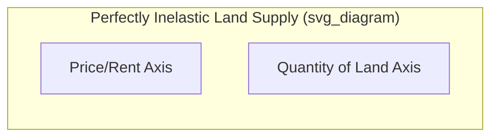
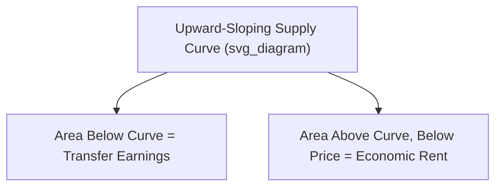

## Land Markets and Economic Rent

### Definition of Economic Rent

**Economic rent** is the payment made for the use of a factor of production that exceeds the minimum amount necessary to bring that factor into productive use (its opportunity cost or **transfer earnings**). It represents a surplus payment above what is required to keep the resource in its current use.

$$\text{Economic Rent} = \text{Total Payment} - \text{Transfer Earnings}$$

**Transfer earnings** is the minimum payment required to keep a factor in its present use; any payment below this amount would cause the factor owner to withdraw the resource and reallocate it elsewhere.

### Land as a Unique Factor of Production

Classical economists, particularly David Ricardo, treated land as distinct from labor and capital because of a key characteristic:

- **Fixed supply**: The total quantity of land is essentially fixed and cannot be increased in response to price changes, at least in aggregate (though specific uses of land can shift)
- **Perfectly inelastic supply**: Because land's supply does not respond to price, the entire payment to land is classified as economic rent in the classical model

**Key Points**

- In the pure classical case, since land has no opportunity cost of existing (it exists regardless of price), the entire return to land is a "pure" economic rent
- This is a simplification: in practice, land has alternative uses, so the classical zero-transfer-earnings assumption applies more precisely to raw, undifferentiated land rather than land improved with buildings, irrigation, or other capital investments

### Supply and Demand Diagram for Land

Because land supply is perfectly inelastic, its supply curve is a vertical line.

**Verbal description of the standard diagram:**

- The vertical axis measures rent (price per unit of land)
- The horizontal axis measures the quantity of land
- The supply curve $S$ is a vertical line at the fixed quantity $Q^*$
- The demand curve $D$ slopes downward, reflecting the marginal revenue product of land at different rental rates
- Equilibrium rent $R^*$ is determined entirely by the position of the demand curve, since supply cannot adjust
- **Any change in demand for land translates entirely into a change in rent, not quantity**, because quantity is fixed

$$R^* = f(D)$$

where $R^*$ (equilibrium rent) is a function solely of demand, holding supply fixed at $Q^*$.

### Rent Determination Mechanism

Since the quantity of land supplied does not respond to price:

1. Demand for land is derived from the demand for the goods and services produced using that land (a **derived demand**, consistent with all factor markets)
2. The demand curve reflects the **marginal revenue product of land (MRP_L)** — the additional revenue generated by employing one more unit of land
3. Because supply is fixed, rent adjusts to whatever level equates demand with the fixed supply
4. If demand increases (e.g., due to higher demand for agricultural output or urban space), rent rises without any corresponding increase in the quantity of land supplied

**Example**

Suppose the demand for land for wheat farming increases due to rising global wheat prices. Because the total supply of arable land in a region is fixed:

- The demand curve for land shifts rightward
- Since the supply curve remains vertical at $Q^*$, the entire adjustment occurs through a **higher equilibrium rent**, with no change in the quantity of land used
- This demonstrates why land rent is highly sensitive to shifts in derived demand

### Ricardian Theory of Rent

David Ricardo's theory of rent, developed in the context of agricultural economics, emphasizes **differential fertility** among plots of land.

**Core Argument**

- Land differs in fertility/productivity; some plots yield more output per unit of input than others
- As population and demand for agricultural output grow, cultivation extends to progressively less fertile ("marginal") land
- The **least fertile land in cultivation** (the marginal land) earns zero rent, because it just covers the cost of production with no surplus
- More fertile land earns a rent equal to the **difference in productivity** between it and the marginal land, holding cost of production constant

**Formal Statement**

$$\text{Rent on land } i = (\text{Output}_i - \text{Output}_{\text{marginal}}) \times \text{Price}$$

where $\text{Output}_i$ is the output per unit of input on land parcel $i$, and $\text{Output}_{\text{marginal}}$ is the output on the least productive (marginal) land in use.

**Example**

Consider three plots of land producing wheat with identical labor and capital inputs:

| Plot | Output (bushels) | Rent (relative to marginal plot) |
| --- | --- | --- |
| A (most fertile) | 100 | 40 (100 − 60) |
| B (moderate) | 80 | 20 (80 − 60) |
| C (marginal, least fertile) | 60 | 0 |

Plot C, being the marginal land, earns zero rent since its output just covers costs. Plots A and B earn rent equal to their productivity advantage over Plot C.

### Quasi-Rent

**Quasi-rent** is a related but distinct concept, referring to a surplus earned by a factor whose supply is fixed only in the **short run** but variable in the **long run**. This concept, introduced by Alfred Marshall, extends the idea of rent beyond land to capital equipment and other durable factors.

- In the short run, capital equipment already installed behaves like fixed-supply land — any payment above the minimum operating cost is quasi-rent
- In the long run, since the quantity of capital can be adjusted (built, depreciated, or scrapped), the supply becomes elastic, and quasi-rent tends to be competed away toward the normal return on capital
- Quasi-rent is therefore a **temporary** phenomenon tied to short-run fixity, distinguishing it from the more permanent rent on land

$$\text{Quasi-Rent} = \text{Total Revenue} - \text{Variable Costs (short run)}$$

### Economic Rent vs. Transfer Earnings: Elasticity Considerations

The proportion of a factor's total payment classified as economic rent versus transfer earnings depends on the **elasticity of supply** of that factor:

- **Perfectly inelastic supply** (vertical supply curve): 100% of payment is economic rent (classic land case)
- **Perfectly elastic supply** (horizontal supply curve): 100% of payment is transfer earnings; economic rent is zero, since the factor has an opportunity cost equal to its current payment in every alternative use
- **Upward-sloping supply curve** (typical case for labor and most factors): Payment is split between transfer earnings (area under the supply curve up to equilibrium quantity) and economic rent (area above the supply curve and below the price line, up to equilibrium quantity)

**Verbal description:**

- On a standard diagram with an upward-sloping supply curve $S$ and downward-sloping demand curve $D$ intersecting at equilibrium price $P^*$ and quantity $Q^*$:
  - The **transfer earnings** region is the area under the supply curve from the origin to $Q^*$
  - The **economic rent** region is the area between the supply curve and the horizontal price line $P^*$, from the origin to $Q^*$

This generalizes the land-rent concept: any factor earning more than its next-best alternative use is earning economic rent, regardless of whether the factor is land, labor, or capital.

### Rent-Seeking Behavior

**Rent-seeking** refers to efforts by individuals or firms to obtain economic rent through manipulation of the economic or political environment, rather than through the creation of new wealth or value.

- Examples include lobbying for favorable regulations, seeking monopoly licenses, or securing subsidies that generate rent without a corresponding increase in productive output
- Rent-seeking is generally considered to impose a **deadweight loss** on society, since resources are diverted toward redistributing existing wealth rather than producing new goods and services
- This concept extends the classical land-rent framework into political economy and public choice theory

[Inference] The magnitude of welfare loss from rent-seeking activities varies substantially across empirical contexts and is difficult to measure precisely, as it depends on the specific institutional and regulatory environment studied.

### Land Value Taxation (Georgist Perspective)

Henry George, in *Progress and Poverty* (1879), proposed a **single tax on land value** based on the economic rent framework:

- Because land supply is fixed, a tax on land rent does not distort the incentive to supply land (there is no disincentive effect, since the quantity supplied cannot change in response to the tax)
- This makes land value tax a theoretically **non-distortionary** tax, in contrast to taxes on labor or capital, which can reduce the quantity supplied due to elastic supply responses
- **Key implication**: Because the tax burden of a tax on a perfectly inelastic factor falls entirely on the supplier (with no deadweight loss), a land value tax is often cited in public economics as an efficient method of raising government revenue

$$\text{Deadweight Loss from Land Tax} \approx 0 \quad \text{(under perfectly inelastic supply assumption)}$$

### Tax Incidence in Factor Markets: General Principle

The land rent framework illustrates a broader principle of **tax incidence**: the burden of a tax falls more heavily on the side of the market (buyers or sellers) that is **less elastic**.

- Since land supply is perfectly inelastic, a tax on land value falls entirely on landowners (suppliers), with none of the burden shifted to tenants/users, because landowners cannot reduce quantity supplied in response
- This contrasts with markets where supply is elastic, in which producers can reduce quantity supplied to shift some of the tax burden onto consumers

### Applications and Extensions

- **Urban land rent and location theory**: Rent on urban land often reflects locational advantages (proximity to city centers, transport links), a extension of Ricardian differential rent to spatial economics (see the Von Thünen model and modern urban economics)
- **Natural resource rents**: The rent framework extends to non-renewable resources (oil, minerals), where "resource rent" reflects the surplus of price over extraction cost
- **Rent in imperfectly competitive markets**: Monopoly rent refers to supernormal profits sustained by barriers to entry, conceptually related to but distinct from classical land rent

### Common Pitfalls and Misconceptions

- **Conflating economic rent with "rent" in everyday usage**: The colloquial term "rent" (e.g., apartment rent) is a market price, not necessarily synonymous with economic rent in the technical sense — only the portion of that price exceeding transfer earnings constitutes economic rent
- **Assuming all land earns zero transfer earnings**: This holds strictly only under the classical assumption of a single, undifferentiated use for land; land with multiple potential uses (agricultural vs. residential vs. commercial) does have positive transfer earnings relative to its next-best use
- **Confusing quasi-rent with economic rent**: Quasi-rent is time-bound and tied to short-run fixity, while classical economic rent on land is treated as a permanent feature due to land's inherently fixed total supply

**Related Topics**

- Factor markets and derived demand
- Elasticity of factor supply and tax incidence
- Ricardian theory of comparative advantage
- Urban and spatial economics (Von Thünen model)
- Public finance and optimal taxation
- Monopoly rent and barriers to entry
- Natural resource economics
- Producer surplus and its relationship to economic rent
- Public choice theory and rent-seeking