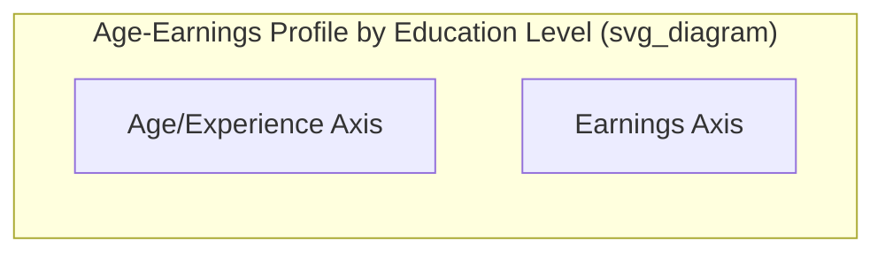

## Wage Differentials and Human Capital

### Overview

Wage differentials refer to systematic differences in earnings across workers, occupations, industries, and demographic groups. Human capital theory provides the primary microeconomic framework for explaining why identical labor is not paid identically, attributing much of the variation to differences in productivity-enhancing investments individuals make in themselves.

### Human Capital Theory: Core Framework

**Human capital** refers to the stock of skills, knowledge, education, training, and experience embodied in a worker that enhances their productive capacity. Developed formally by Gary Becker and Jacob Mincer, the theory treats investments in education and training analogously to investments in physical capital.

**Key Points**

- Workers incur **costs** (tuition, foregone earnings, effort) in the present to acquire skills
- These investments generate a **stream of returns** (higher future wages) over the worker's career
- Rational individuals invest in human capital up to the point where the marginal return equals the marginal cost, analogous to a firm's investment decision

### The Human Capital Investment Decision

The decision to invest in education or training can be modeled as a present-value calculation, comparing the discounted stream of benefits against costs.

$$PV = \sum_{t=1}^{n} \frac{B_t}{(1+r)^t} - C_0$$

where $B_t$ is the additional earnings in year $t$ attributable to the investment, $r$ is the discount rate, $C_0$ is the upfront cost (direct costs plus foregone earnings), and $n$ is the number of years over which returns accrue.

An individual undertakes the investment if $PV > 0$, i.e., if the discounted benefits exceed the costs.

**Costs of Human Capital Investment**

- **Direct costs**: Tuition, fees, books, training program costs
- **Opportunity costs**: Foregone earnings during the period of investment (often the largest component, especially for higher education)
- **Psychic costs**: Effort, stress, and non-monetary burden of learning

**Benefits of Human Capital Investment**

- Higher lifetime earnings
- Improved employment stability and job opportunities
- Non-pecuniary benefits (job satisfaction, social status), which, while relevant to overall welfare, fall outside the strict wage-differential calculation

### Age-Earnings Profiles

Human capital theory predicts a characteristic relationship between age (or experience) and earnings, known as the **age-earnings profile**.

**Verbal description of the standard diagram:**

- Earnings are plotted on the vertical axis, age or years of experience on the horizontal axis
- Higher-education profiles start later (due to years spent in school with low or zero earnings) but rise more steeply and reach a higher peak
- Lower-education profiles start earlier and rise more gradually, often plateauing sooner and at a lower level
- All profiles typically exhibit **diminishing returns to experience** over time — earnings rise at a decreasing rate as workers age, reflecting depreciation of skills and typically flatten or decline near retirement
- The curves are generally **concave**, reflecting this pattern of increasing earnings at a decreasing rate

**Key Points**

- The gap between profiles of different education levels widens over the career for many cohorts before narrowing near retirement, consistent with human capital accumulating value over time through on-the-job experience compounding with formal education
- The point where profiles cross (if a lower-education profile starts higher due to earlier labor market entry) represents the **break-even point** at which the higher-education investment begins to pay off

### On-the-Job Training

Human capital is not solely acquired through formal education; on-the-job training is a major component, distinguished by Becker into two types:

**General Training**

- Increases a worker's productivity equally across many employers (e.g., general computer literacy, communication skills)
- Because the skill is transferable, competitive labor markets imply that the **worker bears the cost** of general training (often via a lower wage during the training period), since a firm cannot capture returns on an investment the worker could take to a competitor
- The worker subsequently earns the return in the form of higher wages either at the current firm or elsewhere

**Specific Training**

- Increases productivity only at the current firm (e.g., firm-specific processes, proprietary systems, knowledge of internal organizational structure)
- Since the skill has no value elsewhere, **firms and workers typically share the cost and returns**, as this arrangement reduces turnover incentives for both parties: the firm avoids losing its investment to a quit, and the worker gains an incentive not to leave (since they would forfeit the wage premium reflecting shared returns)

**Example**

A firm trains a new employee on both (1) general spreadsheet software and (2) the firm's proprietary internal database system.

- For (1), the firm has little incentive to pay the full cost, since the employee could apply this skill anywhere; the wage during training tends to be lower to offset the firm's training expense
- For (2), the firm is more willing to bear some of the cost, since this skill cannot be used to increase the worker's outside wage offers, reducing the risk that the firm's investment is captured by a rival employer through poaching

### Sources of Wage Differentials

Wage differentials arise from several distinguishable sources, often studied together in labor economics:

**1. Compensating Wage Differentials**

Wage differences that compensate workers for non-monetary differences in job characteristics (risk, unpleasantness, location, hours). This is a distinct theoretical mechanism from human capital but often interacts with it — see the related topic entry below.

**2. Human Capital Differences**

Differences in education, training, experience, and innate ability directly translate into differences in marginal productivity, and hence into wages under competitive labor market assumptions.

**3. Ability and Signaling**

[Unverified] There is ongoing debate in labor economics regarding how much of the return to education reflects genuine productivity enhancement (human capital accumulation) versus **signaling** — the theory (associated with Michael Spence) that education merely signals pre-existing ability to employers without necessarily increasing productivity itself. The relative weight of these two explanations is empirically contested and varies by context, education level, and study methodology.

**4. Discrimination**

Wage differentials that persist even after controlling for productivity-related characteristics (education, experience, occupation) may reflect labor market discrimination based on race, gender, or other characteristics unrelated to productivity. This is studied via decomposition techniques (see below).

**5. Market Imperfections**

Search frictions, imperfect information, monopsony power, and geographic immobility can all generate wage differentials that persist even for observably identical workers, independent of human capital differences.

### The Mincer Earnings Equation

Jacob Mincer's human capital earnings function is the standard empirical tool for estimating returns to education and experience. It regresses the natural log of earnings on years of schooling and a quadratic function of experience.

$$\ln(W) = \beta_0 + \beta_1 S + \beta_2 X + \beta_3 X^2 + \varepsilon$$

where:

- $W$ = wages or earnings
- $S$ = years of schooling
- $X$ = years of labor market experience
- $\beta_1$ = estimated percentage increase in earnings per additional year of schooling (the **return to education**)
- $\beta_2, \beta_3$ = coefficients capturing the concave relationship between experience and earnings (with $\beta_3$ expected to be negative, reflecting diminishing and eventually declining returns to experience)
- $\varepsilon$ = error term capturing unobserved factors (ability, luck, etc.)

**Interpretation**

The coefficient $\beta_1$ is commonly interpreted as the **rate of return to an additional year of schooling**, analogous to a rate of return on a financial investment.

[Inference] Estimated returns to schooling using the Mincer framework vary considerably across countries, time periods, and estimation methods, and are subject to well-documented econometric concerns such as ability bias and endogeneity of the schooling decision, meaning point estimates should be interpreted cautiously rather than taken as precise structural parameters.

### Wage Decomposition (Oaxaca-Blinder Method)

To separate the portion of a wage gap attributable to differences in human capital (and other observable characteristics) from the portion attributable to differential returns (potentially reflecting discrimination), economists commonly use the **Oaxaca-Blinder decomposition**.

$$\ln(W_A) - \ln(W_B) = \underbrace{(\bar{X}_A - \bar{X}_B)\hat{\beta}_A}_{\text{Explained (Endowment) Component}} + \underbrace{\bar{X}_B(\hat{\beta}_A - \hat{\beta}_B)}_{\text{Unexplained (Coefficient) Component}}$$

where $\bar{X}_A, \bar{X}_B$ are average characteristics (education, experience, etc.) of groups A and B, and $\hat{\beta}_A, \hat{\beta}_B$ are the estimated returns to those characteristics for each group.

**Interpretation**

- The **explained component** reflects the portion of the wage gap due to differences in measurable human capital and other characteristics between the two groups
- The **unexplained component** reflects the portion of the gap due to differing returns to the same characteristics — often interpreted as an upper-bound proxy for discrimination, though it also captures any unobserved characteristics not included in $X$

### Screening and Signaling Models (Alternative to Human Capital Theory)

**Signaling model (Spence, 1973)**

Education may not increase productivity directly, but serves as a signal that separates high-ability from low-ability workers, since acquiring education is assumed to be less costly for high-ability individuals.

- In a signaling equilibrium, employers pay higher wages to more-educated workers not because education *causes* higher productivity, but because education level correlates with pre-existing ability
- This model can produce similar empirical wage-education correlations to human capital theory, making the two difficult to distinguish using standard cross-sectional wage data alone

**Key distinction between the two theories:**

| Feature | Human Capital Theory | Signaling Theory |
| --- | --- | --- |
| Does education raise productivity? | Yes, directly | Not necessarily |
| Social value of education subsidies | Positive (raises output) | Ambiguous (may only sort workers) |
| Policy implication | Expand access to education | Credentialing may have limited productivity benefit |

### Superstar Markets and Convex Wage Structures

[Inference] In certain markets (entertainment, professional sports, executive compensation), wage differentials can be extremely large and convex relative to differences in measured skill, a pattern often explained by "superstar economics" (Rosen, 1981), where technology allows the most skilled individuals to serve very large markets at low marginal cost, generating disproportionate rewards; the precise magnitude of this effect is context-dependent and debated in the compensation literature.

### Common Pitfalls and Misconceptions

- **Treating the Mincer coefficient as a causal estimate without qualification**: Because schooling is a choice correlated with unobserved ability, motivation, and family background, naive OLS estimates of returns to education may suffer from **ability bias**, generally an upward bias, though the direction and magnitude depend on the specific empirical context and identification strategy used
- **Assuming all wage gaps reflect discrimination**: A raw wage gap between groups conflates differences in human capital, industry/occupation sorting, hours worked, and discrimination; only rigorous decomposition can separate these channels, and even decomposition methods cannot perfectly isolate discrimination from unobserved productivity differences
- **Confusing signaling and human capital theories**: Both theories predict a positive education-wage correlation, but they carry very different policy implications regarding the social returns to expanding education

**Related Topics**

- Compensating wage differentials and hedonic wage theory
- Labor market discrimination and Oaxaca-Blinder decomposition
- Signaling and screening in imperfect information markets
- Marginal productivity theory of factor pricing
- Labor supply and the human capital investment decision
- Monopsony power in labor markets
- Superstar economics and income inequality
- Returns to education: empirical methods and instrumental variables