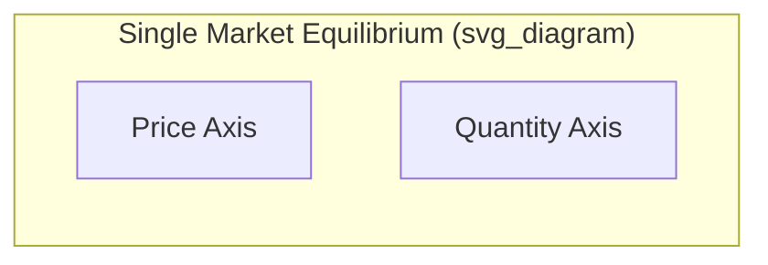
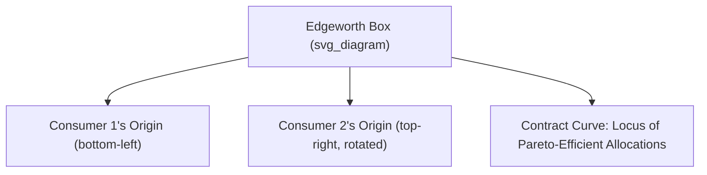

## Partial vs General Equilibrium Analysis

### Definitions and Core Distinction

**Partial equilibrium analysis** examines the equilibrium conditions in a single market or a small subset of markets, holding all other prices and market conditions constant (the *ceteris paribus* assumption). It isolates one market for detailed study, treating spillover effects into other markets as negligible or irrelevant to the question at hand.

**General equilibrium analysis** examines the simultaneous equilibrium of *all* markets in an economy, explicitly accounting for the interdependence between markets — a price change in one market can shift supply and demand in other markets, which in turn feed back into the original market.

**Key Points**

- Partial equilibrium is a **simplifying approximation**, useful when a market is small relative to the whole economy, or when analyzing short-run effects before broader adjustments occur
- General equilibrium is more comprehensive but analytically more complex, since it requires solving for prices and quantities across all markets simultaneously such that every market clears at once

### Partial Equilibrium Framework

**Marshallian Partial Equilibrium**

Named after Alfred Marshall, this framework analyzes a single market using standard supply and demand curves, under the assumption that:

- Prices in all other markets remain fixed
- Consumer income and preferences for other goods are unaffected
- Cross-price effects with other markets are small enough to ignore

**Verbal description of the standard diagram:**

- Downward-sloping demand curve $D$ and upward-sloping supply curve $S$ intersect at equilibrium price $P^*$ and quantity $Q^*$
- Any shift in $D$ or $S$ (from a change in a determinant *other than the good's own price*) leads to a new equilibrium, with all other markets' conditions assumed unaffected

**Mathematical Representation**

$$Q_D(P) = Q_S(P)$$

Equilibrium price $P^*$ solves this single-market equation, holding all other prices $P_j$ ($j \neq i$) and income $Y$ constant.

**When Partial Equilibrium Is Appropriate**

- The market being studied is small relative to the overall economy (its price changes do not meaningfully affect other markets)
- The good in question has few close substitutes or complements with significant cross-market feedback
- The analysis concerns short-run adjustments before broader ripple effects propagate

**Example**

Analyzing the effect of a tax on cigarettes using partial equilibrium: the analysis focuses on the cigarette market's supply and demand curves, computing the new equilibrium price and quantity, and assumes the tax's effect on, say, the market for lighters or healthcare services is negligible enough to ignore for the purposes of the specific question being asked.

### General Equilibrium Framework

**Walrasian General Equilibrium**

Named after Léon Walras, general equilibrium theory models an economy as a system of interconnected markets, where equilibrium requires that supply equals demand **simultaneously in every market**.

**Formal Conditions**

For an economy with $n$ goods, general equilibrium requires:

$$Q_D^i(P_1, P_2, \ldots, P_n) = Q_S^i(P_1, P_2, \ldots, P_n) \quad \text{for all } i = 1, \ldots, n$$

Each market's excess demand depends not just on its own price, but on the **entire vector of prices** across the economy.

**Walras's Law**

A foundational result stating that if all markets but one are in equilibrium, the remaining market must also be in equilibrium. This follows from the aggregate budget constraint: the sum of excess demands across all markets, valued at prevailing prices, must equal zero.

$$\sum_{i=1}^{n} P_i \cdot (Q_D^i - Q_S^i) = 0$$

**Implication**: In an $n$-good economy, only $n-1$ independent market-clearing conditions need to be solved, since the $n$-th is automatically satisfied if the others hold.

### The Edgeworth Box: A Simple General Equilibrium Model

The **Edgeworth box** is a standard graphical device used to illustrate general equilibrium in a simple exchange economy with two goods and two consumers.

**Verbal description:**

- The box represents the total fixed endowment of two goods between two consumers
- Each consumer's indifference curves are drawn from their respective corner of the box (Consumer 2's axes are rotated 180 degrees relative to Consumer 1's)
- The **contract curve** traces all allocations where the two consumers' indifference curves are tangent — i.e., where marginal rates of substitution (MRS) are equal, satisfying the condition for Pareto efficiency in exchange
- A **competitive equilibrium** in this exchange economy occurs where the consumers' offer curves intersect at a common relative price, and this equilibrium allocation lies on the contract curve

**Key Condition for Efficient Exchange**

$$MRS^1_{xy} = MRS^2_{xy} = \frac{P_x}{P_y}$$

Both consumers face the same relative price ratio, and at equilibrium, each consumer's marginal rate of substitution equals that price ratio — which, since both equal the same price ratio, means the two consumers' MRS are equal to each other, satisfying Pareto efficiency in exchange.

### Existence, Uniqueness, and Stability of General Equilibrium

**Existence**

The **Arrow-Debreu model** provides the foundational proof (using fixed-point theorems, notably Kakutani's fixed-point theorem) that a competitive general equilibrium exists under standard assumptions:

- Convex preferences
- Continuous preferences
- Local non-satiation
- Convex production sets (constant or decreasing returns to scale)

**Uniqueness**

[Unverified] General equilibrium is not guaranteed to be unique in general; multiple equilibria can exist depending on the specific structure of preferences and technology, and additional restrictive assumptions (such as gross substitutability across all goods) are typically required to guarantee a unique equilibrium.

**Stability**

Stability refers to whether a hypothetical price-adjustment process (such as Walrasian tâtonnement, a theoretical "groping" process where prices adjust in response to excess demand before trade actually occurs) converges to equilibrium. [Inference] The theoretical conditions under which general equilibrium is stable are more restrictive than those required merely for its existence, and this remains a more technical and less universally applicable branch of the theory compared to existence results.

### Interdependence Between Markets: A Worked Comparison

**Example: Effect of a Gasoline Tax**

**Partial equilibrium view:**

- Tax raises the price of gasoline
- Quantity demanded falls along the gasoline demand curve
- Analysis stops here, treating other markets as unaffected

**General equilibrium view:**

- Higher gasoline prices reduce demand for gasoline-complementary goods (e.g., large vehicles, road trips)
- Higher gasoline prices increase demand for gasoline-substitute goods (e.g., public transit, electric vehicles, bicycles)
- Changes in these related markets can feed back into the labor market (e.g., shifts in employment between automotive and public transit sectors)
- Government tax revenue collected may be redistributed or spent, generating further demand effects across multiple markets
- The full incidence and welfare effect of the tax can only be properly assessed by tracing these interconnected adjustments across markets

**Key Points**

- Partial equilibrium analysis of the gasoline tax will generally **understate or misstate** the full economic impact if cross-market effects are economically significant
- The larger and more central the market under study, the more a general equilibrium approach becomes necessary for accurate welfare analysis

### Comparative Statics in General Equilibrium

Comparative statics in a general equilibrium context traces how a shock to one market propagates through the entire system of interconnected markets to a new full-economy equilibrium.

$$\frac{\partial P_i^*}{\partial \theta} \quad \text{where all } P_j^*, j \neq i, \text{ are also functions of } \theta$$

Here $\theta$ represents an exogenous shock (e.g., a tax, technology change, or preference shift), and the equilibrium price vector $P^*$ across *all* markets must be re-solved jointly, since each price depends on every other price in the system.

### Applications in Welfare Economics

General equilibrium theory underpins the **Fundamental Theorems of Welfare Economics**:

**First Welfare Theorem**: Any competitive equilibrium (under standard assumptions, notably no externalities and no market power) is Pareto efficient.

**Second Welfare Theorem**: Any Pareto-efficient allocation can be achieved as a competitive equilibrium, given an appropriate initial redistribution of endowments.

These theorems require the full general equilibrium framework, since Pareto efficiency is a property of the **entire allocation of resources across all markets simultaneously** — a concept that partial equilibrium analysis, by construction, cannot fully capture, since it examines only one market in isolation.

### Comparison Table: Partial vs. General Equilibrium

| Feature | Partial Equilibrium | General Equilibrium |
| --- | --- | --- |
| Scope | Single market or small group of markets | All markets simultaneously |
| Key assumption | Other prices/markets held constant | All prices determined jointly |
| Complexity | Lower; tractable with standard supply-demand tools | Higher; requires systems of equations, fixed-point methods |
| Best suited for | Small markets, short-run analysis, isolated policy questions | Economy-wide shocks, welfare analysis, trade policy, tax incidence across sectors |
| Key theorist | Alfred Marshall | Léon Walras; formalized by Arrow and Debreu |
| Typical tool | Supply and demand diagram | Edgeworth box, Walrasian system of equations |

### Common Pitfalls and Misconceptions

- **Assuming partial equilibrium is simply "wrong"**: Partial equilibrium is not incorrect, but rather a deliberate simplification valid under specific conditions (small market size, limited cross-market effects); the choice between frameworks is a modeling decision based on the scope of the question, not a matter of one approach being universally superior
- **Overlooking Walras's Law**: Students often attempt to independently verify equilibrium in every market without recognizing that the last market's equilibrium is implied once all others clear
- **Conflating existence and stability**: A general equilibrium can be proven to exist mathematically without any guarantee that a real-world (or theoretical tâtonnement) price-adjustment process would actually converge to it
- **Assuming general equilibrium models require literal real-time market clearing**: The Walrasian tâtonnement process is a theoretical construct for characterizing equilibrium properties, not necessarily a literal description of how real markets adjust to shocks over time

**Related Topics**

- Edgeworth box and Pareto efficiency in exchange
- First and Second Fundamental Theorems of Welfare Economics
- Arrow-Debreu model and existence of competitive equilibrium
- Walras's Law and market interdependence
- Production possibility frontier and efficiency in production
- Tax incidence and deadweight loss across interconnected markets
- Externalities and market failure in general equilibrium
- International trade theory and the gains from trade