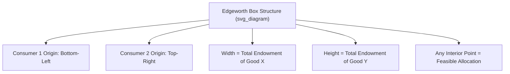
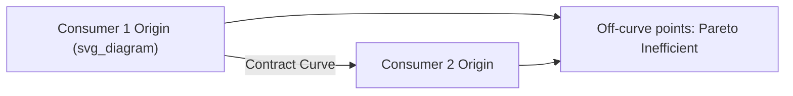

## Edgeworth Box and Exchange Efficiency

### Definition and Purpose

The **Edgeworth box** is a graphical construct used to analyze the allocation of a fixed quantity of two goods between two consumers (or two inputs between two firms in production contexts). Developed by Francis Ysidro Edgeworth and later popularized by Vilfredo Pareto, it is the primary pedagogical tool for illustrating **Pareto efficiency in exchange** and the conditions for competitive equilibrium in a simple general equilibrium setting.

### Construction of the Edgeworth Box

**Setup**

- Two consumers, labeled Consumer 1 and Consumer 2
- Two goods, labeled $X$ and $Y$
- A fixed total endowment of each good: $\bar{X}$ units of good $X$ and $\bar{Y}$ units of good $Y$, shared between the two consumers

**Geometric Construction**

- The box has width $\bar{X}$ and height $\bar{Y}$
- Consumer 1's origin is placed at the bottom-left corner, with axes running rightward and upward in the standard orientation
- Consumer 2's origin is placed at the top-right corner, with axes running leftward and downward (i.e., Consumer 2's indifference map is rotated 180 degrees relative to Consumer 1's)
- Any point inside the box represents a **feasible allocation**: a specific division of the total endowment between the two consumers, since Consumer 1's consumption plus Consumer 2's consumption of each good exactly equals the fixed total

$$X_1 + X_2 = \bar{X}, \qquad Y_1 + Y_2 = \bar{Y}$$

where $X_1, Y_1$ are Consumer 1's consumption of each good, and $X_2, Y_2$ are Consumer 2's.

### Indifference Curves Within the Box

Each consumer's indifference curves are mapped into the box from their respective origin:

- **Consumer 1's indifference curves** are drawn conventionally (convex to Consumer 1's origin at the bottom-left), with utility increasing as one moves up and to the right (toward Consumer 2's origin)
- **Consumer 2's indifference curves** are drawn convex to Consumer 2's origin at the top-right, with Consumer 2's utility increasing as one moves down and to the left (toward Consumer 1's origin)

At any given point in the box, exactly one indifference curve for each consumer passes through it, representing each consumer's satisfaction level with that particular allocation.

### The Initial Endowment Point

The **initial endowment** is a specific point in the box representing the allocation of goods before any voluntary exchange occurs. This is the starting point from which mutually beneficial trade may proceed.

**Key Points**

- Both consumers will only voluntarily trade away from the initial endowment if the trade makes them at least as well off (and at least one strictly better off)
- The set of allocations that both consumers would voluntarily accept (relative to their initial endowment) is bounded by the indifference curves of both consumers passing through the endowment point — this region is often called the **lens-shaped region** or "trading zone"

### Pareto Efficiency and Tangency Condition

An allocation within the Edgeworth box is **Pareto efficient** if it is impossible to make one consumer better off without making the other consumer worse off.

**Graphical Condition**

Pareto efficient allocations occur precisely where the indifference curves of the two consumers are **tangent** to each other — at any such point, moving in any direction would necessarily reduce at least one consumer's utility.

**Formal Condition**

$$MRS^1_{XY} = MRS^2_{XY}$$

where $MRS^i_{XY}$ is Consumer $i$'s marginal rate of substitution between goods $X$ and $Y$ — the rate at which Consumer $i$ is willing to trade good $Y$ for good $X$ while holding utility constant.

**Why Tangency Implies Efficiency**

If the indifference curves cross rather than are tangent (i.e., $MRS^1_{XY} \neq MRS^2_{XY}$), there exists a direction of exchange along which both consumers can move to a mutually preferred allocation — meaning the original allocation was *not* efficient, since a Pareto improvement was still available. Only where the curves are tangent does no such mutually beneficial trade remain possible.

### The Contract Curve

The **contract curve** is the locus of all Pareto-efficient allocations within the Edgeworth box — the set of all points where the two consumers' indifference curves are tangent.

**Verbal description:**

- The contract curve typically runs diagonally from Consumer 1's origin to Consumer 2's origin, though its exact shape depends on the specific utility functions of both consumers
- Every point ON the contract curve is Pareto efficient
- Every point OFF the contract curve is Pareto inefficient, meaning some reallocation exists that would improve at least one consumer's utility without harming the other

**Key Points**

- The contract curve does not indicate which particular efficient allocation will be reached — that depends on the initial endowment, bargaining power, and the specific trading/pricing mechanism used
- Not all points on the contract curve are reachable via voluntary trade from a given initial endowment; only the portion of the contract curve that lies within the lens-shaped mutually-beneficial-trade region relative to the endowment point is reachable through voluntary exchange from that particular starting point

### Competitive Equilibrium in the Edgeworth Box

A **competitive (Walrasian) equilibrium** in the exchange economy is a price ratio $P_X/P_Y$ and an allocation such that both consumers, taking prices as given, choose their utility-maximizing bundle subject to their budget constraint, and the resulting bundles are mutually consistent (markets clear).

**Conditions for Competitive Equilibrium**

$$MRS^1_{XY} = MRS^2_{XY} = \frac{P_X}{P_Y}$$

Both consumers independently set their own MRS equal to the common relative price ratio, which automatically implies their MRS values are equal to each other — satisfying the Pareto efficiency tangency condition.

**Graphical Representation**

- A **budget line** (price line) passes through the initial endowment point, with slope $-P_X/P_Y$
- Each consumer chooses their utility-maximizing point along this shared budget line, subject to their own indifference map
- At equilibrium, both consumers' chosen points **coincide** at a single allocation on the budget line, and this point lies on the contract curve (satisfying tangency)

**Example**

Suppose Consumer 1 has an initial endowment richer in good $X$, and Consumer 2 has an initial endowment richer in good $Y$. At a market-clearing price ratio $P_X/P_Y$:

- Consumer 1, relatively abundant in $X$, will generally wish to sell some $X$ and buy $Y$
- Consumer 2, relatively abundant in $Y$, will generally wish to sell some $Y$ and buy $X$
- Equilibrium occurs where the quantity of $X$ that Consumer 1 wishes to sell exactly equals the quantity Consumer 2 wishes to buy (and correspondingly for $Y$), and this exchange moves the allocation from the initial endowment point to a point on the contract curve

### The First Welfare Theorem in the Edgeworth Box Context

The Edgeworth box provides a direct visual proof of the **First Fundamental Theorem of Welfare Economics** in a simple exchange setting: any competitive equilibrium allocation lies on the contract curve, and is therefore Pareto efficient.

**Intuition**

Because both consumers face the identical price ratio and independently choose their MRS to equal that ratio, their MRS values are necessarily equalized at equilibrium — which is exactly the tangency condition defining Pareto efficiency.

### The Second Welfare Theorem in the Edgeworth Box Context

The **Second Fundamental Theorem of Welfare Economics** states that any point on the contract curve (any Pareto-efficient allocation) can be supported as a competitive equilibrium, provided the initial endowment is first redistributed appropriately (via lump-sum transfers) to a point from which that specific efficient allocation is reachable via trade at the corresponding equilibrium price ratio.

**Key Points**

- This separates the **efficiency** question (which allocation is on the contract curve) from the **equity** question (which point on the contract curve is socially desirable)
- In principle, a policymaker could redistribute initial endowments and then rely on competitive markets to reach any desired efficient outcome — though this requires standard assumptions (convexity of preferences, among others) to hold

### Numerical Example

Consider two consumers with Cobb-Douglas utility functions:

$$U_1(X_1, Y_1) = X_1^{0.5} Y_1^{0.5}, \qquad U_2(X_2, Y_2) = X_2^{0.3} Y_2^{0.7}$$

Total endowments: $\bar{X} = 10$, $\bar{Y} = 10$. Initial endowment: Consumer 1 holds $(8, 2)$, Consumer 2 holds $(2, 8)$.

**Step 1: Compute each consumer's MRS**

$$MRS^1_{XY} = \frac{MU_X^1}{MU_Y^1} = \frac{0.5 X_1^{-0.5} Y_1^{0.5}}{0.5 X_1^{0.5} Y_1^{-0.5}} = \frac{Y_1}{X_1}$$

$$MRS^2_{XY} = \frac{0.3 X_2^{-0.7} Y_2^{0.7}}{0.7 X_2^{0.3} Y_2^{-0.3}} = \frac{3 Y_2}{7 X_2}$$

**Step 2: At the initial endowment**, $MRS^1 = 2/8 = 0.25$ and $MRS^2 = (3 \times 8)/(7 \times 2) \approx 1.71$. Since these differ, the initial endowment is **not** Pareto efficient — mutually beneficial trade is possible.

**Step 3: Solve for competitive equilibrium** by setting $MRS^1 = MRS^2 = P_X/P_Y$ along with each consumer's budget constraint (derived from the endowment value at equilibrium prices) and market-clearing conditions. This yields a unique equilibrium allocation lying on the contract curve where both consumers' MRS values coincide with the equilibrium price ratio. [Inference] The specific numerical equilibrium values depend on solving the full system of budget constraints simultaneously; the general procedure illustrated here (equating MRS to a common price ratio subject to each consumer's budget constraint) is the standard solution method regardless of the specific functional forms chosen.

### Extensions of the Edgeworth Box

**Production Edgeworth Box**

An analogous box can be constructed for a two-input, two-good production economy, where the axes represent quantities of two inputs (e.g., labor and capital) allocated between two firms/industries. Efficiency in production requires that the **marginal rate of technical substitution (MRTS)** be equal across both firms, mirroring the MRS-equalization condition in exchange.

**Extension to Many Goods and Consumers**

While the Edgeworth box is limited to two goods and two consumers for graphical tractability, the underlying efficiency conditions (equalization of marginal rates of substitution across all consumers) generalize to $n$-good, $m$-consumer economies via the Arrow-Debreu general equilibrium framework, though this can no longer be represented in a simple two-dimensional diagram.

### Common Pitfalls and Misconceptions

- **Confusing the contract curve with the set of all competitive equilibria**: The contract curve contains all Pareto-efficient allocations, but only specific points on it correspond to competitive equilibria reachable from a *given* initial endowment; different initial endowments (or different redistributions) generally lead to different equilibrium points on the same contract curve
- **Assuming efficiency implies fairness**: A highly unequal allocation (e.g., one consumer holding almost the entire endowment) can still lie on the contract curve and thus be Pareto efficient — Pareto efficiency says nothing about equity or distributional fairness
- **Assuming the initial endowment itself must be inefficient**: While the initial endowment is often depicted off the contract curve for illustrative purposes (to motivate the gains from trade), an initial endowment could coincidentally already lie on the contract curve, in which case no mutually beneficial trade would occur
- **Misreading tangency as requiring identical indifference curve shapes**: Tangency requires equal *slopes* (equal MRS) at that specific point, not that the two consumers have identical preferences or utility functions

**Related Topics**

- Partial vs general equilibrium analysis
- First and Second Fundamental Theorems of Welfare Economics
- Pareto efficiency and Pareto improvements
- Marginal rate of substitution and indifference curve analysis
- Walrasian competitive equilibrium and price-taking behavior
- Production possibility frontier and efficiency in production
- Social welfare functions and equity-efficiency tradeoffs
- General equilibrium with production (two-good, two-factor models)