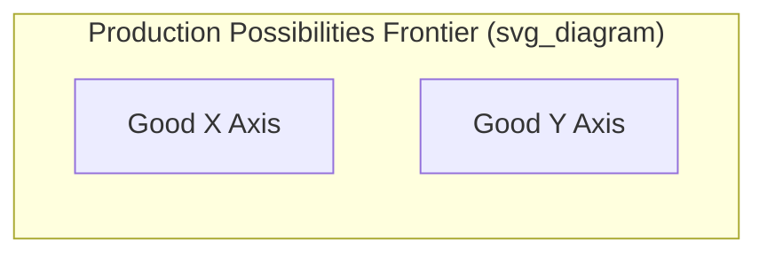
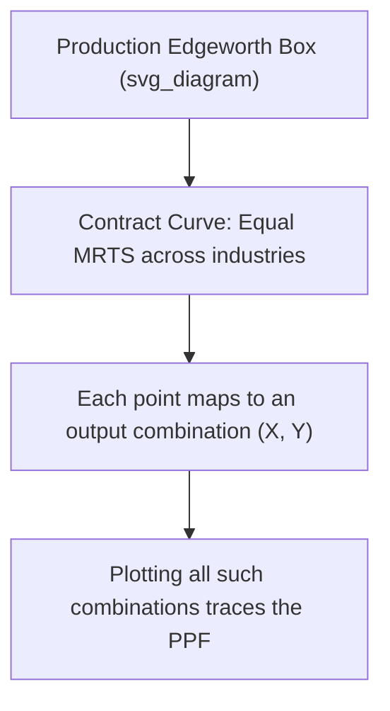
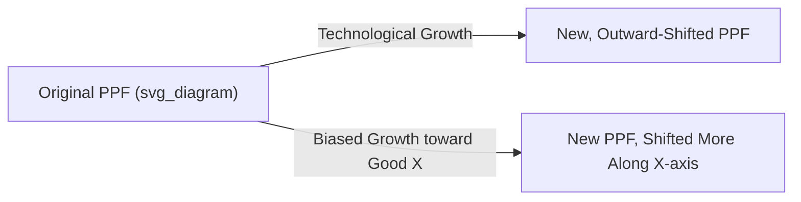

## Efficiency in Production and the Production Possibilities Frontier

### Definition of the Production Possibilities Frontier

The **Production Possibilities Frontier (PPF)**, also called the production possibilities curve, represents the maximum combinations of two goods an economy can produce given its available resources and technology, assuming full and efficient utilization of those resources.

**Key Points**

- Every point **on** the PPF represents a **technically efficient** combination of output — no more of one good can be produced without producing less of the other
- Every point **inside** the PPF represents an inefficient use of resources (unemployment, underutilized capital, or misallocation)
- Every point **outside** the PPF is currently unattainable given existing resources and technology

### Graphical Representation

**Verbal description of the standard diagram:**

- The horizontal axis measures the quantity of one good (Good $X$), the vertical axis measures the quantity of a second good (Good $Y$)
- The PPF is typically drawn as a curve **bowed outward (concave to the origin)**, running from a point on the vertical axis (maximum output of $Y$ if all resources are devoted to $Y$) to a point on the horizontal axis (maximum output of $X$ if all resources are devoted to $X$)
- A point inside the curve represents inefficient production; a point on the curve represents efficient production; a point outside the curve is currently infeasible

### Efficiency in Production: Two-Input Framework

Efficiency in production, in the general equilibrium sense, requires that inputs (typically labor and capital) be allocated between industries such that it is impossible to reallocate them to increase output of one good without decreasing output of the other. This condition is formalized using the **Edgeworth production box**.

**Marginal Rate of Technical Substitution (MRTS)**

The MRTS measures the rate at which one input can be substituted for another while holding output constant, for a given production function.

$$MRTS_{LK} = \frac{MP_L}{MP_K}$$

where $MP_L$ and $MP_K$ are the marginal products of labor and capital, respectively.

**Condition for Efficient Input Allocation**

$$MRTS^X_{LK} = MRTS^Y_{LK}$$

Efficiency in production requires that the marginal rate of technical substitution between labor and capital be **equal across all industries** (here, the industry producing good $X$ and the industry producing good $Y$). If the two industries have different MRTS values, reallocating a unit of labor and capital between them can increase output of one good without reducing output of the other — meaning the initial allocation was not efficient.

**Analogy to the Edgeworth Exchange Box**

This condition parallels the exchange-efficiency condition (equal MRS across consumers) discussed in the Edgeworth box, but applied to inputs across firms/industries rather than goods across consumers. The **production Edgeworth box** traces an analogous **contract curve** of input allocations satisfying $MRTS^X_{LK} = MRTS^Y_{LK}$, and this contract curve, when mapped into output space, generates the PPF itself.

### Derivation of the PPF from the Production Edgeworth Box

**Step-by-step logic:**

1. Total labor and capital in the economy are fixed and allocated between two industries (producing $X$ and $Y$)
2. Each possible allocation of labor and capital between the two industries yields some output level of $X$ and some output level of $Y$
3. Only allocations where $MRTS^X_{LK} = MRTS^Y_{LK}$ are efficient (on the contract curve of the production Edgeworth box) — any allocation off this curve could be adjusted to increase output of both goods, or one without reducing the other, so such points are dominated by points on the curve
4. Plotting the output combinations $(X, Y)$ generated by every point along this contract curve traces out the **PPF** in output space

### The Shape of the PPF: Increasing Opportunity Cost

The standard **bowed-outward (concave)** shape of the PPF reflects the principle of **increasing opportunity cost**.

**Marginal Rate of Transformation (MRT)**

The slope of the PPF at any point is the **marginal rate of transformation**, representing the opportunity cost of producing one more unit of $X$ in terms of the quantity of $Y$ that must be sacrificed.

$$MRT_{XY} = -\frac{dY}{dX} = \frac{MC_X}{MC_Y}$$

where $MC_X$ and $MC_Y$ are the marginal costs of producing goods $X$ and $Y$, respectively.

**Why Opportunity Cost Increases**

As an economy shifts resources from producing $Y$ to producing $X$, it must draw increasingly on resources that are relatively **less suited** to producing $X$ (and more suited to producing $Y$), a consequence of resources not being perfectly substitutable across industries (differing factor intensities and productivities). This causes the opportunity cost of each additional unit of $X$ (in terms of $Y$ forgone) to rise progressively, producing the characteristic outward bow of the PPF.

**Example**

Consider an economy producing wheat (requiring land-intensive production) and computer chips (requiring capital/skill-intensive production). Moving resources from wheat to chip production initially involves shifting relatively chip-suited labor and capital; as production continues to shift, increasingly land-suited resources (poorly suited for chip production) must be reallocated, causing each additional chip to "cost" progressively more forgone wheat.

**Special Case: Linear PPF**

[Inference] If the two goods use inputs in identical proportions (i.e., resources are perfect substitutes between the two production processes, or the underlying factor intensities are identical), the PPF becomes a straight line, implying a constant opportunity cost — this special case is typically used as a simplified pedagogical illustration (e.g., in basic comparative advantage models) rather than a general description of most real-world production relationships.

### Points On, Inside, and Outside the PPF

| Location | Interpretation |
| --- | --- |
| On the curve | Full and efficient use of resources; productively efficient |
| Inside the curve | Inefficient production (unemployment, underused capacity, misallocated resources) |
| Outside the curve | Currently unattainable with existing resources and technology |

**Example**

An economy experiencing a recession, with idle factories and unemployed labor, would be represented by a point **inside** its PPF — resources exist to produce more of both goods, but are not being fully utilized.

### Shifts of the PPF

The PPF shifts outward (expands) due to:

- **Economic growth**: Increases in the quantity of available resources (labor force growth, capital accumulation)
- **Technological progress**: Improvements in production techniques that increase output obtainable from the same resource base
- **Improved factor quality**: Increases in human capital, better-quality capital equipment, or resource discoveries

A shift can be **uniform** (parallel outward shift, if both goods benefit equally from the change) or **biased** (a shift outward that is skewed toward one good, if the change disproportionately benefits the technology or resources used for producing that specific good).

**Example**

A technological breakthrough in semiconductor manufacturing that only benefits the chip industry (not wheat farming) would cause a **biased outward shift** of the PPF — the maximum attainable quantity of chips increases substantially, while the maximum attainable quantity of wheat (if all resources were devoted to wheat) remains largely unchanged.

### Productive Efficiency vs. Allocative Efficiency vs. Pareto Efficiency

It is important to distinguish related but distinct efficiency concepts:

**Productive Efficiency**

Any point *on* the PPF is productively efficient — the economy cannot produce more of one good without producing less of another, given fixed resources and technology. This corresponds to $MRTS^X_{LK} = MRTS^Y_{LK}$ across industries.

**Allocative Efficiency**

A stronger condition requiring that the economy produce the *specific* combination of goods on the PPF that best matches consumer preferences — that is, the point where the PPF's slope (MRT) equals the marginal rate of substitution (MRS) common to consumers in the exchange economy.

$$MRT_{XY} = MRS_{XY}$$

**Key Points**

- An economy can be productively efficient (on the PPF) at many different points, but only **one** of these points (generally) also satisfies allocative efficiency for a given set of consumer preferences
- **Overall Pareto efficiency** in a full general equilibrium sense requires *both* productive efficiency (on the PPF) *and* allocative efficiency (matching the mix of goods produced to what consumers want at the margin) *and* exchange efficiency (goods distributed efficiently among consumers, per the Edgeworth exchange box)

### The Three Conditions for a Full Pareto-Efficient Outcome

A general competitive equilibrium across the whole economy is Pareto efficient when it simultaneously satisfies:

1. **Efficiency in production**: $MRTS^X_{LK} = MRTS^Y_{LK}$ (inputs allocated efficiently across industries — on the PPF)
2. **Efficiency in exchange**: $MRS^1_{XY} = MRS^2_{XY}$ (goods allocated efficiently across consumers — on the Edgeworth exchange contract curve)
3. **Efficiency in product mix (allocative efficiency)**: $MRT_{XY} = MRS_{XY}$ (the specific bundle of goods produced matches consumer preferences at the margin)

**Key Points**

This three-part condition connects the PPF directly to the broader general equilibrium and welfare economics framework: the PPF alone (production efficiency) is a necessary but not sufficient condition for overall Pareto efficiency in the economy.

### Numerical Example

Suppose an economy's PPF is given by:

$$X^2 + Y^2 = 100$$

**Step 1: Compute the MRT** by implicit differentiation:

$$2X + 2Y\frac{dY}{dX} = 0 \quad \Rightarrow \quad MRT_{XY} = -\frac{dY}{dX} = \frac{X}{Y}$$

**Step 2: Interpretation**

At a point where $X = 6, Y = 8$ (satisfying $36 + 64 = 100$), the marginal rate of transformation is $MRT_{XY} = 6/8 = 0.75$, meaning producing one more unit of $X$ at this point costs $0.75$ units of $Y$.

**Step 3: Allocative efficiency check**

If the representative consumer's $MRS_{XY} = 0.75$ at the consumption bundle corresponding to this production point, then the economy is at an allocatively efficient point, since $MRT_{XY} = MRS_{XY}$. If instead $MRS_{XY} \neq 0.75$ at this output combination, the economy is productively efficient (on the PPF) but **not** allocatively efficient — a different point on the same PPF would better match consumer preferences.

### Common Pitfalls and Misconceptions

- **Assuming any point on the PPF is automatically the "best" outcome**: Being on the PPF only guarantees productive efficiency; it says nothing about whether that particular mix of goods matches what consumers actually want (allocative efficiency)
- **Assuming the PPF is always concave**: While the concave (bowed-outward) shape reflecting increasing opportunity costs is standard and most commonly presented, a straight-line PPF (constant opportunity cost) or, in unusual cases, other shapes can arise depending on the specific characteristics of the production technologies involved
- **Confusing a shift of the PPF with a movement along the PPF**: Economic growth or technological change shifts the entire curve outward; reallocating existing resources between the two goods (without growth) is a movement along a fixed PPF
- **Treating "inside the PPF" as always meaning unemployment specifically**: Points inside the PPF can also reflect misallocation of employed resources (e.g., inefficient allocation between industries), not solely idle/unemployed resources

**Related Topics**

- Edgeworth box and exchange efficiency
- Partial vs general equilibrium analysis
- Marginal rate of substitution and consumer indifference curves
- Comparative advantage and gains from trade
- First Fundamental Theorem of Welfare Economics
- Opportunity cost and economic decision-making
- Economic growth and technological change
- Allocative efficiency and market failure